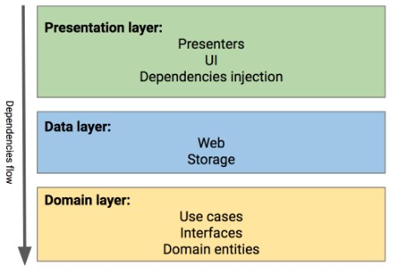

## [A Guided Tour inside a clean architecture code base](https://proandroiddev.com/a-guided-tour-inside-a-clean-architecture-code-base-48bb5cc9fc97)



### Domain layer

- `Domain entities` like `value objects`, `usecases` act as `operations`
- Abstraction of `MoviesCache`, `MoviesDataStore`, `MoviesRepository` from `domain/interface`
   + `MoviesRepository` provide functionality to support `use cases`
   + `MoviesDataStore` hides retrieve data local data access or remote access
   + `MoviesCache` abstract cache operations.  From code [here](https://github.com/mrsegev/MovieNight/blob/7df52e6c93d6932b4b58de9f4f906f86df93dce1/presentation/src/main/kotlin/com/yossisegev/movienight/di/modules/DataModule.kt#L40-L41) you could find `cachedMoviesDataStore` is implemented based on interface from `MoviesCache` 

- `usecases`


- When test `usecases` in domain layer, use `mockito` to mock result from `interface/MoviesRepository` and focus to test logic in `usecases`
```kotlin
    @Test
    fun getMovieDetailsById() {
        val movieEntity = DomainTestUtils.getTestMovieEntity(100)
        val movieRepository = Mockito.mock(MoviesRepository::class.java)
        val getMovieDetails = GetMovieDetails(TestTransformer(), movieRepository)

        Mockito.`when`(movieRepository.getMovie(100)).thenReturn(Observable.just(Optional.of(movieEntity)))

        getMovieDetails.getById(100).test()
                .assertValue { returnedMovieEntity ->
                    returnedMovieEntity.hasValue() &&
                            returnedMovieEntity.value?.id == 100
                }
                .assertComplete()
    }

```
You could find more results [here](https://github.com/mrsegev/MovieNight/blob/7df52e6c93d6932b4b58de9f4f906f86df93dce1/domain/src/test/kotlin/com/yossisegev/domain/UseCasesTests.kt#L23)