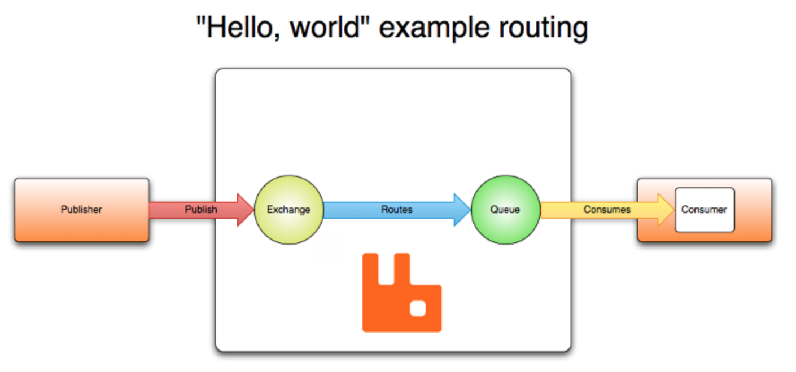
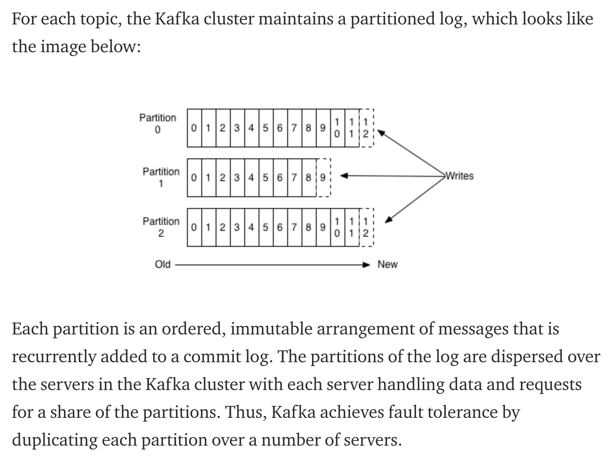

# streaming processing

## Keywords

## Questions
- How streaming system handle joins?  
- How streaming system tolerant fault?  

## Notes

### Streams
- Stream processing is a near-Realtime, high-throughput alternative to batch processing.
- The smallest element of a stream is an event: a small, self-contained, immutable object representing some chunk of state.
- An event is generated by one producer, but processed by multiple consumers.
- Related events grouped together form a topic or stream.
- Streams follow a publish/subscribe model.

### Messaging systems
- At the core of a stream is a messaging system. The messaging system is responsible for receipt and delivery of events.
- Broadly speaking, stream processing systems can be differentiated by asking two questions about their top-level functionality:
	- What happens when the producer publishing outstrips consumer processing? There are three approaches: queueing, dropping messages, and backpressure (the latter being blocking the producer until the current set of messages have been processed).
	- What are the durability guarantees? Messaging systems that may lose data will be faster than ones that provide strong durability.
- You can use any of the tools discussed in the data flow section to implement a message system:
	- Direct producer-consumer messaging.
		- This is simple, and doesn't require standing up new services, but mixes concerns (and doesn't scale very well because of that) and complicates application logic.
	- Message brokers.
		- This makes the most sense at scale.
- When multiple consumers are subscribed to a topic, two patterns are used.
	- Load balancing. Each message is delivered to one consumer.
	- Fan-out. Each message is delivered to all consumers.
- The same consistency and isolation concerns that were present in databases emerge with message streams as well.
- Message brokers that guarantee delivery wait until an ack response from the delivery target before they dequeue a message.
- If no ack comes within a certain timeout, and a load balancing pattern is used, the message is re-delivered to a different node.
- This means that messages do not necessarily arrive in order!
- Furthermore, the message might have actually been processed, but the ack was dropped or delayed by a network problem.
- So duplication of data between consumers is also possible.

### AMQP/JMS-style message broker

  
[AMQP 0-9-1 Model Explained](https://www.rabbitmq.com/tutorials/amqp-concepts.html)

### Log-based message brokers
- Message brokers may keep everything in memory, and delete messages that have been sufficiently acked, or they may choose to persist their contents to a local log. Message brokers that choose to do so are log-based message brokers.
- Log-based message brokers have the advantage of persistence, whilst still being able to reach extremely high throughputs.
- They are also naturally sequential.
- The throughput comes via partitioning. Multiple brokers may be deployed, each one responsible for a single topic.
- For consumers, reading a message is as simple as reading from the (append-only) log file.
- Fan-out is trivial to implement in this case.
- The load balancing pattern can be implemented by assigning nodes on a per-partition basis. However, this is admittedly much less flexible than is achievable with a non log-based message broker, as it requires having at least as many brokers (and topics) as you have consumers.
- In this mode, consumers maintain an offset in the log file. The broker may periodically check which consumer has the furthest-back offset, and "clean out" or perhaps archive the segment of the log that predates it.
- This greatly reduces network volume, as acks are no longer necessary. This helps make log-based message brokers more easily scalable.

### Syncing across systems

- Cross-system synchronization is an often necessary task, but it's one fraught with danger.
- The simplest solution would be to perform a full table dump, from time to time, and have the other system parse that dump.
- If this is too slow, or has too much latency, you can use dual writes: have the application explicitly write to both systems. This is a bundle of fun of race conditions and failure modes, however. You cannot do it fully safely without cross-system atomic commit, which is a big task to consider.
- An increasingly popular alternative is change data capture
- Databases maintain a log of actions in either their log (log and SSLTable -based architectures) or their write-ahead log (B-tree architectures). Another application could consume that log.
- This is better than dual writes in many cases because, as with log-based message brokers, you are explicitly synchronized.
- CDC in Kafka [Integrating Databases and Kafka with Change Data Capture](https://www.oreilly.com/learning/making-sense-of-stream-processing/page/3/integrating-databases-and-kafka-with-change-data-capture)
Making Sense of Stream Processing  Martin Kleppmann — Event Sourcing and Stream Processing at Scale
- Some operations require the full database state to work. For example, building a full-text search index.
- The replication log by default is a database-specific implementation detail. Particularly write-ahead logs will get cleaned up from time to time.
- To continue to have "all the state" without having to maintain an infinitely long log, you can do one of two things:
- Pair snapshots of the database at a certain timestamp with the replication log thereafter. This allows you to delete log entries accounted for in the most recent snapshot.
- Perform log compaction on the CDC side. This preserves only the most recent value set, which is what you need.
- Message brokers that support these features (Kafka does) effectively implement durable storage. In other words, you could use this mechanism to implement a Kafka -based database!

### Event sourcing
- Event sourcing is a service design pattern (one of Martin Fowler's three event-driven design patterns; see his GOTO talk).
- It is a way of organizing entire systems using events.
- A database allows destructive operations: overwrites and deletes.
- Immutability has big advantages and disadvantages.
- You can capture the current state of the database using the event log and/or a database snapshot.
- But now you have a full history of changes, including changes that have since been overwritten.
- This makes it easier to e.g. debug your system, as you can just point to the place in history where a failure occurred and step through it.
- On the other hand truly deleting data (as necessary for e.g. legal compliance) becomes a problem.

### 3 types of joins

- Stream-stream joins
	- both input streams consist of activity events
	- the join operator searches for related events that occur within some window of time
- Stream-table joins
	- one input stream consists of activity events, while the other is a database change-log
	- the change-log keeps a local copy of the database up to date
- Table-table joins
	- both input streams are database changelogs

- Joins between streams are time-dependent, because streams in general do not gaurantee the order of their contents.
- The possibility of a stream join mutating do to event order changes is known as a slowly changing dimension in the data warehousing literature. The solution generally used is timestamping each version of the join, so joins are considered non-deterministic!

### Fault tolerance
- How do you tolerate faults in a stream-based system? The answer is not immediately obvious.  We cannot simply retry the operation, as we had with batch processing, because a stream never ends.
- How do we still provide exactly once execution with streams?
- One method is to organize stream events in microbatches. A microbatch is complete when all necessary acks are received from the subscribers to a selected batch of a topic.
  - Spark Streaming is organized around microbatches that are a single second in length.
  - Apache Flink dynamically chooses batch sizes and boundary conditions.
  - Apache Kafka achieve fault tolerant by duplicating each partition over a number of servers  

  

[Achieving Fault Tolerance with Kafka: A Detailed Explanation](https://medium.com/@debutinfotech/achieving-fault-tolerance-with-kafka-a-detailed-explanation-a9828929d00d)  
- Another approach is to implement an atomic commit protocol.
- Another is to rely on (or force) idempotent operations. E.g. only allow operations that, when applied multiple times, work the same as if they were applied once.  
If your stream processors are idempotent fault tolerance becomes much less of an issue!  

