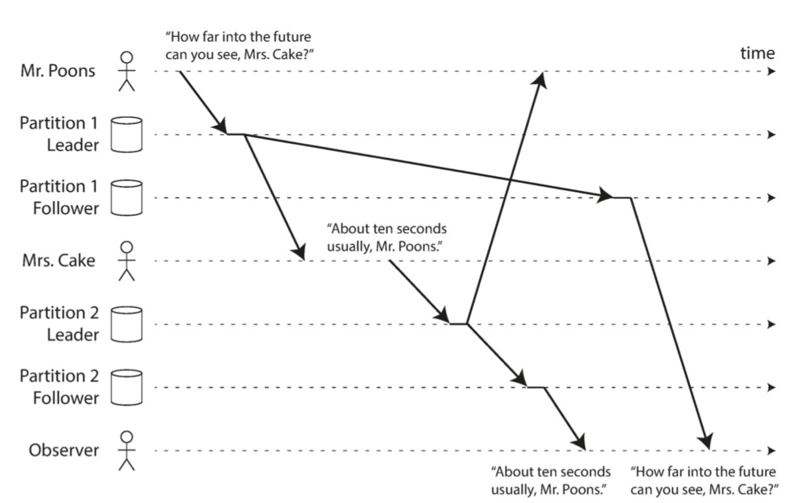
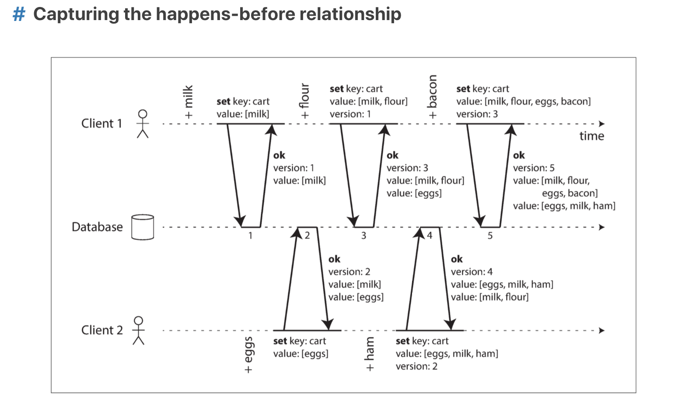

- [Replication](#replication)
  - [Keywords](#keywords)
  - [Questions](#questions)
  - [Notes](#notes)
  - [Single-leader replication](#single-leader-replication)
    - [Implement replication logs](#implement-replication-logs)
      - [Statement-based replication](#statement-based-replication)
      - [Write-ahead log (WAL)](#write-ahead-log-wal)
      - [Logical (row-based) log replication](#logical-row-based-log-replication)
      - [Trigger-based replication](#trigger-based-replication)
    - [Problems with Replication Lag](#problems-with-replication-lag)
      - [Reading your own writes](#reading-your-own-writes)
      - [Monotonic Reads](#monotonic-reads)
      - [Consistent Prefix Reads](#consistent-prefix-reads)
  - [Multi-leader replication](#multi-leader-replication)
    - [When to consider](#when-to-consider)
    - [Handling Write Conflicts](#handling-write-conflicts)
  - [Leader less Client-driven replication](#leader-less-client-driven-replication)
    - [Dynamo style](#dynamo-style)
    - [Limitation](#limitation)
    - [Happens-before](#happens-before)

# Replication

## Keywords

## Questions

## Notes

Replication is one of the strategies for distributing data processes across multiple nodes (the other is partitioning, the subject of a later chapter).

- Why Replication 

<dl>
	<dt>Scalability</dt>
		<dd>	To scale out the number of machines that can serve read queries (and thus increase read throughput) 
            If your data volume, read load, or write load grows bigger than a single machine can handle, you can potentially spread the load across multiple machines.  </dd>
	<dt>Fault tolerance/high availability</dt>
		<dd>To allow the system to continue working even if some of its parts have failed (and thus increase availability) 
        If your application needs to continue working even if one machine (or several machines, or the network, or an entire datacenter) goes down, you can use multiple machines to give you redundancy. When one fails, another one can take over. </dd>
	<dt>Latency</dt>
        <dd>To keep data geographically close to your users (and thus reduce latency) 
        If you have users around the world, you might want to have servers at various locations worldwide so that each user can be served from a datacenter that is geographically close to them. That avoids the users having to wait for network packets to travel halfway around the world.  </dd>
</dl>

- How to Replicate   

Type |Pros |Cons |Comments 
---|:---|:---|:---
Single-leader |Easy to understand, no conflict resolution |Less robust | 
Multi-leader |robust against faulty, network interupptions and latency spikes |complex and harder to maintain | 
Leaderless |robust against faulty, network interupptions and latency spikes |omplext (especially the quorum) | 

- When to Replicate  

Type |Pros |Cons |Comments 
---|:---|:---|:---
synchronous	| easy to gurantee consistency	| slow (especially if there are many folowers) | 
asynchronous	|  fast	| harder to gurantee consistency | 
semi-synchronous | 	both advantages from synchronous & asynchrnous	| harder to implement | 

## Single-leader replication
How do you achieve high availability with leader-based replication?

- Add new follower  

- Follower failure  
The follower can recover quite easily: from its log, it knows the last transaction that was processed before the fault occurred. Thus, the follower can connect to the leader and request all the data changes that occurred during the time when the follower was disconnected.

- Leader failure  
Handling a failure of the leader is trickier: one of the followers needs to be promoted to be the new leader, clients need to be reconfigured to send their writes to the new leader, and the other followers need to start consuming data changes from the new leader.  
Detect - Choose new - Reconfig   
Problems: 1. Data missing during async rep 2. Split brain 

### Implement replication logs
#### Statement-based replication   
the leader logs every write request (statement) that it executes and sends that statement log to its followers.  
**BUT**, the following case will make it not work
1. Any statement that calls a nondeterministic function.  Eg: now(), rand()
2. If statements use an autoincrementing column.  Eg: UPDATE … WHERE need to executed in exactly the same order, limiting concurrent
3. Statements that have side effects.  Eg: triggers, stored procedures, user-defined functions

#### Write-ahead log (WAL)
WAL means the log is an append-only sequence of bytes containing all writes to the database.  
The main disadvantage is that the log describes the data on a very low level: a WAL contains details of which bytes were changed in which disk blocks. This makes replication closely coupled to the storage engine. 

#### Logical (row-based) log replication
Use different log formats for replication and for the storage engine, which allows the replication log to be decoupled from the storage engine internals.  
A logical log for a relational database is usually a sequence of records describing writes to database tables at the granularity of a row:  
- For an inserted row, the log contains the new values of all columns.
- For a deleted row, the log contains enough information to uniquely identify the row that was deleted. Typically this would be the primary key, but if there is no primary key on the table, the old values of all columns need to be logged.
- For an updated row, the log contains enough information to uniquely identify the updated row, and the new values of all columns (or at least the new values of all columns that changed).

#### Trigger-based replication
Application level.  triggers and stored procedures, lets you register custom application code that is automatically executed when a data change (write transaction) occurs in a database system.  
If you want to only replicate a subset of the data, or want to replicate from one kind of database to another, or if you need conflict resolution logic, then you may need to move replication up to the application layer.

### Problems with Replication Lag
Reasons for replication is 1) tolerate node failures 2)scalability 3) Latency
If an application reads from an asynchronous follower, it may see outdated information if the follower has fallen behind.  This inconsistency is just a temporary state—if you stop writing to the database and wait a while, the followers will eventually catch up and become consistent with the leader. For that reason, this effect is known as **eventual consistency**.

#### Reading your own writes
This inconsistency is just a temporary state—if you stop writing to the database and wait a while, the followers will eventually catch up and become consistent with the leader. For that reason, this effect is known as eventual consistency.  
- When reading something that the user may have modified, read it from the leader; otherwise, read it from a follower. This requires that you have some way of knowing whether something might have been modified, without actually querying it.  
- If most things in the application are potentially editable by the user, that approach won’t be effective, as most things would have to be read from the leader.  
- The client can remember the timestamp of its most recent write—then the system can ensure that the replica serving any reads for that user reflects updates at least until that timestamp.
 
**Multiple devices will make things harder**
- Approaches that require remembering the timestamp of the user’s last update become more difficult, because the code running on one device doesn’t know what updates have happened on the other device. This metadata will need to be centralized.
- If your replicas are distributed across different datacenters, there is no guarantee that connections from different devices will be routed to the same datacenter. If your approach requires reading from the leader, you may first need to route requests from all of a user’s devices to the same datacenter.

#### Monotonic Reads
When reading from asynchronous followers it’s possible for a user to see things **moving backward in time**.  
Monotonic reads(单调读) is a guarantee that this kind of anomaly does not happen. It’s a lesser guarantee than strong consistency, but a stronger guarantee than eventual consistency. When you read data, you may see an old value; monotonic reads only means that if one user makes several reads in sequence, they will not see time go backward.  
One way of achieving monotonic reads is to make sure that each user always makes their reads from the same replica. However, if that replica fails, the user’s queries will need to be rerouted to another replica.

#### Consistent Prefix Reads
Replication lag anomalies concerns violation of causality.  

   

Consistent Prefix Reads(一致前缀读) guarantee says that if a sequence of writes happens in a certain order, then anyone reading those writes will see them appear in the same order.  
In Kafka, if you want to gurantee the sequence of two message, you need to make sure they are in the same partition.  

## Multi-leader replication

### When to consider 
- Multiple data center  
Within each datacenter, regular leader–follower replication is used; between datacenters, each datacenter’s leader replicates its changes to the leaders in other datacenters.
- Clients with offline operation  
You have an application that needs to continue to work while it is disconnected from the internet.  Every device has a local database that acts as a leader (it accepts write requests), and there is an asynchronous multi-leader replication process (sync) between the replicas of your calendar on all of your devices. 
- Collaborative editing
github, google doc

### Handling Write Conflicts
The simplest strategy for dealing with conflicts is to avoid them: if the application can ensure that all writes for a particular record go through the same leader, then conflicts cannot occur. Since many implementations of multi-leader replication handle conflicts quite poorly, **avoiding conflicts is a frequently recommended approach**.  
Converging toward a consistent state  
- Give each write a unique ID (timestamp, UUID, hash of key and value), pick the write with highest ID as the winner, and throw away the other writes. If a timestamp is used, this technique is known as last write wins(LWW).  **Data loss**
- Give each replica a unique ID, and let writes that originated at a higher-numbered replica always take precedence over writes that originated at a lower-numbered replica.  **Data loss**
- Somehow merge the values together.  E.g., order them alphabetically and then concatenate them.
- Record the conflict in an explicit data structure that preserves all information, and write application code that resolves the conflict at some later time.

## Leader less Client-driven replication

### Dynamo style
Clients read using **quorums** of certain sizes, taking the most recently updated data point from amongst the nodes that respond to a request. Quorums offer a tunable consistency-speed tradeoff. Larger quorums are slower, as they are tied down by the speed of the slowest respondent, but more consistent. Smaller quorums are faster, requiring fewer node responses, but less consistent.   
As long as w + r > n, we expect to get an up-to-date value when reading, because at least one of the r nodes we’re reading from must be up to date. Reads and writes that obey these r and w values are called quorum reads and writes.     
Services using client-driven replication do so using two processes: read-repair(When a client makes a read from several nodes in parallel, it can detect any stale responses. The client sees that replica has a stale value and writes the newer value back to that replica. This approach works well for values that are frequently read) and Anti-entropy process 
(datastores have a background process that constantly looks for differences in the data between replicas and copies any missing data from one replica to another. Unlike the replication log in leader-based replication, this anti-entropy process does not copy writes in any particular order, and there may be a significant delay before data is copied.)

### Limitation
However, even with w + r > n, there are likely to be edge cases where stale values are returned. These depend on the implementation, but possible scenarios include:
- If a sloppy quorum is used, the w writes may end up on different nodes than the r reads, so there is no longer a guaranteed overlap between the r nodes and the w nodes.
- If two writes occur concurrently, it is not clear which one happened first. In this case, the only safe solution is to merge the concurrent writes. If a winner is picked based on a timestamp (last write wins), writes can be lost due to clock skew.
- If a write happens concurrently with a read, the write may be reflected on only some of the replicas. In this case, it’s undetermined whether the read returns the old or the new value.
- If a node carrying a new value fails, and its data is restored from a replica carry‐ ing an old value, the number of replicas storing the new value may fall below w, breaking the quorum condition.
- Even if everything is working correctly, there are edge cases in which you can get unlucky with the timing. See “Linearizability and quorums”

### Happens-before
   
数据库为每个key创建版本号，每次变更都会增加版本号，把写入的值和新版本号一起存储 
客户端读取时，服务端返回key最新的版本号以及所有的值。客户端在写入前必须先读取 
客户端写入时，要带上之前读取的版本号，并且把之前读到的值与新的值做一个merge操作 
服务端收到写请求后，可以覆盖比这个版本号小的所有的值，但是必须保留比这个版本号大的所有的值。（因为它们是并发操作 

