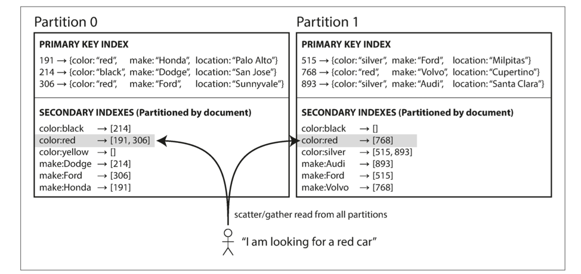
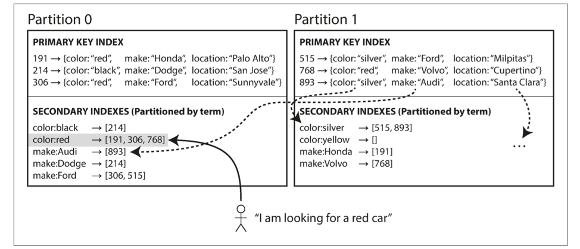
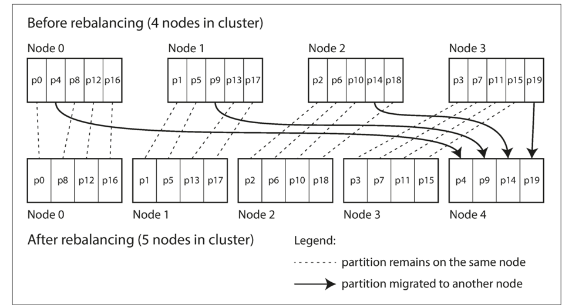

<!-- TOC -->
- [Partitioning](#partitioning)
  - [Keywords](#keywords)
  - [Questions](#questions)
  - [Notes](#notes)
    - [Partitioning](#partitioning-1)
    - [Partition types](#partition-types)
    - [Partitioning secondary indices](#partitioning-secondary-indices)
    - [Rebalancing](#rebalancing)
    - [Service discovery](#service-discovery)

# Partitioning

## Keywords

## Questions
- What is partition, what's the difference & relation with replication?
- When new machine are added, how to rebalance partition effectively?
- Why need service discovering?  How etcd works?

## Notes

### Partitioning
- Partitioning is the splitting of data across multiple nodes.  It is a necessity for scaling to particularly large datasets.
- The main reason for wanting to partition data is scalability. Different partitions can be placed on different nodes in a shared-nothing cluster.
- The main problem that needs to be addressed by your partitioning scheme is the avoidance of hot spots.  Data is not accessed or written to equally. If you partition too many commonly worked-with pieces of data to the same node, your performance will degrade.

### Partition types

| Type                    |Comments                    | Pros                          | Cons                          |
|-------------------------------|:------------------------------|:------------------------------|:------------------------------|
|Key Range|push contiguous strips of data to the same partitions|support efficient range queries|available only when the key can be sorted  hot spots risk|
|Key Hash|A good hashing function will uniformly distribute skewed data, "smudging" your data evenly across your partitions.|may distribute load more evenly|cannot use range queries|
 

### Partitioning secondary indices
A secondary index usually doesn’t identify a record uniquely but rather is a way of searching for occurrences of a particular value: find all actions by user 123, find all articles containing the word hogwash, find all cars whose color is red, and so on.  The problem with secondary indexes is that they don’t map neatly to partitions.  

| Type                    |Index storage                    | Read                          | Write                          |
|-------------------------------|:------------------------------|:------------------------------|:------------------------------|
|Document-partitioned |in the same partition as the primary key |scatter or gather across all partitions |write to only updated single partition|
|Term-partitioned |separately, using the indexed values |read can be served from a single partition |everal partition needs to be written |

 

- Example of Partitioning Secondary Indexes by Document  
(A website for selling used cars. Each listing has a unique ID—call it the document ID—and you partition the database by the document ID.  We allow user to filter by color and by make, so need to build secondary index for them)  
  

- Example of Partitioning Secondary Indexes by Term  

### Rebalancing
The process of moving load from one node in the cluster to another is called rebalancing.  Rebalance has following requirement:  
1. After rebalancing, the load (data storage, read and write requests) should be shared fairly between the nodes in the cluster.
2. While rebalancing is happening, the database should continue accepting reads and writes.
3. No more data than necessary should be moved between nodes, to make rebalancing fast and to minimize the network and disk I/O load.

**hash mod N** is the most simplest way, but if the number of nodes N changes, most of the keys will need to be moved from one node to another.

| Type                    |Comments                    | Add new node                          | Limitation                          | Real world example | 
|-------------------------------|:------------------------------|:------------------------------|:------------------------------|:------------------------------|
|Fixed number of partitions | Create many more partitions than there are nodes, and assign several partitions to each node. |  If a node is added to the cluster, the new node can steal a few partitions from every existing node until partitions are fairly distributed once again.    The only thing that changes is the **mapping table** for partitions to nodes. This change of assignment is not immediate-it takes some time to transfer a large amount of data over the network—so the old assignment of partitions is used for any reads and writes that happen while the transfer is in progress. | Choosing the right number of partitions is difficult if the total size of the dataset is highly variable. | Cassandra - virtual nodes |
|Dynamic partitioning | When a partition grows to exceed a configured size, it is split into two partitions so that approximately half of the data ends up on each side of the split. Conversely, if lots of data is deleted and a partition shrinks below some threshold, it can be merged with an adjacent partition.  | When a new node joins the cluster, it randomly chooses a fixed number of existing partitions to split, and then takes ownership of one half of each of those split partitions while leaving the other half of each partition in place.   Partitions can stay on the same node after a split for a while, but will transfer over to a different node (snapshot operation).| It is ungainly when the datasets are small.| HBase - HDFS snapshotting |

- Example of Fixed number of partitions  

### Service discovery
The client can connect to any node, which can forward the request through the network to the node that has the requested data.  A routing tier can connect to the necessary node.  The client can maintain information on the right node, and connect to it directly.  

- Many distributed data systems rely on a separate coordinate service such as Zoo-Keeper, a hierarchical key-value store to keep track of this cluster metadata.  
- LinkedIn's Espresso use Helix (which in turn relies on ZooKeeper), HBase, SolrCloud and Kafka also use ZooKeeper  
- Cassandra and Riak use a gossip protocol among the nodes to disseminate any changes in cluster state  

