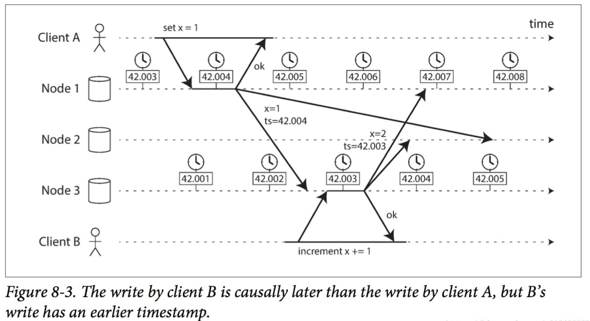

<!-- TOC -->
- [The Trouble with Distributed Systems](#the-trouble-with-distributed-systems)
  - [Keywords](#keywords)
  - [Questions](#questions)
  - [Notes](#notes)
    - [Unreliable Networks](#unreliable-networks)
    - [Unreliable Clocks](#unreliable-clocks)
      - [why clock matters](#why-clock-matters)
      - [Types](#types)
      - [Problems](#problems)
  - [Byzantine fault](#byzantine-fault)

# The Trouble with Distributed Systems

## Keywords

## Questions
- Monotonic Versus Time-of-Day Clocks
- Why Google provide Spanner True data API


## Notes
- Computers are designed to fail all at once and catastrophically.  
- Distributed services are fundamentally different. They need to fail only **partially**, if possible, in order to allow as many services as possible to continue to operate.  This unlocks a lot of additional failure modes, partial failures, which are both hard to understand and hard to reason about.<br/>
1. Detect failure: Timeout.  But timeout could not tell its node failover or network partition
2. Tolerant failure: Send message to other nodes and use consensus algorithm to make decision

### Unreliable Networks
网络分区：网络的一部分发生了故障而被切断  
延迟问题：TCP协议虽然提供了数据校验、超时重传等机制，但是没办法保证数据包在一定时间内保证到达，这种延迟可能是无限的  

### Unreliable Clocks
#### why clock matters
1. Node-to node communication always has delay, it hard to know the sequence
2. Clock on each machine is not accurate

#### Types

type | description | Example
---|:---|:---
time-of-day clock | Its what you intuitively expect of a clock: it returns the current date and time according to some calendar (also known as wall-clock time). <br/> Can move backwards or stop in time| 
monotonic clock | Its suitable for measuring a duration (time interval) | Java: System.nanoTime

#### Problems
- Unsync clock will fail LWW

  


- Process pause
Say you have a database with a single leader per partition. Only the leader is allowed to accept writes. How does a node know that it is still leader, and that it may safely accept writes?  
Only the leader is allowed to accept writes. Only one node can hold the lease at any one time—thus, when a node obtains a lease, it knows that it is the leader for some amount of time, until the lease expires.  
```java
while (true) {
    request = getIncomingRequest();
    // Ensure that the lease always has at least 10 seconds remaining
    if (lease.expiryTimeMillis - System.currentTimeMillis() < 10000) { 
        lease = lease.renew();
    }
    if (lease.isValid()) { 
        process(request);
    } 
}
```
The code assumes that very little time passes between the point that it checks the time (System.currentTimeMillis()) and the time when the request is processed (process(request)).  However, what if there is an unexpected pause in the execution of the program? For example, imagine the thread stops for 15 seconds around the line lease.isValid() before finally continuing. In that case, it’s likely that the lease will have expired by the time the request is processed, and another node has already taken over as leader.<br/>
GC, Virtual Machine suspend and write currnt process into disk, SIGSTOP for current process, visit data over network, all of them will cause long pause.<br/>

- Things that depend on timeouts, like creating a global log in a distributed system (databases) or expiring leader-given leases (GFS), must account for failure possibility.  You can omit these delays if you try hard enough. Systems like flight controls and airbags operate are hard real-time systems that do so. But these are really, really hard to build, and highly limiting.  Algorithms can be proven to work correctly in a given an unreliable system model. But you have to choose your model carefully.
- A point that [Jepsen](https://github.com/jepsen-io/jepsen) makes: these algorithms are hard to implement in a durable way. The theory is far ahead of the practice, but a lot of architects try to homegrow their conflict resolution, which is problematic.

## Byzantine fault
If a node sends an knowingly untrue message to another node, this is known as a Byzantine fault.  Byzantine faults must be addressed in the design of public distributed systems, like the Internet or blockchain. But they can be ignored in the design of a service system, as obviously you will not purposefully lie to yourself.  
In designing a distributed system, one that is protected from Byzantine faults, you often need to design around causal dependency. You need to understand **what a node knew when it made a decision**, as that knowledge informs how you will heal any resulting divergence.   
Vector clocks are an algorithm for this (e.g. Dynamo).  
An alterantive is preserving a total ordering of operations (e.g. MongoDB).  


