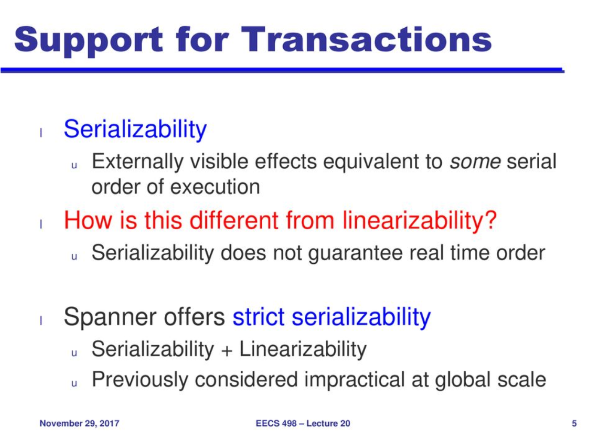
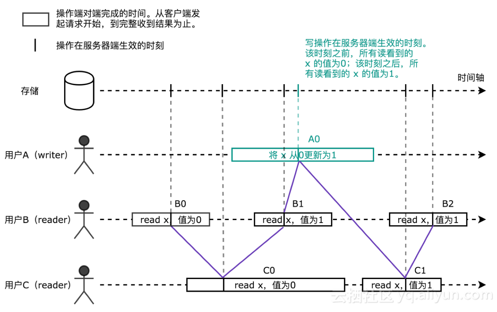
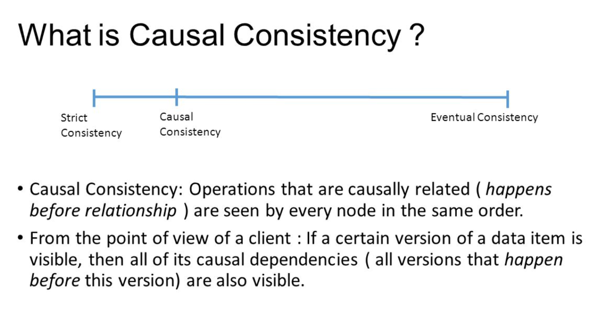

- [Consistency and Consensus](#consistency-and-consensus)
	- [Keywords](#keywords)
	- [Questions](#questions)
	- [Notes](#notes)
		- [Consistency and consensus](#consistency-and-consensus)
		- [Ordering](#ordering)
			- [Sequence](#sequence)
		- [Consensus](#consensus)
			- [Two phase commit](#two-phase-commit)
			- [Consensus algorithms](#consensus-algorithms)
		- [Reference](#reference)

# Consistency and Consensus

## Keywords

## Questions

## Notes

### Consistency and consensus
- All durable data systems provide eventual consistency, but their implementations of the "eventually" part differ.  Consistency is a difficult topic, and it's one wrapped up in all of the other concerns of distributed systems.
- Transaction isolation is primarily about avoiding race conditions due to concurrently executing transactions, whereas distributed consistency is mostly about coordinating the state of replicas in the face of delays and faults.  
  

Linearizability
- In A distributed system which is linearizable, we could get **total order** of all operations, in weak isolation system could only get **partial order**  
  
(After B1 read x as 1, C1 could only get 1)

- A distributed system is linearizable if:
	- All operations are atomic, acting as though they happened at instantaneous moments in time, resulting in an implicit order of operations within the system.  Concurrency or an illusion of concurrency may happen, but operations are sequential within the system.
	- All reads and compare-and-sets are up-to-date at return time with respect to that order (no stale operations).
- Not part of this definition: op start times (e.g. when the request is made) do not determine operation order. The atomic operation may occur at any time before the ack. With concurrent ops, the service may determine the landing sequence.
- Serialization, the strongest isolation guarantee, and linearization, here, are two different concepts of service behavior.
  The strongest possible guarantees a system can provide overall is "strict serializability", which is both of these properties combined.  
  Even if your system does not provide linearizability, some system components may still require linearizability to function properly.
- Lock services, leader elections, data uniqueness guarantees, and two-channel or cross-channel operations (e.g. concurrently asynchronously write a file to a file system and a message to a message broker telling people to do something with that file) all require linearizability.
- Asynchronous multi-leader and leaderless replication are not linearizable due to potential data loss in a failover. Synchronous multi-leader and leaderless replication are linearizable, but you rarely want to pay this performance cost. Single-leader replication can be made synchronous, but again, meh.

### Ordering
My notes for [vector clock](../../papers/lamport_logic_clock.md)  
**There are deep connections between ordering, linearizability, and consensus.**  
Linearizability affords a total ordering.  However, you can have causal consistency without linearizability (a partial ordering).  A causally consistent system preserves causally linked orders of operations.  
In practice, however, determining which operations are causally linked and which ones are not is tedious.  Thus in practice in a causally consistent system we weaken the second criterion of linearizability:
- All operations are atomic, acting as though they happened at instantaneous moments in time, resulting in an implicit order of operations within the system.
- If two ops are in flight at the same time, the ops may be applied in any order.

  

- The difference between causal consistency and linearizability is that in the latter case the timestamps of concurrent requests cannot be compared, because there is no globally consistent timestamp.
  - Causal consistency can be achieved without linearization.
  - Causal consistency is the strongest consistency model that doesn't incur a heavy network cost.
  - Providing it requires defining a sequence of operations across nodes that the nodes agree upon.

#### Sequence
How do you get a sequence of numbers that matches the operational sequence?  
- Using a naive solution, like clocks, won't work, because see chapter 8.
- Lamport timestamps are a lightweight way of achieving this agreed-upon sequential order. In this algorithm nodes increment a (node_unique_id, node_sequence_number, largest_sequence_number_seen) counter.
  - If a node wants to add an op to the log, it increments its sequence number.
  - If a node sees a message with a larger sequence number, it immediately raises its own next sequence number to match.
  - The unique ID is used to break sequence number ties.
- Vector clocks are an alternative more heavyweight algorithm.
- Systems using these schemes are eventually consistent across all nodes.  However, this is insufficient if there are requests (like e.g. asking for a unique username) that need to be aware of every previous operation at runtime.
- Supporting such operations requires knowing, eventually, the total order of operations. The systems that provide this are performing total order broadcast (also known as atomic broadcast).
- Total order broadcast requires two operational capacities:
	- Reliable delivery (no message loss)
	- Totally ordered delivery (messages are delivered to all nodes in the same order).
- Implementing consensus requires implementing total order broadcast. This feature is provided by e.g. etcd and Zookeeper.
- Linearizable systems can be used to build total order broadcast systems, and vice versa.

### Consensus
Consensus algorithms are a class of algorithms for addressing the node consensus problem.  No matter how you design a distributed system, there will always be situations where all nodes must agree on state. For example, transactions across data partitions on different nodes, or leader elections.  
Total order broadcast is an identity transform of a consensus algorithm.

#### Two phase commit
My notes for [2pc and 3pc](../../papers/2pc_3pc.md)  
- Two-phase commit relies on a coordinator, usually a separate process, which performs a pre-flight check on all of the nodes involving, asking if they can perform the op. The nodes check and reply yes or no. If any nodes say no, the state change is aborted. If all nodes say yes, the coordinator sends a green light.
- This algorithm obviously relies on atomic broadcast to work.
- This algorithm has one glaring weakness: if the coordinator goes down after all nodes ack but before it can send a green or red light, it's non-obvious how to recover (restarting the coordinator, sure, but that takes time).  If nodes are blocked during this period (they probably are), this is really bad, as it stops the system dead.
- Two-phase commit is a simple idea, but it turns out to make for a crappy consensus algorithm, due to this exact problem.

#### Consensus algorithms
My notes for [raft](../../papers/raft.md)  
My implementation for [raft](https://github.com/CodeBear801/mit6.824/tree/master/6.824-golabs-2018/src)
- Good consensus algorithms avoid this problem. The field includes Paxos (the oldest), Zab, Raft, and VSR.
- The consensus algorithms are all designed around epochs and strict quorums.
	- Each time a leader loss occurs, a quorum of nodes is gathered to vote on a new leader. The new leader increments the epoch number.
	- Every time a leader wants to perform an action, it checks whether or not another leader with a higher epoch number exists.
	- To do this, it asks a quorum of nodes what the highest epoch number they have seen is. The insight: within a strict quorum, at least one of the nodes, at a minimum, was present in the most recent vote!
	- Thus if a leader does not learn from its quorum of another higher-epoch leader, it knows it can safely perform the op.
- Consensus algorithms implement synchronous replication. Totally ordered atomic broadcast, we thus learn, requires we be synchronous.
- Therefore it is very slow, particularly if the network is bad.
- Additionally, certain network partitions can lead to very bad worst-case behavior, such as continuous elections.
- Designing consensus algorithms that are more robust to network failures is an ongoing area of research.

### Reference
- [浅析分布式系统中的 Linearizability](https://yq.aliyun.com/articles/98608)
- [吴镝 - Vector Clock/Version Clock](http://www.cnblogs.com/foxmailed/p/4985848.html) 
- [Distributed Consistency and Session Anomalies](https://blog.acolyer.org/2016/02/26/distributed-consistency-and-session-anomalies/) 