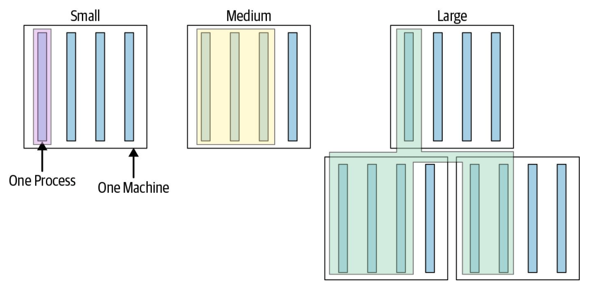
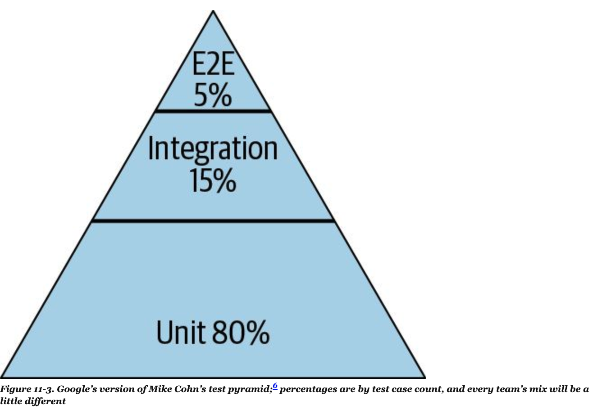
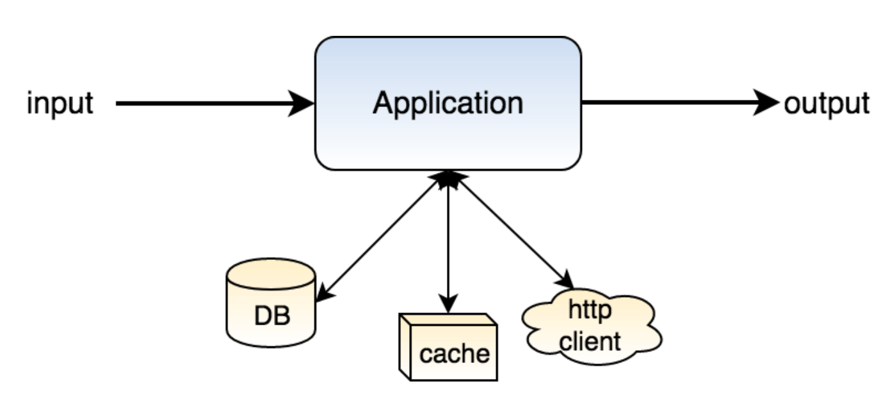
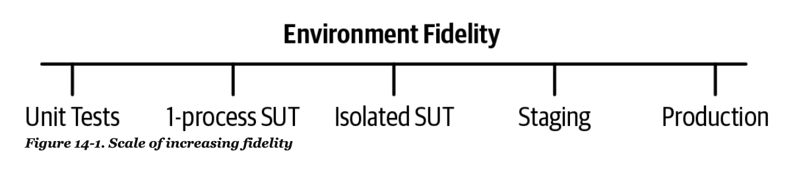
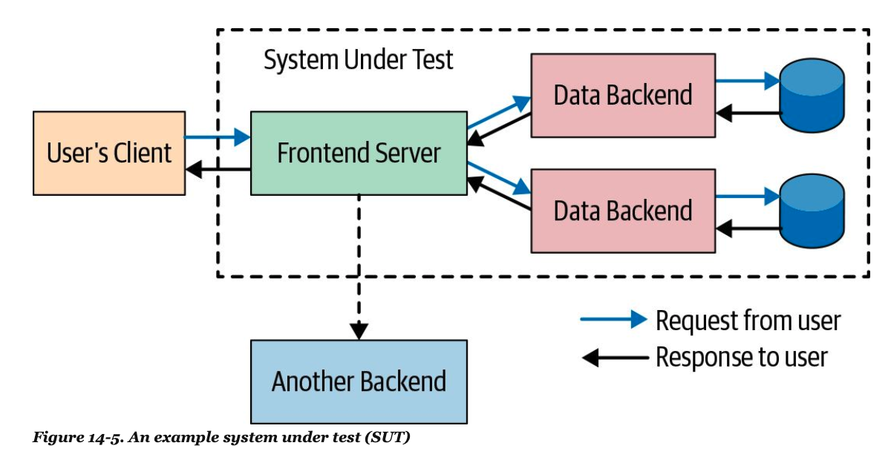
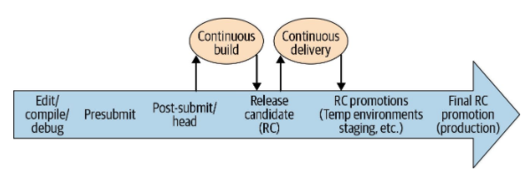

- [Software engineering in Google](#software-engineering-in-google)
  - [Chapter 11 Testing Overview](#chapter-11-testing-overview)
  - [Chapter 12 Unit Testing](#chapter-12-unit-testing)
    - [Avoid brittle tests](#avoid-brittle-tests)
    - [Writing clear tests](#writing-clear-tests)
  - [Chapter 13 Test double](#chapter-13-test-double)
    - [Dependency injection](#dependency-injection)
    - [Mocking framework](#mocking-framework)
    - [Techniques](#techniques)
      - [Faking](#faking)
      - [Stubbing](#stubbing)
      - [Interaction Testing](#interaction-testing)
  - [Chapter 14 Larger Testing](#chapter-14-larger-testing)
    - [Why need large test](#why-need-large-test)
    - [Structure of a large Test](#structure-of-a-large-test)
    - [Types of larger test](#types-of-larger-test)
  - [Chapter 23. Continuous Integration](#chapter-23-continuous-integration)


# Software engineering in Google

[amazon link](https://www.amazon.com/Software-Engineering-Google-Lessons-Programming/dp/1492082791)

## Chapter 11 Testing Overview

- Why test
   + Catching bugs is only part of the motivation, an equally important reason is to **support the ability to change**
   + tests can tell you how well your entire product conforms to its intended design, and more important, when it doesn't
   + As software grows, so do test suits, face challenges like instability and slowness
   + automatic test: the best team find which to turn the collective wisdom of its members into a benefit for the entire team

- Design a test suite: the desire to reduce pain led teams to develop smaller and smaller tests
   + size: the resources that are required to run a test case, memory, processes and time
   + 
   + scope: how much code a test is intended to validate
   + 

- A better way to approach the quality of test suite is to think about the **behaviors that are tested**

- Limits of automated testing: some test need human judgment, such as search quality, video, audio.  Human explore, find problem, uncovered by probing commonly overlooked code paths or unusual responses from application, add automated test to prevent future regression.
   + Exploratory testing: which is a fundamentally creative endeavor in which someone treats the application under test as a puzzle to be broken


## Chapter 12 Unit Testing
- Maintainable tests: after writing them, engineers don't need to think about them again until they fail, and those failures indicate real bugs with clear causes

### Avoid brittle tests

- Brittle tests: the one that fails in the face of an unrelated change to production code that does not introduce any real bugs.
   + Only breaking changes in a system's behavior should require going back to change its tests, and in such situations, the cost of updating those tests tend to be small relative to the cost of updating all of the system's users


- [**Test via public API**](https://testing.googleblog.com/2015/01/testing-on-toilet-prefer-testing-public.html)
   + public API means **explicit contracts**, they exposed by that unit to third parties outside of the team that owns the code
   + If a method or class exists only to support one or two other classes, it probably shouldn't be considered its own unit
   + If a package or class is designed to be accessible by anyone without having to consult with its owners, must need a unit test
   + If a package or class can be accessed only by the people who own it, but it is designed to provide a general piece of functionality useful in a range of contexts("support library"), better also consider as a unit and test directly

```java
public void processTransaction(Transaction transaction) {
	if (isValid(transaction)) {
		saveToDatabase(transaction);
	}
}

private boolean isValid(Transaction t) {
	// ...
}

private void saveToDatabase(Transaction t) {
	// ...
}

public void setAccountBalance(String accountName, int balance) {
	// Write the balance to the database
}

public volid getAccountBalance(String accountName) {
	// Read transactions from database
}

```

```java
@Test
public void shouldTransferFunds() {
    processor.setAccountBalance("me", 150);
    processor.setAccountBalance("you", 20);

    processor.processTransaction(newTransaction()
        .setSender("me")
        .setRecipient("you")
        .setAmount(100));

    assertThat(processor.getAccountBalance("me")).isEqualTo(50);
    assertThat(processor.getAccountBalance("you")).isEqualTo(120);
}

@Test
public void shouldNotPerformInvalidTransactions() {
    processor.setAccountBalance("me", 50);
    processor.setAccountBalance("you", 20);

        processor.processTransaction(newTransaction()
        .setSender("me")
        .setRecipient("you")
        .setAmount(100));

    assertThat(processor.getAccountBalance("me")).isEqualTo(50);
    assertThat(processor.getAccountBalance("you")).isEqualTo(20);
}

```
- [**Test State, not interactions**](https://testing.googleblog.com/2013/03/testing-on-toilet-testing-state-vs.html)
   + With state testing, you observe the system itself to see what it looks like after invoking with it.
   + With interaction testing, you instead check that the system took an expected sequence of actions on its collaborators in response to invoking it
   + interaction tests check **how** a system arrived at its result, whereas usually you should care only **what** the result is

```java
public void testSortNumbers() {
  NumberSorter numberSorter = new NumberSorter(quicksort, bubbleSort);
  // Verify that the returned list is sorted. It doesn't matter which sorting
  // algorithm is used, as long as the right result is returned.
  assertEquals(
      new ArrayList(1, 2, 3),
      numberSorter.sortNumbers(new ArrayList(3, 1, 2)));
}
```

### Writing clear tests

- A clear test is one whose purpose for existing and reason for falling is immediately clear to the engineer diagnosing a failure
   + Unclear tests always result in be dropped off, introducing a subtle hole in test coverage

- [**Make your tests complete and concise**](https://testing.googleblog.com/2014/03/testing-on-toilet-what-makes-good-test.html)
   + test is complete when its body contains all of the information a reader needs in order to understand how it arrives at its result
   + test is concise when it contains no other distraction or irrelevant information
   + **a resilient test doesn't have to change unless the purpose or behavior of the class being tested changes.**
   + a test's body should contain all of the information needed to understand it without containing any irrelevant or distracting information

```java
// incomplete and cluttered test
@Test public void shouldPerformAddition() {
  Calculator calculator = new Calculator(new RoundingStrategy(), 
      "unused", ENABLE_COSIN_FEATURE, 0.01, calculusEngine, false);
  int result = calculator.doComputation(makeTestComputation());
  assertEquals(5, result); // Where did this number come from?
}

// Lots of distracting information is being passed to the constructor, and the important parts are hidden off in a helper method.

// complete, concise test
@Test public void shouldPerformAddition() {
  Calculator calculator = newCalculator();
  int result = calculator.doComputation(makeAdditionComputation(2, 3));
  assertEquals(5, result);
}

```
- [**Test behaviors, not methods**](https://testing.googleblog.com/2014/04/testing-on-toilet-test-behaviors-not.html)
```java
// a transaction snippet
@Test public void testProcessTransaction() {
  User user = newUserWithBalance(LOW_BALANCE_THRESHOLD.plus(dollars(2));
  transactionProcessor.processTransaction(
      user,
      new Transaction("Pile of Beanie Babies", dollars(3)));
  assertContains("You bought a Pile of Beanie Babies", ui.getText());
  assertEquals(1, user.getEmails().size());
  assertEquals("Your balance is low", user.getEmails().get(0).getSubject());
}

// a method driven test
@Test public void testDisplayTransactionResults() {
    transactionProcessor.displayTransactionResults(
        newUserWithBalance(LOW_BALANCE_THRESHOLD.plus(dollars(2))),
        new Transaction("some item", dollars(3))
    );
    assertThat(ui.getText()).contains("You bought a some item");
    assertThat(ui.getTest()).contains("Your balance is low")
}

// a behavior driven test
@Test public void testProcessTransaction_displaysNotification() {
  transactionProcessor.processTransaction(
      new User(), new Transaction("Pile of Beanie Babies"));
  assertContains("You bought a Pile of Beanie Babies", ui.getText());
}
@Test public void testProcessTransaction_sendsEmailWhenBalanceIsLow() {
  User user = newUserWithBalance(LOW_BALANCE_THRESHOLD.plus(dollars(2));
  transactionProcessor.processTransaction(
      user,
      new Transaction(dollars(3)));
  assertEquals(1, user.getEmails().size());
  assertEquals("Your balance is low", user.getEmails().get(0).getSubject());
}

```
- rather than writing a test for each method, write a test for each behavior.  
- Verify **one** behavior of a method in a single test
- A behavior is any guarantee that a system makes about how it will respond to a series of inputs while in a particular state
- [**Given, When, Then**](https://martinfowler.com/bliki/GivenWhenThen.html)
   + **given** defines how the system is set up
   + **when** defines the action to be taken on the system
   + **then** validates the result
   + [Cucumber](https://cucumber.io/), [spock](http://spockframework.org/)
- Split tests to [**keep them more focused**](https://testing.googleblog.com/2018/06/testing-on-toilet-keep-tests-focused.html)
- Behavior driven tests tend to be clearer
   + They read more like natural language, easy to be understood
   + More clearly express [cause and effect](https://testing.googleblog.com/2017/01/testing-on-toilet-keep-cause-and-effect.html) because each test is more limited in scope
   + the fact that each test is short and descriptive makes it easier to see what functionality is already tested and encourages engineer to add new streamlined test methods instead of piling onto existing methods

```java
@Test public void shouldTimeOutConnections() {
    // Given two users
    User user1 = newUser();
    User user2 = newUser();

    // And an empty connection pool with a 10-minute timeout
    Pool pool = newPool(Duration.minutes(10));
    
    // When connecting both users to the pool
    pool.connect(user1);
    pool.connect(user2);
    
    // Then the pool should have two connections
    assertThat(pool.getConnections()).hasSize(2);

    // When waiting for 20 minutes
    clock.advance(Duration.minutes(20));

    // Then the pool should have no connections
    assertThat(pool.getConnections()).isEmpty();

    // And each user should be disconnected
    assertThat(user1.isConnected()).isFalse();
    assertThat(user2.isConnected()).isFalse();
}
```

- [**Define clear test name**](https://testing.googleblog.com/2014/10/testing-on-toilet-writing-descriptive.html).  A good name describes both the actions that are being taken on a system and the expected outcome.
   + Test names will sometimes include additional information like the state of the system or its environment before taking action on it
   + A good trick if you're stuck is to try starting the test name with the word **should**.  When taken with the name of the class being tested, this naming scheme allows the test name to be read as a sentence.

```
shouldNotAllowWithdrawalsWhenBalanceIsEmpty
shouldLockOutUserAfterThreeInvalidLoginAttempts
```

- [**Don't put logic into tests**](https://testing.googleblog.com/2014/07/testing-on-toilet-dont-put-logic-in.html)
   + good test: a test is doing the correct thing just from glancing at it
   + avoid operators, loops, conditionals
   + in test code, stick to straight-line code over clever logic, and consider tolerating some duplication when it makes the test more descriptive and meaningful

```java
@Test public void shouldNavigateToPhotosPage() {
  String baseUrl = "http://plus.google.com/";
  Navigator nav = new Navigator(baseUrl);
  nav.goToPhotosPage();
  assertEquals(baseUrl + "/u/0/photos", nav.getCurrentUrl());
}

@Test public void shouldNavigateToPhotosPage() {
  Navigator nav = new Navigator("http://plus.google.com/");
  nav.goToPhotosPage();
  assertEquals("http://plus.google.com//u/0/photos", nav.getCurrentUrl()); // Oops!
}
```

- [**Write clear failure messages**](https://testing.googleblog.com/2014/12/testing-on-toilet-truth-fluent.html)
   + A good failure message contains much the same information as the test's name: it should clearly express the desired outcome, the actual outcome, and any relevant parameters
   + [Truth - Fluent assertions for java and android](https://truth.dev/)

```golang
result := Add(2, 3)
if result != 5 {
    t.Errorf("Add(2, 3) = %v, want %v", result, 5)
}
```

- Tests and code sharing: DAMP(Descriptive and meaningful phrases), not DRY(Don't repeat yourself)
   + [DRY code, DAMP DSLs](http://blog.jayfields.com/2006/05/dry-code-damp-dsls.html)

```java


@Test public void shouldAllowMultipleUsers() {
    User user1 = newUser().setState(State.NORMAL).build();
    User user2 = newUser().setState(State.NORMAL).build();

    Forum forum  = new Forum();
    forum.register(user1);
    forum.register(user2);

    assertThat(forum.hasRegisteredUser(user1)).isTrue();
    assertThat(forum.hasRegisteredUser(user2)).isTrue();
}

@Test public shouldNotRegisterBannedUsers() {
    User user = newUser().setState(State.BANNED).build();
    Forum forum = new Forum();
    try {
        forum.register(user);
    }catch(BannedUserException ignored){}

    assertThat(forum.hasRegisteredUser(user)).isFalse();
}

```
- DAMP is not a replacement for DRY, it is complementary to it.  Helper methods and test infrastructure can still help make tests clearer by making them more concise, factoring out repetitive steps whose details aren't relevant to the particular behavior being tested.

- Shared Values
    + [construct data using helper methods](https://testing.googleblog.com/2018/02/testing-on-toilet-cleanly-create-test.html)
    + Builder pattern: [autovalue](https://github.com/google/auto/tree/master/value)


```java
private static final Account ACCOUNT_1 = Account.newBuilder().setState(AccountState.OPEN).setBalance(50).build();
private static final Account ACCOUNT_2 = Account.newBuilder().setState(AccountState.CLOSED).setBalance(0).build();
private static final ITEM = item.newBuilder().setName("Cheeseburger").setPrice(100).build();
// ....

@Test public void canBuyItem_returnsFalseForClosedAccounts() {
    assertThat(store.canBuyItem(ITEM, ACCOUNT_1)).isFalse();
}

@Test public void canBuyItem_returnsFalseWhenBalanceInsufficient() {
    assertThat(store.canBuyItem(ITEM, ACCOUNT_2)).isFalse();
}

// Change name to CLOSED_ACCOUNT and ACCOUNT_WITH_LOW_BALANCE helps a bit
// difficult to see the exact details of the value being tested

```

```python
def newContact(firstName="Grace", lastName="Hopper", phoneNumber="555-555-5555"):
    return Contact(firstName, lastName, phoneNumber)

# Tests call the helper, specifying values for only the parameters that they care about
def test_fullNameShouldCombineFirstAndLastNames(self):
    def contact = newContact(firstName="Ada", lastName="Lovelace")
    self.assertEqual(contact.fullName(), "Ada Lovelace")

```

```java
// Languages like Java that don't support named parameters can emulate them
// by returning a mutable "builder" object that represents the value under
// construction
private static Contact.Builder newContact() {
    return Contact.newBuilder()
        .setFirstName("Grace")
        .setLastName("Hopper")
        .setPhoneNumber("555-555-5555");
}

// Tests then call methods on the bulder to overwrite only the parameters
// that they care about, then call build() to get a real value out of the
// builder
@Test public void fullNameShouldCombineFirstAndLastNames() {
    Contact contact = newContact()
        .setFirstName("Ada")
        .setLastName("Lovelace")
        .build();
    assertThat(contact.getFullName()).isEqualTo("Ada Lovelace")
}

```

- Shared setup

```java
private NameService nameService;
private UserStore userStore;

@Before public void setUp() {
    nameService = new NameService();
    nameService.set("user1", "Donald Knuth");
    userStore = new UserStore(nameService);
}

// don't use the default value in setUp, try to put all information in test function
@Test public void shouldReturnNameFromService() {
    nameService.set("user1", "Margaret Hamilton");
    UserDetails user = userStore.get("user1");
    assertThat(user.getName()).isEqualTo("Margaret Hamilton");
}

```

## Chapter 13 Test double

A [test double](http://xunitpatterns.com/Test%20Double.html) is an object or function that can stand in for a real implementation in a test, similar to how a stunt double can stand in for an actor in a movie.  It could be achieved by mocking framework, which were easy to write, but they required constant effort to maintain while rarely finding bugs.  Better choice is **avoiding mocking frameworks but writing more realistic tests**.

### Dependency injection

When you develop an APP, you need call interface from other layers, such as: database, cache, HTTP/RGC, message queue.  I just care the logic in my layer and I want specific layers return certain value to test APP's logic.  



The [dependency injection](https://en.wikipedia.org/wiki/Dependency_injection) pattern helps to solve these problems, which has following premises: **Dependencies are stateful, Dependencies are represented by interfaces**

```golang
package module

type Module struct {
	Store database.Store
}


package database

type Store interface {
  // Get will fetch the value (which is an integer) for a given ID
	Get(ID int) (int, error)
}
```

```golang
package database

import (
  // We use the "testify" library for mocking our store
	"github.com/stretchr/testify/mock"
)

// Create a MockStore struct with an embedded mock instance
type MockStore struct {
	mock.Mock
}

func (m *MockStore) Get(ID int) (int, error) {
	// This allows us to pass in mocked results, so that the mock store will return whatever we define 
  returnVals := m.Called(ID)
  // return the values which we define
	return returnVals.Get(0).(int), returnVals.Error(1)
}
```

```golang
func TestModuleSuccess(t *testing.T) {
	// Create a new instance of the mock store
	m := new(database.MockStore)
	// In the "On" method, we assert that we want the "Get" method
	// to be called with one argument, that is 2
	// In the "Return" method, we define the return values to be 7, and nil (for the result and error values)
    m.On("Get", 2).Return(7, nil)
    //...
    // Most important purpose is, let your test tell the story

```
You could go to here for more information's
- Motivation for Guice(Java): https://github.com/google/guice/wiki/Motivation
- Testify - Thou Shalt Write Tests(Golang): https://github.com/stretchr/testify
- [「Guice」依赖注入框架中的小清新](https://zhuanlan.zhihu.com/p/32299568), [The many flavours of dependency injection in Golang](https://blog.gojekengineering.com/the-many-flavours-of-dependency-injection-in-go-25aa070d79a0)


### Mocking framework
- [mockito](https://site.mockito.org/)(java), you could find lots of examples here: [Getting Started with Mockito @Mock, @Spy, @Captor and @InjectMocks](https://www.baeldung.com/mockito-annotations)
- [googlemock component of googletest](https://github.com/google/googletest)(C++)
- [unittest.mock](https://docs.python.org/3/library/unittest.mock.html)(python)
- [golang/mock](https://github.com/golang/mock)(golang)

Using mocking framework requires engineers to follow [strict guidelines when designing the system under test](http://jmock.org/oopsla2004.pdf).  Real implementation is always preferred for testing, because tests have higher fidelity when they execute code as it will be executed in production.  As long as real implementation runs fast, deterministic(see more information [here](https://testing.googleblog.com/2012/10/hermetic-servers.html)), easy to construct dependencies.  Otherwise, please see following technical.

### Techniques

#### Faking
A [fake](http://xunitpatterns.com/Fake%20Object.html) is a lightweight implementation of an API that behaves similar to the real implementation but isn't suitable for production, for example, an in-memory database.  
Writing fake can be challenging because you need to ensure that **it has similar behavior to the real implementation, now and in the future**

```java

public class FakeFileSystem implements FileSystem {

private Map<String, String> files = new HashMap<>();

@Override
public void writeFile(String fileName, string contents) {
    files.add(fileName, contents);
}

@Override
public String readFile(String fileName) {
    String contents = files.get(fileName);

    // The real implementation will throw this exception if the 
    // file isn't found, so the fake must throw it too.
    if (contents == null) {
        throw new FileNotFoundException(fileName);
    }
    return contents;
}

}
```

- A fake must have its own tests to ensure that it conforms to the API of its corresponding real implementation.
- Fake's fidelity, which means how closely the behavior of a fake matches the behavior of the real implementation
   + Fake should maintain fidelity to the API contracts of the real implementation
   + Fake must have perfect fidelity to the real implementation, but only from the perspective of the test
- To reduce the number of fakes that need to be maintained, a fake should typically be created only at the root of the code that isn't feasible for use in tests.  For example, if a database can't be used in tests, a fake should exist for the database API itself rather than for each class that calls the database API.


#### Stubbing
[Stubbing](http://xunitpatterns.com/Test%20Stub.html) means you specify to the function exactly what values to return.

```java
@Test public void getTransactionCount() {
    transactionCounter = new TransactionCounter(mockCreditCardServer);
    // use stubbing to return three transactions
    when(mockCreditCardServer.getTransactions()).thenReturn(newList(TRANSACTION_1, TRANSACTION_2, TRANSACTION_3));
    assertThat(transactionCounter.getTransactionCount()).isEqualTo(3);
}

```
Stubbing is a poor choice if the system under test depends on the real implementation's contract because you will be forced to duplicate the details of the contract.

```java
@Test public void creditCardIsChanged() {
    // Pass in test doubles that were created by mocking framework.
    paymentProcessor = new PaymentProcessor(mockCreditCardServer, mockTransactionProcessor);
    // set up stubbing for these test doubles
    when(mockCreditCardServer.isServerAvailable()).thenReturn(true);
    when(mockTransactionProcessor.beginTransaction()).thenReturn(transaction);
    when(mockCreditCardServer.initTransaction(transaction)).thenReturn(true);
    when(mockCreditCardServer.pay(transaction, creditCard, 5000)).thenReturn(true);
    when(mockTransactionProcessor.endTransaction()).thenReturn(true);

    paymentProcessor.processPayment(creditCard, Money.dollars(5000));

    // there is no way to tell if the pay() method actually carried out the 
    // transaction, so the only thing the test can do is verify that the
    // pay() method was called
    verify(mockCreditCardServer).pay(transaction, creditCard, 5000);

}
```
A better way, avoid stubbing
```java
@Test public void creditCardIsChanged() {
    paymentProcessor = new PaymentProcessor(creditCardServer, transactionProcessor);
    // call the system under test
    paymentProcessor.processPayment(creditCard, Money.dollars(5000));
    // Query the credit card server state to see if the payment went through
    assertThat(creditCardServer.getMostRecentCharge(creditCard)).isEqualTo(500);
}
// option 1, creditCardServer and transactionProcessor better have a fake implementation
// option 2, use a real implementation that talks to a hermetic credit card server
```

- When is Stubbing Appropriate?
   + when you need a function to return a specific value to get the system under test into a certain state
   + to ensure its purpose is clear, each stubbed function should have a direct relationship with the test's assertions.
   + a test typically should stub out a small number of functions


#### Interaction Testing
[Interaction testing](http://xunitpatterns.com/Behavior%20Verification.html) validates how a function is called without actually calling the implementation of the function.  
- Prefer to test code through [state testing](http://xunitpatterns.com/State%20Verification.html) over interaction testing.  
- Tests overuse interaction testing as [change detector tests](https://testing.googleblog.com/2015/01/testing-on-toilet-change-detector-tests.html), which is less useful
- Prefer to perform interaction testing only for state changing functions, like sendEmail(), saveRecord(), logAccess(), not like getUser(), findResults(), readFile()
```java
@Test public void grantUserPermission() {
    UserAuthorizer userAuthorizer = new UserAuthorizer(mockUserService, mockPermissionDatabase);

    // call the system under test
    userAuthorizer.grantPermission(USER_ACCESS);

    // addPermission() is state-changing, so it is reasonable to perform
    // interaction testing to validate that it was called
    verify(mockPermissionDatabase).addPermission(FAKE_USER, USER_ACCESS);

    // getPermission() is non-state-changing, so this line of code isn't
    // needed.  One clue that interaction testing may not be needed:
    // getPermission() wa already stubbed earlier in this test
    verify(mockPermissionDatabase).getPermission(FAKE_USER);
}
```

## Chapter 14 Larger Testing

### Why need large test
Fidelity



Common gaps in unit tests
- unfaithful doubles
    + not representing real situation, and mocks become stale
- configuration issues
- Issues that under load


### Structure of a large Test
- SUT: The system under test  
  + More information: [Hermetic Servers](https://testing.googleblog.com/2012/10/hermetic-servers.html)
  + In google, they use a larger test to generate a smaller one by recording the traffic to external services when running the larger test and replaying it when running smaller tests.  https://github.com/googleapis/google-cloud-go/blob/master/rpcreplay/doc.go


- Test data

- Verification
   + manual
   + assertions.  For example, for an integration test of google search of xyzyx, wirte assertion: assertThat(response.Contains("Colossal Cave"))
   + A/B comparison: sending the same data and comparing the output


### Types of larger test

- Functional Testing
- Browser and device testing
- Performance, Load and stress testing
- Exploratory Testing(manual testing looking for questionable behavior by trying out new user scenarios, [more info](https://epdf.pub/exploratory-software-testing-tips-tricks-tours-and-techniques-to-guide-test-desi.html))

- Deployment configuration testing
   + SUT: single-machine hermetic or cloud-deployed isolated
   + Data: none
   + Verification: assertions(doesn't crash)

- Probers and Canary Analysis
    + SUT: production
    + Data: production
    + Verification: assertions and A/B diff
    + How
        * they are the ways to ensure the production env itself is healthy
        * probers are functional tests that run encoded assertions against the production env.  For example, a prober perform a google search at www.google.com and verify a result is returned, but not actually verify the contents of the result.
        * canary analysis is similar, except that it focus on when a release is being pushed to the production env.  Run both prober assertions targeting the upgraded(canary) services as well as compare health metrics of both canary and baseline parts of the production


- A/B Diff regression Test
   + SUT: two cloud-deployed isolated environments
   + Data: usually multiplexed from production or sampled
   + Verification: A/B diff comparison
   + Challenges
      * Test data must cover enough scenarios to identify corner-case difference.  How to identify useful traffic data to have high coverage?
      * When diff exists, needs domain expert to manual analysis
      * How to identify the real problem: let's say two SUT share interdependencies

- Disaster Recovery and [CHAOS engineering](https://medium.com/better-programming/chaos-engineering-and-open-sourcing-of-netflix-chaos-generator-chaos-monkey-a68873f46269)
    + SUT: production
    + Data: production and user-crafted(fault injection)
    + Verification: manual and A/B diff(metrics)
    + The goal of CHAOS engineering is to help teams break assumptions of stability and reliability and help them grapple with the challeges of building resiliency in.
    + Limitations
        * DiRT(Disaster Recovery Testing, [ref](https://queue.acm.org/detail.cfm?id=2371516)) is quite expensive to run.
        * might modify the state of production, or has user-visible side effects 


## Chapter 23. Continuous Integration

- Definition: the continuous assembling and testing of entire complex and rapidly evolving ecosystem
- Google's platform: TAP
    + [CASE STUDY: The Birth Of Automated Testing At Google In 2005](https://itrevolution.com/case-study-automated-testing-google/)
- The fundamental goal of CI is to automatically catch problematic changes as early as possible
- In micro system, the changes that break an application are less likely to live inside the project's immediate codebase and more likely to be **in loosely coupled micro services on the other side of a network call**
- CI concepts
   + fast feedback loop
       * Canarying deployment
       * Experiments and feature flags are extremely powerful feedback loops
   + actionable feedback
   + automation
       * continuous build
       * continuous delivery: a continuous assembling of release candidates, followed by the promotion and testing of those candidates throughout a series of environments
  + Continuous Testing
       * presubmit's testing should be a small set: fast, reliable
       * CD-> RC -> run larger tests against the entire candidate
             


- CI Challenges
- Hermetic Testing: tests run against a test environment that is entirely self-contained
     + greater determinism(stability)
     + isolation

- CI case study: Google Takeout - a data backup and download product
    + Issue 1: Continuously broken dev deploys  
        * Problem description: Takeout team development the core, many other team have their own customized deployment.  When takeout team change configuration always break the release for other team
        * The team's solution by then: Created temporary, sandbox mini-environments for each of these instances that ran on presubmit and tested that all servers were healthy on startup
        * 95% -> 50%, but not catch all -> Need end-to-end tests -> originally daily -> reused the sandboxed environments from presubmit, extending them to a new post-submit environment -> run each two hours on RC
    + Issue 2: Indecipherable test logs
        * Problem description: Takeout is the core, other products has their own plugins.  -> Takeout's end-to-end tests dumped its failures to a log -> more products, more failures -> tests always failed
        * The team's solution by then: refactor the tests(using [parameterized test runner of junit](https://github.com/junit-team/junit4/wiki/parameterized-tests)) -> clearly show tests result in UI and also attach more context information
        * Lesson learned: **Accessible, actionable feedback from CI reduces test failures and improves productivity.**
    + Issue 3: Debugging "all of google"
        * Problem description: many warning/error information are related with Google's foundation/platform
        * The team's solution by then: dedup by running CI applied to production
    + Issue 4: Keeping it green
        * Problem description: end-to-end test suites always broken and failures could not all be immediately fixed -> disable tests would make the failures too easy to forget about -> especially when rolling out a new feature for glug-ins
        * The team's solution by then: Disable failing tests by tagging them with an associated bug and filling that off the responsible team -> make tests suits green-> When rolling out a new feature, add feature flag or ID of a code change, enable a particular feature along with the output to expect both with and without the feature
        * Lesson learned: **Disabling failure tests that can't be immediately fixed is a practical approach to keeping your suite green, which gives confidence that you're aware of all test failures.**  **Automating the tests suite's maintenance, including rollout management and updating tracking bugs for fixed tests keep the suite clean and prevents technical debt** 
