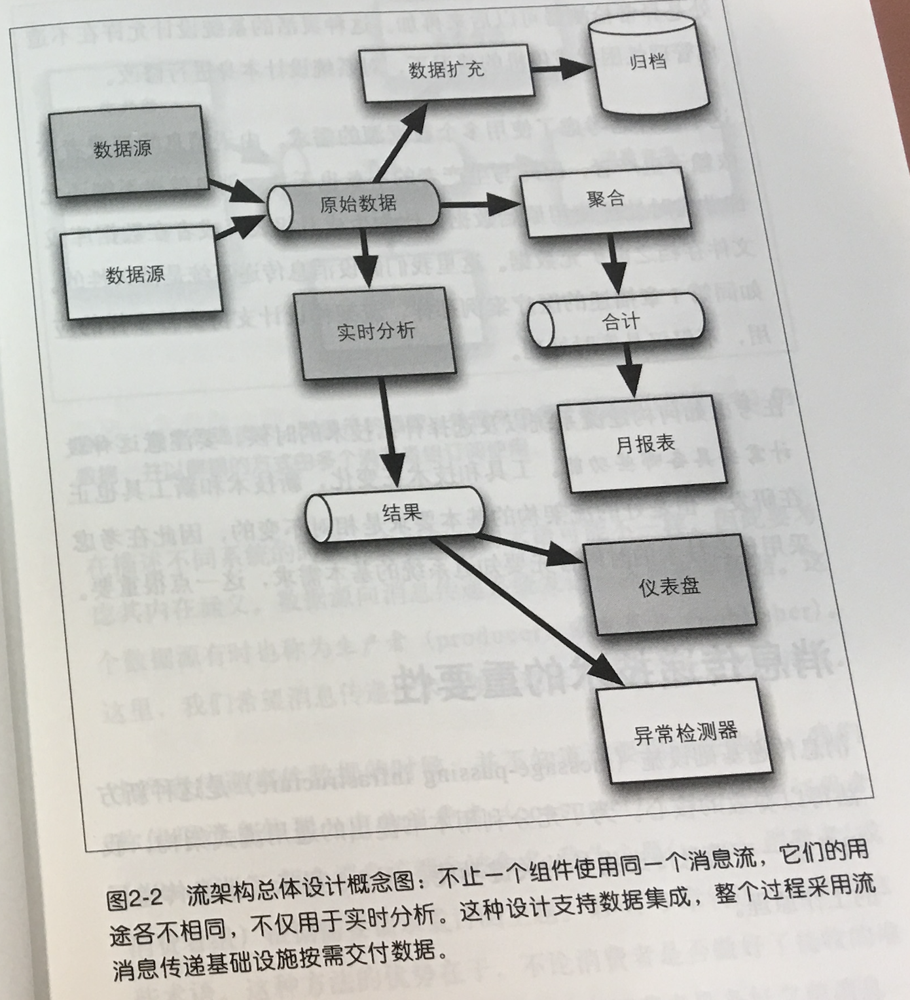

# [Streaming System](https://github.com/iamseancheney/pythonbooks/blob/master/Streaming%20Systems%20-%20Tyler%20Akidau.pdf)

## 为什么需要流处理
假设做一个实时更新的仪表盘: 他需要一个消息队列作为安全缓存
将数据流贯穿到整体架构之中

## Why Kafka high preferment

[stackoverflow What makes Kafka high in throughput?](https://stackoverflow.com/a/44621695)

正好一次处理  
窗口技术(基于时间，基于触发器)  

## 微服务与传统架构的区别

https://mapr.com/ebooks/streaming-architecture/chapter-03-streaming-platform-for-microservices.html

选择消息传递技术的重点在于，能否免去服务之前不必要的依赖或者复杂性

最终的设计

- Designing for a universal microservices architecture
- Maintaining independence of microservices by using lightweight communications between services via a uniform message-passing technology (such as Apache Kafka or MapR Streams) that is durable and high performance
- Use of distributed files, NoSQL databases, and snapshot

