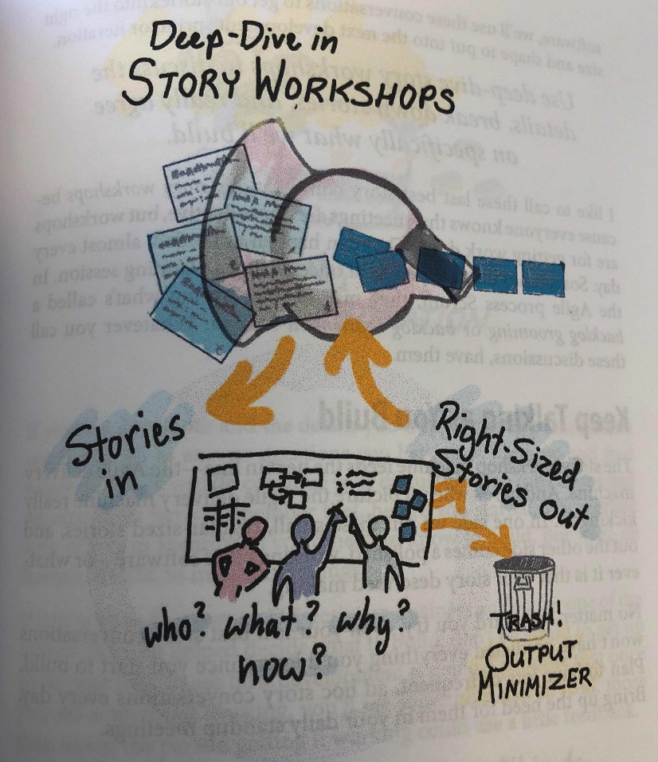

# [User story mapping](https://www.amazon.com/User-Story-Mapping-Discover-Product/dp/1491904909)

## Key take away
1. Tell stories, don't just write them
2. Use simple visualizations to anchor the stories you tell
3. Tell the whole story to find the parts that matter most
4. Think things through: minimize output maximize outcome and impact
5. Build to minimum viable product tests to find what's minimum and viable in the market
6. Effective stories connect everyone to the purpose of your product

## C0 Preface

Good story is generated from lots of discussions, we use conversation for common agreement.  
**good document should like a vocation photo**, looking at it helps you remember details that aren't in the photo.    
Measure outcome, people actually do differently to reach their goal as a consequence of what you built, and whether you make their life better

There’s always more to build than we have time or resource to build.  
Minimize input, and maximize outcome and impact.  
I had to work out the least I have do to make people feel happy.  

## C1 The big picture

- We should get together and tell our story by talking we could build shared understanding and together we’d arrive at better solutions
- Stories turns from shred documents to shared understanding
- Story maps are for breaking down big stories as you tell them
- Think write explain place. Record your idea and explain to others, it could be linked for later

 

- Reorganizing cards together allows you to communicate without saying a word
- Mapping your story helps you find holes in your thinking

- Focus on the breadth of the story before diving into the depth
- Do less, there is always more to build than you will have time for

## C2 Plan to build less

- We must always deliver on time
- We can’t release until we see all components linked together, visualize dependencies between teams

- find holes, what about games
- focus on what you hope will happen outside the system to make decisions about what’s inside the system
- The minimum viable solution is the smallest solution release that successfully achieves its desired outcomes

## C3 Plan to learn faster

- Product owner always owns **others' ideas**
- Ask questions

- Valid the idea with key stack holders, customer development partners
- For prototype prepare for bad news, its good to know now than several month later 

## C4 plan to finish on time
- Build it piece by piece

 

- Use the map for continuous discussion
- Discussions drive out more details, validate and build shared understanding
- Talking through the map with multiple users and subject matter experts helps test it for completeness
- Plan by slicing the map into holistic valuable releases

 ## C6 The real story about stories
- 3C

## C7 Telling better stories
- How to tell better story -> story template

- Good story like vocation photos
- Checklist
  - who what why
  - What's going on outside the software
  - What goes wrong
  - Questions and assumptions
  - Better solutions
  - How/How long
 

## C8 It's not all on the card

- Building shared understanding, let everyone notice what has been written on card in the real time
- Use every way to remember the conversation, photo, video, text

## C9 The card is just the beginning

## C10 Bake stories like cake
- You tell the story and imaging the software you will have in the end, you think and talk about who uses it and why

## C11 Rock breaking

- Task Size always matters
- A right-sizes story from a user’s perspective is the one that fulfills a need
- A right-sizes story from develop team’s perspective is that tales just a few days to build and test
- A right-sizes story from Business perspective is that helps a business achieve a business outcome

 

- opportunity discussions to agree the problem is worth to solve - to make a go forward or trash decision 
- Discover Minimum viable solution 
- Dive into the details of each story during delivery

- Keep talking as you build
- Evaluate each piece

- You need frequent reflect on product quality, your plans, and the way you work 
- Business stakeholders care about progress on the minimum viable solution

## C12 Rock breakers
- Effective product owners surrounded themselves with people they need to make good decisions.  But you need make final call

- Three amigos, Dev qa + Product discovery team + UE designer or business analyst

## C15 Using discovery for validated learning
- What if your guess is wrong
- Minimal viable solution will be unsuccessful most of time

## More links
- [Essentials of Agile User Story Mapping at Twitter - Atlassian Summit 2016](https://www.youtube.com/watch?v=svquaeyKg5E)
- [**Agile Product Ownership in a Nutshell**](https://www.youtube.com/watch?v=502ILHjX9EE&feature=youtu.be)
- [User Story Mapping with Jeff Patton](https://www.youtube.com/watch?v=AorAgSrHjKM)
- [Slides from Jeff Patton](https://www.slideshare.net/jeffpatton/user-story-mapping-discovery-the-whole-story)
- [Another PPT](https://www.slideshare.net/danapylayeva/user-story-mapping-workshop)

