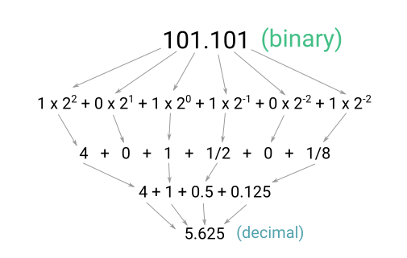
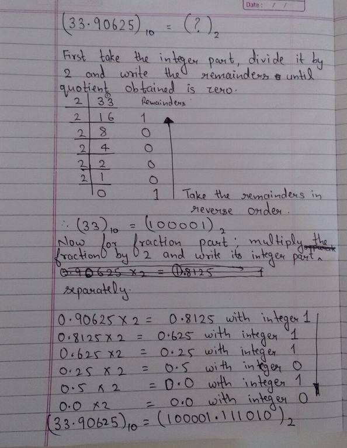
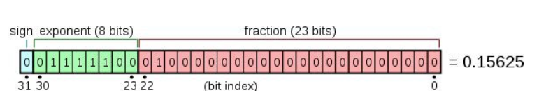
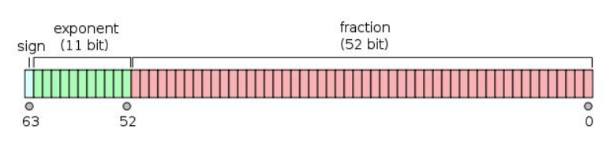

- [Float number](#float-number)
  - [Conversion](#conversion)
    - [Binary fraction to decimal](#binary-fraction-to-decimal)
    - [Decimal fraction to binary](#decimal-fraction-to-binary)
  - [Storage the value of float](#storage-the-value-of-float)
    - [float32](#float32)
    - [float64](#float64)
    - [Sign bit](#sign-bit)
    - [Exponent](#exponent)
    - [Mantissa](#mantissa)
  - [Reference](#reference)

# Float number

How computer represent float point  
Decimal(fragment) => binary => float32/float64

## Conversion

### Binary fraction to decimal




### Decimal fraction to binary

(A great example from [quora](https://www.quora.com/How-do-I-convert-the-decimal-fraction-to-binary-with-a-maximum-of-6-places-to-the-right-of-the-radix-point-example-33-90625))




## Storage the value of float

### float32

**Single precision**, which uses 32 bits and has the following layout:
- 1 bit for the sign of the number. 0 means positive and 1 means negative.
- 8 bits for the exponent.
- 23 bits for the mantissa.





### float64

**Double precision**, which uses 64 bits and has the following layout.
- **1 bit** for the sign of the number. 0 means positive and 1 means negative.
- **11 bits** for the exponent.
- **52 bits** for the mantissa.





### Sign bit
0 for positive
1 for negative

### Exponent
- Exponent can be positive (to represent large numbers) or negative (to represent small numbers, ie fractions).
- Exponent number is a shift to `127`(`7F`)
```
Exponent = 5  => 5 + 127 = 132 => 10000100
Exponent = -7 => -7 + 127 = 120 => 01111000
```
- Why:  
   + it allows for easier processing and manipulation of floating point numbers.  Eg: compare numbers as is using lexicographical order.
   + If the left most bit is a 1 then we know it is a positive exponent, otherwise it is a negative and it's a fraction
```
3 = 1010
-3 = 0100

Otherwise
3 =  0011
-3 = 1101

```
     


### Mantissa
- Always keep first digit as 1, which then could be ignored during store the value
```
111.00101101 => 1.1100101101 => 1100101101
0.0001011011 => 1.011011 => 011011
```

## Reference
- https://medium.com/@elliotchance/comparing-floating-point-numbers-in-c-c-f7aa483d7ae1
- https://indepth.dev/the-mechanics-behind-exponent-bias-in-floating-point/
- https://indepth.dev/the-simple-math-behind-decimal-binary-conversion-algorithms/