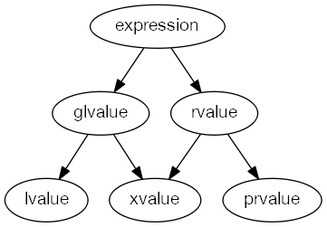

<!-- TOC -->
- [C++11 Notes](#c11-notes)
  - [General](#general)
  - [Rules](#rules)
  - [Lvalue & Rvalue](#lvalue--rvalue)
  - [Lambda](#lambda)
  - [Tuple](#tuple)
  - [Traits](#traits)
    - [enable if](#enable-if)
    - [Parameter pack](#parameter-pack)
  - [auto & decltype](#auto--decltype)
  - [Other Key words](#other-key-words)
  - [Sharedptr](#sharedptr)
  - [Concurrency](#concurrency)
    - [Coroutine/go style api](#coroutinego-style-api)
    - [Thread Pool](#thread-pool)
    - [Simple TBB](#simple-tbb)


# C++11 Notes

## General
[The biggest changes in C++11](https://smartbear.com/blog/develop/the-biggest-changes-in-c11-and-why-you-should-care/)  
[A glimpse into C++14](https://blog.smartbear.com/development/a-glimpse-into-c14/)  
[C++17 language features](https://stackoverflow.com/questions/38060436/what-are-the-new-features-in-c17)  
[2019-02 Kona report about C++ 20](https://www.reddit.com/r/cpp/comments/au0c4x/201902_kona_iso_c_committee_trip_report_c20/)  
[CPP Core Guidelines](https://github.com/isocpp/CppCoreGuidelines)  

## Rules
1. Try to avoid FOR loops, see whether there is internal functions supported.  
```C++
using SourceSinkNodes = std::unordered_set<NodeID>;
SourceSinkNodes source_nodes, sink_nodes;
...
const auto separated = std::find_if(source_nodes.begin(), source_nodes.end(), [&sink_nodes](const auto node) {
            return sink_nodes.count(node);
        }) == source_nodes.end();
```
2. Try to avoid new/delete, use make_shared/make_unique  
3. Try to understand fundamental difference of lvalue/rvalue from previous version  
4. Read excellent examples


## Lvalue & Rvalue
 



| Keyword                       | Notes                          | Reference |
|-------------------------------|:------------------------------|:------------------------------|
|| * lvalue or rvalue : Can you get the address <br/> * The most useful place for rvalue reference is overloading copy constructor and assignment operator, to achieve move semantics.<br/>* lvalue - An object that occupies some identifiable location in memory<br/> * rvalue - Any object that is not a lvalue <br/>* 1. Every C++ expression yield either an rvalue or a lvalue. <br/>* 2. If the expression has an identifiable memory address, it's lvalue; otherwise, rvalue.|* [code snippet](http://cpp.sh/9oz7) <br/> * [cppreference]( http://en.cppreference.com/mwiki/index.php?title=cpp/language/value_category&oldid=85137) <br/> * [Stroustrup - To move or not to move](http://www.stroustrup.com/move.pdf) <br/> * [Scott Meyers - Cppcon - Type Deduction and Why You Care](https://github.com/CppCon/CppCon2014/tree/master/Presentations/Type%20Deduction%20and%20Why%20You%20Care) [video](https://www.youtube.com/watch?v=wQxj20X-tIU) <br/><br/> * [C++11 Tutorial: Explaining the Ever-Elusive Lvalues and Rvalues](https://blog.smartbear.com/development/c11-tutorial-explaining-the-ever-elusive-lvalues-and-rvalues/) <br/> * [blog - move statement and perfect forward](https://codinfox.github.io/dev/2014/06/03/move-semantic-perfect-forward) <br/> * [Understanding lvalues and rvalues in C and C++](https://eli.thegreenplace.net/2011/12/15/understanding-lvalues-and-rvalues-in-c-and-c) <br/> <br/> * [stackoverflow - why stdmove and when should it be used for](https://stackoverflow.com/questions/3413470/what-is-stdmove-and-when-should-it-be-used?rq=1) <br/> * [stackoverflow - What are rvalues, lvalues, xvalues, glvalues, and prvalues? ](https://stackoverflow.com/questions/3601602/what-are-rvalues-lvalues-xvalues-glvalues-and-prvalues) <br/>* [stackoverflow  - What does T&& (double ampersand) mean in C++11?](https://stackoverflow.com/questions/5481539/what-does-t-double-ampersand-mean-in-c11) <br/> * [stackoverflow - When to use std::forward to forward arguments?](https://stackoverflow.com/questions/7257144/when-to-use-stdforward-to-forward-arguments)|

- Move constructor is particularly powerful where passing by reference and passing by value are both needed.  
Move constructor give you finer control of which part of your object to be moved.
```C++
boVector(const boVector && rhs) {
    cout << "Move constructor.\n";
    size = rhs.size;
    array = rhs.array;
    overload(rhs);
   }

   overload(boVector&  v) { cout << "by lvalue."; }
   overload(boVector&& v) { cout << "by rvalue."; }
```

- Why need std::forward
```C++
//一个右值引用作为函数的形参，在函数内部再转发的时候已经变成一个左值了

Template <typename T> void forwardValue(T& val) { processValue(val);} // change to left value

Template <typename T> void forwardValue(const T& value) {processValue(val);} // change to const ref to left

```
- What is forward
```C++
template<class T>
T&& forward(typename remove_reference<T>::type& arg) {
  return static_cast<T&&>(arg);
} 
```
More information please go to [C++ rvalue reference page](./c++11-rvalue-reference.md)

## Lambda
- Grammar
```
[capture clause] (parameters) -> return-type {body}
```
- Example
```C++
auto addX = [=](int y) { return x + y; }; // capture local objects (local variables, parameters) in scope by value.
addX(1); // == 2
 
auto getXRef = [&]() -> int& { return x; }; // capture local objects (local variables, parameters) in scope by reference.
getXRef(); // int& to `x`

// By default, value-captures cannot be modified inside the lambda because the compiler-generated method is marked as const. 
// The mutable keyword allows modifying captured variables. 
auto f = [x] () mutable { x = 2; };   // Without mutable would be compilation error

```

| Keyword                       | Notes                          | Reference |
|-------------------------------|:------------------------------|:------------------------------|
||[=] //capture all of the variables from the enclosing scope by value<br/>[&]//capture all of the variables from the enclosing scope by reference <br/>[this]//capture all of the data members of the enclosing class<br/>  // lamda help to pass context <br/>[this] pass by reference <br/>[*this] pass by copy |[code snippet](http://cpp.sh/4kofdf) <br/> [cppreference]( http://en.cppreference.com/w/cpp/language/lambda) <br/>  [C++11 tutorial lambda expressions the nuts and bolts of functional programming]( https://smartbear.com/blog/develop/c11-tutorial-lambda-expressions-the-nuts-and-bolts/) <br/> [Glennan Carnie - Demystifying C++ lambdas]( https://blog.feabhas.com/2014/03/demystifying-c-lambdas/) <br/> [University of Michigan - Handout - Using C++ Lambdas](http://umich.edu/~eecs381/handouts/Lambda.pdf) <br/>|
|std::bind||[code snippet](http://cpp.sh/6urbc)| 
|Std::function|const std::function<void(int)>& f|[code snippet](http://cpp.sh/6bcdz)|


## Tuple
- [code snippet](http://cpp.sh/3pzjt) to print all values from tuple by template, another way is inheritance
- Get value from tuple, suppose last value of a tuple is integer
```C++
int len = std::get<1>(tp);                       
int len = 0; std::tie(std::ignore, len) = tp;   
```
- When you want to return multiple objects and you can't find proper name for which, please don't define one-time use only structure for this but try with tuple instead.
- Example
```C++ 
inline bool operator<(const OSMObject& lhs, const OSMObject& rhs) noexcept {
    return const_tie(lhs.type(), lhs.id() > 0, lhs.positive_id(), lhs.version(), lhs.timestamp()) <
           const_tie(rhs.type(), rhs.id() > 0, rhs.positive_id(), rhs.version(), rhs.timestamp());
}
```

## Traits

### enable if  
enable_if is a compile-time switch for templates, which will check at compilation time and provide more protection.  
- Below is a simple case for demoing two way of using enable_if [code snippet](http://cpp.sh/9tlqm)
```C++
// 1. the return type (bool) is only valid if T is an integral type:
template <class T>
typename std::enable_if<std::is_integral<T>::value,bool>::type
is_odd (T i) {return bool(i%2);}

// 2. the second template argument is only valid if T is an integral type:
template < class T,
           class = typename std::enable_if<std::is_integral<T>::value>::type>
bool is_even (T i) {return !bool(i%2);}
```

- Inside template class, enable_if could apply to function parameter, template parameter or return type[code snippet](http://cpp.sh/5ijga)
```C++
template<typename T>
struct Check1
{
   template<typename U = T>
   U read(typename std::enable_if<
          std::is_same<U, int>::value >::type* = 0) { return 42; }

   template<typename U = T>
   U read(typename std::enable_if<
          std::is_same<U, double>::value >::type* = 0) { return 3.14; }   
};
template<typename T>
struct Check2
{
   template<typename U = T, typename std::enable_if<
            std::is_same<U, int>::value, int>::type = 0>
   U read() { return 42; }
   // ...
}

template<typename T>
struct Check3
{
   template<typename U = T>
   typename std::enable_if<std::is_same<U, int>::value, U>::type read() {
      return 42;
   }
   // ...
}
```
Take away:
1. The main purpose of std::enable_if is providing a way to limit types could be pass into a template class.    
  Take the upper case as an example, without enable_if limitation, we define Check1<Any type>, but almost for all situation, this is not what we want.  Our logic might just expect its either int or double, if pass string into then could trigger compilation error.<br/>  
  
2. The purpose of `::type* = 0` is just given a default value for type, so you don't need parameters to call this function.<br/>
   For example, you could write check1_obj.read() or check1_obj.read(&variable); You could find experiments here [code snippet](http://cpp.sh/8tvjm)  
3. enable_if always used for such situation, for passing type in certain condition, go to one kind of operation, others go to differernt operation.  [code snippet](http://cpp.sh/25xnx) [stackoverflow](https://stackoverflow.com/questions/29040059/enable-if-to-add-a-function-parameter-that-has-a-default-argument)
```C++
/*
you wish to write multiple overloads of the function template with different behaviours that are 
controlled by one or more of the template arguments. Then, by replacing your_condition with a 
condition expressing an appropriate requirement on the template argument(s), you can enlist the 
SFINAE principle to select the specific overload that you want to be instantiated for given 
template arguments.

The SFINAE parameter - let's call it that - is unused by the instantiated function; it exists 
solely to provoke SFINAE in function template overload resolution. Hence it can be nameless, 
and hence it must be defaulted: it must not force you to provide an additional, useless, argument 
when you invoke the function template.
*/

template <typename T>
T foo(T && t, 
    typename std::enable_if<std::is_same<T,int>::value, void **>::type = nullptr)
{
    std::cout << "Doubling " << t << " gives " << (t + t) << std::endl;
    return t + t; 
}

template <typename T>
T foo(T && t, 
    typename std::enable_if<!std::is_same<T,int>::value, void **>::type = nullptr)
{
    std::cout << "Squaring " << t << " gives " << (t * t) << std::endl;
    return t * t; 
}
```
4. https://eli.thegreenplace.net/2014/sfinae-and-enable_if/<br/>

5. Examples  
[OSMIUM - enable_if check template parameter](https://github.com/Telenav/osrm-backend/blob/016adf6439433929ed5c6fd1272aee00d32f8ec1/third_party/libosmium/include/osmium/tags/matcher.hpp#L84)   
[OSRM - enable_if check function parameter](https://github.com/Telenav/osrm-backend/blob/016adf6439433929ed5c6fd1272aee00d32f8ec1/include/util/filtered_integer_range.hpp#L94)  

6. More information<br/>
[stackoverflow - Why should I avoid std::enable_if in function signatures](https://stackoverflow.com/questions/14600201/why-should-i-avoid-stdenable-if-in-function-signatures/14623831)<br/>
[stackoverflow - std::enable_if to conditionally compile a member function](https://stackoverflow.com/questions/6972368/stdenable-if-to-conditionally-compile-a-member-function)<br/>
[stackoverflow - std::enable_if : parameter vs template parameter](https://stackoverflow.com/questions/11055923/stdenable-if-parameter-vs-template-parameter) <br/>
[SFINAE - Substitution failure is not an error](https://en.wikipedia.org/wiki/Substitution_failure_is_not_an_error)<br/>
[C++11新特性--std::enable_if和SFINAE](https://www.jianshu.com/p/a961c35910d2)


### Parameter pack
- Use template to unpack parameters: [code snippet](http://cpp.sh/6mmae)<br/>
  Different way to write terminate function: [code snippet](http://cpp.sh/9rc5)
  For these two way, both of them using recursion to unpack parameters, there must be a **terminate function**
- If you use `,` and initialization list then would be easier to write [code snippet](http://cpp.sh/5676q7)

## auto & decltype
- Whether const auto = auto const?  I think so based on this [stackoverflow-Is 'auto const' and 'const auto' the same?](https://stackoverflow.com/questions/10709897/is-auto-const-and-const-auto-the-same)  
There are people recommand write const volatile infront of auto to avoid auto type deduction
```C++
const volatile auto coeffarr={3.6666667, 2.65, 1.3333}; //const volatile double[]
```
- [auto or auto&](https://stackoverflow.com/questions/29859796/c-auto-vs-auto/29859998)  
Choose auto x when you want to work with copies.  
Choose auto &x when you want to work with original items and may modify them.  
Choose auto const &x when you want to work with original items and will not modify them.  

- Decltype deduces the type of an expression
```C++
template <class T>
auto get_value_by_key(T const &object, const char *key) -> decltype(object.get_value_by_key(key))
```
std::result_of is an older version before decltype.  std::result_of could be implemented by Decltype and Decltypecould always make code simpler. <br/> [stackoverflow - Difference between std::result_of and decltype](https://stackoverflow.com/questions/2689709/difference-between-stdresult-of-and-decltype)
```C++
  template<typename _Signature>
    class result_of;

  template<typename _Functor, typename... _ArgTypes>
    struct result_of<_Functor(_ArgTypes...)>
    {
      typedef
        decltype( std::declval<_Functor>()(std::declval<_ArgTypes>()...) )
        type;
    };
```
[OSRM - decltype example](https://github.com/Telenav/osrm-backend/blob/016adf6439433929ed5c6fd1272aee00d32f8ec1/include/partitioner/reorder_first_last.hpp#L37)
- std::result_of Deduces the return type of an INVOKE expression at compile time. [code snippet](http://cpp.sh/85qkt)

## Other Key words


| Keyword                       | Notes                          | Reference |
|-------------------------------|:------------------------------|------------------------------:|
|override & final|Overrides specifiy a virtual function overrides another vitual function. <br/> If the virtual funciton does not override a parendt's virtual function throw a compiler error.<br/> Final specifies that a virtual function cannot be overrridden in a derived class or that a class cannot be inherited from<br/>|[code snippet](http://cpp.sh/523s)|
|default & delete||[code snippet](http://cpp.sh/542vn)|
|std::initializer_list||[code snippet](http://cpp.sh/6zfao)|
|Std::unordered_multimap||[code snippet]( http://cpp.sh/7bxf5)|
|std::copy_if||[code snippet](http://cpp.sh/8tre)|
|std::adjacent_find|check the two element which is near to each other|[code snippet]( http://cpp.sh/4h2a4)|
|std::nth_element ||[cppreference]( http://en.cppreference.com/w/cpp/algorithm/nth_element) [code snippet](http://cpp.sh/3axpc) |
|Std::find_if|| [code snippet](http://cpp.sh/7jh47)|
|Std::decay|Remove reference and const volatile(cv) |[example in OSRM](https://github.com/Project-OSRM/osrm-backend/blob/82b5648c97edf1d2edec7aecebc35aa8a8033c82/src/server/api/url_parser.cpp#L74)|
|Std::result_of|Obtain the result type of a call to fn <br/>拿一个可调用对象的返回值类型|[code snippet](http://cpp.sh/85qkt)|
|std::bind|The example of bind multiple functor with std::bind->|[code snippet](http://cpp.sh/542vn)|
|std::function|const std::function<void(int)>& f|[code snippet](cpp.sh/6bcdz)|


## Sharedptr
| Keyword                       | Notes                          | Reference |
|-------------------------------|:------------------------------|:------------------------------|
|shared_ptr|| *[code snippet](http://cpp.sh/9bn4f) Tests shared_ptr|
|unique_ptr|guarantee deallocation <br/> only move, no assignment| * [code snippet](http://cpp.sh/8zpr6) Implements make_unique <br/> * [code snippet](http://cpp.sh/2kkip) deleter type for shared_ptr and unique_ptr |
|weak_ptr|Won't increase shared_ptr's reference count, could be used for break recursive referernce <br/>||
<br/>

- Example of unique_ptr [from aws-sdk](https://github.com/aws/aws-iot-device-sdk-cpp/blob/dab39e33abad342e51476cde85d35613159203c5/src/util/JsonParser.cpp#L40)
```C++
std::unique_ptr<FILE, int (*)(FILE *)>
input_file = std::unique_ptr<FILE, int (*)(FILE *)>(fopen(input_file_path.c_str(), "rb"), fclose);
if (nullptr == input_file) {
    return ResponseCode::FILE_OPEN_ERROR;
}
```

- Example of unique_ptr [from aws-sdk](https://github.com/aws/aws-iot-device-sdk-cpp/blob/dab39e33abad342e51476cde85d35613159203c5/src/util/JsonParser.cpp#L53)

```C++
std::unique_ptr<char[]> read_buffer = std::unique_ptr<char[]>(new char[fsize]);
```

- std::unique_ptr 指定删除器的时候需要确定删除器的类型
```C++
std::shared_ptr<int> ptr(new int(1),[](int* p){delete p}); //correct
std::unique_ptr<int> ptr(new int(1),[](int* p){delete p}); //incorrect!

std::unique_ptr<int,void(*)(int*)> ptr(new int(1),[](int* p){delete p;}); //correct
std::unique_ptr<int,void(*)(int*)> ptr(new int(1),[&](int* p){delete p;}); //incorrect, capture variable

std::unique_ptr<int,std::function<void(int*)>> ptr(new int(1),[&](int* p){delete p;});
```

- <span style="color:red">**Never dereferernce shared_ptr and then call obejct's interface**</span>
```C++
auto& p = *returns_a_shard_ptr();
// If you dereference shared_ptr to normal pointers, that means you given up protection from shared_ptr
// When reference count of this shared_ptr becomes 0, the resource it holds will be destructed
// Call interface from p is very dengerous and could possibly caused crash
p.func();  
```

- <span style="color:red">**Is shared_ptr thread safe?**</span>  
Don't get your hopes up.  There are two parts in shared_ptr, one is ref-count and another is the pointer it points to.  If there is no protection who could gurantee the safeness of the pointer?


- Manage 3rd party resource
```C++
#define GUARD(p) std::shared_ptr<void> p##p(p, [](void*p){ GetHandle()->Release(p);});
// or #define GUARD(p) std::unique_ptr<void, void(*)(void*)> p##p(p, [](void*p){ GetHandle()->Release(p);});

void* p = GetHandle()->Create();
GUARD(p);

```

## Concurrency

| Keyword                       | Notes                          | Reference |
|-------------------------------|:------------------------------|:------------------------------|
|Lock_guard||[code snippet](http://cpp.sh/6y3fi)|
|Detach||[code snippet](http://cpp.sh/8zb43)|
|condition_variable||[code snippet](http://cpp.sh/8vxt)|
|Promise&Future| std::promise is used by the "producer/writer" of the asynchronous operation. <br/>std::future is used by the "consumer/reader" of the asynchronous operation. |[code snippet](http://cpp.sh/4kr) <br/>[code snippet](http://cpp.sh/7gbd7)<br/> [code snippet](http://cpp.sh/865jm) <br/> [cppreference](http://en.cppreference.com/w/cpp/thread/promise/set_value) <br/><br/> [Concurrency in C++11 - promise, future and what's next](https://paoloseverini.wordpress.com/2014/04/07/concurrency-in-c11/) <br/> [Futures from Scratch]( https://github.com/CppCon/CppCon2015/blob/master/Tutorials/Futures%20from%20Scratch/Futures%20from%20Scratch%20-%20Arthur%20O'Dwyer%20-%20CppCon%202015.pdf) [video](https://www.youtube.com/watch?v=jfDRgnxDe7o&t=1031s) <br/> <br/> [github - twitter - promise impl in scala](https://github.com/twitter/util/blob/master/util-core/src/main/scala/com/twitter/util/Promise.scala) <br/> [github - twitter future impl in scala](https://github.com/twitter/util/blob/master/util-core/src/main/scala/com/twitter/util/Future.scala) <br/> [github - twiter - finagle futures](https://twitter.github.io/finagle/guide/Futures.html)|


### Coroutine/go style api
- [github - libco - 微信](https://github.com/Tencent/libco)<br/>
- [github - slab - implementation of Future and channel ](https://github.com/stlab/libraries)<br/>
- [github - libgo - 魅族科技](https://github.com/yyzybb537/libgo)<br/>
- [github - coroutine-scheduler - Daniel](https://github.com/daniel-j-h/coroutine-scheduler)<br/>


### Thread Pool
- [github - simple C++11 thread pool impl](https://github.com/progschj/ThreadPool)<br/> 
- [github - thread-pool doc](https://github.com/mtrebi/thread-pool/blob/master/README.md#thread-pool)<br/>

### Simple TBB
- [github - task impl](https://github.com/CodeBear801/zoo/blob/eee7b107f3e3909c837538b60aa691aa78eba15f/concurrency/tbb_simple/include/task.hpp#L43) [test](https://github.com/CodeBear801/zoo/blob/eee7b107f3e3909c837538b60aa691aa78eba15f/concurrency/tbb_simple/unit_tests/engine/task_test.cpp#L1)<br/>
- [github - ParallelForeach impl](https://github.com/CodeBear801/zoo/blob/eee7b107f3e3909c837538b60aa691aa78eba15f/concurrency/tbb_simple/include/parallel_algrithm.hpp#L11) [test](https://github.com/CodeBear801/zoo/blob/eee7b107f3e3909c837538b60aa691aa78eba15f/concurrency/tbb_simple/unit_tests/engine/parallel_algorithm_test.cpp#L10)<br/>


