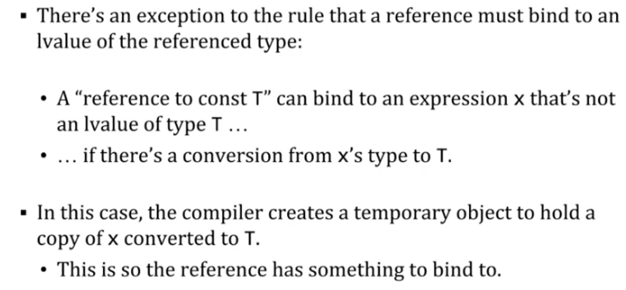
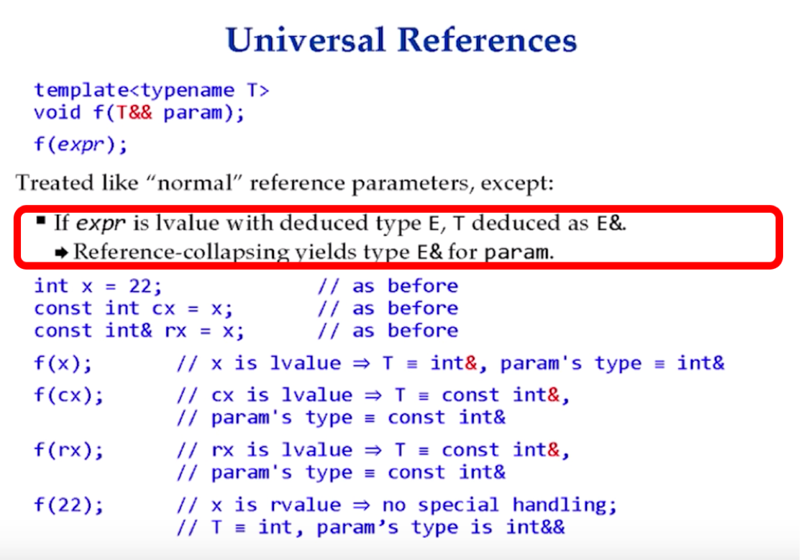
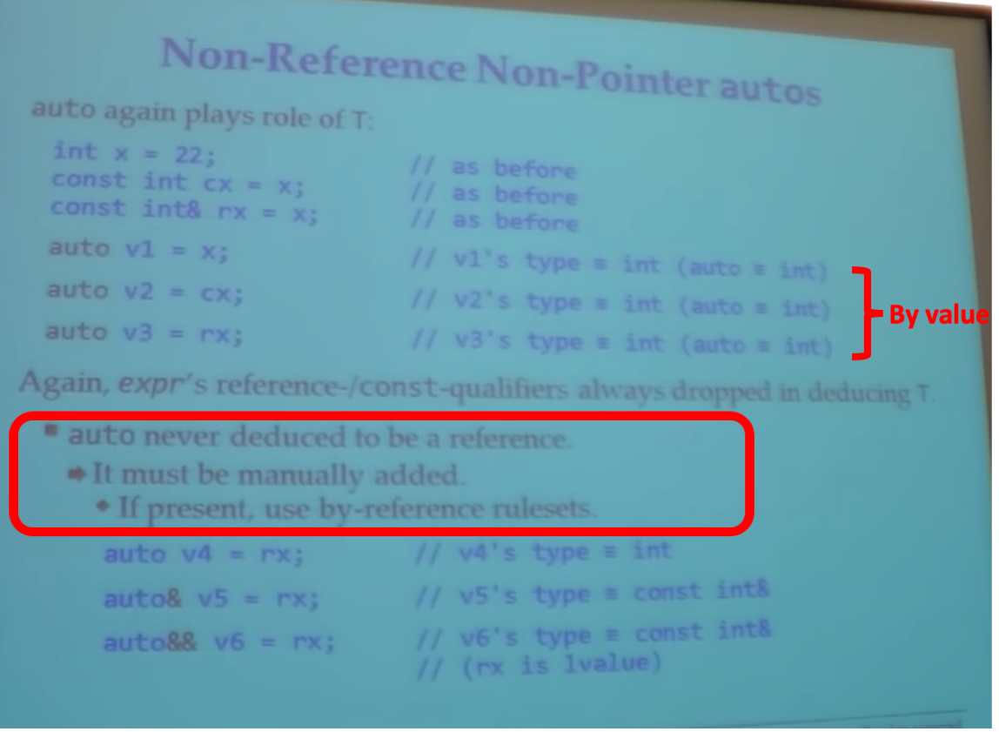
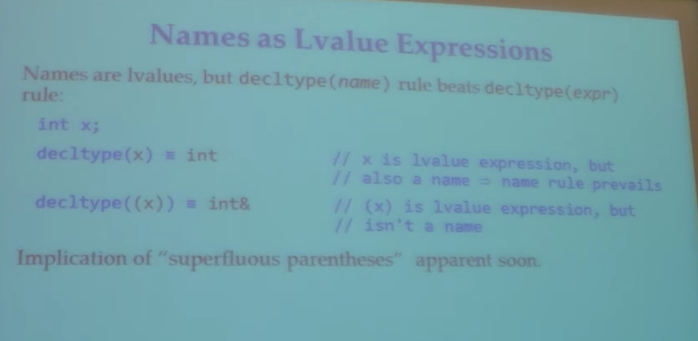
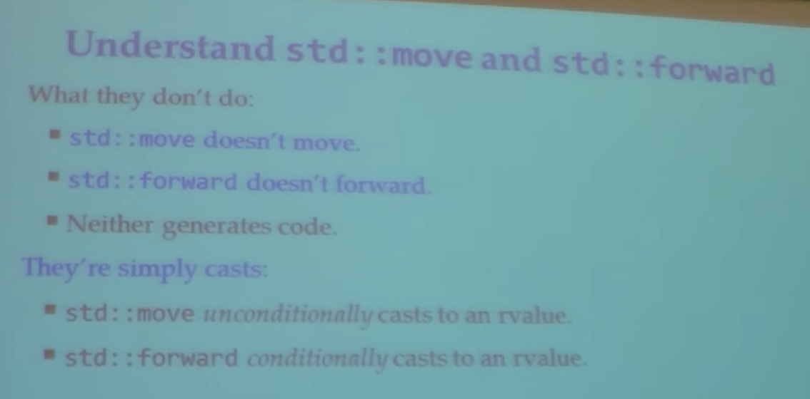
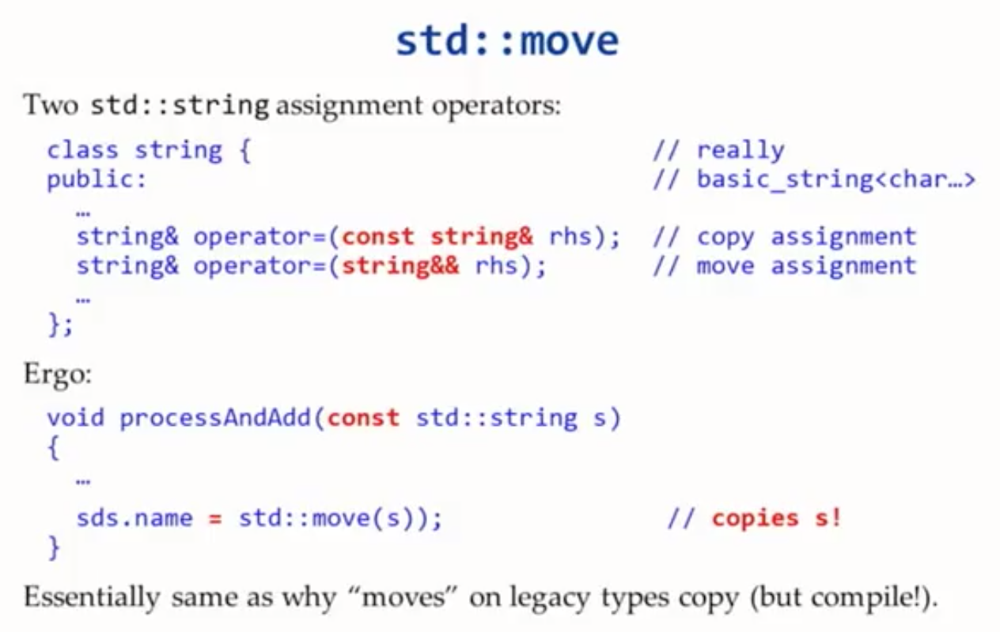
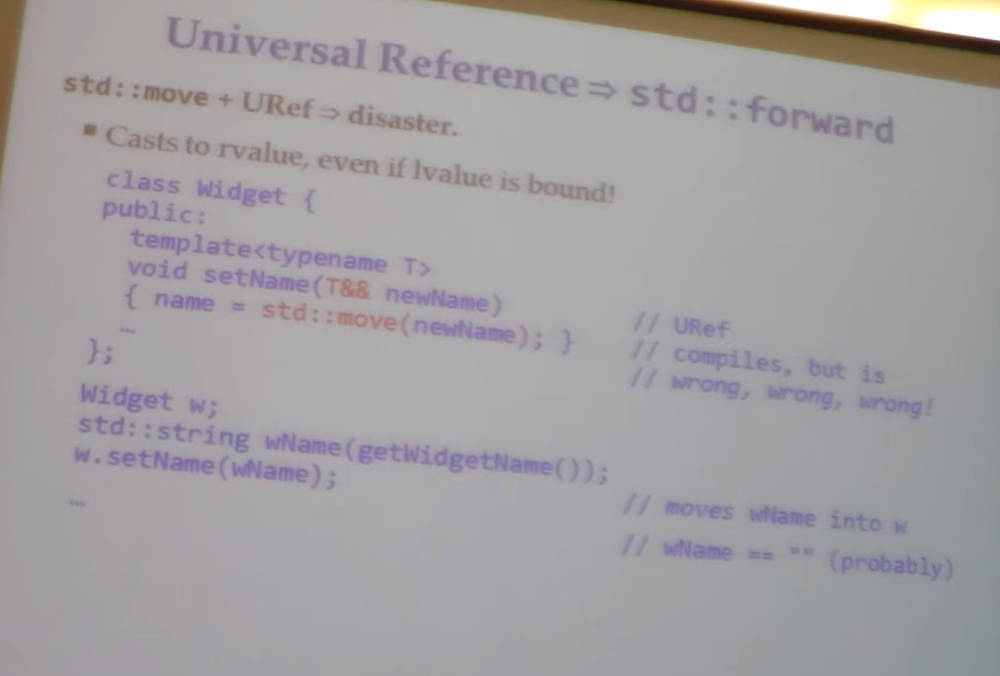

- [C++11 RRef & URef](#c11-rref--uref)
  - [Lvalue & Rvalue](#lvalue--rvalue)
    - [In C](#in-c)
    - [Why lvalue & rvalue](#why-lvalue--rvalue)
    - [Basic case](#basic-case)
    - [Enumeration Constants](#enumeration-constants)
    - [unary &](#unary)
    - [unary *](#unary)
    - [Data storage](#data-storage)
    - [const](#const)
      - [Const type](#const-type)
      - [Const object](#const-object)
    - [references](#references)
    - [pass parameter by value or reference](#pass-parameter-by-value-or-reference)
    - [references and temporaries](#references-and-temporaries)
      - [Exceptions](#exceptions)
    - [operator](#operator)
  - [Type deduction](#type-deduction)
    - [Template type deduction](#template-type-deduction)
      - [Non-Uref Reference/Pointer parameters](#non-uref-referencepointer-parameters)
      - [Universal reference](#universal-reference)
      - [By value parameters](#by-value-parameters)
    - [auto type deduction](#auto-type-deduction)
    - [Lambda capture type deduction](#lambda-capture-type-deduction)
    - [Decltype deduction](#decltype-deduction)
    - [Function return type](#function-return-type)
  - [std::move & std::forward](#stdmove--stdforward)
    - [std::move](#stdmove)
    - [std::forward](#stdforward)
  - [Reference](#reference)

# C++11 RRef & URef

## Lvalue & Rvalue

Lvalue & rvalue are <span style="color:red">**sematic properties of expressions**</span>


### In C

- Every expression in C either a lvalue or a rvalue
- An lvalue is an expression referring to an object.  An object is a region of storage.
- An rvalue is simply an expression that's not an lvalue
- Caveat: although this is true for none-class type in C++, its not true for class types
- Java: build-in type-> pass by value, none build-in -> pass by reference


<span style="color:red">Why lvalue is none moveable - lvalue means it could have more than one way to access that variable </span>


Function return value: no name, you can't take it address, candidate for moving


### Why lvalue & rvalue


<span style="color:blue">Why differentiate lvalue & rvalue</span>
<br/>

<br/>

<br/>

<br/>

<br/>
<span style="color:red">rvalue give compiler the permission for optimization.</span>


### Basic case

```C
int m, n
m=n.    // n is lvalue, this assignment uses the lvalue expressions n as an rvalue
              // due to c++ performs an lvalue-to-rvalue conversion
              // assign to lvalue m

m+n.     // the result in a compiler-generated temporary object, such as a CPU register -> rvalue
```

More examples


```C++
//Lvalue Examples:
int i;
Dog d1;
i = 1;  // i

// more explain
// i is lvalue
// - named object, address can be taken
// - could be referred for multiple times


//Rvalue Examples:
int x = 1;  // 1
int x = x + 1; // x+ 1
d1 = dog();    // dog() is rvalue of user defined type (class)

// more explain
// 1 is rvalue
// - can't take its address
// - all build-in numeric literals are rvalues

int sum(int x, int y) { return x+y; }
int i = sum(1, 2);  // sum(1, 2) is rvalue

template <typename T1, typename T2>
int sizeDiff(const T1& t1, const T2& t2)
{ return t1.size() - t2.size(); }

// sizeDiff, t1, t2 are lvalue
// Return value is rvalue
// - address can't be taken
// - no way to get pointer/reference to it

int *px;
*px = sizeDiff(v, s);
// sizeDiff(v, s) is rvalue

// lvalue reference
int& r = x;   // r
const int& r = 1;  // assign rvalue to const lvalue reference 

// lvalue can be used to create an rvalue
int i = 1;
int x = i + 2; 

// rvalue can be used to create an lvalue
int v[3];
*(v+2) = 4;

// - function or operator always yields rvalues.
// - lvalues are modifiable
// - rvalue are not modifiable

// rvalue referernce
int&& c = 3;

```


### Enumeration Constants
- When used in expressions, enum constans are also rvalues
```C
enum color {red, green, blue};
color c;

c = green;  // OK, c is an lvalue, green is rvalue
blue = green; // wrong, blue is an rvalue

```


### unary &
&e is valid expression only if e is an lvalue, <span style="color:red">&e is rvalue</span>  
&e = n is not work


### unary *
In contrast to unary &, unary * yields an lvalue  

<span style="color:red">A pointer p can point to an object, so *p is an lvalue</span>  

<span style="color:red">However, its operand can be an rvalue, while result is lvalue</span>

```C
Int *p = a;
*p = 3;

Char *s = Null
*s = '\0'.  // undefined behavior

*(p + 1) = 4   // p+1 is an rvalue, but *(p+1) is an lvalue, we store 4 into the object referenced by *(p + 1)

```

### Data storage


### const

#### Const type

An lvalue is non-modifiable if it has a const-qualified type

```C
Char const name[] = "dan"
Name[0] = 'x'.     // wrong, name[0] is lvalue, but can not change
```


#### Const object


### references
```C++
Int &ri = a;  // ri is an alias for a
```


<span style="color:red">A reference yields an lvalue</span>  
<span style="color:blue">Why reference</span>: C++ has references so that overloaded operators can look just like build-in operators.
Lvalue properties we need, such as implement ++ operator

```C++
Month & operator++(month& x)
{
   return x = static_cast<month>(x + 1);
}
```

### pass parameter by value or reference
```C++
R f(T t)                 // by value: f has access only to a copy of x, not x itself

R f(T const &t)    // by reference to const, f's parameter is declared to be non-modifiable 
```


### references and temporaries


<span style="color:red">A "pointer to T" can point only to an lvalue of type T</span>
<span style="color:red">A "reference to T" binds only to an lvalue of type T</span>
```
int *pi = &3;  // wrong, can't apply & to 3
int &ri = 3;   // wrong, 3 is a rvalue

int i;
double *pd = &i   // wrong, can't convert pointers
double &rd = i    // wrong, can't bind
```

#### Exceptions





```
int const &ri = 3;
double const &rd = ri;
// converts ri from int to double -> create a temp double to hold result -> binds rd to temp -> when out scope rd will destroys the temp
```


### operator
operator+ yields an rvalue

```
string operator+(string const &lo, string const &ro)
s = s + string(",") + t // lvalue + rvalue + lvalue
string *p = &(s + t);   // wrong
```

***

## Type deduction

C98 is simple, only template, pass by value, pass by &/*  
C++11 add auto, universal reference, lambda capture and return, decltype  
C++14 add function return types, lambda init capture  


### Template type deduction


**Pass by reference is the easier one, pass by value is the complicated one**

#### Non-Uref Reference/Pointer parameters


& will always be ignored, for <span style="color:red">none-uref</span>


<br/>
pointer
<br/>


<span style="color:red">Auto behaves exact the same as type deductions</span>


#### Universal reference




f(22)  22 is a rvalue, universal references be initial as rvalue value, became rvalue references 

Summary: when you have a universal reference
    if you init it with lvalue, the type be deduced as lvalue reference(E&).  
    <span style="color:red">Type T will be deduced to reference only when you deal with universal reference</span>
    

#### By value parameters


<span style="color:red">Pass by value gives a completely independent object</span>

### auto type deduction

Auto & template deduction has the same rules




<span style="color:red">If you want to have a reference, you must manually add &when you use auto</span>

Auto&& is not that common,  but in C++14 you could use it in lambda(forward)


<span style="color:red">A brace initializer don't has type</span>


Only "auto" works


### Lambda capture type deduction

### Decltype deduction


Decltype didn't throw const/&/valotile

Below is a special rule


<span style="color:red">Usually, a lvalue reference expression already be a reference type </span>



(x) is an expression


### Function return type deduction


Auto vs. template: only diff is {} initialization


Auto itself never a reference type  
Auto will make a copy  


Decltype(auto) add &  


(retVal) is not longer a name of variable, this is an expression

Deduce return type should be used carefully, most time you just directly return type


When you declare an object, you should prefer to use auto: readability

***

## std::move & std::forward

### std::move

**important**




Std::move and std::forward talks to compiler, if std::move it means this expression here is a rvalue, if std::forward it means this expression here **might** be a rvalue.


<br/>


Why move


https://stackoverflow.com/questions/21605579/how-true-is-want-speed-pass-by-value


Move to a const object?  



Finally call copy constructor.  **Move doesn't move**


When use move operator, If the type you want to cast to don't support move, then it will fall back to copy
-- you can only pay really really close attention to avoid this

### std::forward


Notice that, param is a lvalue  
If what was passed originally was a rvalue, then turn param back to rvalue even though it’s a lvalue inside the function  
If what was passed originally was a lvalue, then the fact of param is lvalue should be unchanged  
That's why std::forward is a conditional cast  


for lvalues, returns T& Reference clapsing <br/>
Is deduce type always none reference:  
For lvalues, the deduce type is lvalue reference  
For rvalues, its none-reference revalue  


***


## Universal reference vs Rvalue Reference

### Distinguish Uref & RRef

Rvalue references, wrap by std::move  
Universal reference, wrap by std::forward  


**important**


The purpose of rvalue reference is used to identify whether the object can be moved from  
Universal reference also has name forward reference


<span style="color:red">If a variable or parameter is declared to have type T&& for some deduced type T, that variable or parameter is a universal reference.</span>


<span style="color:red">UURef, the form is T&& and there has to be a type deduction for T</span>
Otherwise its just a Rvalue reference


<span style="color:red">Object type is independency of rvalueness or lvalueness</span>  
What universal reference really is depened on how the expression was initialized  
If the expression initializing a universal reference is an lvalue, the universal reference becomes an lvalue reference.  
If the expression initializing the universal reference is an rvalue, the universal reference becomes an rvalue reference.  

<br/>
<span style="color:red">Parameters are lvalues, its type could be lvalue or rvalue</span>


Rhs is lvalue, while its type is rvalue reference  


```C++
Widget&& var1 = Widget();   // Widget() generate a rvalue for object Widget
                            // you could take the address of var1, so var1 is lvalue
Widget&& var4 = va1;        // wrong, rvalue reference could only combine with rvalue, while var1 is lvalue

auto&& var3 = var1;         // var3's type declaration of auto&& makes it a universal reference 
                            // and because it's being init with var1 an lvalue, var3 becomes an lvalue reference)
                            // It the same as Widget&var3 = var1;

std::vector<int> v;

Auto&& val = v[0];          // val is universal reference, with a call to std::vector<int>::operator[]
                            // That function returns an lvalue reference to an element of vector
                            // so in the result var is lvalue reference

//http://cpp.sh/7tf5
```


User code, in C++14 lambda, always to take auto&& parameters  


### T&& not always Uref
#### Case 1: No template deduce

**Exceptions**


Push_back(int&& x)    There is no type deduced here  
Look from the user code, when you call push_back, vi's type already be decided.  


<span style="color:blue">Why need std::move? </span> take the vector as an example, there are two overload, with rvalue referece you could get additional efficiency with std::move.  Preserve rvalueness, pass value into several deep who really do the work.  


#### Case 2: Const/Volatile


Const will not be deduced for f(const T&& param)  
Rvalue reference means candidate for moving, const means can't be modified  
Rvalue reference to const is very very very **uncommon**  


### function overloading

You will overload rvalue reference functions, but you won't for uref version


<span style="color:blue">Why not always use std::forward, since it could automatically be translated to rvalueref/lvalue ref:</span> Yes you can, but, when I wrote std::move I want clearly represent the idea of: this is an rvalue and I want to keep the rvalueness in the following function call, when I wrote std::forward I want to represent the idea of universal reference, might be a rvalue reference or might be a lvalue reference, they make different statement, I want the reader have a clear idea of this.


Push_back, we know exactly what the type is, there is no type deduction   
Emplace_back, we don't know what we passed, emplace_back is not overloaded   
<span style="color:blue">Why have move and forward, not directly use const &:</span> that depend on your purpose, if you don't want to modify anything, then you could use const &.  When write function like upper one, it means I either want to a copy, or want to have a move operation if which could bring me additional flexibility.


***

## Return Rref&Uref


### Return by std::move & std::forward


Why need std::forward & std::move.  That's one important point for C++11




vName == ** is due to the implementation of string(stirng&& s) will probably assgin nullptr for original string


If pass in as lvalue, setText take text as std::move,  then later its gone  
So the first line should take it as copied, only last sentence applied std::forward


Temp is rvalue ref, it is safe to change
Std::move(temp) means I want the content of Matrix to be moved to return value, its different with return value optimization, which is not work on rvalue reference


Compile require to copy data from temp to the location of matrix


Without forward it will be copied into return value, otherwise it could be moved


C++ compiler rule: if you have local variable and the type is the same with return value and you return that local variable, then compiler will directly construct it at return value's location.  There is no move or copy  
For the second situation, std::move is a function call, compiler don't know what happened.


### return rule optimization

What is C++'s return rule optimization


Return Value Optimization (RVO), Named RVO (NRVO) and Copy-Elision are in C++ since C++98.
```C++
struct Snitch {   // Note: All methods have side effects
  Snitch() { cout << "c'tor" << endl; }
  ~Snitch() { cout << "d'tor" << endl; }

  Snitch(const Snitch&) { cout << "copy c'tor" << endl; }
  Snitch(Snitch&&) { cout << "move c'tor" << endl; }

  Snitch& operator=(const Snitch&) {
    cout << "copy assignment" << endl;
    return *this;
  }

  Snitch& operator=(Snitch&&) {
    cout << "move assignment" << endl;
    return *this;
  }
};


Snitch ExampleRVO() {
  return Snitch();
}

int main() {
  Snitch snitch = ExampleRVO();
}
```

The output is

```console
$ clang++ -std=c++11 main.cpp && ./a.out
c'tor
d'tor

$ clang++ -std=c++11 -fno-elide-constructors main.cpp && ./a.out
c'tor
move c'tor
d'tor
move c'tor
d'tor
d'tor
```
Return rule optimization is C++'s default behavior.  The following code also tiggers which
```
// Named RVO is when an object with a name is returned but is nevertheless not copied. 
Snitch ExampleNRVO() {
  Snitch snitch;
  return snitch;
}

int main() {
  ExampleNRVO();
}

// Copy Elision
void foo(Snitch s) {
}

int main() {
  foo(Snitch());
}

```

When RVO doesn't happen
- Deciding on instance at runtime.  Such as if(condition) return a else return b. 
- Returning a global parameter
- RVO can only happen when an object is created from a return value.  http://cpp.sh/4czmi

***

## Reference collapsing

Reference collapsing only happens for template type deduction, auto type deduction, typedef, decltype

[reference collapsing rules](http://thbecker.net/articles/rvalue_references/section_08.html): If T = U&, then T&& = U&, but if T = U&&, then T&& = U&&, so you always end up with the correct type inside the function body. Finally, you need forward to turn the lvalue-turned x (because it has a name now!) back into an rvalue reference if it was one initially.  

**Std::forward avoid using pointer to pass rvalue reference.  For example, an object is allocated on stack, use std::forward act like std::move, to pass obj from one place to another.**  


- Reference Collapsing Rules ( C++ 11 ):
    * T& &   ==>  T&
    *  T& &&  ==>  T&
    * T&& &  ==>  T&
    * T&& && ==>  T&&

```C++
// Example 1
template< classs T >
struct remove_reference;    // It removes reference on type T

// T is int&
remove_refence<int&>::type i;  // int i;

// T is int
remove_refence<int>::type i;   // int i;


// Example 2
template< typename T >
void relay(T&& arg ) {
   ...
}
// T&& variable is intialized with rvalue => rvalue reference
  relay(9); =>  T = int&& =>  T&& = int&& && = int&&
// T&& variable is intialized with lvalue => lvalue reference
  relay(x); =>  T = int&  =>  T&& = int& && = int&

// Example 3
template< typename T >
void relay(T&& arg ) {
  foo( std::forward<T>( arg ) );
}

```


### General rules


<span style="color:red">As a user, you are not permitted to declare reference over references</span>


W is a Widget, even after move operation it still be a Widget, except for special stl container, others should be fine


You can't write such code, but this is what compiler do


If either value is an lvalue reference, then the result is lvalue reference  
If both value are rvalue reference, the result is rvalue reference  


### auto&& much less common


### typedef

Bad name

### decltype


## Reference
- [Core C++ 2019 :: Dan Saks :: Understanding Lvalues and Rvalues](https://www.youtube.com/watch?v=mK0r21-djk8) <span>&#9733;</span><span>&#9733;</span><span>&#9733;</span>
- [CppCon 2014: Scott Meyers "Type Deduction and Why You Care"](https://www.youtube.com/watch?v=wQxj20X-tIU) <span>&#9733;</span><span>&#9733;</span><span>&#9733;</span>
- [2015 Scott Meyers An Effective C++11 14 Sampler](https://www.youtube.com/watch?v=IqVZG6jWXvs) <span>&#9733;</span><span>&#9733;</span><span>&#9733;</span>
- [2012 Scott Meyers Universal References in C++11](https://isocpp.org/blog/2012/11/universal-references-in-c11-scott-meyers) <span>&#9733;</span><span>&#9733;</span><span>&#9733;</span>
- [Blog: Return Value Optimization](https://shaharmike.com/cpp/rvo/)
- [The rule of three/five/zero](https://en.cppreference.com/w/cpp/language/rule_of_three)


***


- The most useful place for rvalue reference is overloading copy constructor and assignment operator, to achieve move semantics.
```C++
X& X::operator=(X const & rhs); 
X& X::operator=(X&& rhs);
```

- Move semantics is implemented for all STL containers, which means:
 1. Move to C++ 11, You code will be faster without changing a thing.
 2. You should use passing by value more often.

```C++
vector<int> foo() { std::vector<int> vTmp;  return vTmp; }
```

- The most frequent std::forward showc case
```C++
template <typename ...Args> void f(Args && ...args)
{
  g(std::forward<Args>(args)...);
}

```


