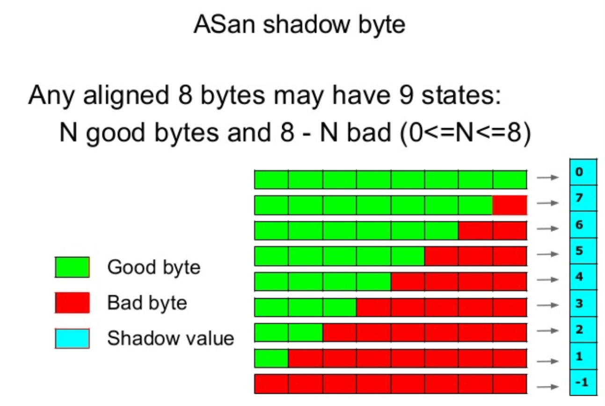
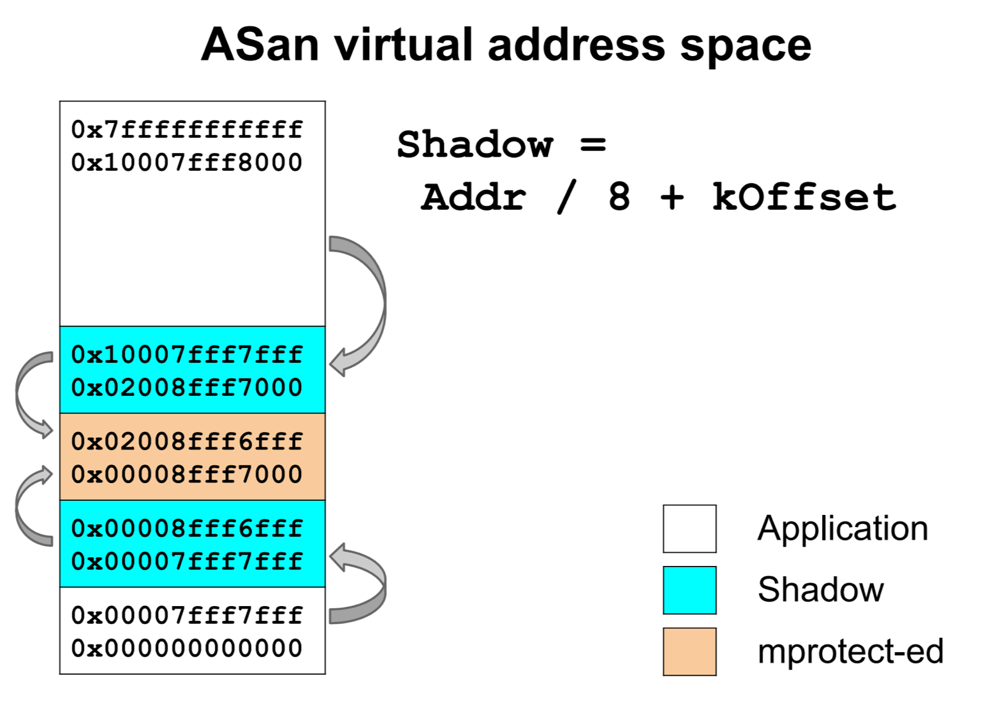
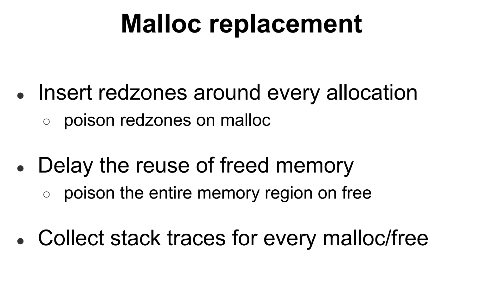
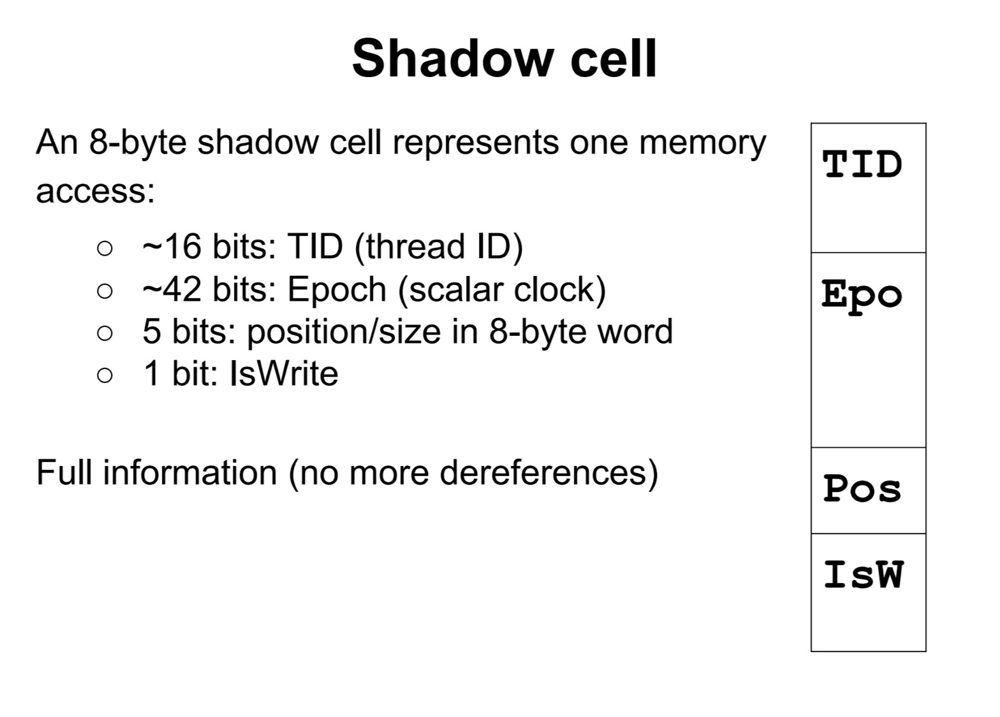

<!-- TOC -->
- [C++ tools](#c-tools)
  - [Address Sanitizer](#address-sanitizer)
    - [Problem set](#problem-set)
    - [Internal](#internal)
      - [Shadow memory](#shadow-memory)
      - [Instrumentation](#instrumentation)
      - [Run-time Library](#run-time-library)
    - [Impact](#impact)
  - [Thread Sanitizer](#thread-sanitizer)
    - [Problem set](#problem-set-1)
    - [Internal](#internal-1)
    - [Impact](#impact-1)
  - [Memory Sanitizer](#memory-sanitizer)
    - [Problem set](#problem-set-2)
    - [Internal](#internal-2)
    - [Impact](#impact-2)
  - [stacktrace](#stacktrace)
  - [gperftools](#gperftools)
  - [CMake](#cmake)
- [Reference](#reference)
- [To do](#to-do)


# C++ tools

This page list a bunch of tools which helps me to find C++ related issues.  Most of them identify issues at **running time**, which means **the more scenarios your test could cover, the more benefits you could get from those tools**.

## Address Sanitizer
### Problem set
- Out of boundary.  Overflow is *the* most issue happened in my previous bug trace experience.  No matter with what kind of tool, I will suggest once you use operator [] on array or vector please pay more attention for whether the index is in the valid range.  <br/>
```C++
int array[100] = {0};
//...
    array[x + 100] = 1;
```
No matter this array is allocated in heap or stack or static data, -fsanitizer=address could help to detect it.

Actually, **iterators** are for such situation.  When you find certain ranges be frequently used, take a deeper think whether you could abstract them


- Use after free
```C++
int * p = new int[100];
delete[] p;
// ...
p[index] = value;
```
-fsanitizer=address could help to identify it


- Memory leak/double free
-fsanitizer=address could help to detect it.  Or, **any place using new/delete directly, you'd better have a better reason for not using sharedptr**

- stack_use_after_return

```C++
int *g;
void func1()
{
    int temp = 0;
    g = &temp;
}

void func2()
{
    func1();
    *g = 3;
}

```
Use `ASAN_OPTIONS=detect_stack_use_after_return=1` while running executable could help to detect it. <br/>
Please do distiguish upper case with follow one
```C++
std::vector<int> func()
{
    std::vector<int> vTemp = {0};
    return vTemp;
}

auto v = func();
// use v
```
With C++11, std::vector has move-semantics, which means the local vector declared in your function will be moved on return and in some cases even the move can be elided by the compiler.<br/>
Its preferred way in C++11 and efficient.  [stackoverflow](https://stackoverflow.com/questions/15704565/efficient-way-to-return-a-stdvector-in-c)

### Internal
Inorder to know the status of memory usage, AS replace compiler's malloc and add poison bits to detect errors. <br/>
It use shadow memory to record whether each byte of application memory is safe to access, and use instrumentation to check the shadow memory on each application load or store.  

#### Shadow memory

Compare to Valgrind, AS use a more compact shadow encoding and more efficient shadow mapping.  <br/>


There are different negative values to distinguish between different kinds of unaddressable memory (heap redzones,
stack redzones, global redzones, freed memory).

AddressSanitizer dedicates one-eighth of the virtual address space to its shadow memory and uses a direct mapping with a scale and offset to translate an application address to its corresponding shadow address.  


The shadow memory occupies 1/8 of the virtual address space and the minimum size of theredzone (and the malloc alignment) is 8 bytes. Each shadow byte describes the state of 8 bytes and encodes 9 different values. 

The value of Offset should be chosen in a way that the region from Offset to Offset+Max/8 is not occupied at startup.  On a 64-bit system with 47 significant address bits we use Offset =`0x0000100000000000` (244).


#### Instrumentation

```C++
*a = ...

char *shadow = (a >>3) + offset

// 8 bytes access
if (*shadow)
    ReportError(a)

// N bytes access N=1,2,4
// AS assum random bytes read is aligned to N
if (*shadow && *shadow <= ((a&7) + N -1))
    ReportError(a)

```
Instrumentation inserts only one memory read for each memory access in the original code, and it placed at the very end of the LLVM optimization pipeline.

#### Run-time Library


The main purpose of the run-time library is to manage the shadow memory.  


### Impact
2x slowdown, 1.5x ~ 3x memory overhead


## Thread Sanitizer

TS detects data races and dead locks.  At compile time, it intercepts all read and writes, at run-time will intercepts all synchronization and handle read and writes.

### Problem set

- data race
```C++
int x;

std::thread t1([&]{x = 1;});
std::thread t2([&]{x = 2;});
t1.join();
t2.join();

```


- dead lock

Example 1:
```C++
// thread-fun1
lock_guard<mutex> l0(mu0);
lock_guard<mutex> l1(mu1);

// thread-fun2
lock_guard<mutex> l1(mu1);
lock_guard<mutex> l0(mu0);

```

Example 2:
```C++
std::mutex m;

void mul(int x)
{
    std::lock_guard<std::mutex> lock(m);
    i *= x;
}
void div(int x)
{
    std::lock_guard<std::mutex> lock(m);
    i /= x;
}
void both(int x, int y)
{
    std::lock_guard<std::mutex> lock(m);
    mul(x);
    div(y);
}
```
Here please consider using std::recursive_mutex instead of std::mutex, recursive mutex allow the same thread acquire mutex for multiple times.  But I would rather to put logic from mul() and div() into both() to avoid such complex situation.


### Internal
TS direct mapping application's address space to shadow space
```
shadow = 4 * (Addr & KMask)
```


During run-time, if **thread with different thread id write overlapped position range**, TA bucks. 

### Impact
CPU: 4x - 10x, RAM: 5x - 8x


## Memory Sanitizer
MS detects uninitialized memory reads

### Problem set

```C++
int main(int argc, char **argv) {
    int x[10];
    x[0] = 1;
    return x[argc];
}
```

### Internal
Similar to AS, using shadow memory. 


### Impact
2.5x slowdown, 2x memory overhead

## stacktrace
If just needed for Linux system, just need call function of [backtrace](http://man7.org/linux/man-pages/man3/backtrace.3.html) and enable functionality only for Linux platform.  
For multiple platform, we use [this one](https://github.com/CodeBear801/zoo/blob/6dcd33c37ae24f5523be0263bae70f9a7f0dceff/stacktrace/stacktrace.cpp#L460) implemented by Zexing Shi.  But please be aware that there always be compilation challenge on different platforms, I think use such class for 1~2 specific platform only might be more reasonable and maintainable.  
```C++
std::cout << ST();
```


## gperftools


## CMake
ccache, distcc


# Reference
- [github/google/sanitizers/wiki](https://github.com/google/sanitizers/wiki/)<br/>
- [slideshare - Address/Thread/Memory Sanitizer](https://www.slideshare.net/sermp/sanitizer-cppcon-russia)<br/>
- [Paper - AddressSanitizer: A Fast Address Sanity Checker](https://www.usenix.org/system/files/conference/atc12/atc12-final39.pdf)<br/>


# To do
- Refine TS, MS
- Add UBS
- CMake
- gperftools
- valgrind-memcheck
