# Golang Async

## What is Channel

unbuffered_channel

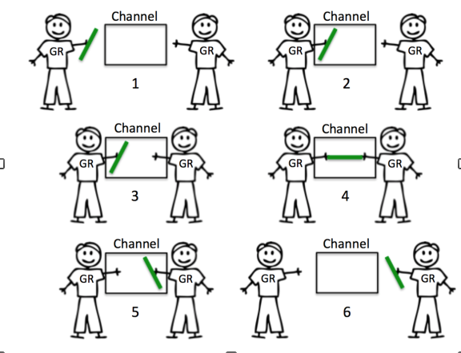  


buffered_channel

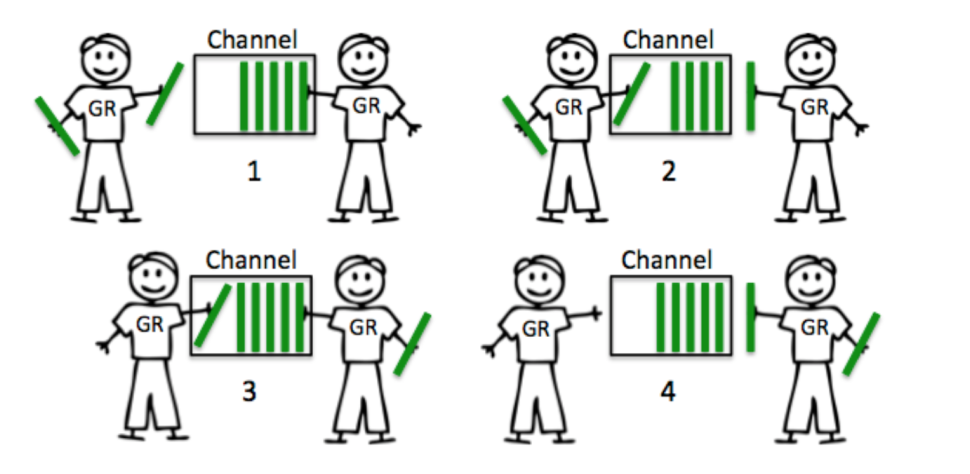  

Image from [The Nature Of Channels In Go](https://www.ardanlabs.com/blog/2014/02/the-nature-of-channels-in-go.html)


## Chan

- **When use channel, must be aware of who will create and when will close**
- Channels are both communicable and synchronize


### Nil chan

Nil channel: nil channel always blocks, which means that trying to read or write from a nil channel will block.  
**You could always read from closed channel, but you can never write to closed channel.**

### Chan of Chan

When using a `chan chan`, the thing you want to send down the transport is another transport to send things back.  
They are useful when you want to get a response to something, and you don’t want to setup two channels (it’s generally considered bad practice to have data moving bidirectionally on a single channel)  

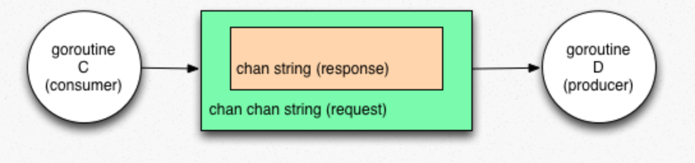  

Image from [Understanding Chan Chan's in Go](http://tleyden.github.io/blog/2013/11/23/understanding-chan-chans-in-go/)

[example](https://play.golang.org/p/chi6P2XGTO)

### Return chan

```go
func gen(nums []int) <-chan int {
}
```

[example](https://play.golang.org/p/Qh30wzo4m0)

## Select

- select likes switch statement for multiple channels.  
   + All channels are evaluated
   + Selection blocks until one communication can proceed, which then does
   + If multiple can proceed, select chooses pseudo-randomly
   + A default clause, if present, executes immediately if no channel is ready


### for-select pattern
- create a loop runs in its own goroutine
- select lets loop avoid blocking indefinitely in any state

```go
func (s * sub) loop() {
    ... declare mutable state...
    select {
        case <- c1:
            ... read/write state ...
        case c2 <- x:
            ... read/write state ...
        case y := <-timer:
            ... read/write state ...
    }
}

```
- The cases interact via local state in loop
- [example](https://play.golang.org/p/FzONhs4-tae)

### Stop goroutine
- A goroutine could be stopped by timer/notify by waitgroup/channel

```go
func timeout(w *sync.WaitGroup, t time.Duration) bool {
	temp := make(chan int)
	go func() {
		time.Sleep(5 * time.Second)
		defer close(temp)
		w.Wait()
	}()

	select {
	case <-temp:
		return false
	case <-time.After(t):
		return true
	}
}
```

## Fan-in
Multiplexing (fan-in): function that takes multiple channels and pipes to one channel, so that the returned channel receives both outputs

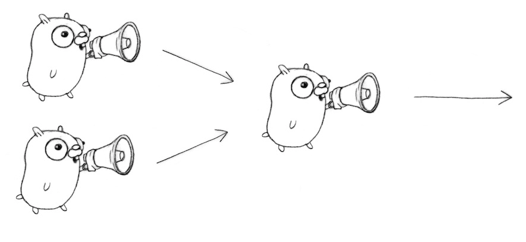 

## Pipeline

- [go-osmium](https://github.com/Telenav/open-source-spec/blob/master/osmium/doc/pbf_golang.md) 
- [OSRM speed table dumper](https://github.com/Telenav/osrm-backend/blob/037a545659cef519f976360ae5c90dffcbafc145/integration/cmd/osrm-traffic-updater/speed_table_dumper.go#L26)
- [OASIS builder](https://github.com/Telenav/osrm-backend/pull/259)

## Great examples

### LoadBalancer

[code](https://github.com/CodeBear801/tech_summary/blob/master/tech-summary/language/go/code/sync/balance.go#L86) [slides](https://talks.golang.org/2012/waza.slide#41) [video](https://www.youtube.com/watch?v=jgVhBThJdXc)

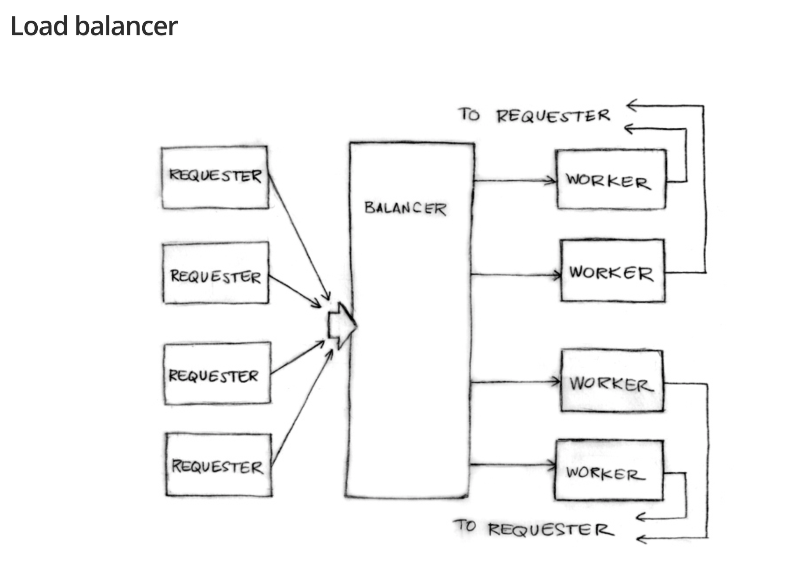 

The code simulate how to write a load balancer  

Input
- Simulate 100 goroutine and each goroutine keep on sending requests
- each goroutine execute the function of `requester`, for { send request to work, get response}
- `work` is a unbuffered channel, means there is just one request get in at one time
- `request`'s definition contains fn() and a channel for response

```go
// [Perry] requester simulate the call from external users
func requester(work chan Request) {
	c := make(chan int)
	for {
		time.Sleep(time.Duration(rand.Int63n(nWorker * 2e9)))
		// [Perry] send request
		work <- Request{op, c}
		// [Perry] wait for answer, result:= <-c, then further process on result
		<-c
	}
}
```

Worker
- worker contains a buffered channel for request
- worker contains `pending` which means how many requests on him
- worker has an index in pool/heap
- worker function keep on executing requests, send response to channel, and notify loadbalancer

```go
func (w *Worker) work(done chan *Worker) {
	for {
		req := <-w.requests  // get request from load balancer
		req.c <- req.fn()    // call fn and send result to requester
		done <- w            // tell balancer we finished the job, send worker's pointer 
	}
}

```

Balancer
- Most important task for balancer is picking who is next worker, by [`balance()`](https://github.com/CodeBear801/tech_summary/blob/0f9b90fbad06d50baf44745aa18e873d2a4852bd/tech-summary/language/go/code/sync/balance.go#L125)
- When there is a work(request), balancer will call [`dispatch()`](https://github.com/CodeBear801/tech_summary/blob/0f9b90fbad06d50baf44745aa18e873d2a4852bd/tech-summary/language/go/code/sync/balance.go#L151) then pick a worker, put request in his queue
- When there is a worker done his task(via done), balancer will call [`complete()`](https://github.com/CodeBear801/tech_summary/blob/0f9b90fbad06d50baf44745aa18e873d2a4852bd/tech-summary/language/go/code/sync/balance.go#L177) to adjust status
- Use `worker`'s pointer as trigger is interesting

```go

func (b *Balancer) balance(work chan Request) {
	for {
		select {
		case req := <-work:
			b.dispatch(req)
		case w := <-b.done:
			b.completed(w)
		}
		b.print()
	}
}
```

### Google search Example

[code]() [video](https://www.youtube.com/watch?v=f6kdp27TYZs&t=1021s)

Requirement:
- Send search request
- Search from web, image, youtube, etc
- mix result and response

Version 1:
- Just append information to final results sequentially
https://talks.golang.org/2012/concurrency.slide#45

Version 2:
- Put results into channel, goroutine 
https://talks.golang.org/2012/concurrency.slide#46

Version 2.1
- Add timeout for slow servers
https://talks.golang.org/2012/concurrency.slide#47

Version 3.0
- Add replica, avoid time out, 
https://talks.golang.org/2012/concurrency.slide#48
  Iterate all replica, put result into channel, returns as long as there is value in channel

### RSS client
[code](https://github.com/golang/talks/blob/5ca518b26a5529a11839285645c750ffc2f96500/content/2013/advconc/naivemain/naivemain.go) [slides](https://talks.golang.org/2013/advconc.slide#11) [slides-source](https://github.com/golang/talks/blob/master/content/2013/advconc.slide) [video](https://www.youtube.com/watch?v=QDDwwePbDtw)

Requirement:
- Given Fetch api to fetch items for uri + the time when the next fetch should be attempted
- items contain {Title, Channel, GUID string}
- Expect result 
   - stream    <-chan item
   - multiple subscriptions

```go
	// Subscribe to some feeds, and create a merged update stream.
	merged := Merge(
		NaiveSubscribe(Fetch("blog.golang.org")),
		NaiveSubscribe(Fetch("googleblog.blogspot.com")),
		NaiveSubscribe(Fetch("googledevelopers.blogspot.com")))
```

- given

```go
// A Fetcher fetches Items and returns the time when the next fetch should be
// attempted.  On failure, Fetch returns a non-nil error.
type Fetcher interface {
	Fetch() (items []Item, next time.Time, err error)
}

// Fetch returns a Fetcher for Items from domain.
func Fetch(domain string) Fetcher {
```

- To implement

```go
// A Subscription delivers Items over a channel.  Close cancels the
// subscription, closes the Updates channel, and returns the last fetch error,
// if any.
type Subscription interface {
	Updates() <-chan Item
	Close() error
}

// Subscribe returns a new Subscription that uses fetcher to fetch Items.
func Subscribe(fetcher Fetcher) Subscription { }

// Merge returns a Subscription that merges the item streams from subs.
// Closing the merged subscription closes subs.
func Merge(subs ...Subscription) Subscription { }

func (s *sub) Close() error { }

// Subscribe returns a new Subscription that uses fetcher to fetch Items.
func Subscribe(fetcher Fetcher) Subscription {
	s := &sub{
		fetcher: fetcher,
		updates: make(chan Item),       // for Updates
		closing: make(chan chan error), // for Close
	}
	go s.loop()
	return s
}

// sub implements the Subscription interface.
type sub struct {
	fetcher Fetcher         // fetches items
	updates chan Item       // sends items to the user
	closing chan chan error // for Close
}

func (s *sub) loop() { ... }

```

Loop's duty:
- Periodically call fetch
- send fetched items on the Updates channel
- exit when Close is called

version 1:


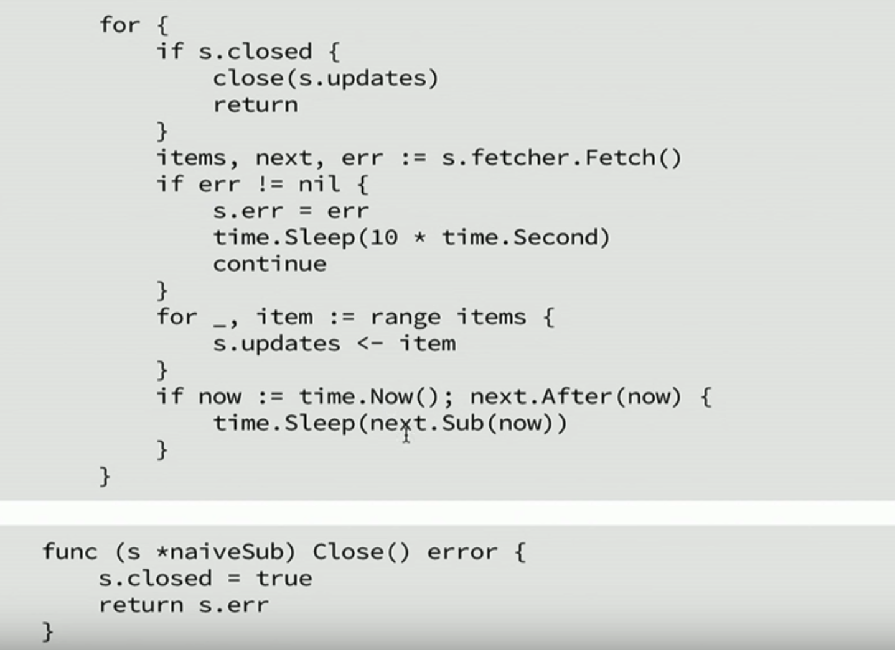 

- Issue: race condition => s.closed
- Issue: time.sleep(next.Sub(now)) could keep loop running even you set flag to closed.  Next.Sub() could return a month later
- Loop may block forever on s.updates: client might close s.updates channel, s.updates <- item will block send infinitely

Solution
- for - select pattern
- `chan chan` pattern


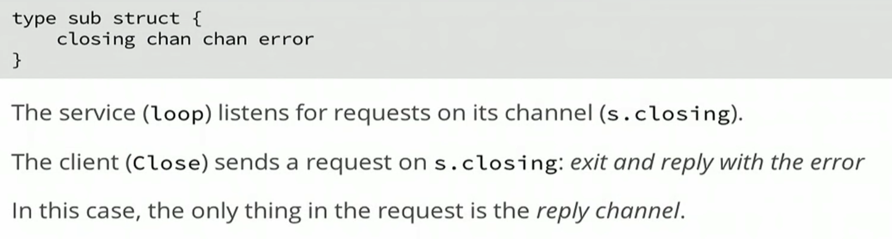 

<br/>
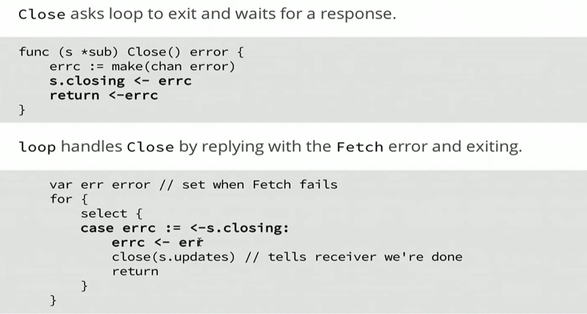 

- Fetch

startFetch controls next time to fetch, and will always be update in select  


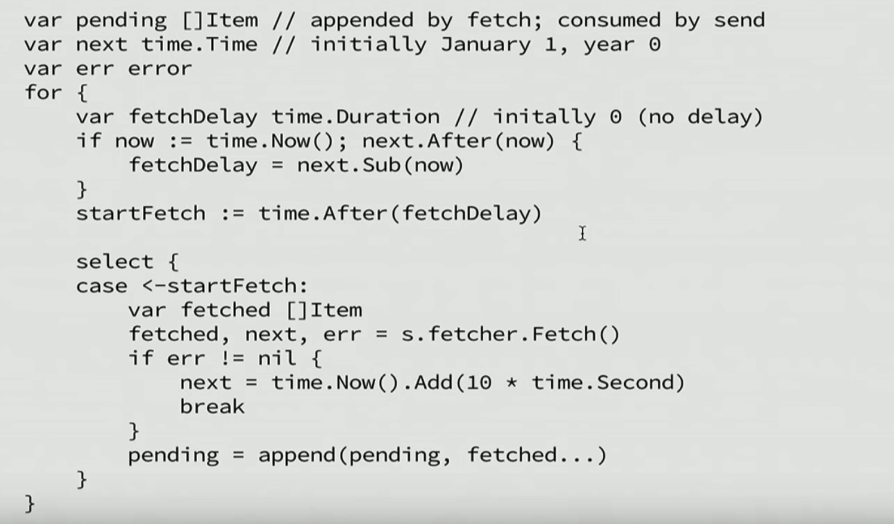 

- Send


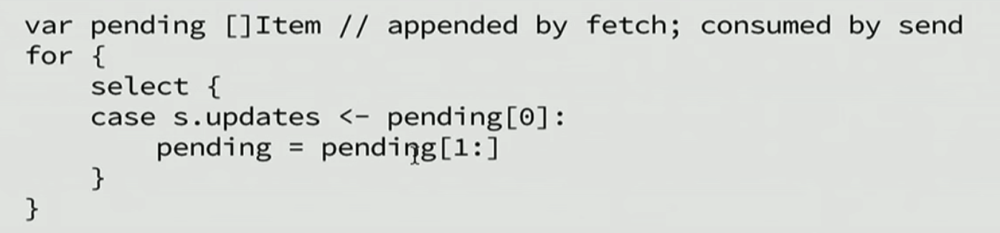 

Here pending could be nil

**Send/receive on nil channel always blocks, but never panic**


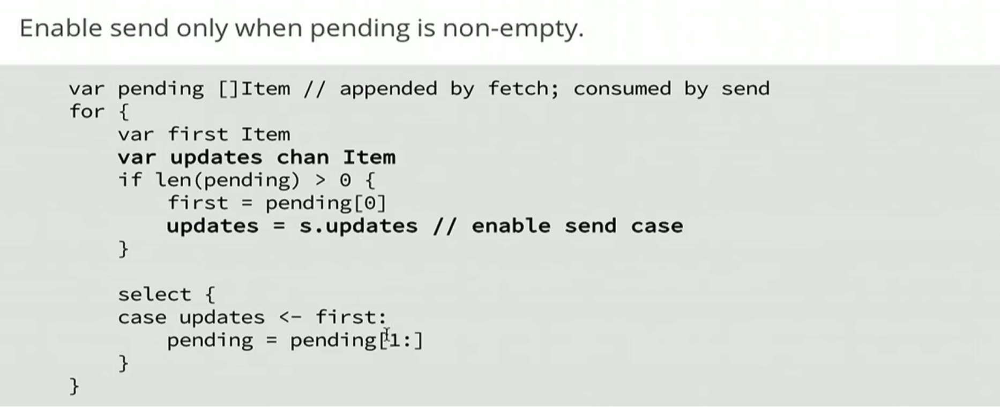 

initially updates is nil, only when there is value in pending, then first will be assigned  
then enable send case, so select will gointo the case, otherwise, will skip there  

- Avoid duplicates in fetch: filter items before adding to pending


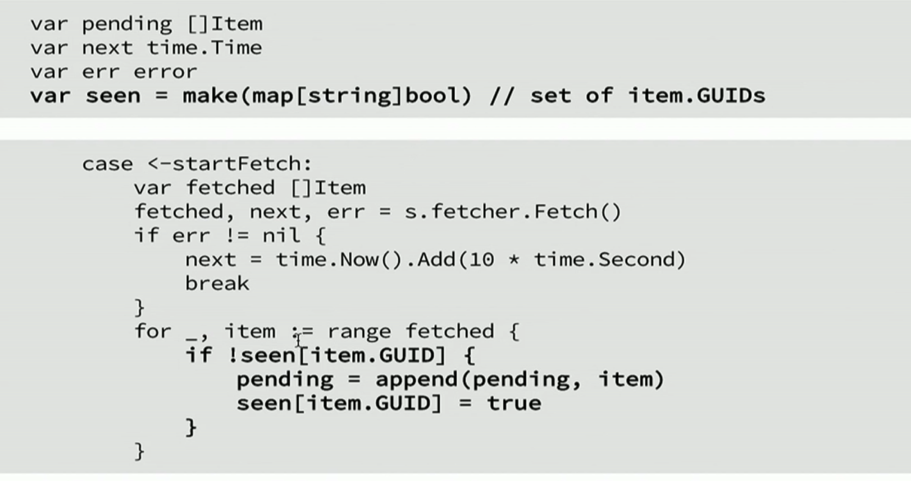 

- Limit the size of pending
Stop `startFerch` then based on limit condition to reopen it


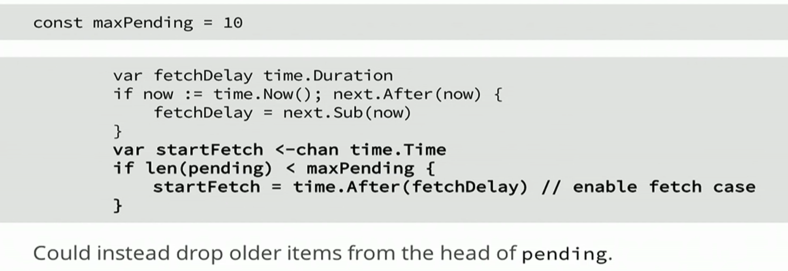 

- Run fetch async incase fetch is too slow


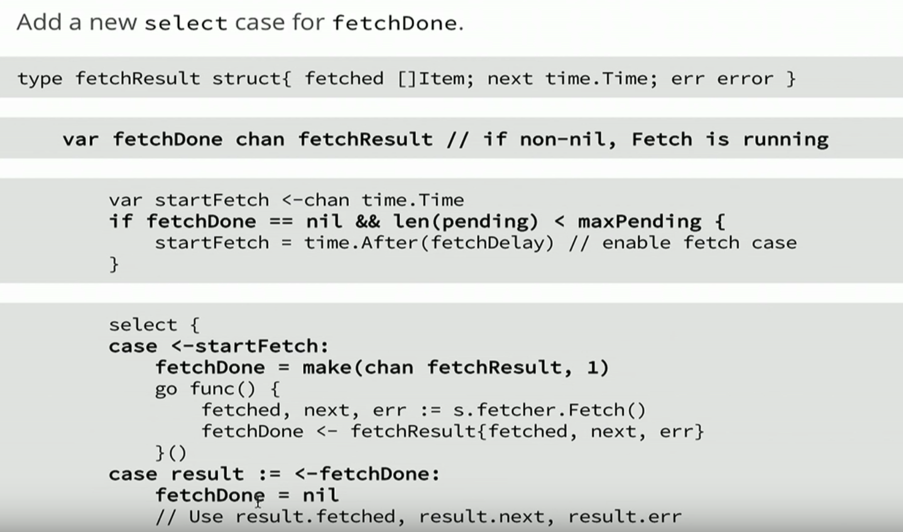 

## More info
- [A tour of Go concurrency patterns via the new Heartbeat scheduler](https://www.elastic.co/blog/a-tour-of-go-concurrency-patterns-via-the-new-heartbeat-scheduler)
