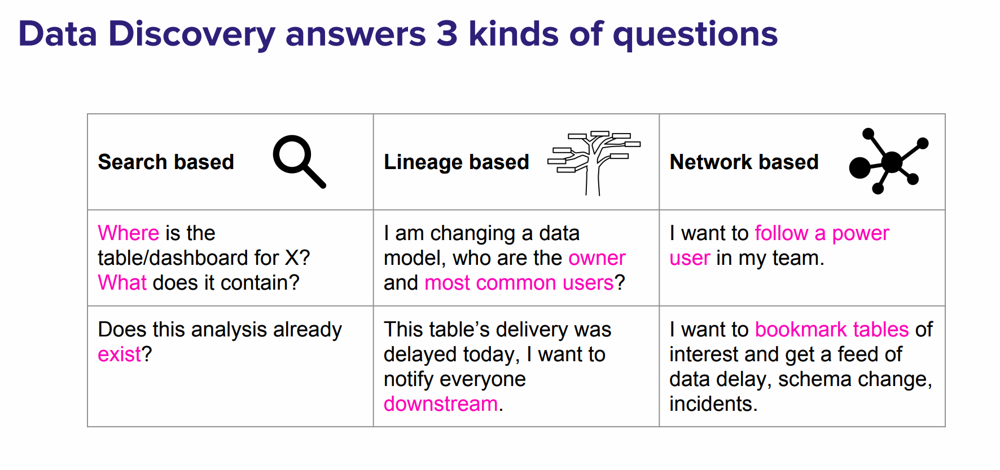
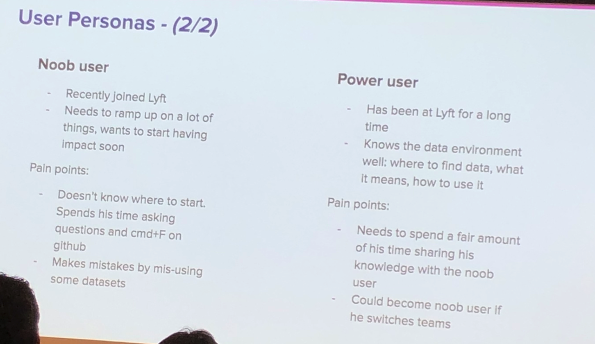
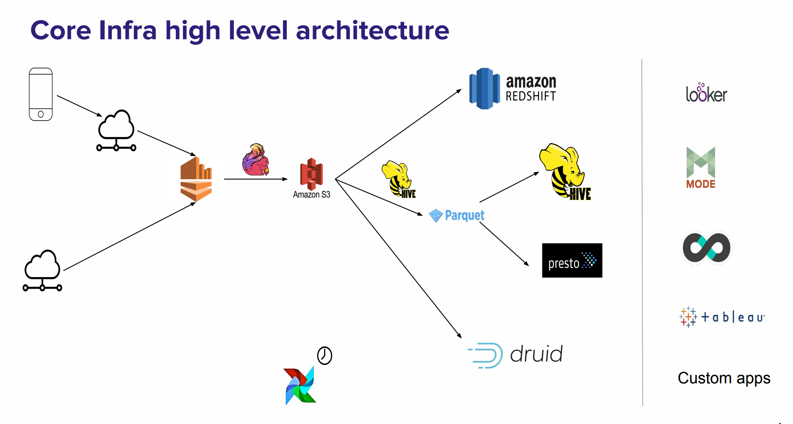

- [Amundsen: A Data discovery platform from lyft](#amundsen-a-data-discovery-platform-from-lyft)
  - [Take away](#take-away)
  - [Useful links](#useful-links)
  - [Notes](#notes)
    - [What is amundsen](#what-is-amundsen)
    - [Why amundsen](#why-amundsen)
    - [Lyft's data infra](#lyfts-data-infra)
    - [Amundsen's architecture](#amundsens-architecture)

# Amundsen: A Data discovery platform from lyft

Wednesday, May 15, 2019 
6:30--7:15  Philippe Mizrahi, Jin Hyuk Chang  
@Lyft HQ  

## Take away
- Why amundsen
- The power of microservice design
- push vs pull
- Lyft's data infra

## Useful links
- [Setting up Amundsen](./issues.md)
- Code Analysis [databuilder](./amundsendatabuilder.md) [metadataservice](./amundsenmetadata.md) [searchservice](./amundsensearch.md) 
- [Amundsen - Lyft's data discovery & metadata engine](https://eng.lyft.com/amundsen-lyfts-data-discovery-metadata-engine-62d27254fbb9) (Lyft engineering blog)
- [Disrupting Data Discovery](https://www.slideshare.net/taofung/strata-sf-amundsen-presentation) (Strata SF 2019)

## Notes

### What is amundsen
[Amundsen demo](./amundsen_demo.md)

### Why amundsen

- Summary
  - AmundsenFrontend provide one box search to let user discover data information
  - AmundsenDatabuilder holds ETL jobs and publish data to search service and metadata service
  - AmundsenSearch index and rank data
  - AmundsenMetadata holds metadata information and user's comments

- First Question: How to predict the number of people join today's lyft meetup? 
  - **Discover what information we have**
  - **Ask people about the format of data**
  - **Check whether there is historical data could be used**
  - Build model
  - Visualization

- Data discovery

Two kind of DS in LYFT:
- What if I am a new comer knows few about the company/people/data   
- Even as a Senior engineer, I don’t want to be bothered by lots of questions  

Amundsen mainly target is decreasing the effort used in data discovery  

***

### Lyft's data infra

***

### Amundsen's architecture
[technical notes](./amundsen.md)

