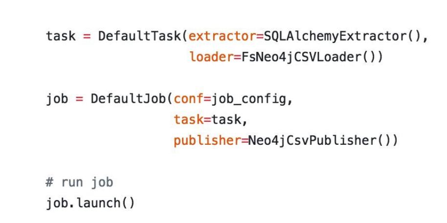

## Amundsen

### Amundsen's architecture

***

### DataBuilder Service

The design is similar to Apache Gobblin  

More information about Apache Gobblin: [Gobblin: Unifying Data Ingestion for Hadoop](http://www.vldb.org/pvldb/vol8/p1764-qiao.pdf), [Gobblin: A Framework for Solving Big Data Ingestion Problem](https://www.slideshare.net/InfoQ/gobblin-a-framework-for-solving-big-data-ingestion-problem), [Announcing Gobblin 0.7.0: Going Beyond Ingestion](https://engineering.linkedin.com/blog/2016/06/announcing-gobblin-0-7-0--going-beyond-ingestion), [Gobblin--一个用于Hadoop的统一"数据抽取框架"](https://blog.csdn.net/lmalds/article/details/53940549)

- Databuilder example

   
In general,  ETL + publish    

   
The upper code demos inside databuilder, how to define task and job to build data.  [More information](./amundsendatabuilder.md)   

   

#### Challenge 1: Various forms of metadata

 

 

#### Challenge 2: Pull mode vs push mode

Pull model: batch process  
Push model: streaming process, real time  

 

 

***

### Search Service

 

 

#### Challenge: How to make the search result more relevant
 
- Search behavior instrumentation is key  
  Store all user behavior to double check/validation  
- Balance relevance & popularity    
Relevance - Search apple on google, "Orange" has lower relevance while "Apple" has high   
Popularity - Search apple on google, "apple"(company) has higher popularity  

 

***

### Metadata service

*What is metadata*  
[metadata](http://cidrdb.org/cidr2017/papers/p111-hellerstein-cidr17.pdf) means a set of data that describes and gives information about other data.  
 
**ABC of metadata**
- A is application context. This is information that you and I and everyone needs in
order to just do our job. What data exists, where is it and what does it mean? 
- B for behavior, which is who’s using it? What applications are built on it and
so on?
- C for change. How is this dataset evolving and why was it evolved? Why did
someone change the type of this column from string to end? 

 

 

 

**Why Airflow**  
Apache Airflow is a very popular workflow management project. It’s known for dependency management. It handle like schedules, certain job in a fixed schedule library.  
An example:  
- Get the metadata for all the table detail first. 
- Once that is done, then kickoff the extended metadata. It could be the statistic for this table. Who used this 
table? What is the high watermark or low watermark of this table? Then there’s certain sequence.  
Once build each of these as an Airflow task in the deck, then Airflow will kick off in a certain sequence. 

 

#### Trade off: Why choose graph database

- Graph database is great for handling lots of join  
   - nosql: out of lock/sync
   - relationdatabase: up to 2~3 tables, if more then would be slow  

- Graph database could represent the flow better  
  - For example, a typical Lyft dataflow likes below:
      - Lyft mobile clients in certain location/ETA information to Kafka topics -> generate data.  
      - Streaming subscriber will get this information and persist into raw high table.  
      - Some analysis of data engineer build dataset on top of this raw table into derived table.  
      - For specific user case needed, will look into a certain column of such derived table.    
      - This actually is a graph to model the whole flow, each component will be a node and connect them will be edges.  
  - To summary:  
      - Graph database help to model the flow more easily, application connected with the events.
      - There is no perfect system at beginning, final table format could be changed which need more join operation in the future

#### Trade off: Why not propagate the metadata back to source
 
If we want to push data back to hive, one related open source on github didn't allow to modify  
But apache atlas allow to write back  

***

### Background information

- How data is created in Lyft
    - Say you want to take a Lyft ride, you open up your app, go through the “funnel”. You select your destination and you select your mode. Each of those clicks or actions is going to send an event which Lyft track and then later can be used for analysis to see how well that flow works. 
    - CDC, change data capture. Lyft is taking replicas from online production systems and then bringing them into warehouse in real time. 
    - Any external data or third party data get from vendors that = upload on the side to Lyft's data warehouse, so folks can do analysis later on. 

- Similar solutions

 

