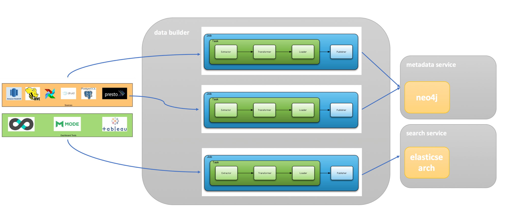
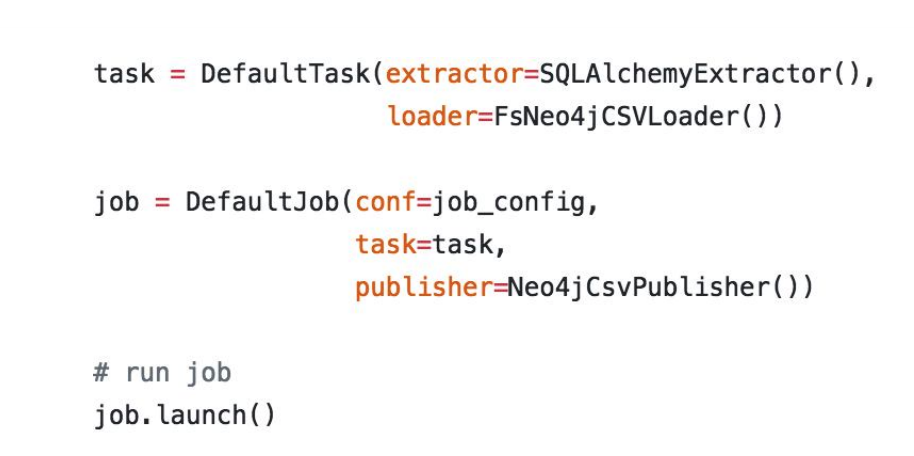
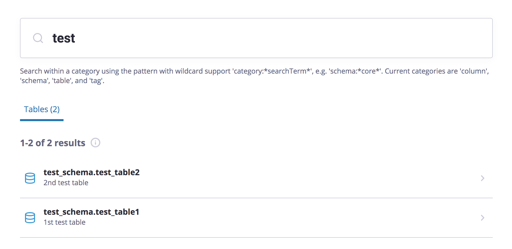

# [amundsendatabuilder](https://github.com/lyft/amundsendatabuilder)

## Structure
[amundsendatabuilder](https://github.com/lyft/amundsendatabuilder/blob/master/README.md)




## Why data builder
- Abstract data from differernt data sources
  
- Handle batched data and live streamed data

- Extract + Transform + Load(writer) + Publish


## Task
[Class task](https://github.com/lyft/amundsendatabuilder/blob/bfb69f03fa6553f3b2199855423814caacc2c493/databuilder/task/task.py) orchestrates extractor, transformer and loader.  The most important function is [run()](https://github.com/lyft/amundsendatabuilder/blob/bfb69f03fa6553f3b2199855423814caacc2c493/databuilder/task/task.py#L48)  
```python
    def run(self):
        try:
            record = self.extractor.extract()

            while record:
                record = self.transformer.transform(record)
                if not record:
                    continue
                self.loader.load(record)
                record = self.extractor.extract()
        finally:
            self._closer.close()

```
A record is representeed by one of [models](https://github.com/lyft/amundsendatabuilder/tree/master/databuilder/models).

## Job
Job orchestrates task and publisher.  In its function [launch()](https://github.com/lyft/amundsendatabuilder/blob/master/databuilder/job/job.py#L53)
```python
def launch(self):
        try:
            is_success = True
            self._init()
            try:
                self.task.run()
            finally:
                self.task.close()

            self.publisher.init(Scoped.get_scoped_conf(self.conf, self.publisher.get_scope()))
            Job.closer.register(self.publisher.close)
            self.publisher.publish()
```
Publish means call RPC interface of other micro services to register data into.


Task + Job

  <br/> 


## Example
[sample_data_loader.py](https://github.com/lyft/amundsendatabuilder/blob/bfb69f03fa6553f3b2199855423814caacc2c493/example/scripts/sample_data_loader.py#L5) is the one I tried to work though data builder's logic.

### Input
sampole_col.csv

|name|description|col_type|sort_order|database|cluster|schema_name|table_name |table_desc    |
|----|-----------|--------|----------|--------|-------|-----------|-----------|--------------|
|col1|col1       |string  |1         |hive    |gold   |test_schema|test_table1|1st test table|
|col2|col2       |string  |2         |hive    |gold   |test_schema|test_table1|1st test table|
|col3|col3       |string  |3         |hive    |gold   |test_schema|test_table1|1st test table|
|col4|col4       |string  |4         |hive    |gold   |test_schema|test_table1|1st test table|
|col1|col1       |string  |1         |dynamo  |gold   |test_schema|test_table2|2nd test table|
|col2|col2       |string  |2         |dynamo  |gold   |test_schema|test_table2|2nd test table|
|col3|col3       |string  |3         |dynamo  |gold   |test_schema|test_table2|2nd test table|
|col4|col4       |string  |4         |dynamo  |gold   |test_schema|test_table2|2nd test table|

sample_table.csv

|database|cluster|schema_name|table_name|table_desc|
|--------|-------|-----------|----------|----------|
|hive    |gold   |test_schema|test_table1|1st test table|
|dynamo  |gold   |test_schema|test_table2|2nd test table|

sample_user.csv  

|email|first_name|last_name|name|github_username|team_name    |employee_type|manager_email     |slack_id|
|-----|----------|---------|----|---------------|-------------|-------------|------------------|--------|
|roald.amundsen@example.org|Roald     |Amundsen |Roald Amundsen|lyft           |Team Amundsen|sailor       |phboss@example.org|ramundzn|
|chrisc@example.org|Christopher|Columbus |Christopher Columbus|ChristopherColumbusFAKE|Team Amundsen|sailor       |phboss@example.org|chrisc  |
|buzz@example.org|  Buzz    |       Aldrin|Buzz Aldrin|BuzzAldrinFAKE |Team Amundsen|astronaut    |phboss@example.org|buzz    |

<br/>

#1. Load data
Load each of csv and put them into embedded database sqlite3

#2. Create job and publish to neo4j  
[code](https://github.com/lyft/amundsendatabuilder/blob/bfb69f03fa6553f3b2199855423814caacc2c493/example/scripts/sample_data_loader.py#L152)  

```python
    sql_extractor = SQLAlchemyExtractor()
    csv_loader = FsNeo4jCSVLoader()

    task = DefaultTask(extractor=sql_extractor,
                       loader=csv_loader,
                       transformer=NoopTransformer())

    job = DefaultJob(conf=job_config,
                     task=task,
                     publisher=Neo4jCsvPublisher())

    job.launch()
```

#3. Create job and publish to elasticsearch   
[code](https://github.com/lyft/amundsendatabuilder/blob/bfb69f03fa6553f3b2199855423814caacc2c493/example/scripts/sample_data_loader.py#L197)  

```python
    # loader save data to this location and publisher read if from here
    extracted_search_data_path = '/var/tmp/amundsen/search_data.json'

    task = DefaultTask(loader=FSElasticsearchJSONLoader(),
                       extractor=Neo4jSearchDataExtractor(),
                       transformer=ElasticsearchDocumentTransformer())

    job = DefaultJob(conf=job_config,
                     task=task,
                     publisher=ElasticsearchPublisher())

    job.launch()
```

Result  

  <br/>


