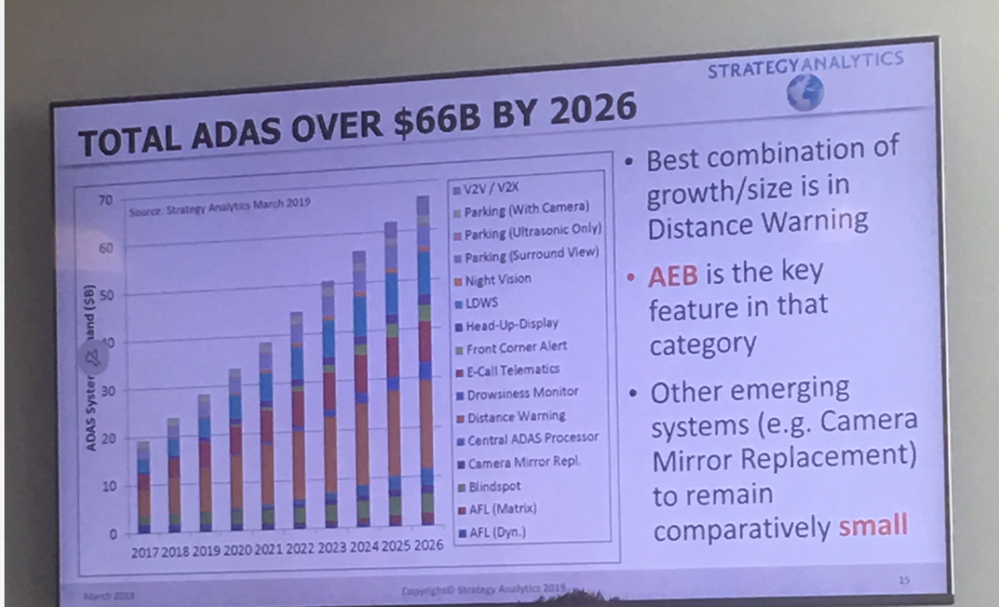
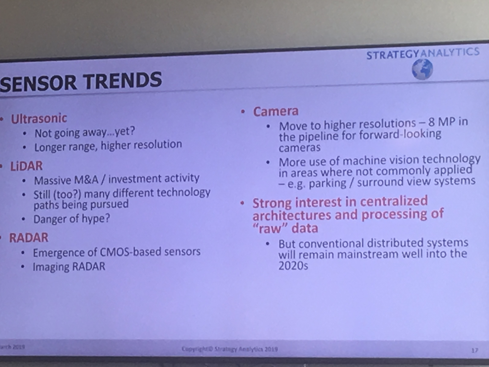
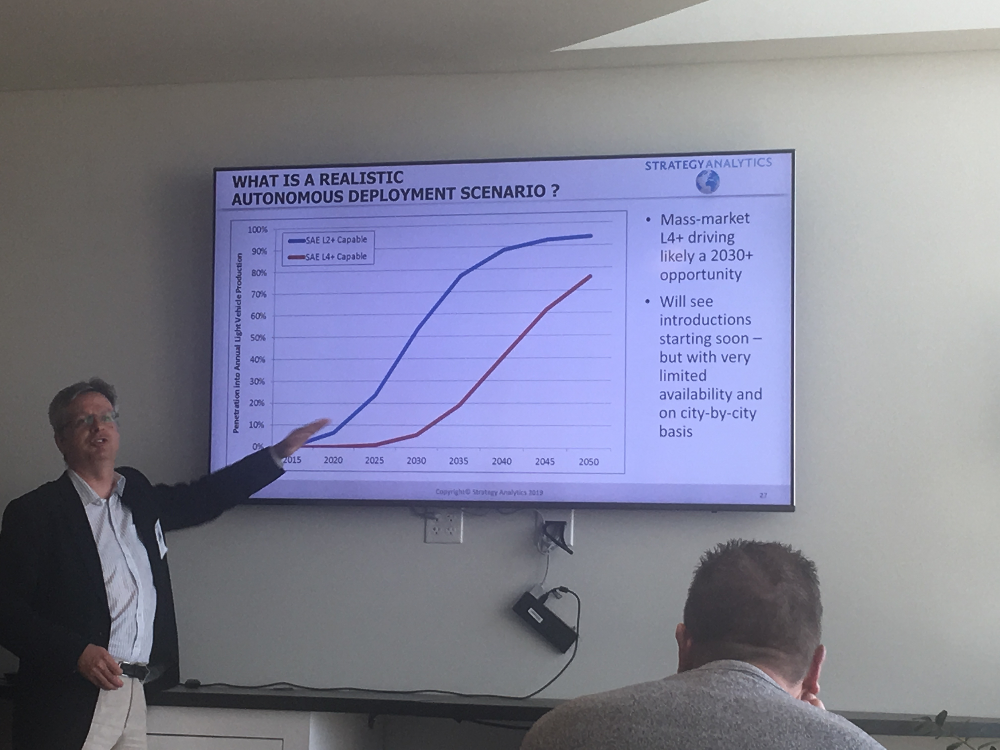
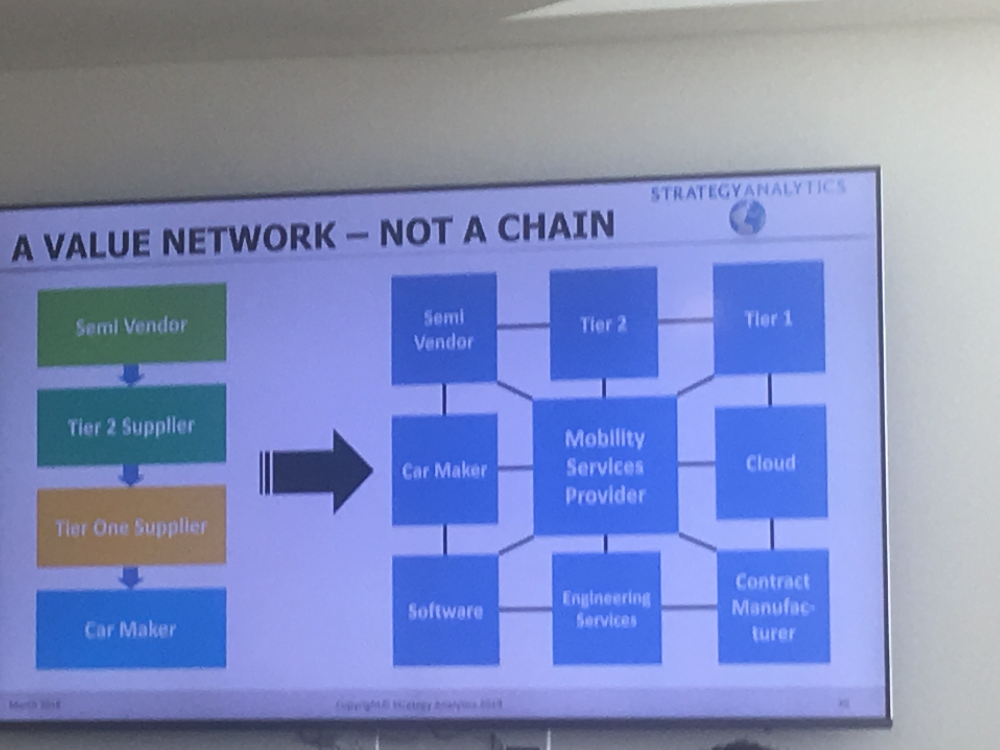

# Autonomous Vehicles Analysis
Thursday, March 21, 2019 
3:00--4:15 [Ian Riches]([rmpowell77@me.com](https://www.strategyanalytics.com/strategy-analytics/strategy-analytics-analysts/analyst-bio/Ian-Riches))  
@Telenav

## Take away
- Distance warning is the main feature for ADAS
- Radar + camera is the most popular solution for now
- 2025-2030 there will be lots of self-drive bus and shuttle
- Mobility service provider(software + hardware) will be the center instead of car maker

## Slides

 

 

 

 