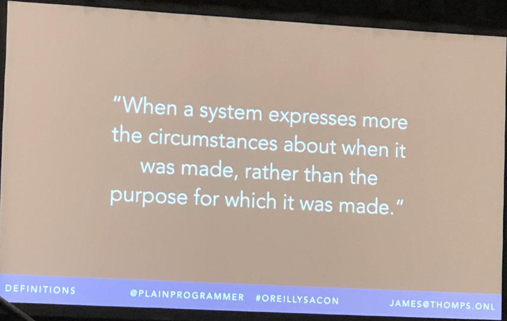
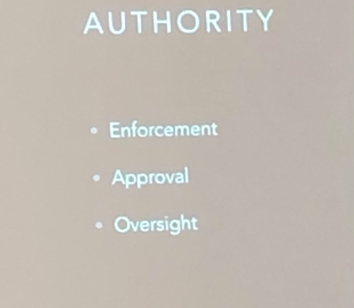
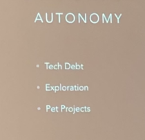

# Beyond accidental architecture
9:00am–10:30am Thursday, June 13, 2019, James Thompson
@[Oreilly Software Architecture Conf](https://conferences.oreilly.com/software-architecture/sa-ca) 

## Take away

## Notes
- What's the purpose of architecture
	(Understand constrains, should enable the team and never block them)

- What is accidental architecture

- Authority  
  
  - Authority depend on credibility  
  - **Write daily code & contribute on feature work**

- Autonomy  
 
  - Focus on important not urgent  
  - Trust not just personal feelings  
  - Techdebt, the reality of current old solution working in real production  
  - Exploration in your day to day time  

- Realignment
  - Team own architecture 
  - Architecture belongs to team
  - Architecture is everyone's job
  - Democratize architecture -> empower everyone
- Approches
  - Archtect as teacher
  - know why & risk
- Consule adviser
  - Testing assumption
  - Giving advise(not dectacy, but give options)
  - Architect as guide
  - leading the way
  - Taking the risk(You should say, what if not build, xxx might go wrong)
  - Arriving together
Go though hard time with your team

## Ref
- [Conf detail](https://conferences.oreilly.com/software-architecture/sa-ca/public/schedule/detail/74511)
- [Slides](https://www.slideshare.net/jwthompson2/beyond-accidental-arcitecture)

