# [A Unified Model for Batch and Streaming Data Processing](https://www.youtube.com/watch?v=3UfZN59Nsk8)

By Frances Perry  


## Story

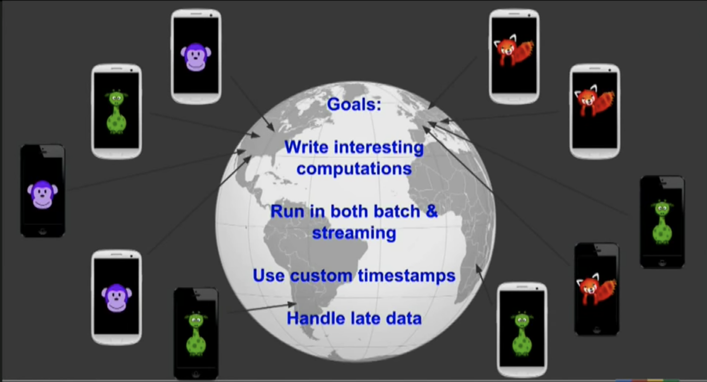<br/>


Mobile game:
- Users are distributed all over the world
- User could play offline, then update status later


## Why watermarks

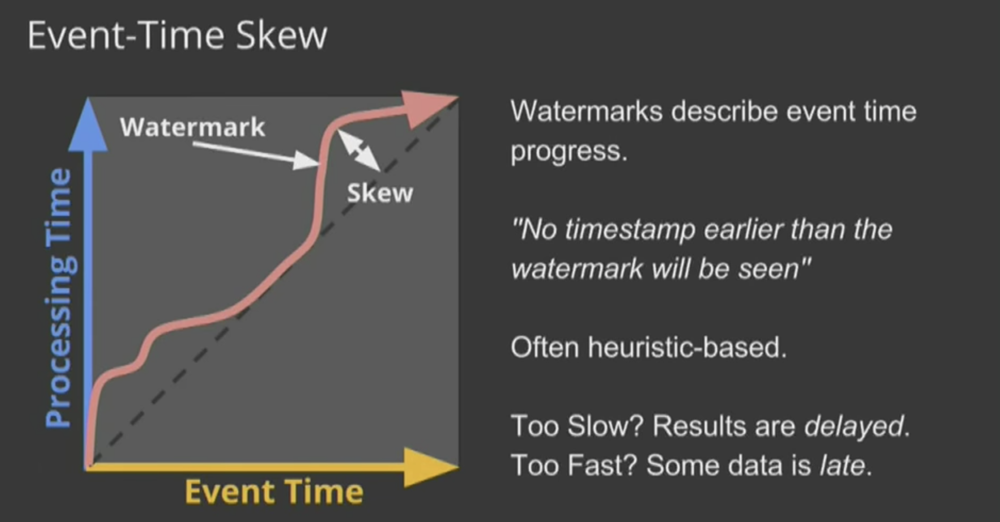<br/>


Watermark is a heuristic event time progress


## Key steps of Dataflow programming

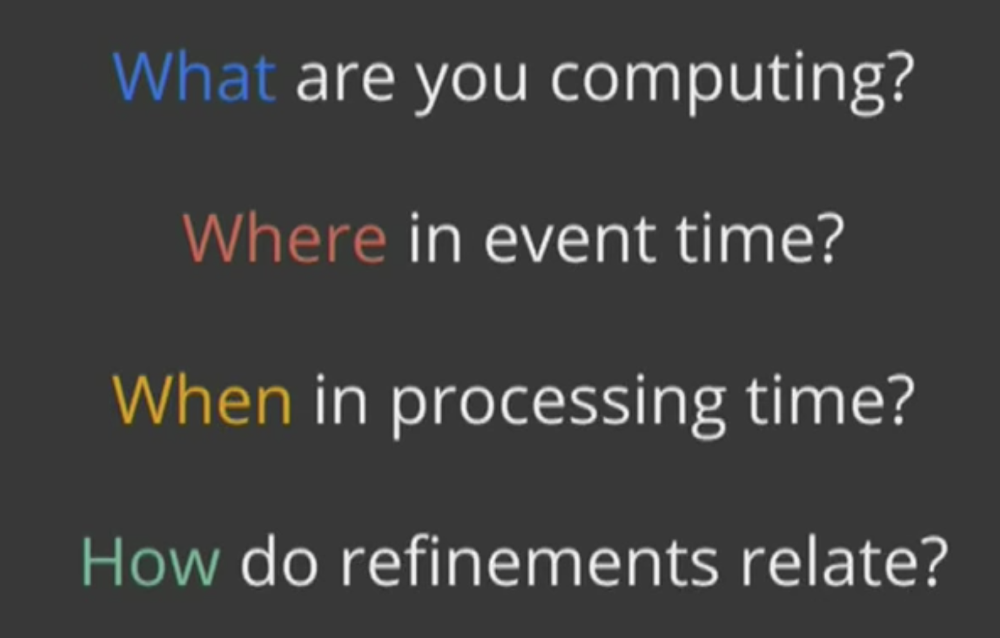<br/>

- What results are calculated? = transformations
- Where in event-time are results calculated? = windowing
- When in processing-time are results materialized? = watermarks + triggers
- How do refinements of results relate? = accumulation


### What
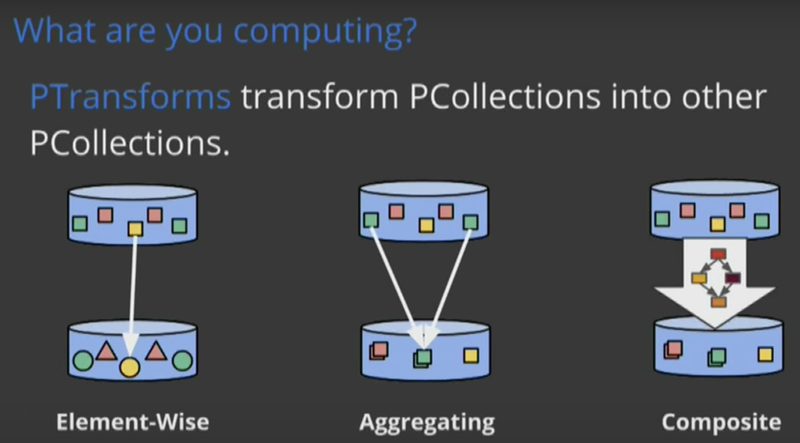<br/>


### Where

Windowing divides data into **event-time-based** finite chunks.

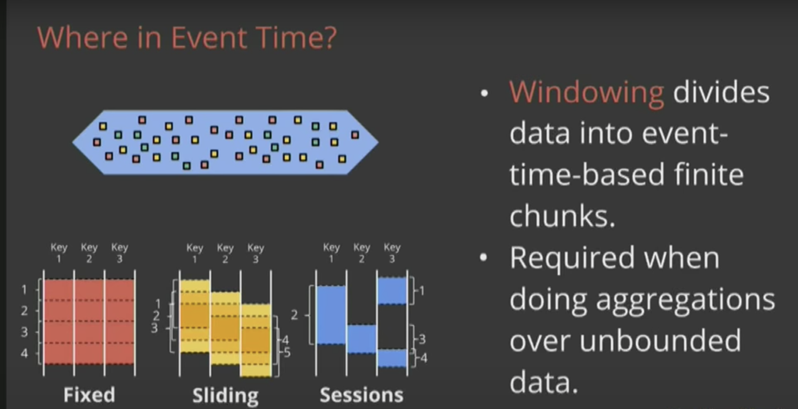<br/>


Session means a period time user is active.  More info about [session-windows](https://cloud.google.com/dataflow/docs/concepts/streaming-pipelines#session-windows)

### When

How the arriving time into system will affect the processing result

`Watermarks`: A watermark is a notion of input completeness with respect to event times. A watermark with a value of time X makes the statement: “all input data with event times less than X have been observed.”   

`Triggers`: A trigger is a mechanism for declaring when the output for a window should be materialized relative to some external signal.  Not waiting all data, just wait for enough inputs to generate result.

<br/>


Why hubristic value for `watermark`  

<br/>
- To balance `resource taken` for computation(whether a state can be dropped) and correctness of all data
   + too slow
   + too fast
- Take `9` as an example, its generated around 12:01 ~ 12:02, but arrives for processing around 12:08 ~ 12:09, when calculating window of 12:00~12:02, if we want to taken `9` into consideration, the resource be used for calculating this window need to be hold for 7 more minutes(12:09 - 12:02) or more.


#### Example
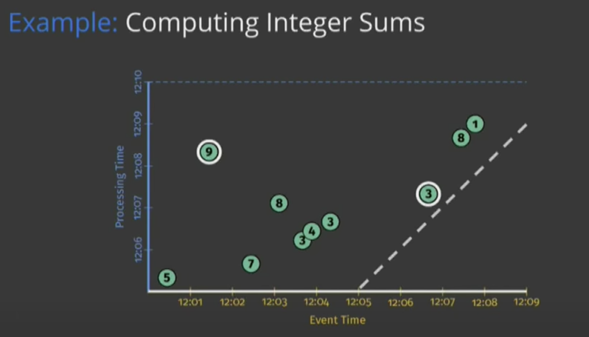<br/>

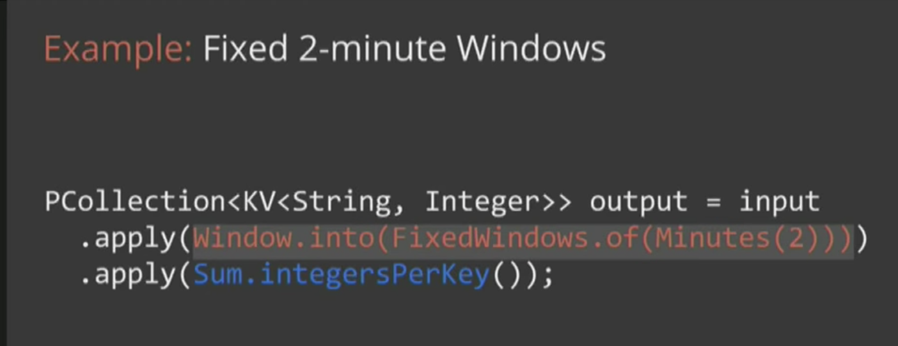<br/>

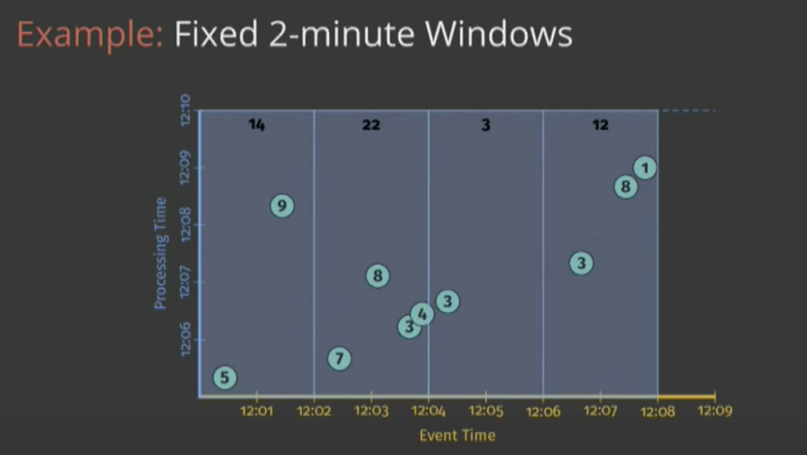<br/>

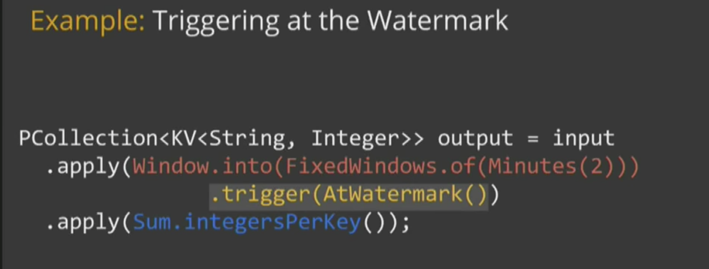<br/>

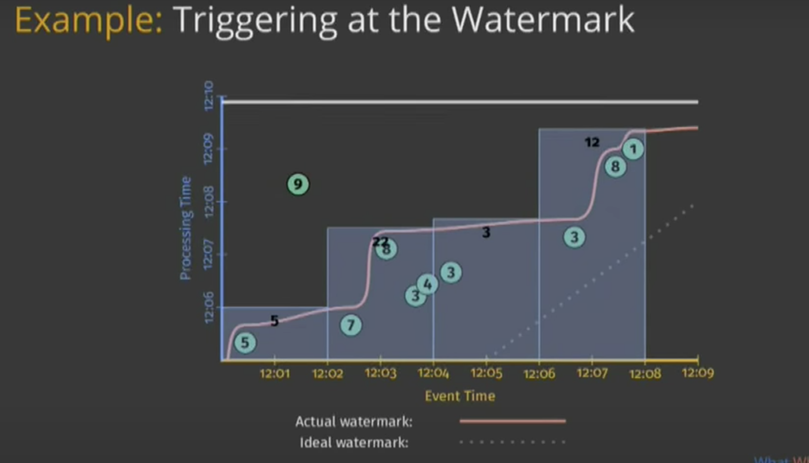<br/>


- `9` has been dropped
- waiting to watermark to trigger

<br/>

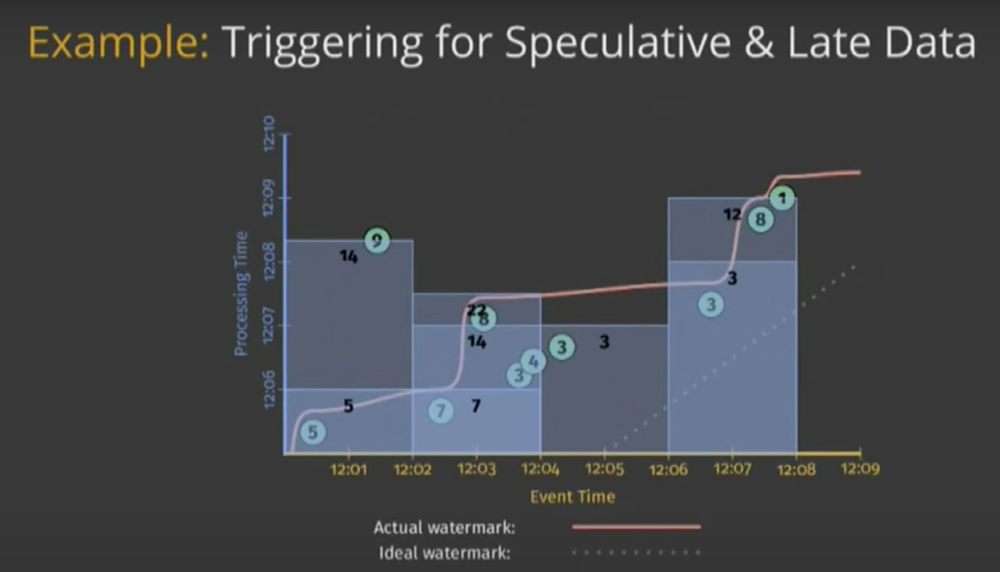<br/>


### How
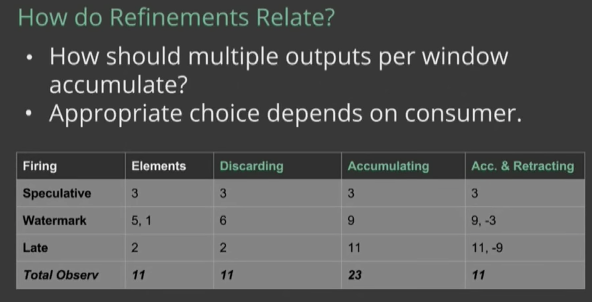<br/>

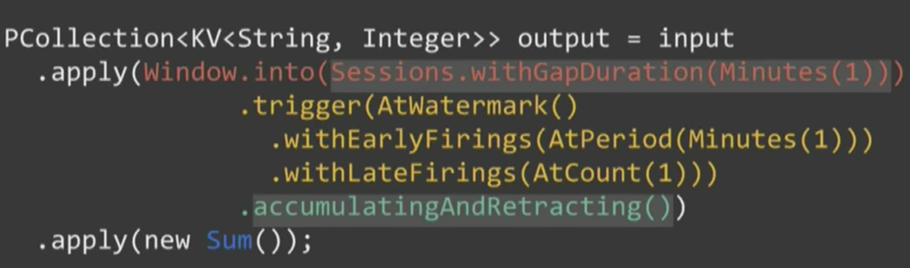<br/>

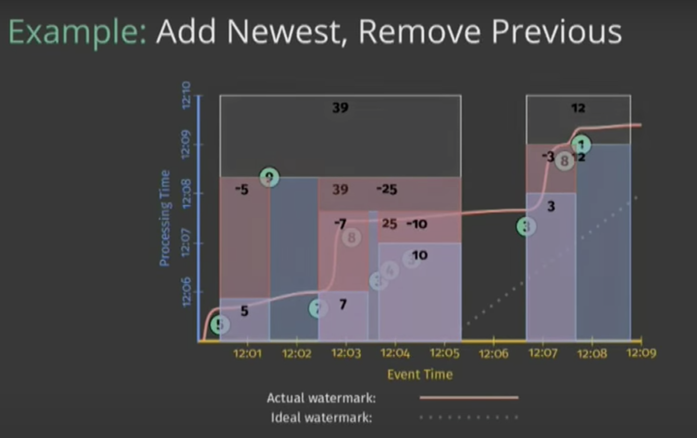<br/>


<br/>


```java
PCollection<KV<String, Integer>> scores = input
  .apply(Window.into(Sessions.withGapDuration(Duration.standardMinutes(1)))
               .triggering(
                 AtWatermark()  // 4
                   .withEarlyFirings(AtPeriod(Duration.standardMinutes(1))) // 3
                   .withLateFirings(AtCount(1)))  // 2
               .accumulatingAndRetractingFiredPanes())   // 1

  .apply(Sum.integersPerKey());

/*
# 1: How do refinements relate - accumulation

# 2: Give late firing after the window is closed, if any late data arrived
     For example, for the event of 5 and 9, withLateFirings will generate 
     second result for window 12:00 ~ 12:02 with value 14 

# 3: withEarlyFirings solves too slow problem.  Any minute of processing time,
     triggers when any new value be generated

# 4: when watermark pass will generate the result.  Watermark link represent
     the system's idea of where inputs completes

withAllowedLateness
     triggering().withAllowedLateness(Duration.standardMinutes(1)))
     Target for avoiding influence to the system's latency, like GC
     https://stackoverflow.com/questions/37246641/google-dataflow-late-data
     Dataflow's default windowing and trigger strategies discard late data. 
     If you want to ensure that your pipeline handles instances of late data, 
     you'll need to explicitly set .withAllowedLateness when you set your 
     PCollection's windowing strategy and set triggers for your PCollections 
     accordingly.
     https://user-images.githubusercontent.com/16873751/84212097-ccaae680-aa71-11ea-8a43-26bfaeb3d299.png
     6 is late, but due to .withAllowedLateness(Duration.standardMinutes(1)), 
     its accepted, and actual time bound of `12:00 ~ 12:02`extend to 6's 
     processing time + 1 minute.
*/
```

## Demo

Fixed bounding input data -> output aggregation for all batch data

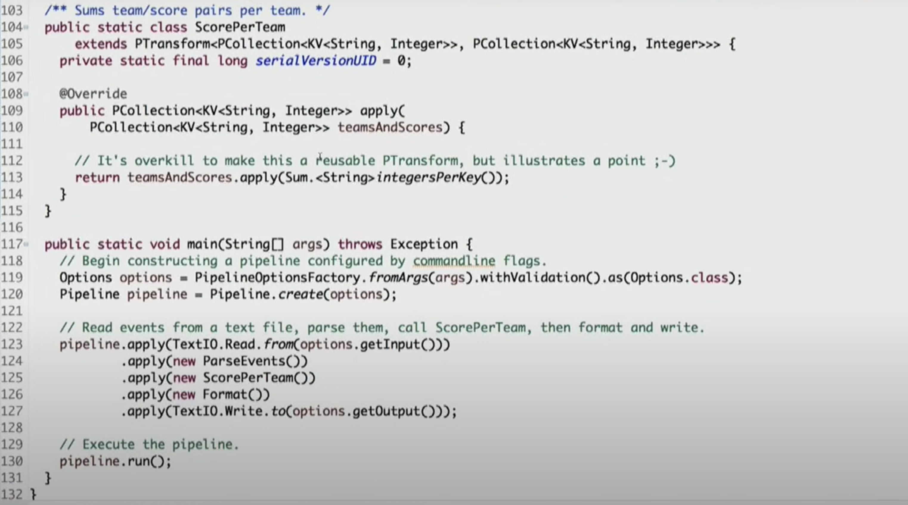<br/>


Window
- fixed window
- session window(processing time window)
- 
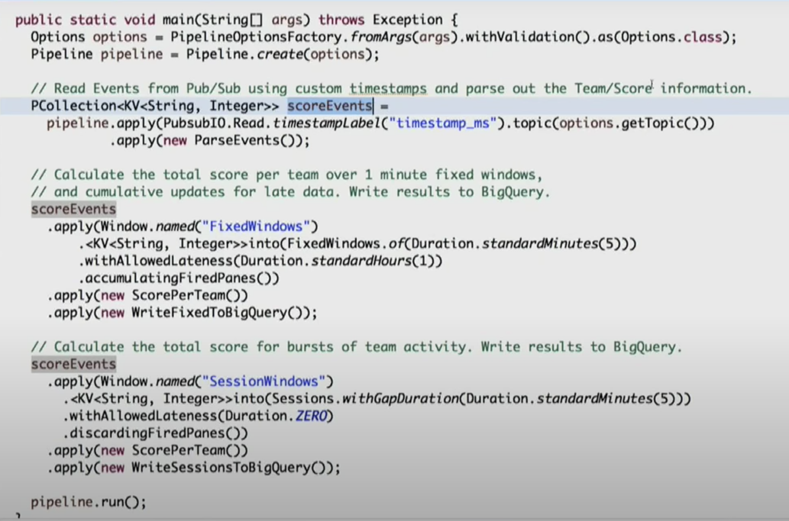<br/>


Fixed window

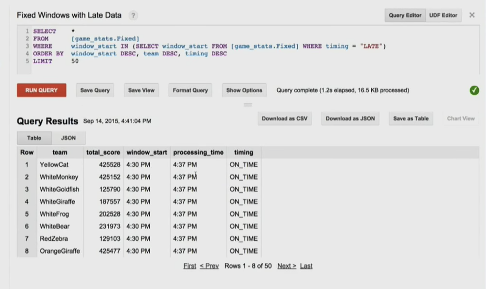<br/>


Session Window

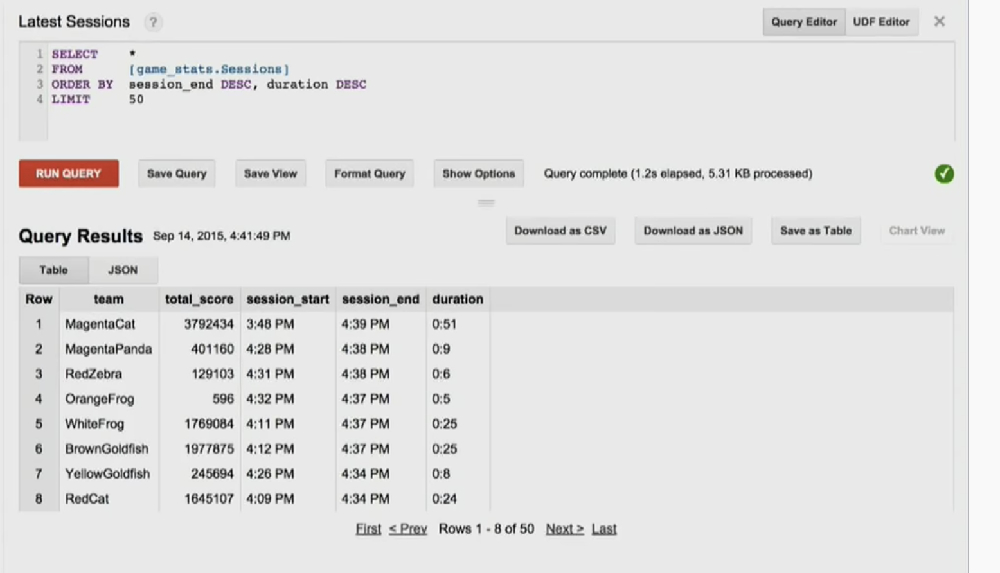<br/>


## Reference 
- https://cs.stanford.edu/~matei/courses/2015/6.S897/slides/dataflow.pdf
- https://beam.apache.org/documentation/programming-guide/#overview
- https://github.com/tshauck/DataflowJavaSDK-examples/tree/master/src/main/java8/com/google/cloud/dataflow/examples/complete/game
- https://github.com/jlewi/dataflow/blob/master/dataflow/src/main/java/sessions/SlidingWindowExample.java
- [A Unified Model for Batch and Streaming Data Processing](https://www.youtube.com/watch?v=3UfZN59Nsk8)
- [Fundamentals of Stream Processing with Apache Beam](https://www.youtube.com/watch?v=crKdfh63-OQ)
- [Streaming 102: The world beyond batch](https://www.oreilly.com/radar/the-world-beyond-batch-streaming-102/)<span>&#9733;</span><span>&#9733;</span>