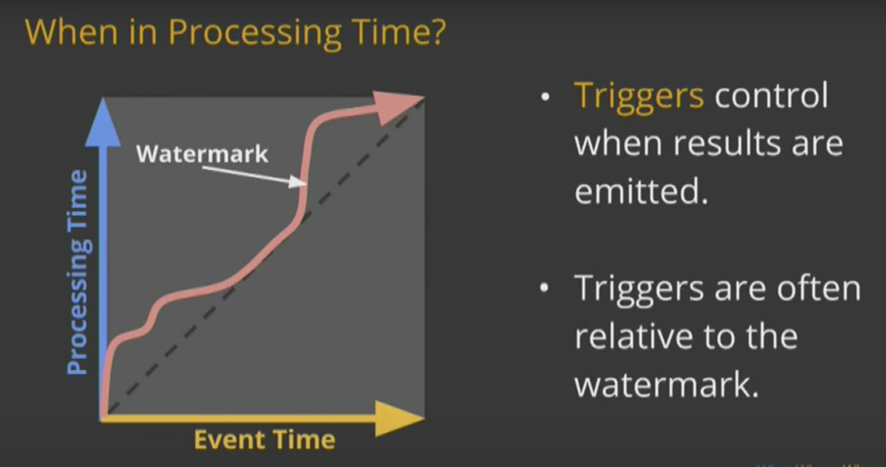

# [A Unified Model for Batch and Streaming Data Processing](https://www.youtube.com/watch?v=3UfZN59Nsk8)

By Frances Perry  

## Story

 

Mobile game:
- Users are distributed all over the world
- User could play offline, then update status later

## Why watermarks

 

Watermark is a heuristic event time progress

## Key steps of Dataflow programming

 

### What
 

### Where
 

Session means a period time user is active.  More info about [session-windows](https://cloud.google.com/dataflow/docs/concepts/streaming-pipelines#session-windows)

### When

How the arriving time into system will affect the processing result

 

#### Example
 

 

 

 

 

- `9` has been dropped
- waiting to watermark to trigger
- 
 

 

### How
 

 

 

 

## Demo

Fixed bounding input data -> output aggregation for all batch data

 

Window
- fixed window
- session window(processing time window)
- 
 

Fixed window

 

Session Window

 

## Reference 
- https://cs.stanford.edu/~matei/courses/2015/6.S897/slides/dataflow.pdf
- https://beam.apache.org/documentation/programming-guide/#overview
- https://github.com/tshauck/DataflowJavaSDK-examples/tree/master/src/main/java8/com/google/cloud/dataflow/examples/complete/game
- https://github.com/jlewi/dataflow/blob/master/dataflow/src/main/java/sessions/SlidingWindowExample.java