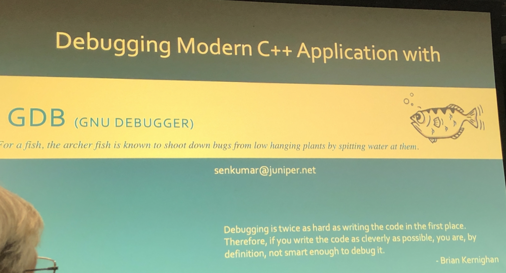
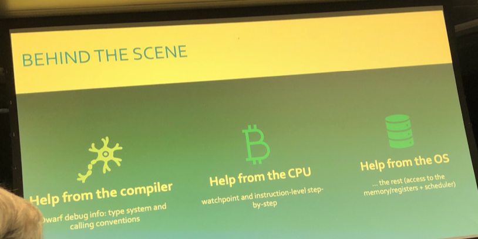

# Debugging Morden C++ with GDB
Wendesday, Nov 13, 2019<br/>
7:00pm - 8:45pm<br/>
@[Mercedes-Benz Research & Development North America] By Senthilkumar Selvaraj


## Notes from lecture
- The most frequent useful tool is cout + assert
- debug tool is used for validate your assumption
- debug hints: smart small, binary search


### Frequent use commends

```
gdb [prog][core|procID]

gdbinit

s step
r run

set args
attach progid
detach progid

break function
break offset
break filename:function
Info break


watch expr
info watchpoints
catch


step
next
continue
util

```

### Highlights


<br/>


<br/>


<br/>


<br/>

x addr examine address

<br/>


## My exploration
