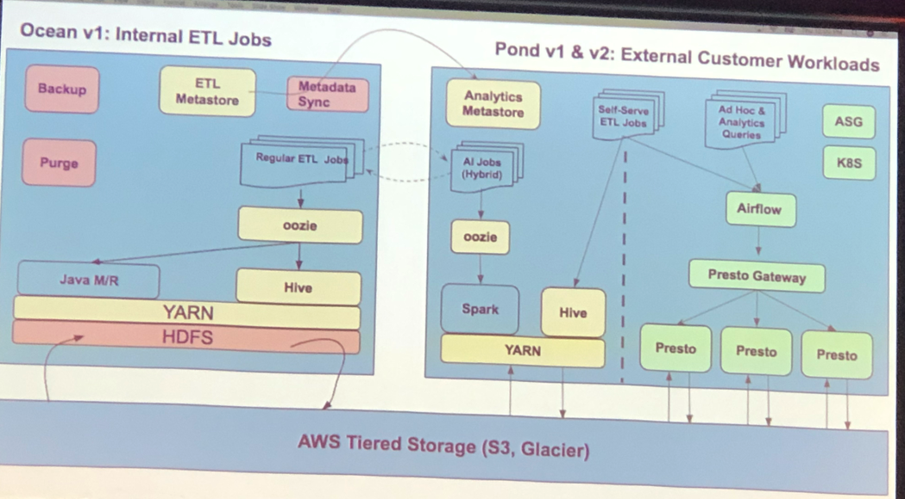

# How to build and maintain cloud first data platform
Thursday, Nov 7, 2019 
9:30am--8:30PM Du Li 
@[DATA ORCHESTRATION SUMMIT](https://www.alluxio.io/data-orchestration-summit-2019/) 

 

## Story 1: Monitoring Systems

EA's monitoring system gave 1000+ alarms per day, most of them are false alarm, some emergency alarm hard to be found.

 

root cause

 

The warning is due to change of hardware+service pair is made by operators manually.  If you update alert generator, you also need to update metrics aggregator's cong.  

Solution:

 

 

 

## Story 2: Data platforms

 

 

 

# EA's data platform

 

 

 

## Takeaways

 

