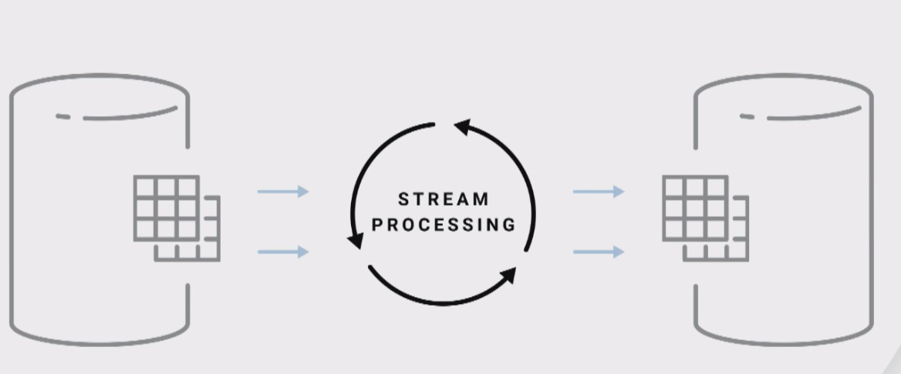

# The Death and Rebirth of the Event-Driven Architecture
Jay Kreps | Kafka Summit 2018 Keynote (The Death and Rebirth of the Event-Driven Architecture)
[video](https://www.youtube.com/watch?v=gsUZ6RYmL1s)

## What is event

<br/>


Event could capture change and **state**  
Difference with message?  From [Difference Between Event and Message](https://bradirby.com/difference-between-events-and-messages/)
```
An important difference between events and messages is that there is no expectation of further processing for an event.  After the event is published it can be ignored by all systems without any harm coming out of it.  A message, however, carries the assumption that something somewhere will process it.

Another difference is that messages can affect 0 or more aggregates while an event reflects a change to exactly one aggregate.  The Use Case that is executed in response to a message can decide what aggregates need to be updated, possibly resulting in no changes at all.  Each aggregate that is created, however, should publish an event stating changes that were made.
```



<br/>


<br/>


Event has two functions  
1.Triggers  
2.Data  


<br/>


<br/>


Tables(keep current state of world) + Events(what's happening now in the world)  
streaming system combine these two things together  

Data wheahouse:  dimension table  fact table


<br/>


<br/>


Taken in stream of events, combine them with stream of new events


<br/>


Why use Kafka for streaming system


<br/>


<br/>
Need both table and messaging(event).  


<br/>

