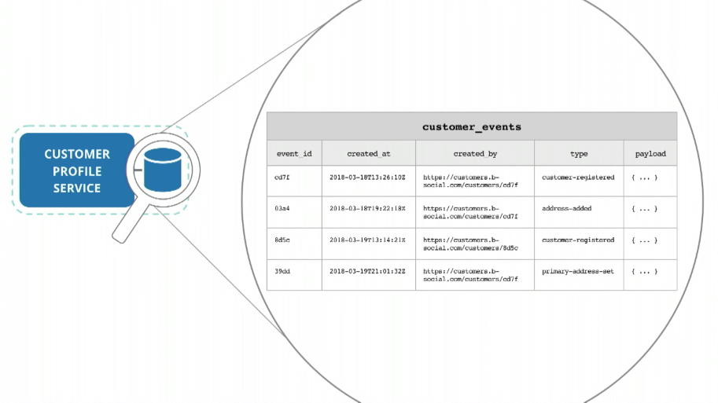

# Experimentation Using Event-based Systems
Martin Fowler + Toby Clemson | Kafka Summit 2018 Keynote (Experimentation Using Event-based Systems)  
[video](https://www.youtube.com/watch?time_continue=52&v=_RgUxUTuxH4)

Agile Fluency

 

Optimists situation

## Evolution 0

 

https://github.com/infrablocks

 

Postgis  
Communicate sync  

**Microservice: each service has its own datastore**

 

Hyper media:  
- easy to make the move
- change service's boundary
- Only provide one url for the entire system, every other url should be got steps by steps

 

 

## Event sourcing

 

At any time, could blow away application data and rebuild system based on events, recall from log  

Version control: Git  

## Evolution 1

 

Record complete information from user

 

 

## Evolution 2

 

All cordinate logic lives in consumer, load, replayabiliy

 

Where would we find event bus: kafka

 

Keep event feed in json, keep readability

 

Sync communication

 

## Future

 

Flexibility
