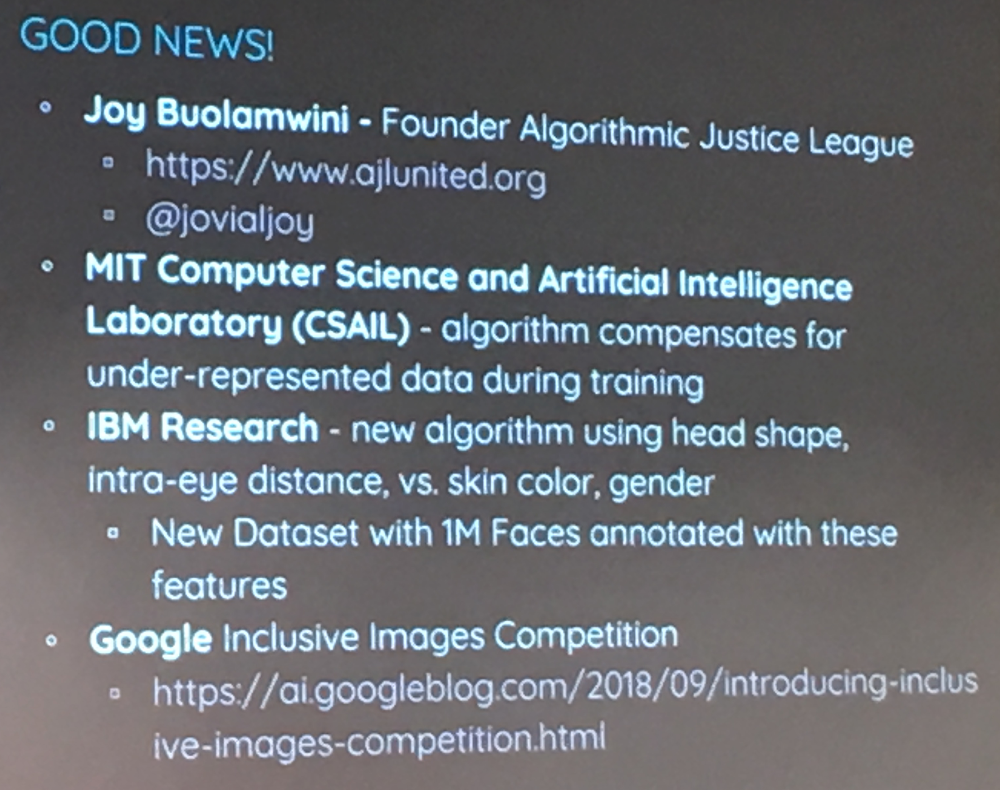

# Human + Machine Learning

Wednesday, March 6, 2019 
7:10--7:50: Human + Machine Learning - Mike Wolfson 
@Google Cloud 

## Notes
- [Human-Centered Machine Learning](https://medium.com/google-design/human-centered-machine-learning-a770d10562cd)
- [Facial Recognition Is Accurate, if You’re a White Guy](https://www.nytimes.com/2018/02/09/technology/facial-recognition-race-artificial-intelligence.html)
- [Slides](https://www.slideshare.net/mswolfson/human-machine-learning)

HCML steps  

 
Additional information: Ranking bayes   

 

- Design clearly about your questions, otherwise, it would be gabegy in, gabegy out  
- If you want to design a music recommend system, let's use human to fake AI to get the expectation from system  
- Beaware the influence of false positive  
- Watch your label  