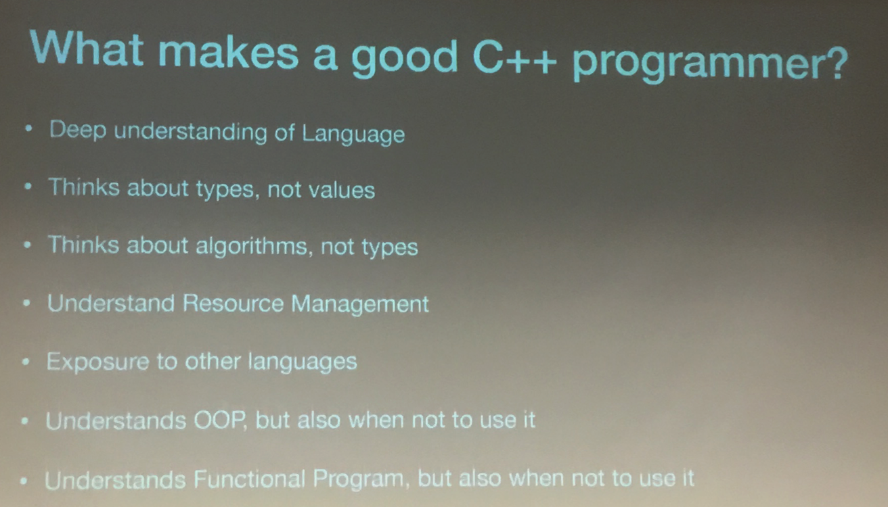
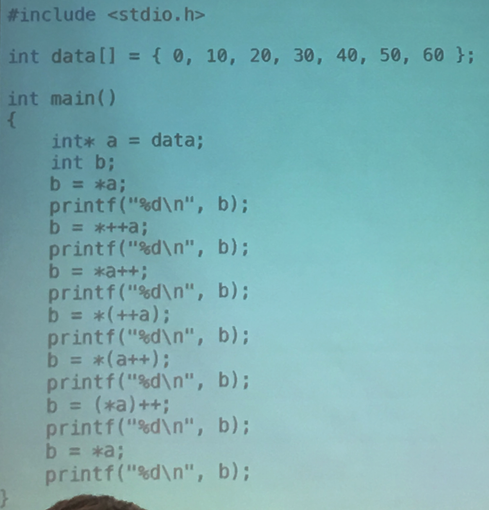
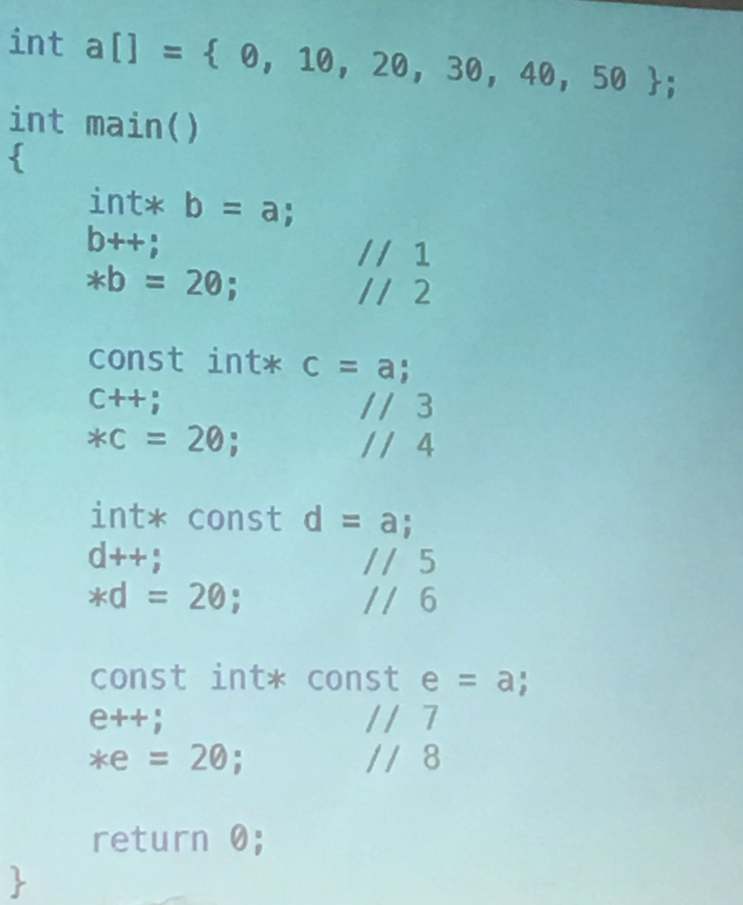

# Interview C++
Wednesday, March 12, 2019 
7:00--8:15 [Rchard Powell](rmpowell77@me.com)  
@Synopsys

## Take away
- Take a reference of vector with integers, remove value which is power of 2 from it  
  You could use Lambda, 2 for loop, or more elegant solution, sort?
- Ask candidate what's your favorite projects/code, let them describe, and then try to **add new features** in the code base
- Candidate should know every decision of consequence is made by group, he/she suppose to have collaboration skill and communication skill.
- Implement std::string or tuple::get()
- Buffered file reader implementation
- Why use C++ for your project?

## Useful links
- cppnow.org
- Cppcon.org
- [Deep understanding of language](https://www.slideshare.net/olvemaudal/deep-c/) 

## Slides

 

 
Don't try those questions, too detail  

 
Try with following questions instead 

 
How to make your evaluation system consistent, same candidate might get opposite result if you don't prepare carely enough 

 
Interview is a bidirection process 

 