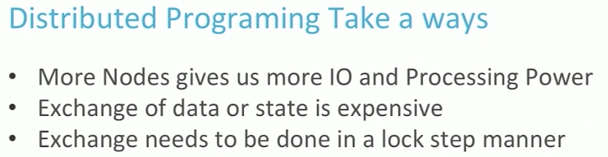
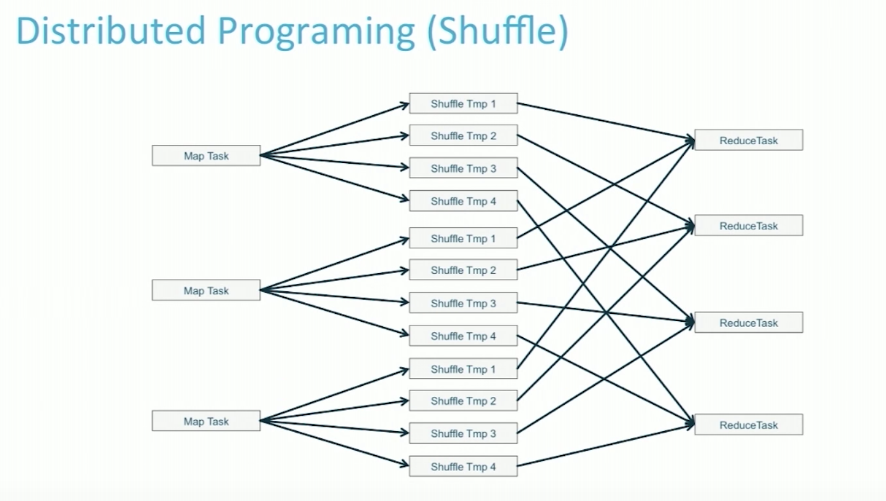
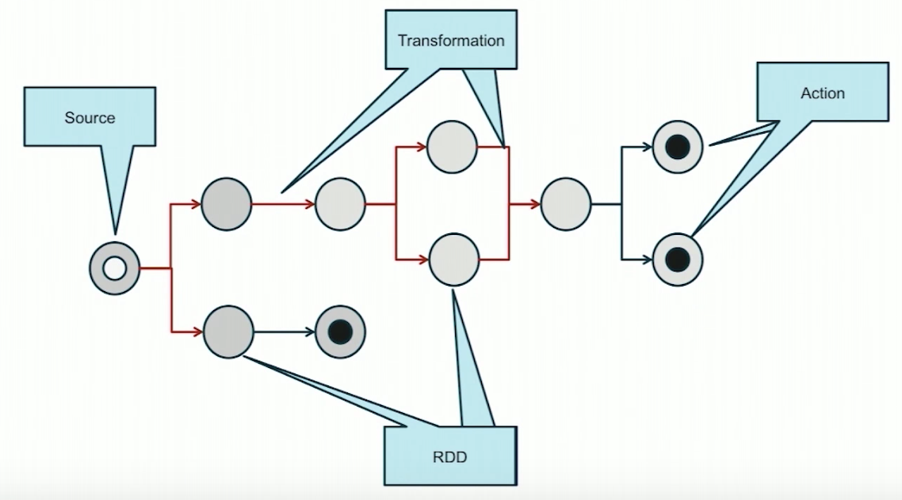
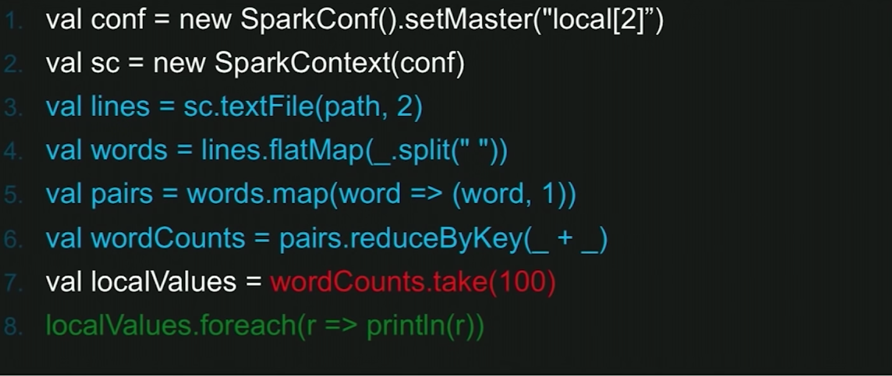
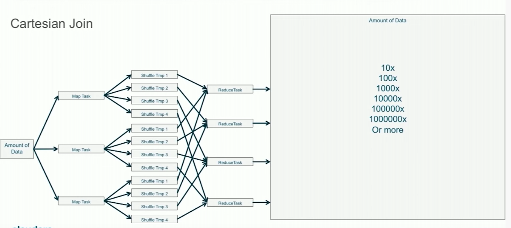

# Intro to Apache Spark for Java and Scala Developers

Initially from onenotes' record on May 24, 2018  
[video](https://www.youtube.com/watch?v=x8xXXqvhZq8), by Ted Malaska  

## Taken

- One driver and many executors, shuffle service
- DAG is small and can be passed to each of executors

## Problem with Hadoop

- Shuffring =. Mapper * Reduccer
- Single point problem
- Transfer data could be the bottleneck

## Spark

keyword  
Single **driver** - **broadcast** tasks to **schedulers** and **take** result back   

### RDD
Mutable data used for replay(handling single point failure), in memory with schema(data frame)
In memory, no schema  
**data frame means RDD with schema**  

### DAG

What is action: Count, take, foreach  
What is Transformation: Map, ReducebyKey, Group By Key,Join by Key  
DAG+RDD makes, when anything went wrong, its more easy to recover  

### FlumeJava
Write distribute program is the same as writing local one  

### Manage Parallelism

#### A better hash(Stew)
Usually Math.abs(value.HashCode)%# works  
IF Most of keys are the same  
-> SALT, add random key(dirt), such as Mod2 Records per reducer  

#### Cartesian Join
When you join two tables with many to many relationship, it generate thousands of keys in the middle  

- Nested structures
   + cell in table, which has rows
   + Example, if we have one to many relations, bob, bob has 3 cats, if we join two table, then will be bob cat1, bot cat2, bot cat3, with nested fields we will only see one row for bob with 3 cates 
   + Reduce join scale
- Windowing
- ReduceByKey

