# More Data Science with Less Engineering: ML Infrastructure at Netflix
Monday, Sep 17, 2019 
7:10--7:40: ML Infrastructure at Netflix - Ville Tuulos  
@Lyft HQ 

## Take away

## Notes

### problems to solve

What problem to solve:
- NLP to estimate which TV or movie will become popular
- ML to organize front page

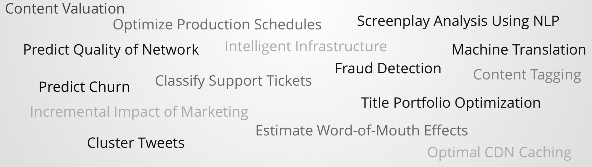

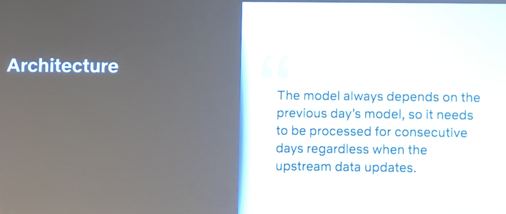

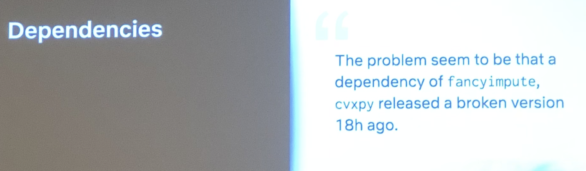

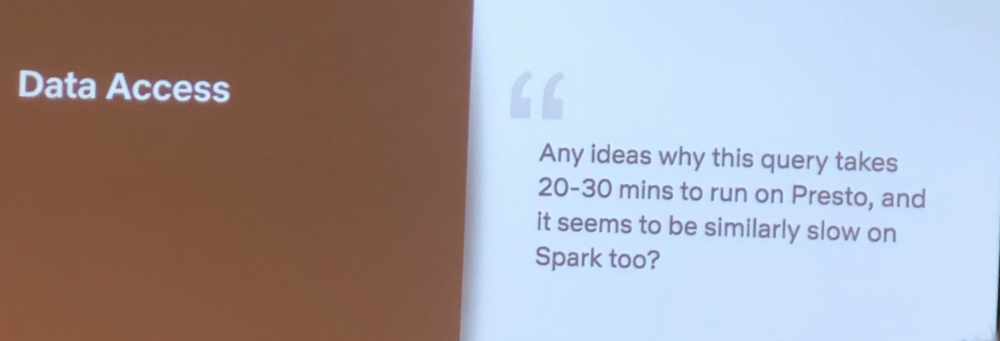

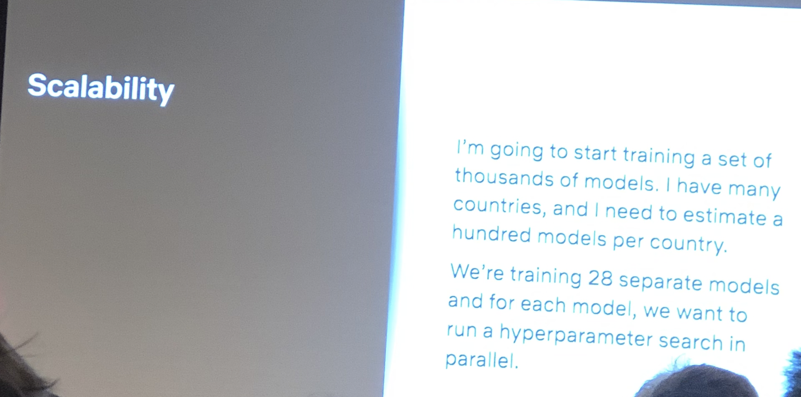

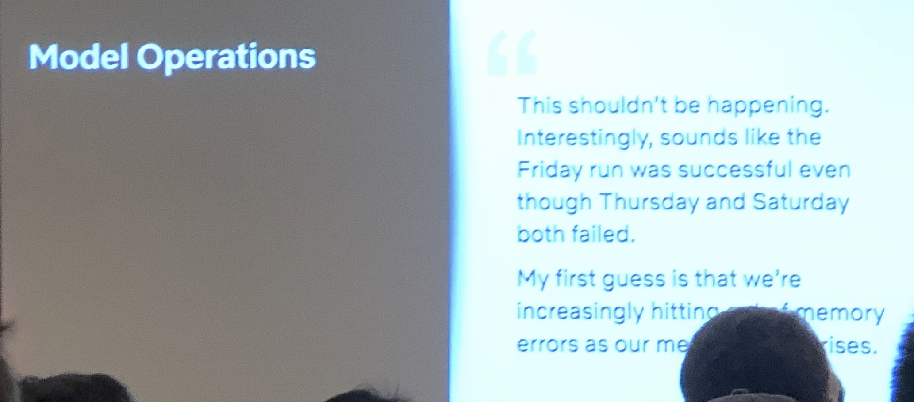

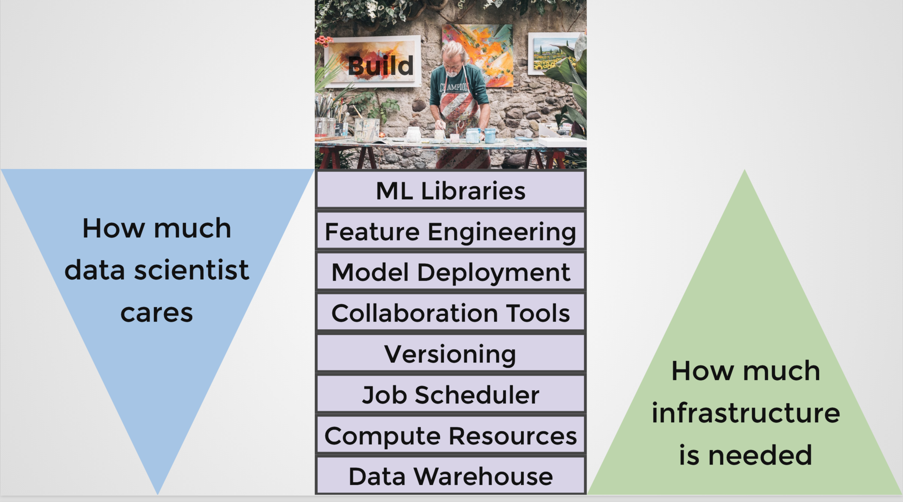

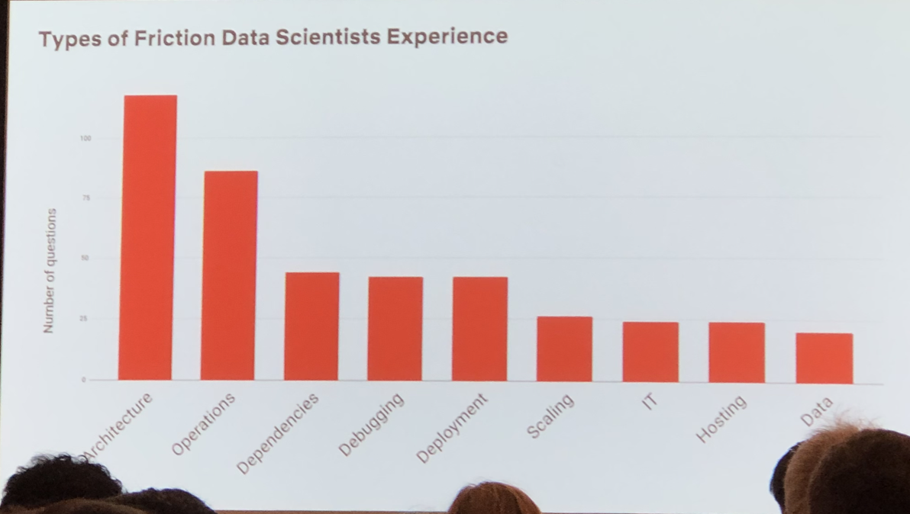

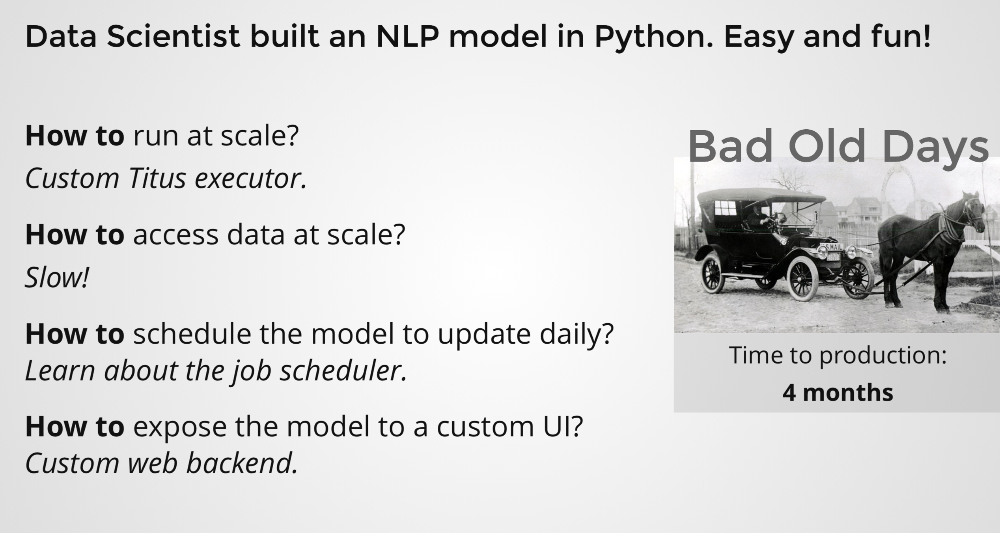

Without good infra, data project roll out is hard

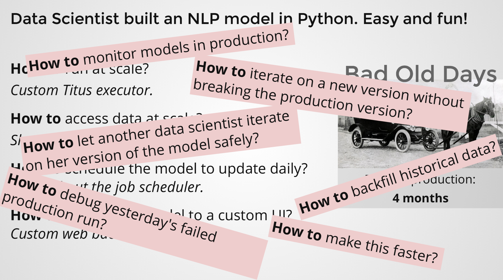

### Metaflow

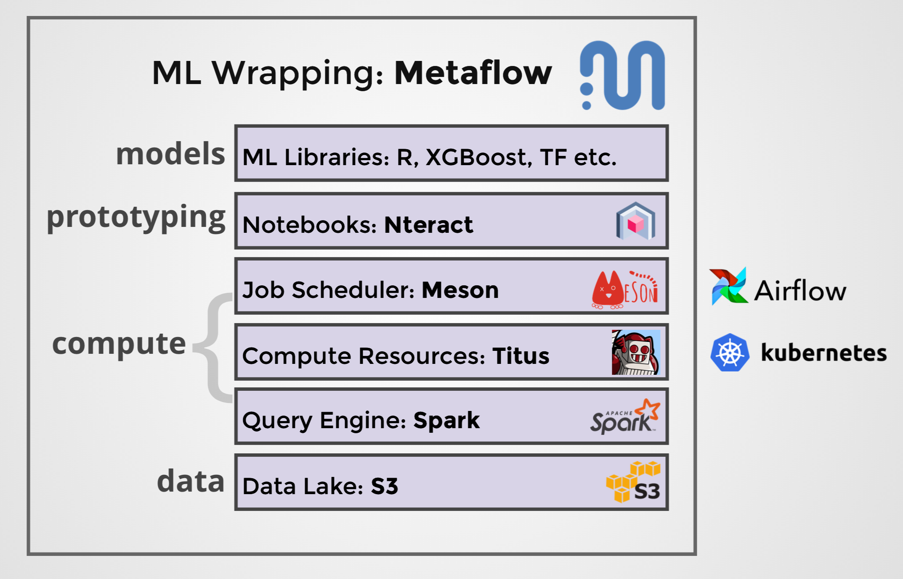

Fan out is easy collect result is harder

Every effort to made is for fast failure

## Ref
- [video from InfoQ](https://www.infoq.com/presentations/netflix-ml-infrastructure/#downloadPdf/) 
- [slides](https://ress.infoq.com/downloads/pdfdownloads/presentations/QConSF2018-VilleTuulosHuman-CentricMachineLearningInfrastructureNetflix.pdf?Expires=1568673190&Signature=THvsdfeVAhATDvbw1ymQeD9WahrfUcfa5F3UXBnUDsExoLxuoJlC6Is~7BiU1nPNld95dNIPbdu0lGAvGHVSchzhBqWrx~pW5rr4VIdSsSMNbFueNbumoTt9QTBAiMULui8xx7aThrMq6nuKofDSVdpMddaU~BVPG7dD1x28jF8_&Key-Pair-Id=APKAIMZVI7QH4C5YKH6Q)

