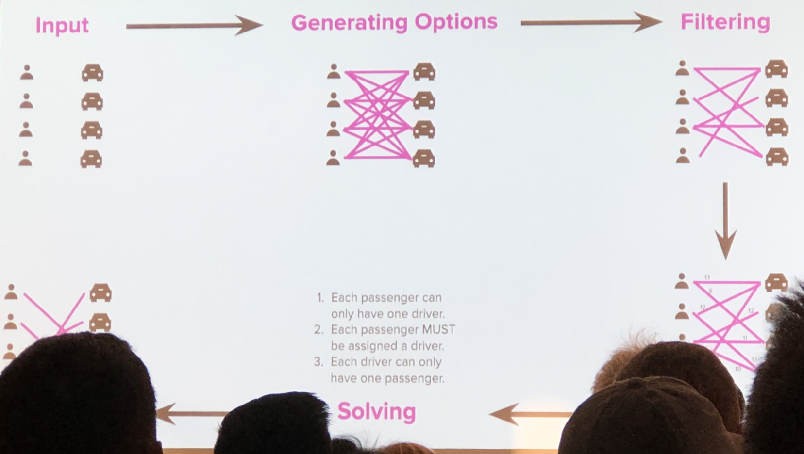
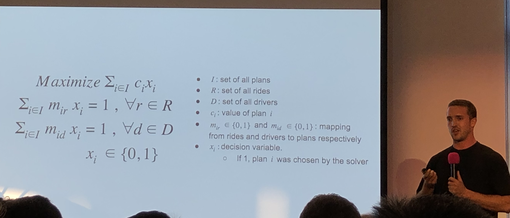
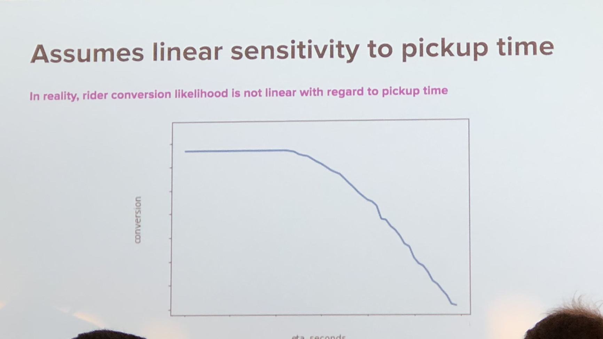
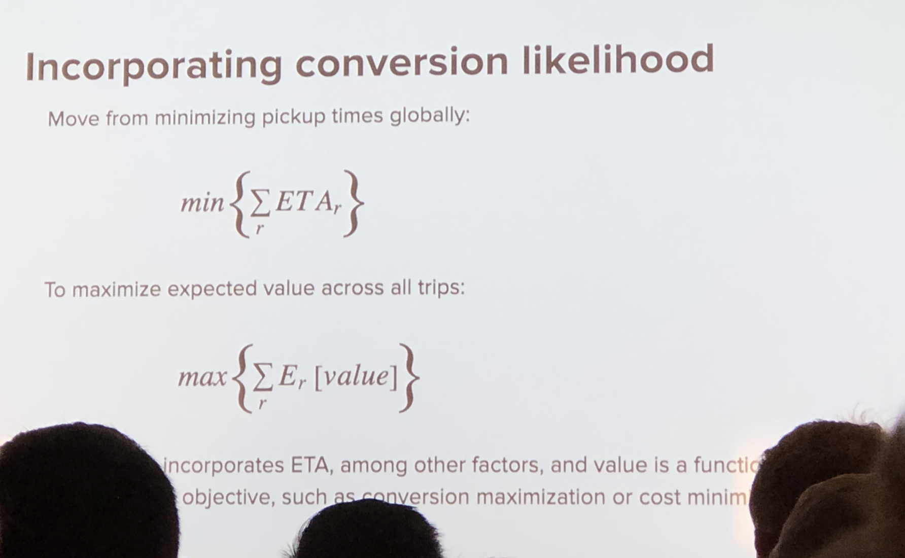
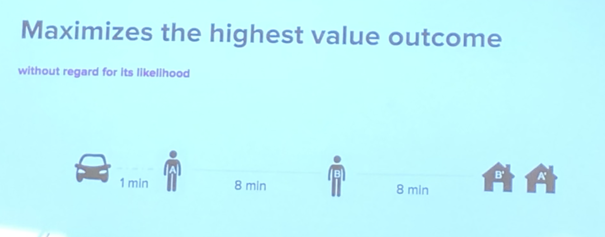
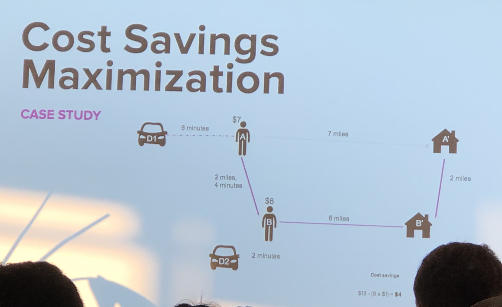
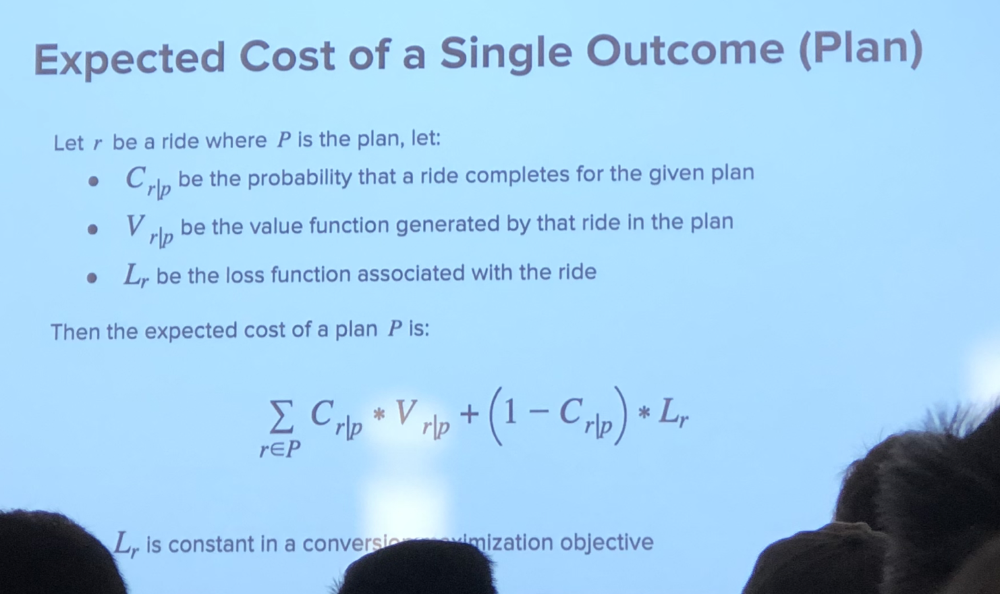
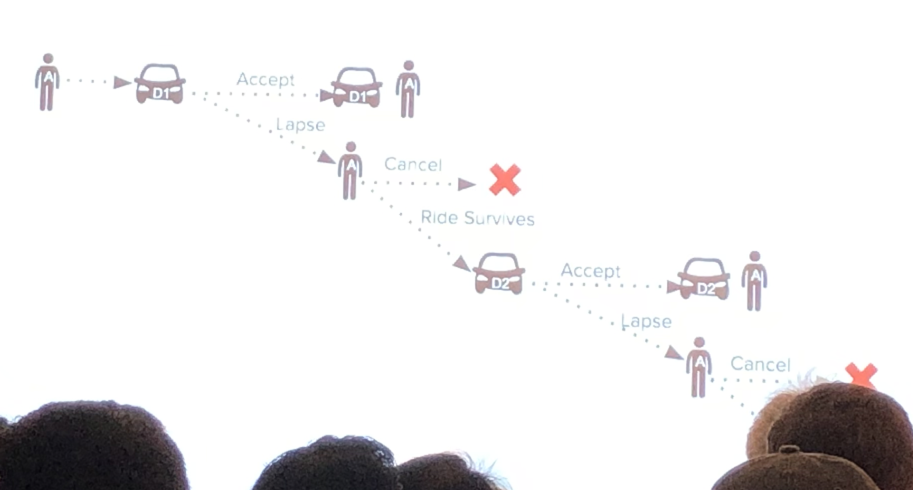

# Ridesharing - Accounting for uncertainty in dispatch decisions to optimize marketplace balance

Monday, Sep 17, 2019<br/>
6:30--7:10: Ridesharing - Parker Spielman<br/>
@Lyft HQ<br/>


## Take away


## Notes

Dispach's objective
- Spatial optimization
- Temporal optimization

Not only optimize for one user's time/money/etc, but overall trip score
Need also consider one customer cancel, or both cancel



Problem: unmatched person, rider, make a plan for sharing  
Input -> generating options -> filtering -> score -> solving -> response









Need consider overall pick up time,  











Loss function is the important factor to adjust result(cancel)  
Decision tree + geohash




## How Lyft perform Matchmaking

Figure out smart strategy is just the first step, how to build system to evaluate the strategy and continuing tuning data is the core.


### Problem to solve
- Cheap, fast, efficient, and friendly ride is a good lyft line route
- How do we know if we’ve matched a passenger in a route that’s fast and efficient?
- How can we accurately predict whether two, three, or four passengers together would enjoy the route we’ve selected? 

## Initial thinking
- Use one minute to find a good match for given origin and destination
- Use a matching pool to accumulate users, like users in 10 minutes.  But if user wait for 10 minutes but still be put into a bad route he will feel disappointed, so accumulation will be dropped

### Initial algorithm
- a simple greedy [haversine](https://en.wikipedia.org/wiki/Haversine_formula) matchmaking system
  - straight-line distances between two points and are multiplied by the region’s average speed to get a time estimate
  - some tight enough constraints(e.g. detours, time until pickup, etc)
  - compared every passenger with every other passenger in the system (O(n^2)), in all possible orderings
  - Suppose user A and B, there are 24 potential orderings ABB`A`, ABA`B`... But users could not be dropped off first then pick up(remove A`*A), and no overlap is not make sense(AA`BB`), total number could be reduced to 4 kind.
```
// look at all four permutations and eliminate ones that didn’t satisfy all of Lyft's constraints
// choose the most optimal ordering, make the match, and notify the passenger
def make_matches(all_rides):
    for r1 in all_rides:
        for r2 in all_rides: 
            orderings = []
            for ordering in get_permutations(r1, r2):
                if is_good_match(r1, r2, ordering):
                    orderings.append(ordering)
            best_ordering = get_best_ordering(r1, r2, orderings)
            if best_ordering:
                make_match(r1, r2, best_ordering)
            // etc ...
```
- Need to consider **detour and pickup time**(Lyft has over 30 constraints for 2016)
  - the total detour that match added for each passenger would have to be below an absolute threshold, but would also have to be below a proportional threshold
  - Additional time used for pick up also need to be considered, especially for the influence of multiple passengers
- After lunch, lyft started learning that passengers didn’t want to go backwards, and in fact the angle of the lines they saw on the map would affect their satisfaction with the match.


### Improvement
- A* -> contraction hierarchies, too much of work
- geohash based model for estimates
  - record the average speed of rides in each geohash box, use such speed + haversine distance for estimation
  - Helps to avoid matching through mountains and differentiate between highway and local travel
  - Not good for one way and rush-hour/historical speed(geohash grid for different hours)

[](https://miro.medium.com/)

- Tiple matching(matching multiple passangers to decrease cost)
  - match up to four passengers
  - ABCDBCDA is a bad experience for A
  - User could provde incorrect number of passangers
  - although riding in a full car with four others is ultimately the most efficient route we can make, it doesn’t always create the best experience
- Longitudinal sorting
  - When considering pairing A and B together, there was some maximum distance they could be apart from each other
  - sorted the outer and inner loops by longitude, we could short circuit out of that loop when we’ve passed this maximum distance
- Rerouting
  - change a driver’s route mid-ride to pick up a passenger along the way
  - Disallow unreasonable rerouting, only been willing to add a passenger to a route if it didn’t change the driver’s next stop

- Upgrade algorithm
  - a [maximum matching problem](https://en.wikipedia.org/wiki/Matching_(graph_theory)) for a weighted graph combined with elements of a [Secretary Problem](https://en.wikipedia.org/wiki/Secretary_problem)
[](https://miro.medium.com/)


- Route Swapping
  
[](https://miro.medium.com/)

  - reduced the burden of having to predict future demand
  - only swap the passenger if the new route reduced their pickup or detour time, but we had to be cautious about making drastic changes

- Matching exchange
  - no longer wanted to compare riders as frequently, instead we wanted to “accumulate” rides for a period of time before attempting to solve in a more complete way.
  - **partition your graph into smaller components in real-time without hurting your system’s efficiency**. (Identifying the right partitioning pattern and solving for optimal system efficiency is the secret sauce behind our Matching Exchange.)


### The Road Ahead
- [Hotspots](https://blog.lyft.com/posts/100hotspots) was a feature we launched that suggested pickup locations to our passengers in exchange for a cheaper ride.
- [Standby](https://techcrunch.com/2015/04/27/lyft-is-testing-a-feature-that-will-make-line-cheaper-if-youre-willing-to-wait-longer/) was a feature that allowed passengers to wait up to 10 minutes for a match in exchange for an additional discount.
- A/B test
- work for cities of different composition(sparse cities like LA, North-South neighborhoods like Manhattan, and centralized downtown commuter cities like Chicago)

### How Lyft simulation works
-  accurate, fast, easy to use
https://miro.medium.com/max/2560/1*2msd1BqaOu4NjuBzMdDHgQ.png
- The simulator breaks time into discrete chunks, everything that happened in the real world in a 10 second period happens in the simulator all at once (10sec is configurable and depends on what’s being simulated).
- the simulator runs two core components: first the marketplace algorithms and then the user behavior models.
  - The algorithms run and update information that the simulated users see, prime Time price and the estimated time to arrival (ETA)
  - Use machine learning models to determine passenger and driver behavior in response to the simulated conditions. (We know how a user responded to the price they saw in reality, but don't know when price was 25% )
- What will happen in 10 second chunks
  - ETAs are estimated
  - ride states and driver locations are updated
  - Lyft Line matches are made
  - users “decide” to cancel rides and matches
  - passengers are dropped off
  - key metrics are recorded
- Aggregate the results from different time slices and markets
https://miro.medium.com/max/2698/1*f4Vdmfy9SB4hiurEwfQ9mA.png

## More info
- [Bias vs Variance](http://scott.fortmann-roe.com/docs/BiasVariance.html) [偏差 vs 方差](https://cloud.tencent.com/developer/article/1441999)

- Experimentation in a Ridesharing Marketplace
[Part 1 of 3: Interference Across a Network](https://eng.lyft.com/experimentation-in-a-ridesharing-marketplace-b39db027a66e)
[Part 2 of 3: Simulating a ridesharing marketplace](https://eng.lyft.com/https-medium-com-adamgreenhall-simulating-a-ridesharing-marketplace-36007a8a31f2)
[Part 3 of 3: Bias and Variance](https://eng.lyft.com/experimentation-in-a-ridesharing-marketplace-f75a9c4fcf01)

- Matchmaking in Lyft Line — [Part 1](https://eng.lyft.com/matchmaking-in-lyft-line-9c2635fe62c4), [2](https://eng.lyft.com/matchmaking-in-lyft-line-691a1a32a008), [3](https://eng.lyft.com/matchmaking-in-lyft-line-part-3-d8f9497c0e51)
