# Scaling Instagram Infra 
@[Lisa Guo](https://www.linkedin.com/in/lisa-guo-5b56972/)   
[video](https://www.youtube.com/watch?v=hnpzNAPiC0E)

## Take away

## Notes

### scale out

scale_instagram_infra_lisa_arch.png

	- User's request come to Django
	- Jango will fwd to other services
	- Use postgresql to persist data
	- Use memcache as front end cache
	- Use cassandra to cache user feeds   https://blog.pythian.com/cassandra-use-cases/

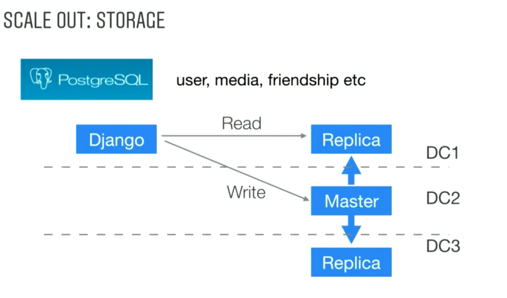

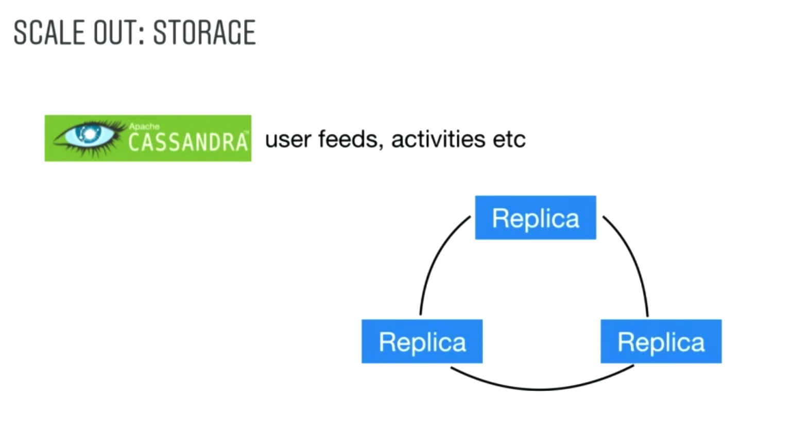

[Perry] static information recorded in postgresql, for dynamic information recorded in cassandra

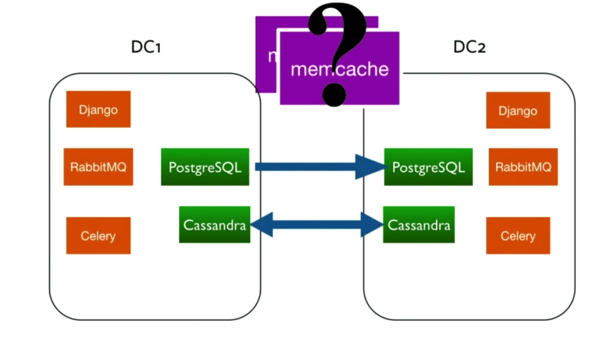

Django + RabbitMQ as one package
[RabbitMQ vs Celery](https://stackoverflow.com/questions/9077687/why-use-celery-instead-of-rabbitmq)

Why memcache

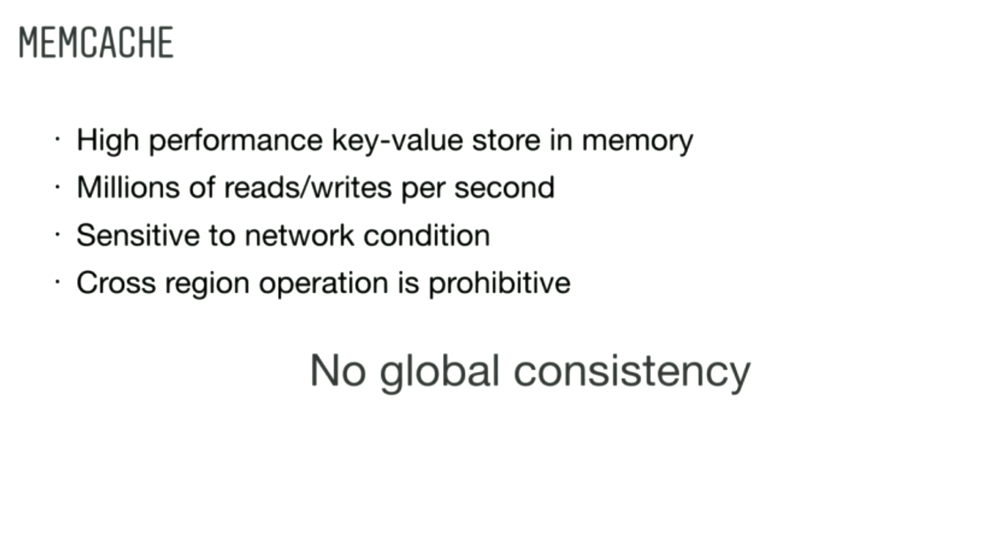

Memcache for single data center

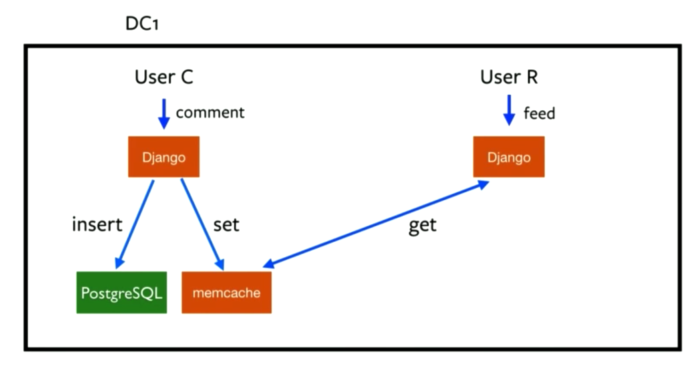

Memcache for multiple data center (How to avoid stale read)

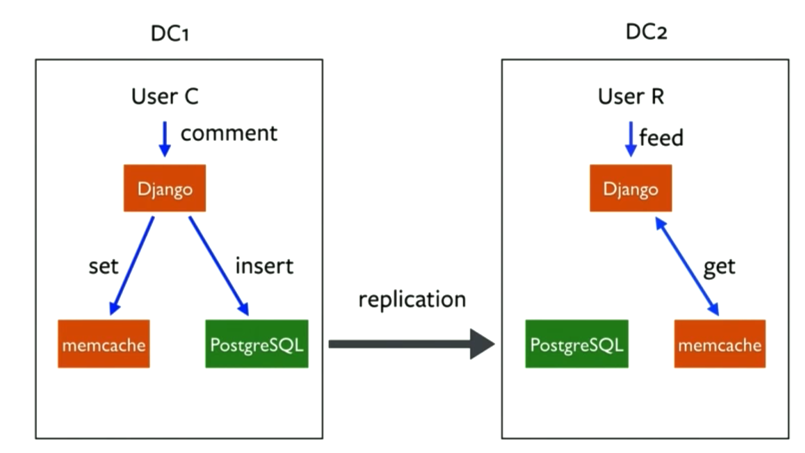

User R will read stale information about user C's comments
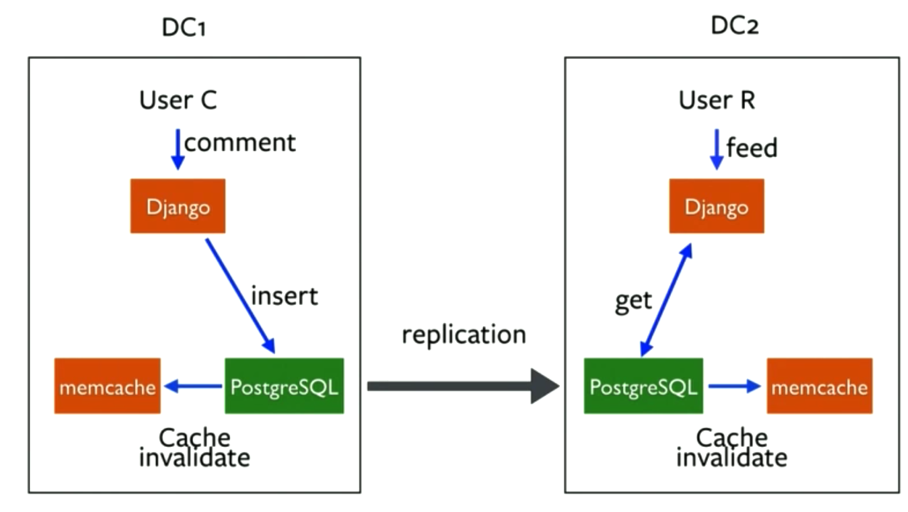

When PostgreSQL replica data, invalid cache  
When User R want to read data again, he will go to database  
But what if there are millions of User R query from DC2  
Select count from media_likes where media_id = 12345  

Solution: cache lease: only first request trigger database load, for following ones wait or use stale value  

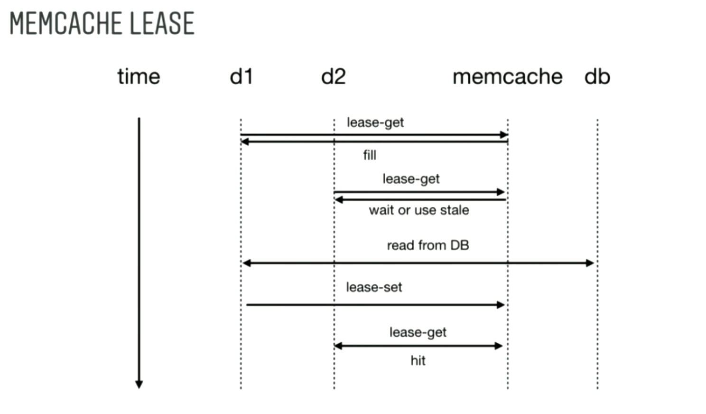

[mark]Don't count servers, make the servers count[/mark]

### scale up

Use as few CPU instructions as possible
How: monitor, analyze, optimize

#### Monitor
- collect cpu based on user request, with meta data(data center, time, …)
                 when you find some jump, it could be regression in new feature

- python cprofile find bottleneck
- 

#### Analyze

Analysis based on running specific version(snapshot)
Analysis based on duration of running (regression)

#### Optimize
Different size of images

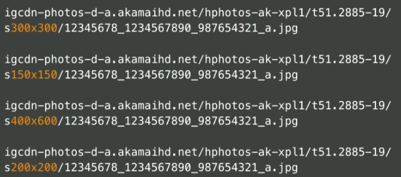

**Use C++ to replace python for core part**
Facebook folly's std::future https://instagram-engineering.com/c-futures-at-instagram-9628ff634f49

Number of process is limited due to system memory

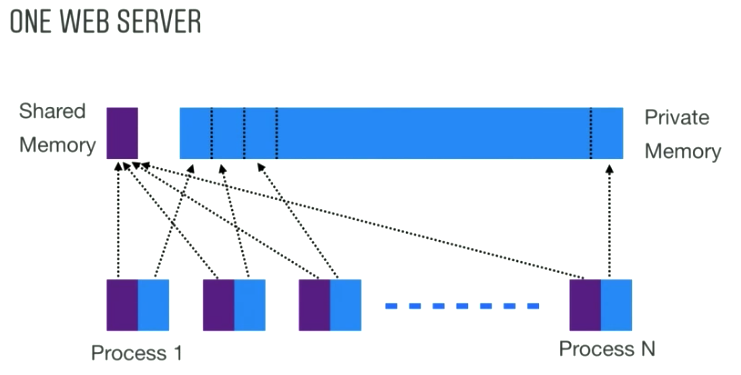

How to have more processes: reduce code, share more(move config to shared memory, disable GC to avoid private mem allocation)

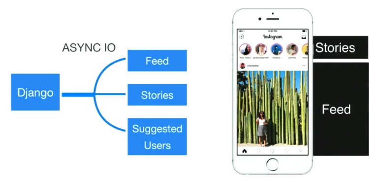

