# A Tale of Three Apache Spark APIs: RDDs, DataFrames, and Datasets 
By Jules Damji 2017 [Video](https://www.youtube.com/watch?v=Ofk7G3GD9jk)

## RDD

### What is RDD

#### 1. Distributed data abstraction 
  - I could write functions and make them run in parallel  

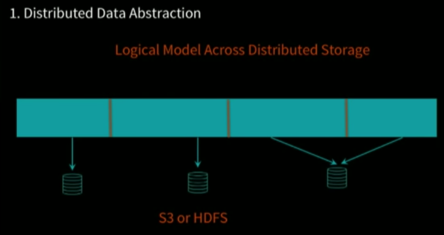
 

#### 2. Resilient & Immutable
- I could re-create the RDDs at any time
- RDD's metadata will record lineage

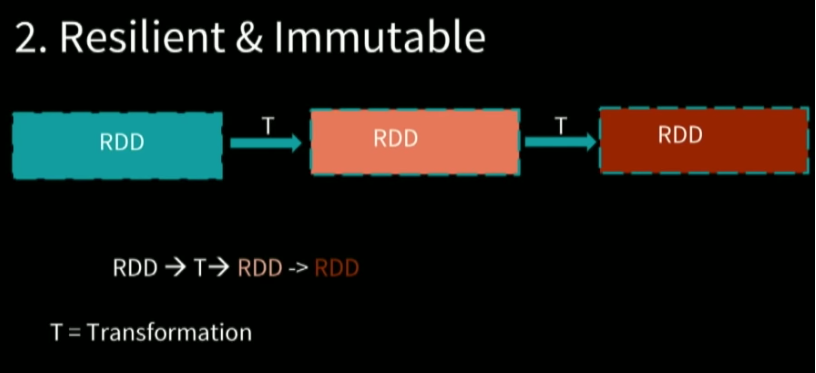
 

#### 3. Compile-time type-safe

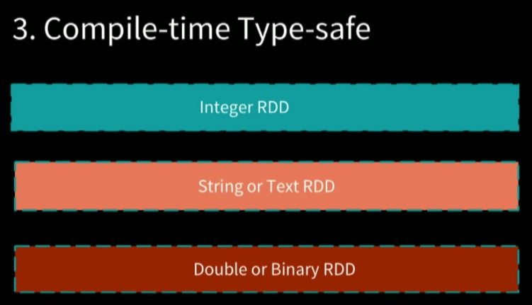
 

#### 4. Data could be unstructured or structured data

- RDD don't understand the data, its just string, upper user could use format to decoding them

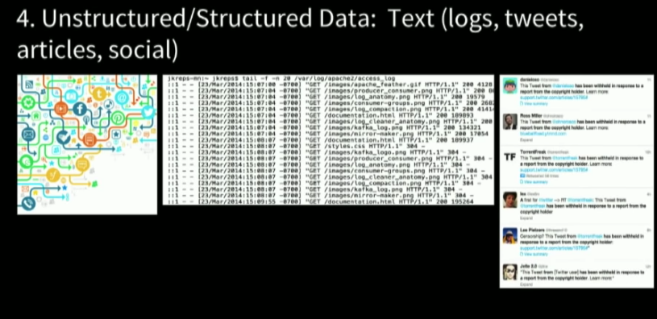
 

#### 5. Lazy
- actions means the entire DAG start to execution

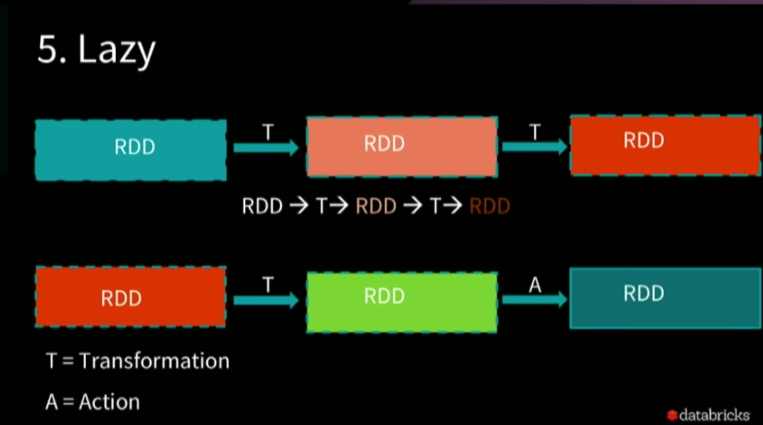
 

### RDD operations

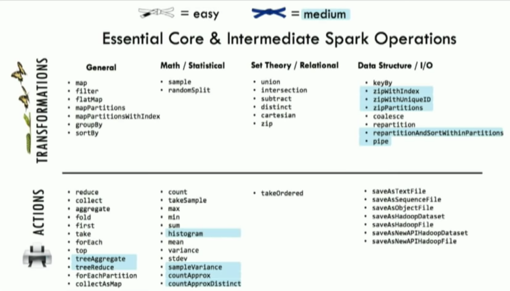
 

### Why RDDs?

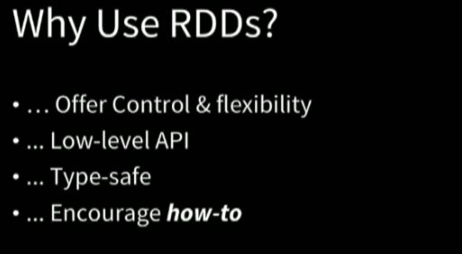
 

An example: Pick most popular wiki pages in english language

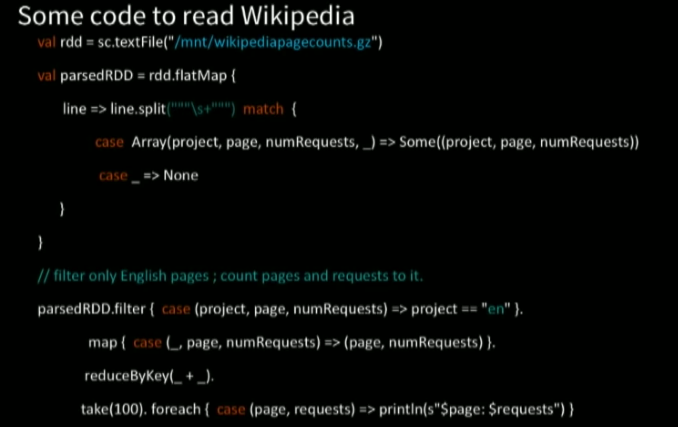
 

### When to use RDD

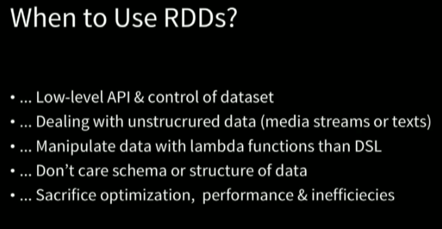
 

### What's the problem of RDD

Spark don't look into lambda functions, and he don't know what's the data

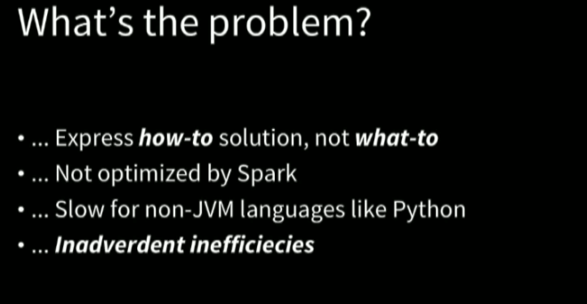
 

Inadvertent inefficient example -> reduceByKey first then do filter.  reduceByKey will take all data and shuffering the data

### What's inside RDDs

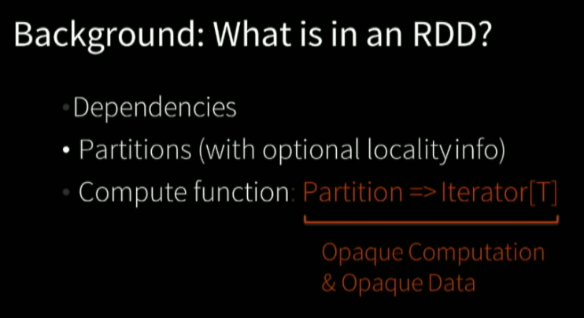
 

Functions with RDD, spark don't know what it is.   
Spark will serialize the code and send which to executor.   

## DataFrames & DataSets

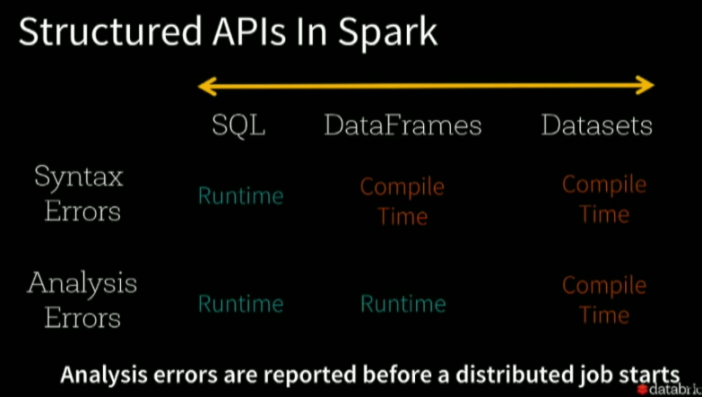
 

- DataFrame-> access non-exists colum, run time error
- Datasets-> similar to java.bin
- In Scala, data frame is dataset
- In java, there is no type, everything is dataset
- In python, there is only data frame

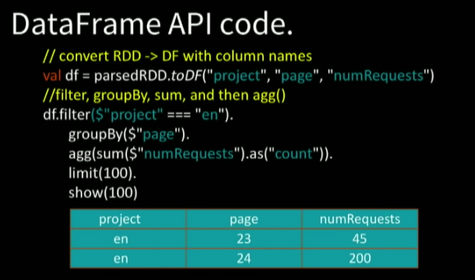
 

Comments: 
declarative column types
tell spark what to do, let spark to optimize

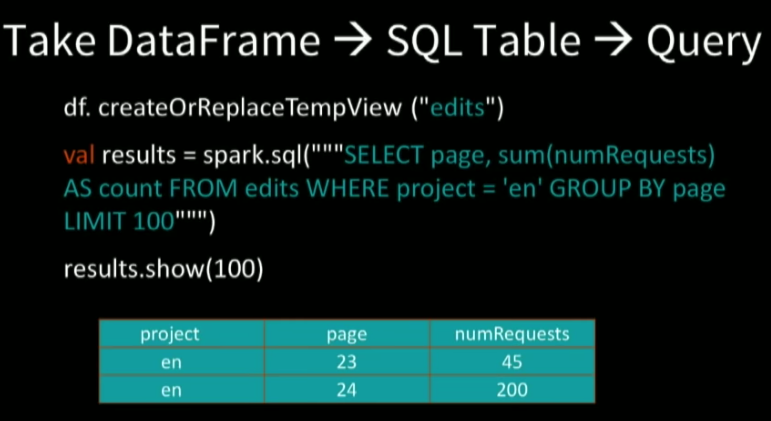
 
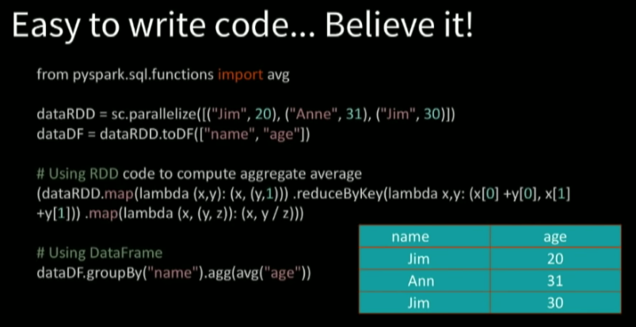
 

### Why structure APIs

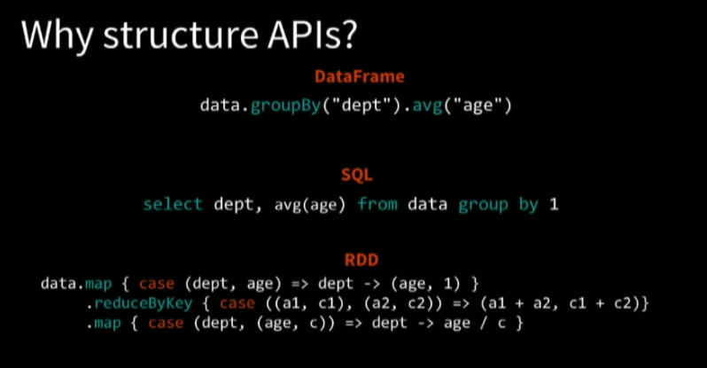
 

Structure gives the ability to do things in a declative matter, similar to database query

### Catalyst

spark_rdd_df_ds_2017_catalyst
1. Any query(sql, dataframe, dataset) will create unresolved logical plan
2. Then check for `catalog` to see which column you are referring to
3. Then create logical plan and optimized on
4. Create lots of physical plans and ranking them
5. Selected
6. RDD -> everything in spark will go into RDD

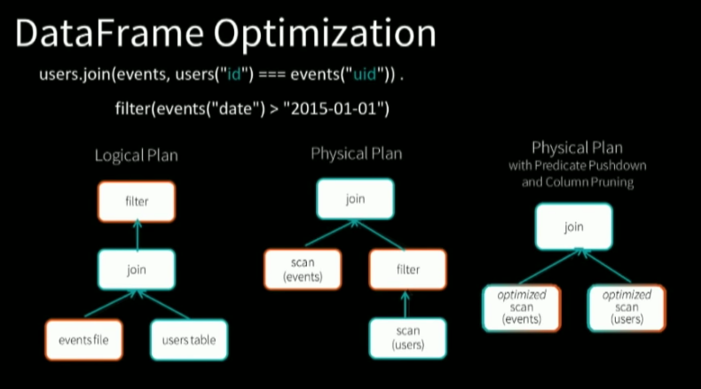
 

Step 3:   
- scan is operate on database  
- event could coming from parquet file  
- Push filter to lower level which is more efficient on operation  
- Bring less data to spark  

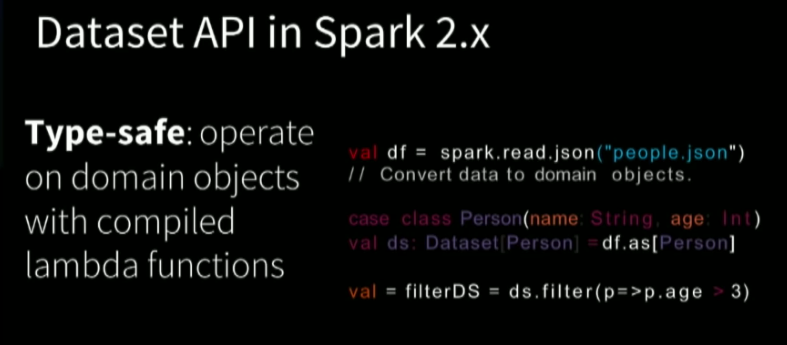
 

### Why & When

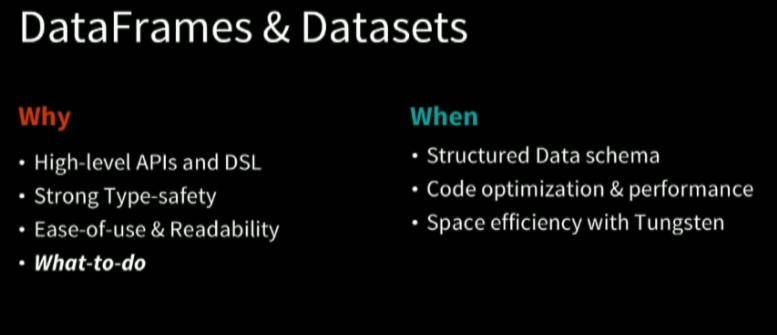
 

