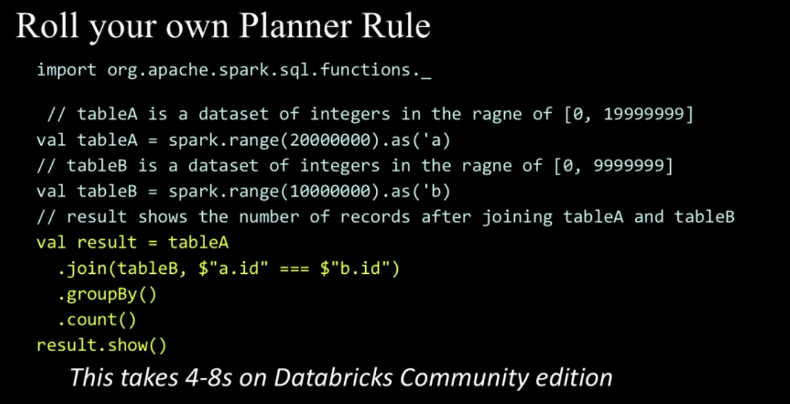
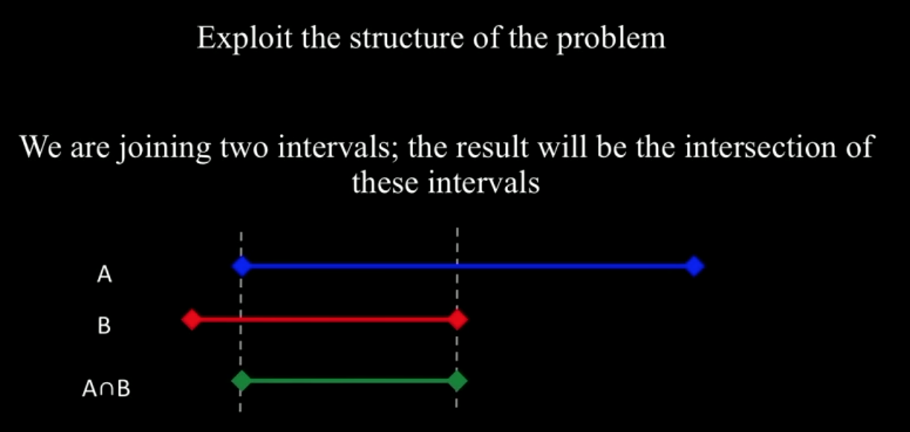
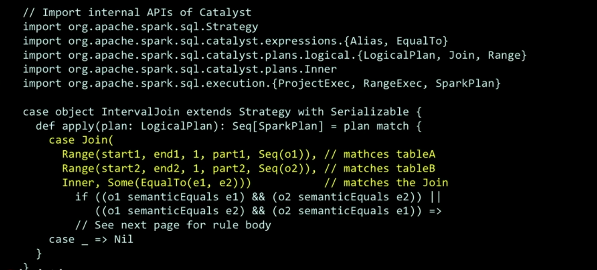
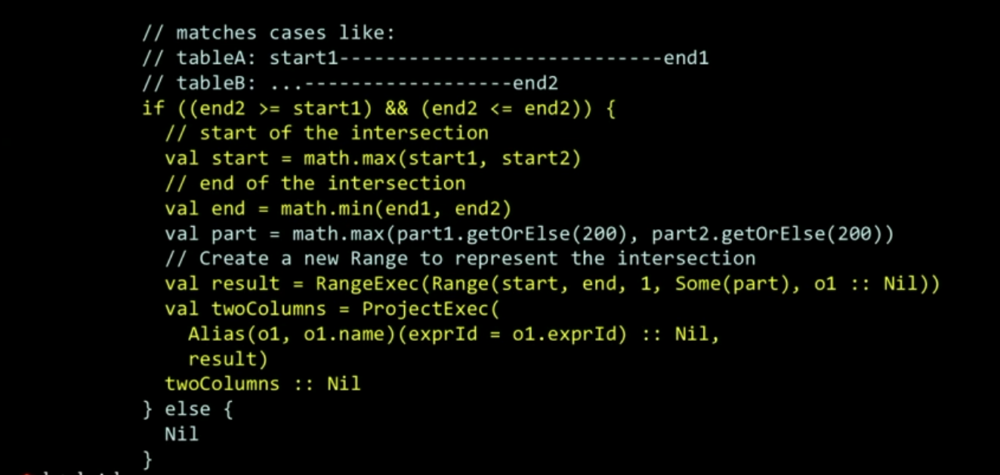
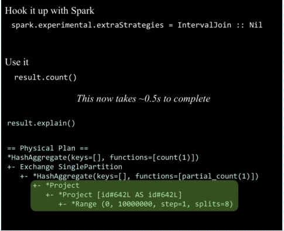

# A Deep Dive into Spark SQL's Catalyst Optimizer with Yin Huai

[video](https://www.youtube.com/watch?v=RmUn5vHlevc)

## Example 

### Original version

Analysis the query

### Optimized version

Write special rule to match the cases when we join intervals

 

The result:

