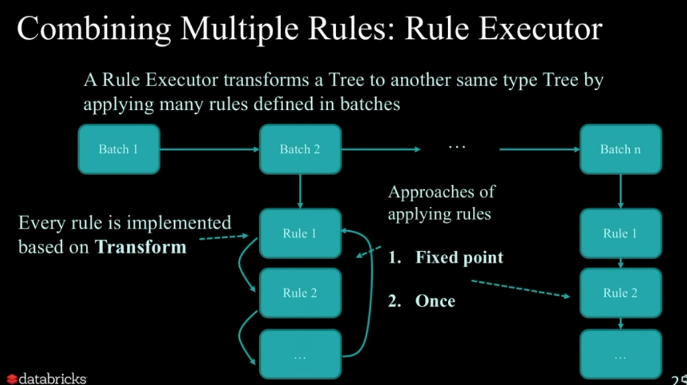
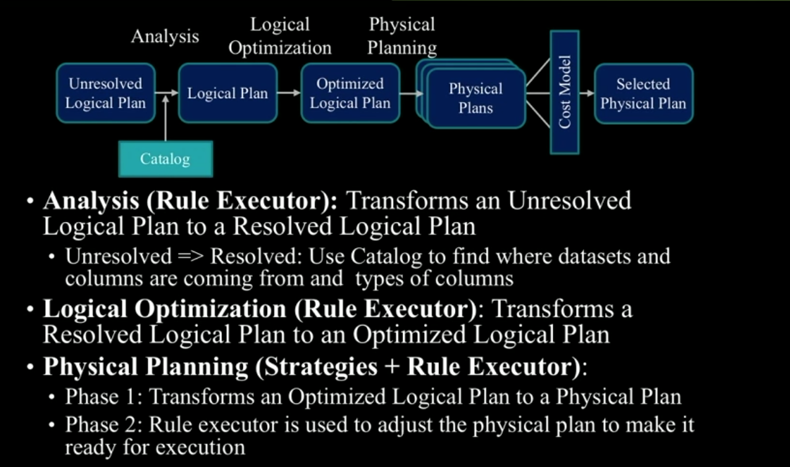

# A Deep Dive into Spark SQL's Catalyst Optimizer with Yin Huai

[video](https://www.youtube.com/watch?v=RmUn5vHlevc)


## Example 

### Original version


Analysis the query


### Optimized version

**Write a special query plan rule to match the cases when we join two intervals and calculate intersection directly and then put back to query plan.**


// high light code is the condition which triggers the rule:


<br/>


The result:


## Deep Dive

### Why structure API

- Structure will limit what can be impressed -> enable optimizations
- In practice, accommodate the vast majority of computations


### How to take advantage of optimization opportunities?

```
Get an optimizer that automatically finds out
the most efficient plan to execute data
operations specified in the user's program
```

### Trees

abstraction of users programs

#### Expression


#### Query plan


Expression -> new value  
Query plan -> new dataset  
Query plan use one or more expressions


#### Transformation


A `transformation` is defined as a partial function, which is a function that is defined for a subset of its possible arguments.


#### Optimization

// predicate pushdown: t2.id>50000 only apply to t2


// column pruning: only need 3 columns: from t1: column id and value, from t2: column id  
// reduce IO cost(column data format)


// combine rules


Rule executor to combine multiple rules  

Two strategy to apply rule  
Fixed point: apply rules to batch again and again, until the tree is not changed anymore   
Once: apply all the rules to the same batch just once, get them all trigger  



#### Physical plan


## Overview



