# Structuring Apache Spark 2.0: SQL, DataFrames, Datasets And Streaming
by Michael Armbrust [video](https://www.youtube.com/watch?v=1a4pgYzeFwE&t=54s)

## Why not RDD

### What is a RDD

 

- when you call rdd, it will return you an iterator
- data itself is serializer to obejct from byte array, or reversely, can't look specific column, change to uncompressed, etc
- optimization is limited

### What Structure
Define **common pattern** of the data analysis, let you describe your computation in that way, like join, select, etc.

### Why Structure

 

### DataSet

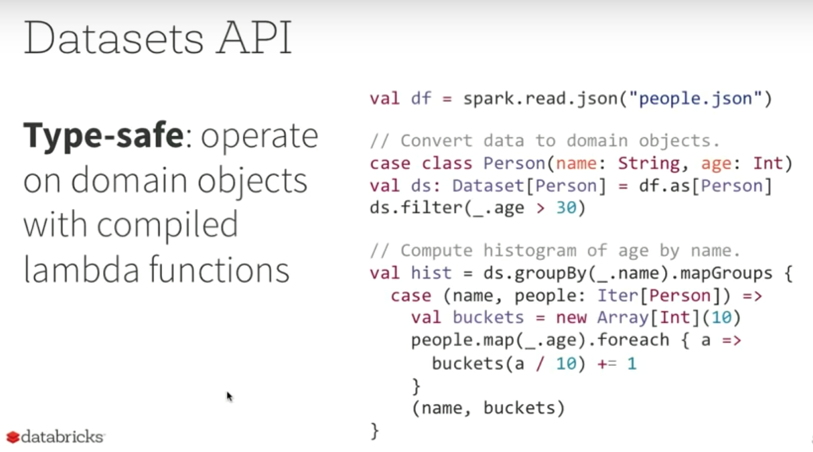
 

Scala's type safe class or Java's javabins

### DataFrame

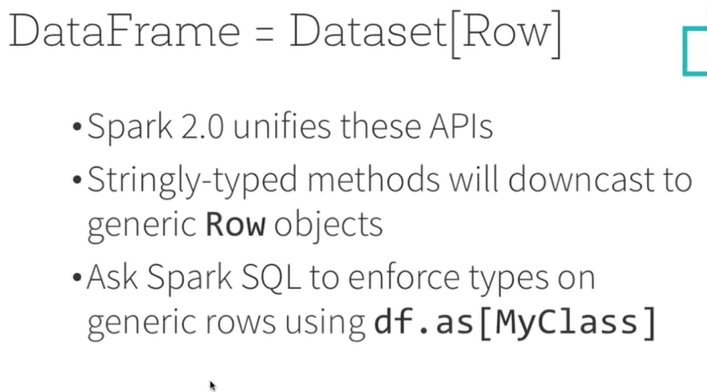
 

**User don't know the row ahead of time, you don't want to compile the object to hold your data**

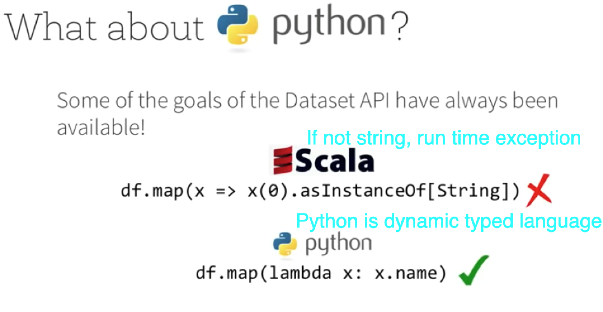
 

## Structured Spark Internal

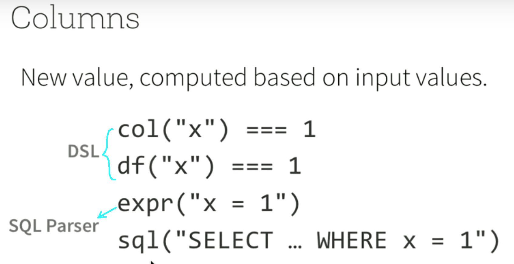
 
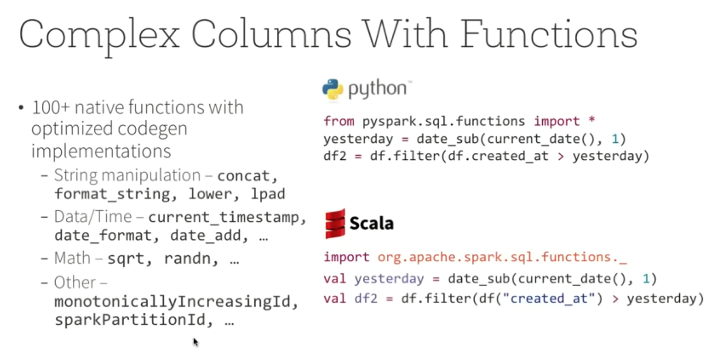
 
 
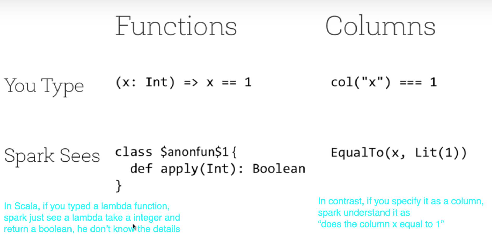
 
 
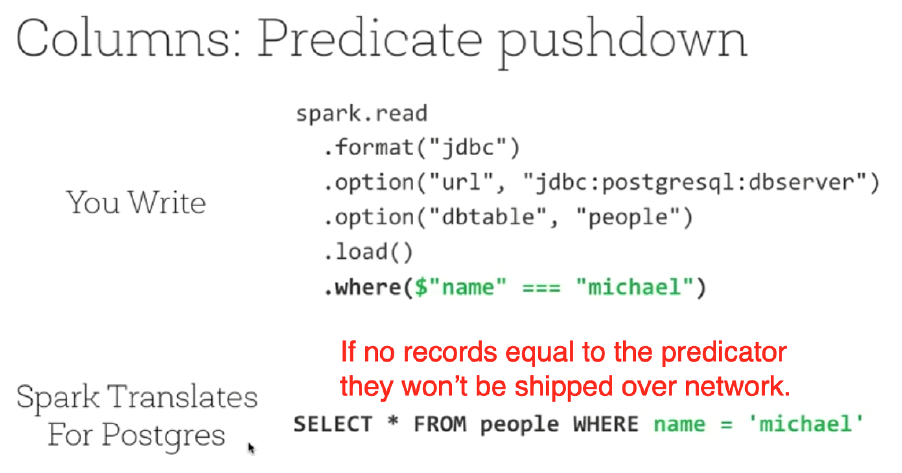
 
 
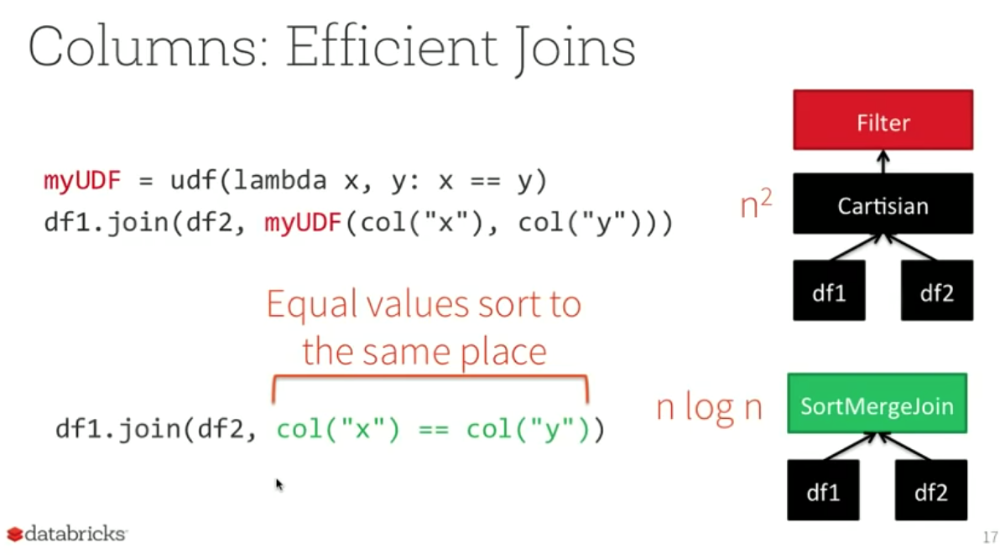

- Hash partition the data over cluster using a shuffle
- Make sure both side have a hash table
- Merge sort will result in the complexity of nlogn
- Spark take a giant dataset and sort it, if the column is the same they will be sort to the **same place**

## Data model
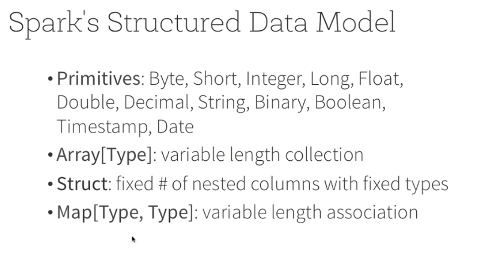
 

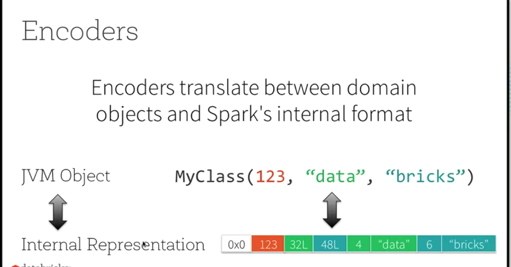
 

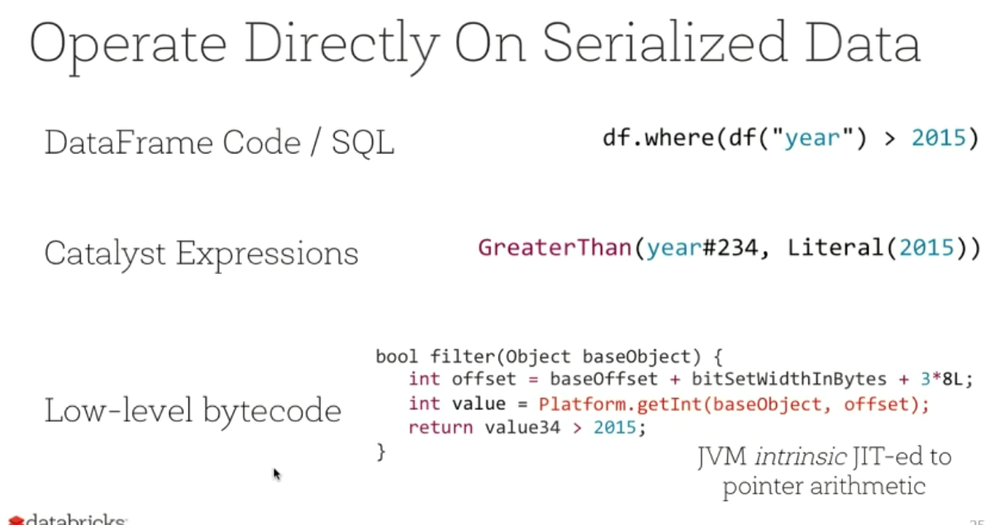
 

**Spark knows where the data is and he will try to jump to the location when generating low level code, no need to construct entire object**

## Structured streaming

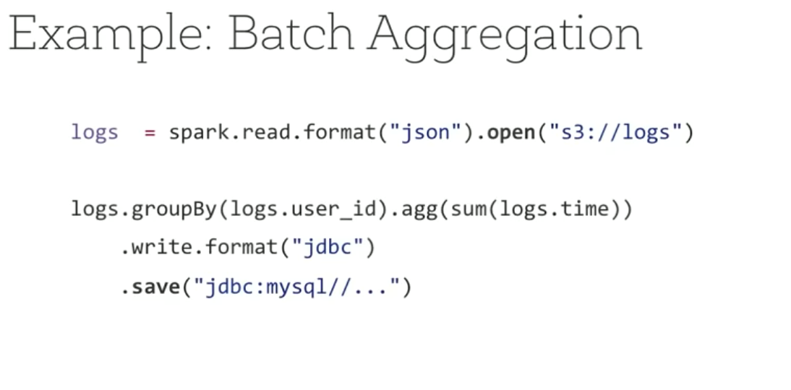
 

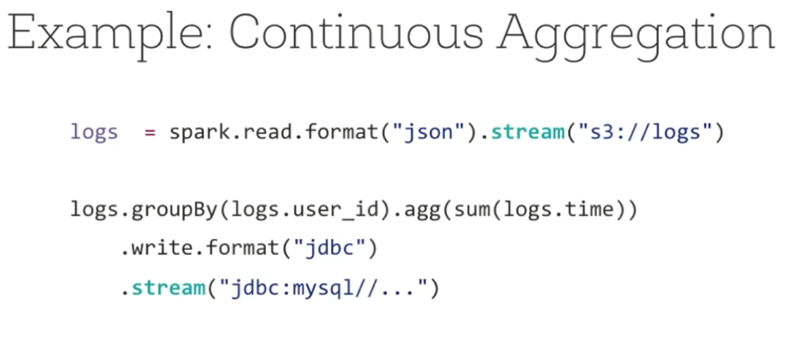
 

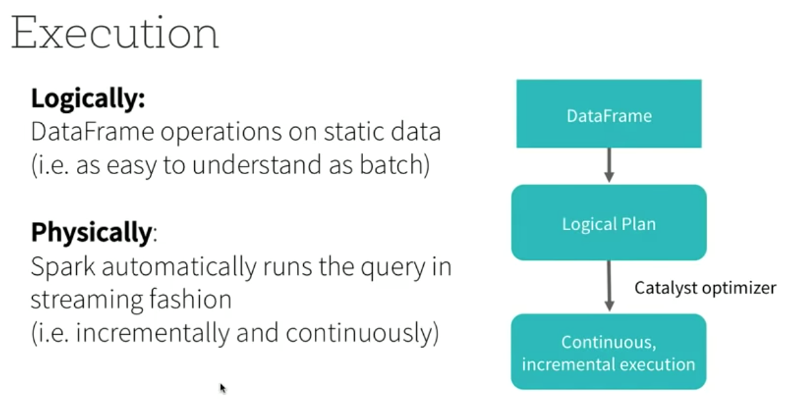
 

- Instead scanning file every time, spark will record the location of read index and only scan new data
- stateful aggregation: when aggregation data, will scan data you could see + previous scan result
