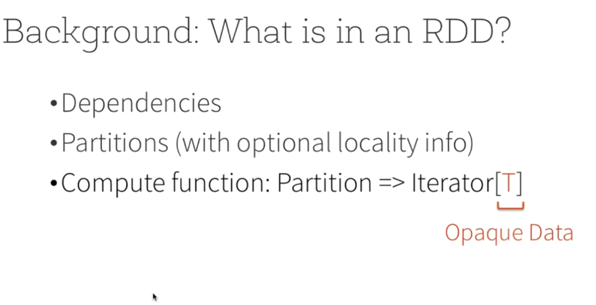
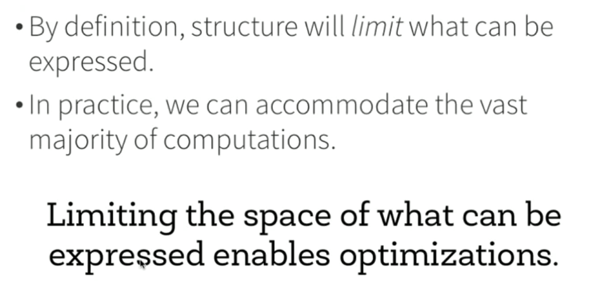

# Structuring Apache Spark 2.0: SQL, DataFrames, Datasets And Streaming
by Michael Armbrust [video](https://www.youtube.com/watch?v=1a4pgYzeFwE&t=54s)

## Why not RDD

### What is a RDD

 

- when you call rdd, it will return you an iterator
- data itself is serializer to obejct from byte array, can't look specific column, uncompressed, etc
- optimization is limited

### What Structure
Define common pattern of the data analysis, let you describe your computation in that way, like join, select, etc.

### Why Structure

 

