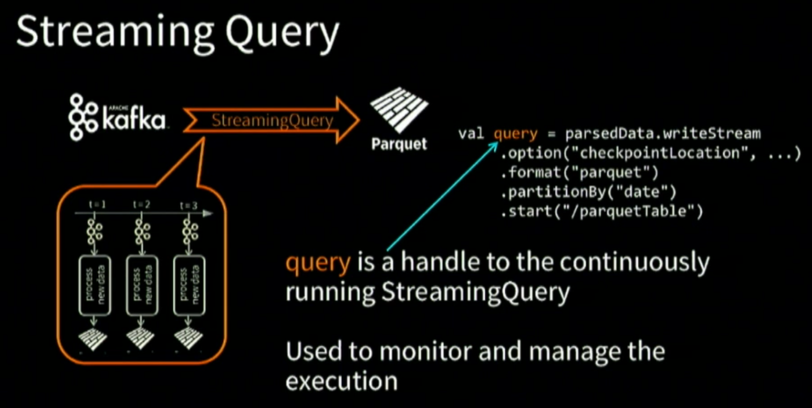

# Easy, Scalable, Fault Tolerant Stream Processing with Structured Streaming in Apache Spark

[Spark Summit 2017 session](https://databricks.com/session/easy-scalable-fault-tolerant-stream-processing-with-structured-streaming-in-apache-spark)

Question: How spark continuously update query result?

## High level overview

Example: Streaming word count

### Step 1

define source, here input is kafka

### Step 2

Convert records into string as key and count number of each key

### Step3

What to do with final wordcount -> define sink

### Step 4

When -> how you want it to be executed

### Step 5

Fault tolerant

**compatible**

## Details

Traditional way of design complex streaming ETL

Issue: for data to be usable, it takes hours, long time

### How

Another example

Raw data -> Dataframe, a collection of row

3 steps:  
1. cast to string, then into json format  
2. json string to nested columns  
3. flatten:nested -> un-nested  

=> powerful build-in APIs to perform complex data transformations
https://docs.databricks.com/_static/notebooks/transform-complex-data-types-scala.html

Return a handle to streaming query

How parquet table is updated incrementally?  My understanding is parquet file is partitioned by time, `parseData`'s result will continuously, small patch by small patch, append to certain parquet file.   

More info:  
https://databricks.com/spark/getting-started-with-apache-spark/streaming

### Play with Time

#### Event time

**Windowing is another kind of grouping**

#### How to aggregate

Important slide:  

- Inside spark, there is running aggregation going on for every window.
- To keep this aggregations alive across micro baches
- Keep state for every trigger in distrubute env
- State record in excutor's memory, write-ahead log, including check point location 

### Watermarking

- How long to keep each window open? 
- Limit the size of state to be aggregate
- System keep on tracking `max event time`(most latest)

How late data do you want

### 3 time to be distinguish

