- [Uber's big data platform](#ubers-big-data-platform)
  - [Problem set](#problem-set)
  - [Gen0](#gen0)
  - [Gen1](#gen1)
    - [Target](#target)
    - [Details](#details)
    - [Data scale](#data-scale)
    - [Limitation](#limitation)
  - [Gen2](#gen2)
    - [Target](#target-1)
    - [Data scale](#data-scale-1)
    - [Limitation](#limitation-1)
  - [Gen3](#gen3)
    - [Target](#target-2)
    - [Update/Delete challenge](#updatedelete-challenge)
    - [Details](#details-1)
      - [HUDI](#hudi)
      - [Generic data ingestion](#generic-data-ingestion)
      - [Incremental data modeling](#incremental-data-modeling)
      - [Standardized data model](#standardized-data-model)
    - [Data scale](#data-scale-2)
    - [Ongoing effort](#ongoing-effort)
  - [Lessons learned](#lessons-learned)
  - [More info](#more-info)

# Uber's big data platform

[Article](https://eng.uber.com/uber-big-data-platform/) - [Video](https://www.youtube.com/watch?v=YxlmgwHJaqw) 

## Problem set

Uber data team's user:

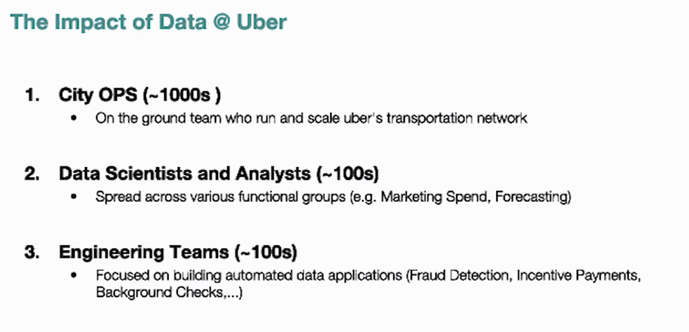

## Gen0

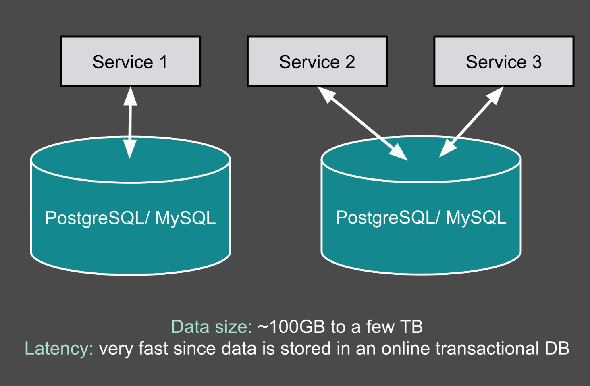

data recorded in different transaction database, no global view of data
data recorded as json
100GB ~ TB

## Gen1

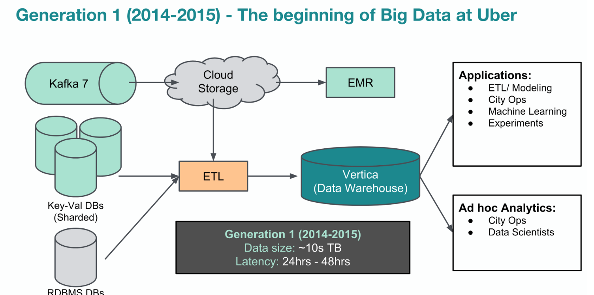

### Target 
- global view of data  -> all data in the same place -> EL load to Vertica
-  sql query  -> Vertica

### Details
- Event into Kafka7(no rep at that time), sharded DB, ad-hoc ETL job to extract data into Vertica
- All data into HDFS and recorded into parquet, based on which there is hive/presto/spark
### Data scale
10PB, 24 hour latency
### Limitation
- Data reliability concern due to ad hoc ETL jobs and lack of formal schema communication mechanism(most data in json format, when producer change format ingestion jobs need update)
- Vertica is good for data warehouse, but be used as data lake: piling up all raw data as well as performing all data modeling and serving the data
- High load for up stream data sources and data redundancy: The same data could be ingested multiple times if different users performance different transformations during ingestion. 
- Due to the use of flexible JSON format resulted in the lack of schema enforcement for the source data

## Gen2

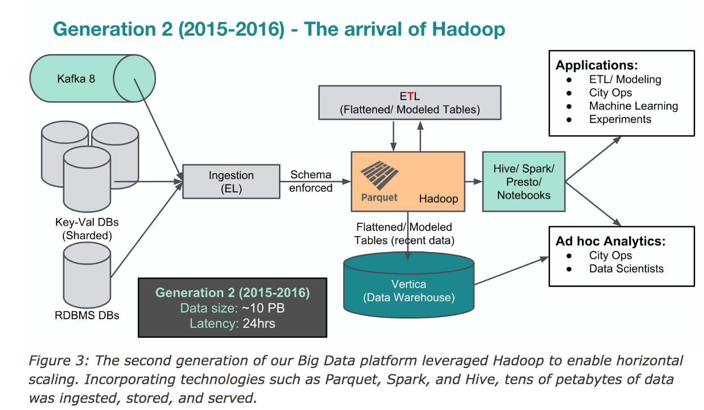

### Target 
- Hadoop ecosystem
	- Hadoop data lake: all raw data ingested from different online stores only once with no transformation during ingestion
	- Based on HDFS, introduce Presto(interactive ad hoc), Spark(programmatic access), Hive(extremely large queries)
- All data modeling and transformation only happened in Hadoop - scalable
	- All data services horizontally scalable(due to **parquet**, spark, hive, kafka8)
- Central schema service
	- ad hoc data ingestion jobs were replaced with a standard platform to transfer all source data in its original, nested format into the Hadoop data lake

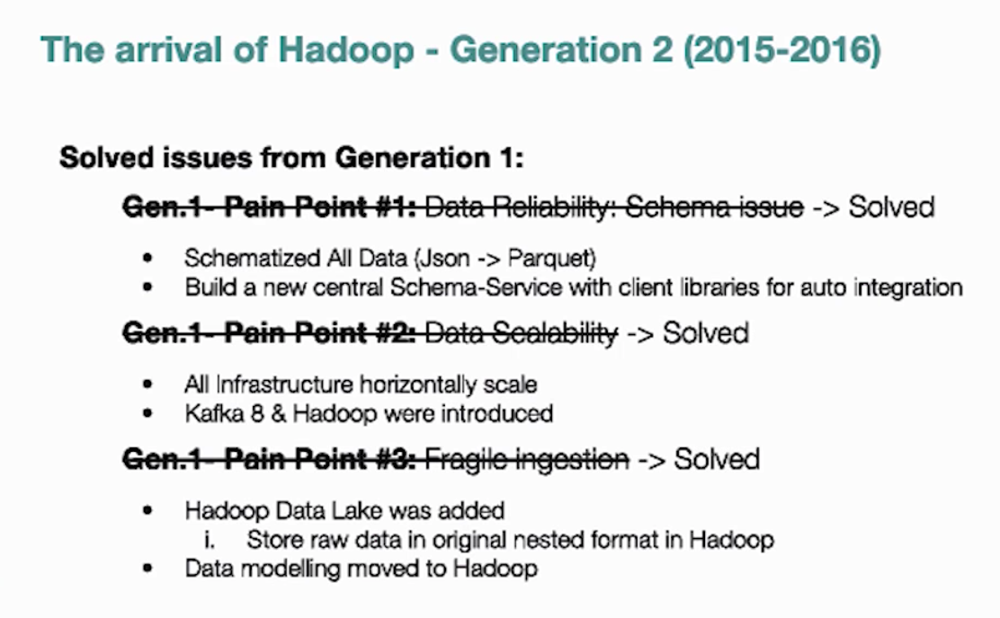

### Data scale
~10 PB in HDFS, ~10TBG/day new data, ~10k vcores, ~100k daily batch jobs, 

### Limitation
- Massive amount of small files in HDFS
- parquet data update is hard
- ETL and modeling jobs become bottle neck
	- These jobs had to rely on snapshot-based ingestion of the source data because of the high ratio of updates on historical data.
	- Uber's data contains a lot of update operations -> all integration jobs needed to create new snapshots from the updated source data -> ingest the new snapshot into hadoop -> covert it into Parquet format -> swap the output tables to view the new data
- Data latency too high(over 24hours)
	- Snapshot based ingestion results in 24hrs data latency

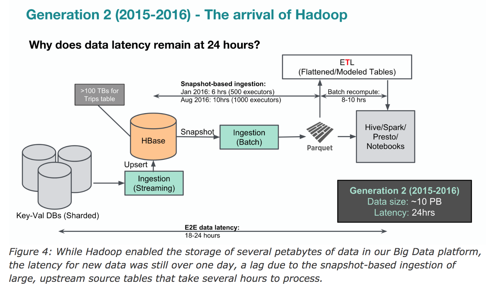

## Gen3

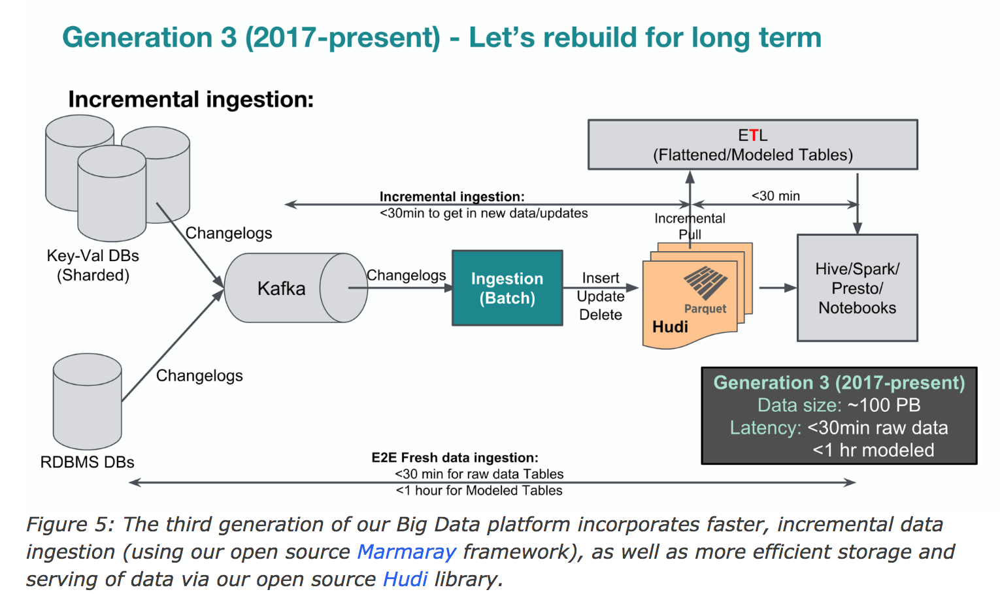

### Target
- HDFS scalability limitation
   - Name node will always be the bottleneck -> sharednamenode
   - Small files are the killer
   - Benefit from viewfs and federation to scale
- Faster data in Hadoop
- Support for updates/deletes in hadoop/parquet
  - Need to support update/deletion during ingestion of incremental changelogs
  - Uber's data has large number of columns with nested data support -> Parquet
- Faster ETL/modelling
	- ETL need incremental too
	- Need allow users to pull out change only

### Update/Delete challenge

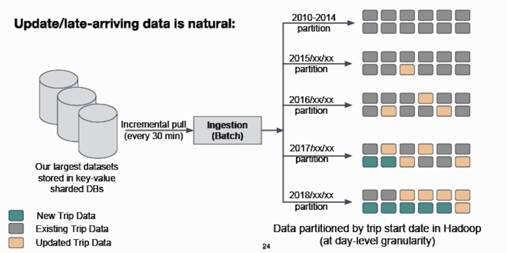

You might give review a month later.  Then related Parquet file need to be updated, entire file need to be loaded and re-written.  

Raw data in our Hadoop ecosystem is partitioned based on time and any of the old partitions can potentially receive updates at a later time.

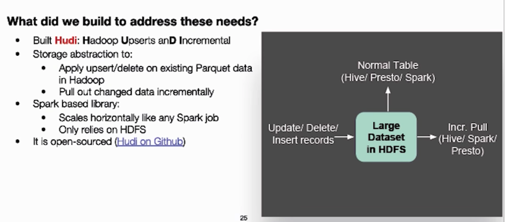

### Details

#### HUDI

- Why HUDI is needed
	- Data partitioned based on date, but Uber has a long tail of all data could be modified
Due to that then invent hudi
	- any Big Data platform that needs to support update/delete operations for the historical data can leverage Hudi.
- Hudi enables update, insert and delete existing Parquet data in Hadoop, allows data users to incrementally pull out only changed data

- With Hudi, snapshot-based ingestion of raw data changed to an incremental ingestion model

#### Generic data ingestion

- Changelogs into Kafka, use Hudi to deal with incremental changes
- Upstream datastore events (as well as classic logging messages from different applications and services) stream into Kafka with a unified Avro encoding including standard global metadata headers attached (i.e., timestamp, row key, version, data center information, and originating host). 

#### Incremental data modeling
The use of a Hudi writer during an ETL job enables us to update old partitions in the derived modeled tables without recreating the entire partition or table.  Thus, the modeling ETL jobs use Hudi readers to incrementally fetch only the changed data from the source table and use Hudi writers to incrementally update the derived output table.

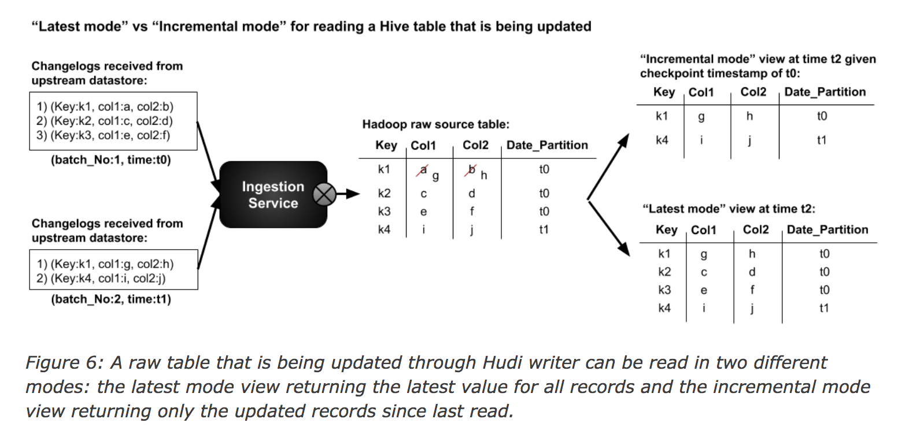

- When usersrun an ad hoc query to analyze data based on the latest state, they use the latest mode view of the table (e.g., to fetch the total weekly number of trips per city in the U.S.)
- when a user has an iterative job or query that needs to fetch only changed or new records since its latest execution, they use the incremental mode view

#### Standardized data model

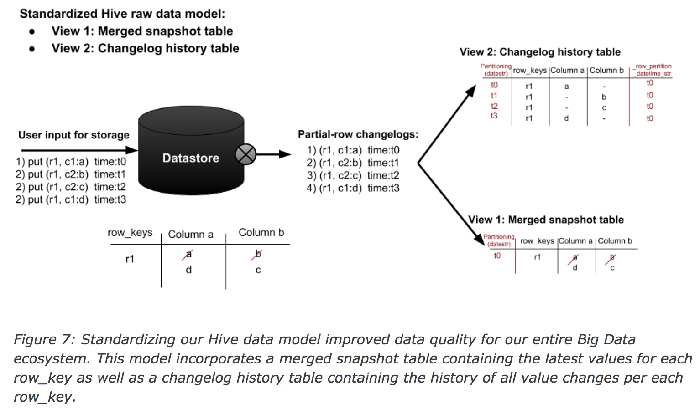

Merged snapshot table contains all columns data, plus data from changelog history table from new timeline which might only contain changed roles could efficient create up-to-date data.a

### Data scale
100 petabytes of data in HDFS, 100,000 vcores in our compute cluster, 100,000 Presto queries per day, 10,000 Spark jobs per day, and 20,000 Hive queries per day

### Ongoing effort
- Data quality
	- Unification of hadoop ingestion with strict contract with storage team in uber
	- Expand schema-service beyond type/structural check and into **semantic checks**
- Faster data access
- Efficiency is the next big monster
	- Unified resource scheduler
- Hoodie (copy-on-write)

## Lessons learned

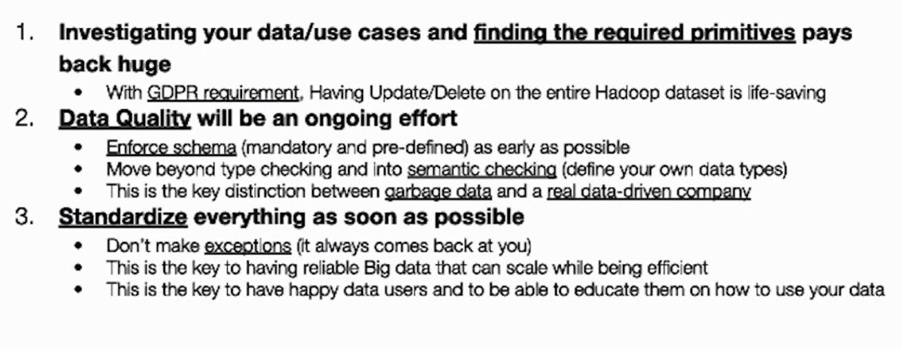

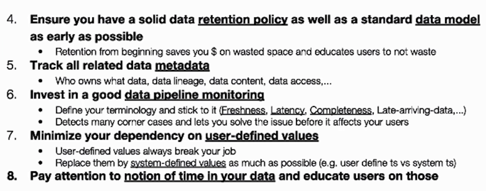

## More info
- Data lake vs Data warehouse

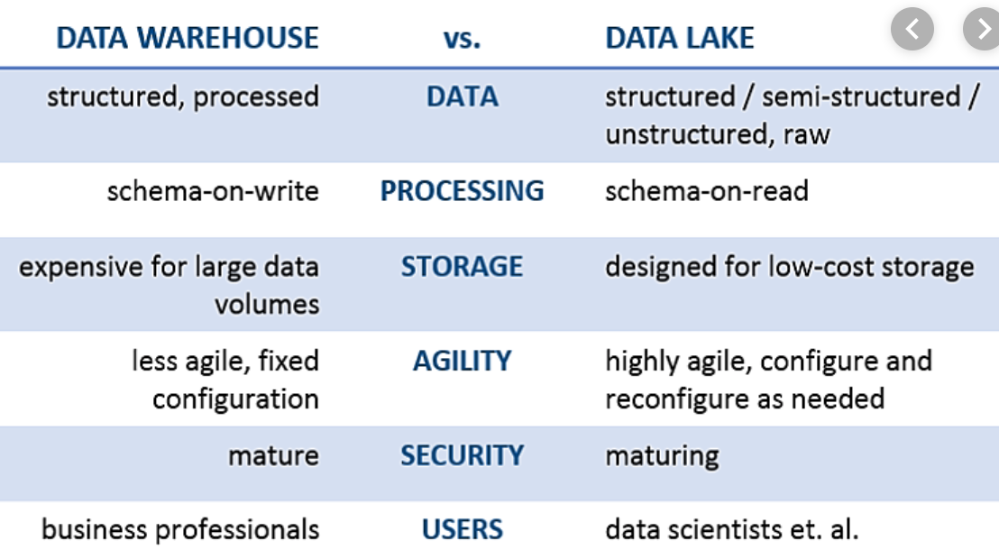

- [4年数据涨万倍，Uber大数据平台四次变迁揭秘](https://mp.weixin.qq.com/s/ac_uaaG25k_zGdDF-LibQw)

- [Hudi: Uber Engineering’s Incremental Processing Framework on Apache Hadoop](https://eng.uber.com/hoodie/), [中文](https://www.jianshu.com/p/1ae2db40f43e)

- Hadoop Infrastructure @Uber Past, Present and Future, [video](https://www.youtube.com/watch?v=37u1fBkp9vE), [slides](https://events.static.linuxfound.org/sites/events/files/slides/Apache-Data-Uber-Mayank-Bansal.pdf)

- How Uber scaled its Real Time Infrastructure to Trillion events per day [video](https://www.youtube.com/watch?v=K-fI2BeTLkk)
