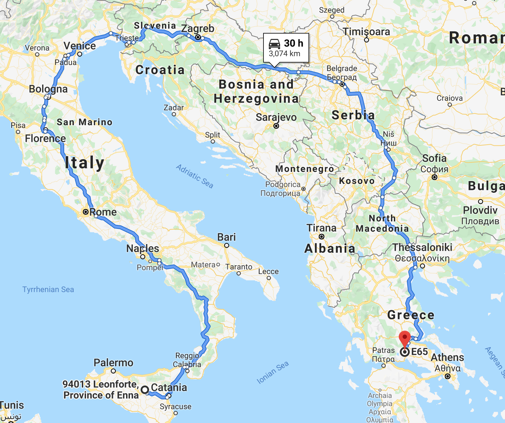
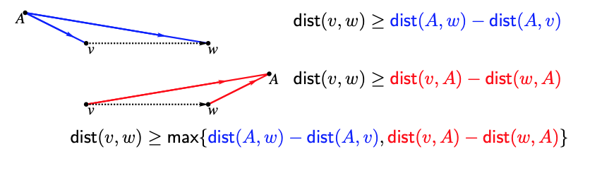
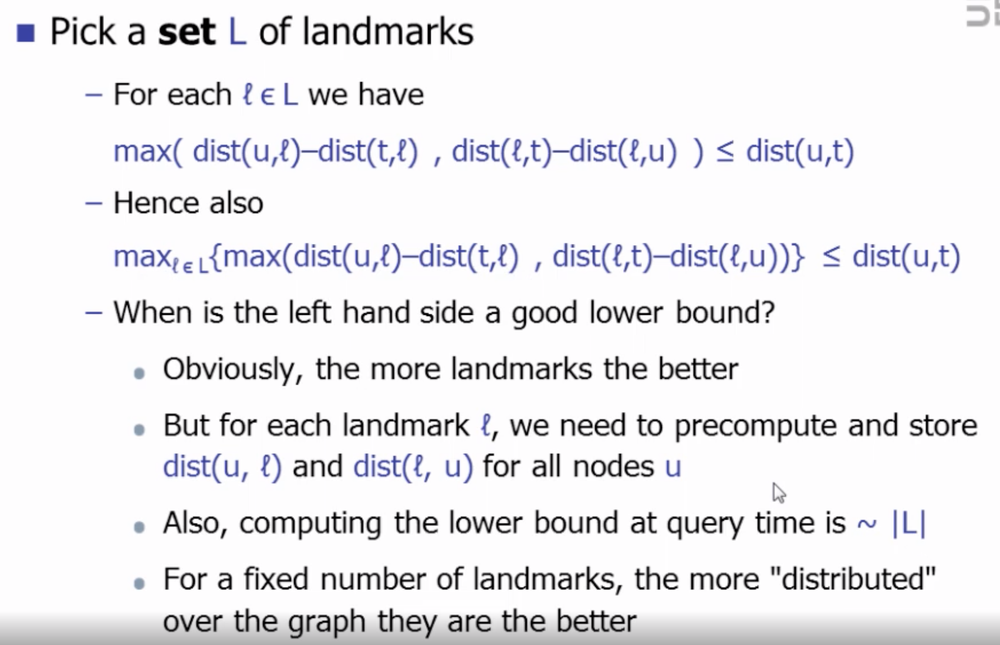
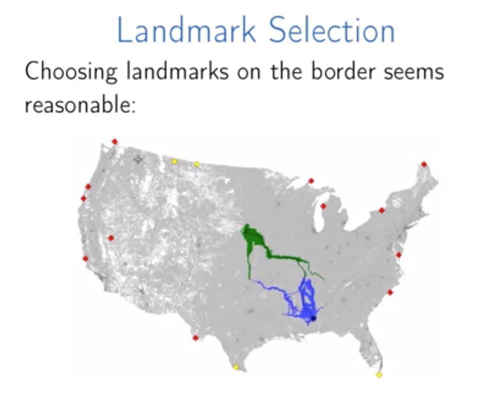
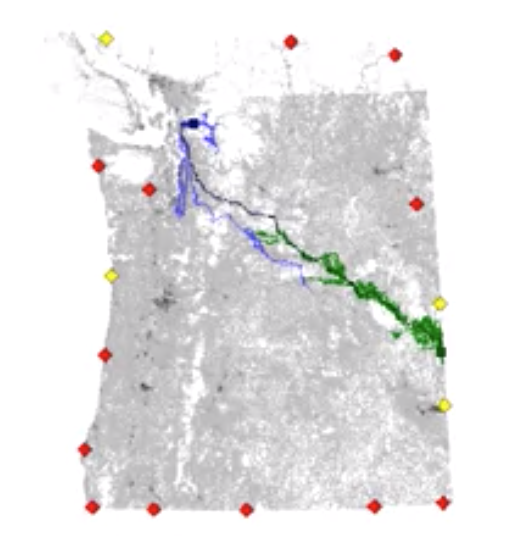
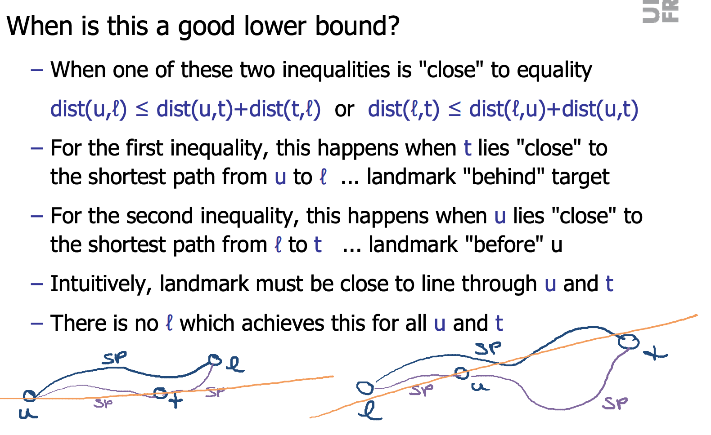
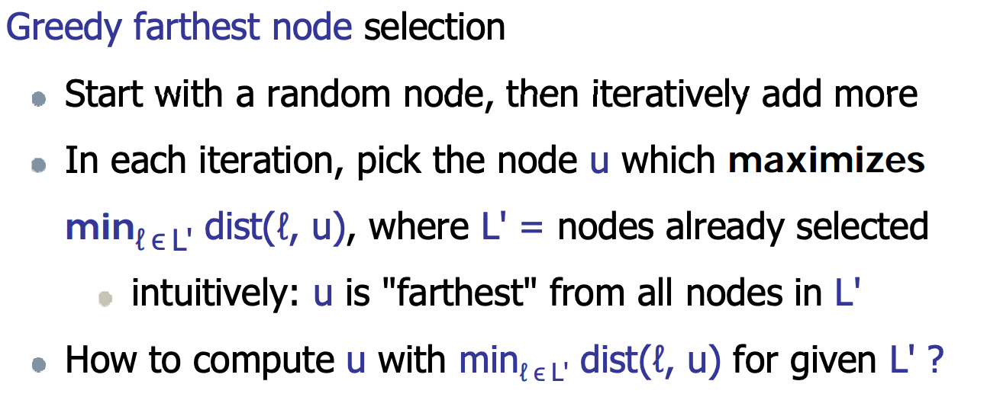
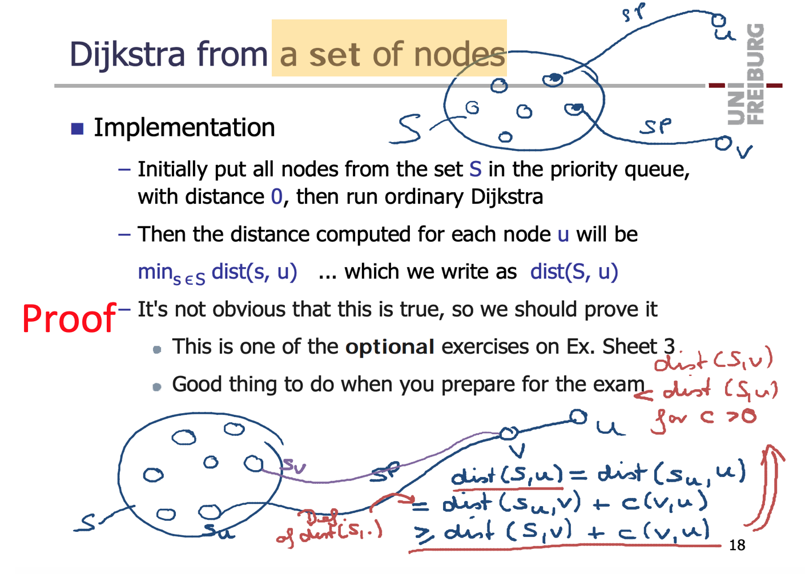

# ALT

ALT means Astar, landmarks and triangle-inequality.  
Landmarks could help to provide better hubristic for Astar.  

 
For goal directed hubristic(Euclidean distance), the upper case always be a trouble for routing.

## Algorithm
Pre-processing:  
Select a small number of vertices Landmarks (L)  
For all nodes v store distance vector d(v, l) to all landmarks(l belongs to L)  

Query:
h(u) = |dist(l, u) - dist(l, t)| <= dist (u,t)

- What is Triangle-inequality

 

- Multiple landmarks

 

- What are good landmarks
A good landmark appears “before” v or “after” w.

 

 

 

 

- How to select landmarks

 

 

- How to compute distance from all vertex to specific landmark  
Could get result in one dijkstra on reverse map
 

- How to compute distance from one vertex to a set of landmarks

 

## More info
- [Landmarks - Algorithms on Graphs - University of California San Diego](https://www.coursera.org/lecture/algorithms-on-graphs/landmarks-optional-h3uOb)
- [Landmark selection - On Preprocessing the ALT-Algorithm - Fabian Fuchs from KIT](http://www.fabianfuchs.com/fabianfuchs_ALT.pdf)
