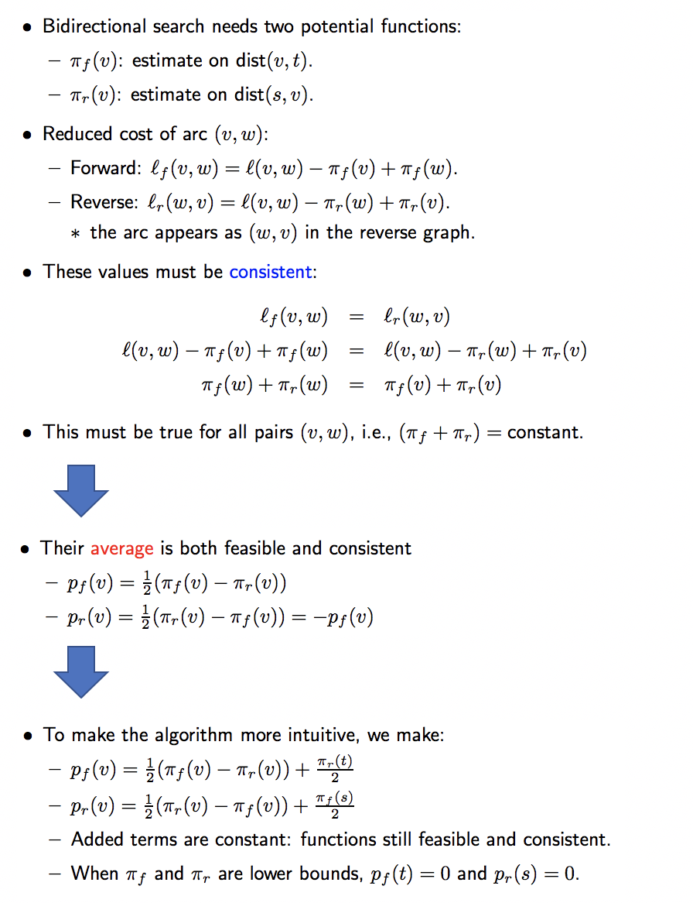
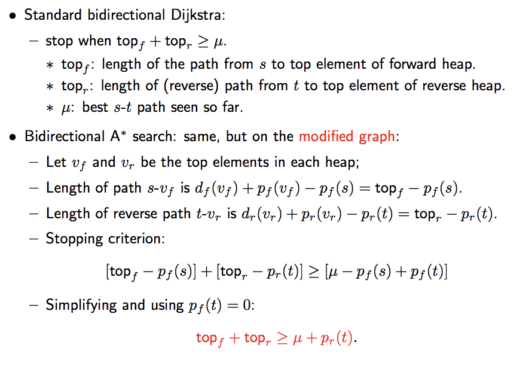
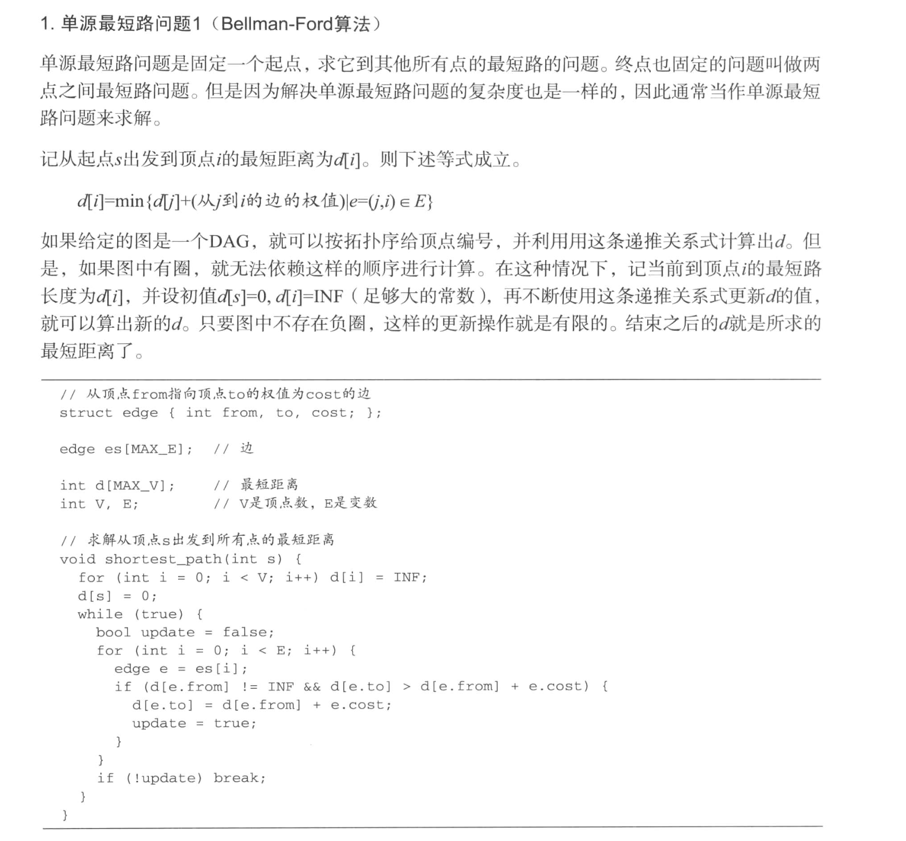
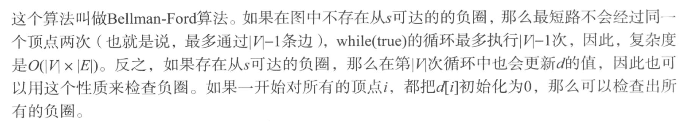
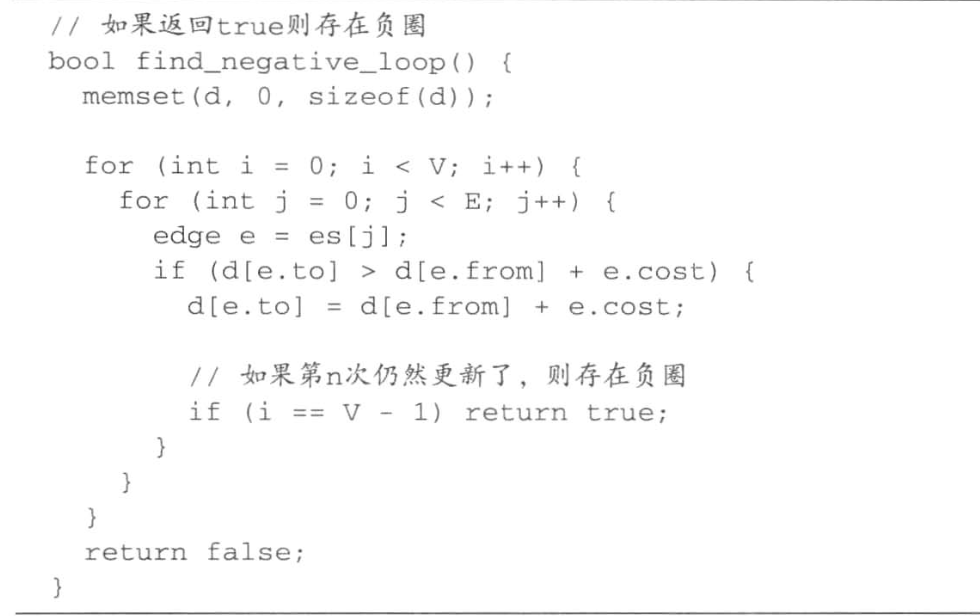
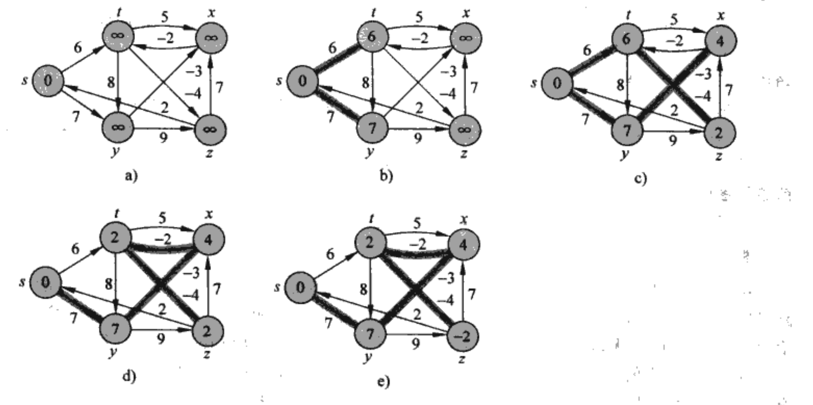

# Basic Routing Algorithms

Summary about basic routing algorithms, based on questions [here](https://github.com/Telenav/open-source-spec/blob/master/routing_basic/doc/routing_alg_questions.md)

## Dijkstra

- Grow a ball around s and stop when t is settled
- PQ + Hash map
- Algorithm detail


<br/>


- Complexity

  O(VNlogV) -> O(ElogV)  
  https://stackoverflow.com/questions/26547816/understanding-time-complexity-calculation-for-dijkstra-algorithm  

- Proof

- Difference between visited / settled

- pseudo code
```C++
do{
    Pop()
    UpdateData()
    Relax()
} while(Stop())
```


## Bidirectional Dijkstra
- Grow a ball around end(s and t) until they meet

- Unlike uni-direction dijkstra, first meet could not guarantee best solution:


<br/>

- Proof


<br/>

## A Star

- Goal directed, add heuristic, make the ball become ellipse

- Algorithm detail


<br/>

- Why is A* equivalent to Dijkstra on the modified graph?


<br/>


- Why is π(v) a lower bound on dist(v, t) when π is feasible and π(t)=0?


<br/>


- How to make sure l' is > 0
Triangle inequality ensures 


<br/>

- What's the meaning of Dijkstra's algorithm only explore the shortest path?
In extreme case, only edges on shortest path would pop-out.  
This could prove in ideal situation, why A* works.  
Let's assume in all vertex you record shortest path to t, so node on shortest path be pops because:  


<br/>


## Bidirectional A Star

- Make forward search and backward search consistent


<br/>

- Stop condition


<br/>


## Bellman Ford

 

<br/>

如果不是从起点开始 开始的loop是不是就浪费了?

Bellman Ford有这几个假设
1. 从起点到任何一个点的最短距离，顶多会经过n-1个端点(无环)  
2.相当于从起点一层一层往外推，每次更新一层的cost  

<<挑战程序竞赛>>


<br/>


<br/>


<br/>

<<算法导论>>


<br/>


## Fibonacci heap 

-  Why Fibonacci heap 
https://stackoverflow.com/questions/14252582/how-can-i-use-binary-heap-in-the-dijkstra-algorithm  
Heap data-structures have no way of getting at any particular node that is not the minimum or the last node!  
For specific node in heap, we might find a better path to him with lower cost
