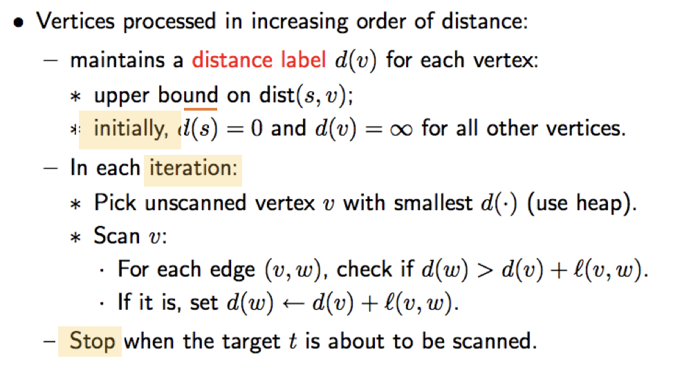
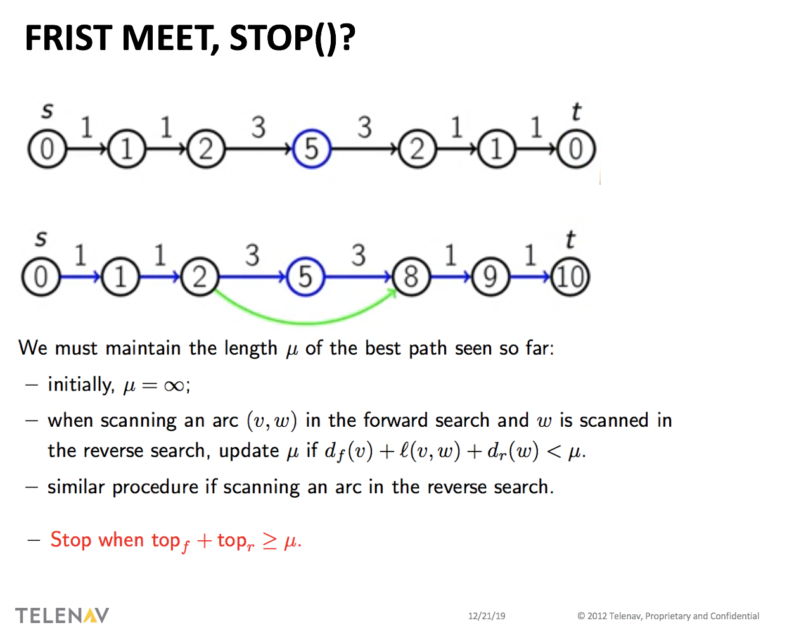
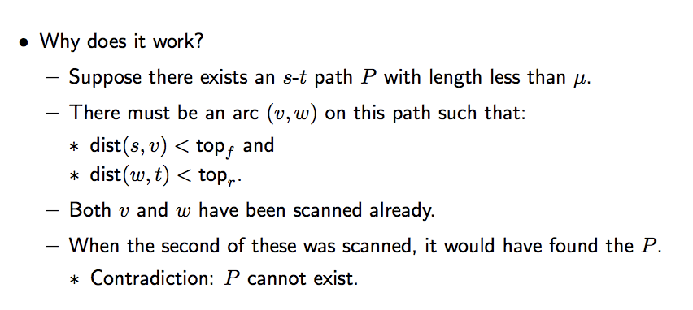
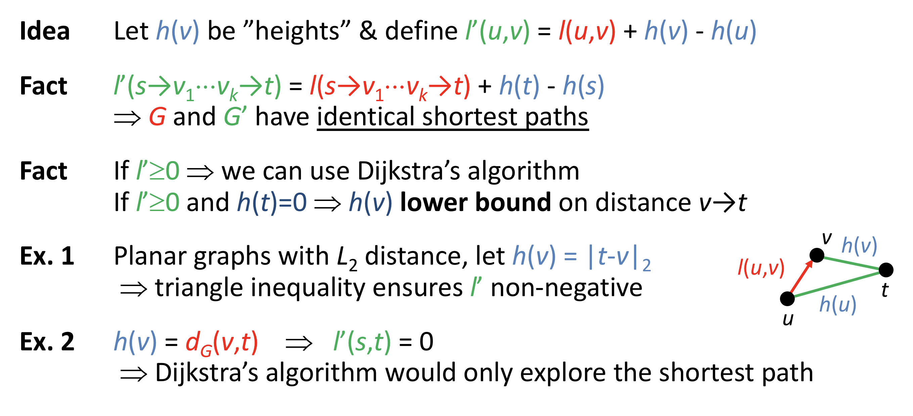
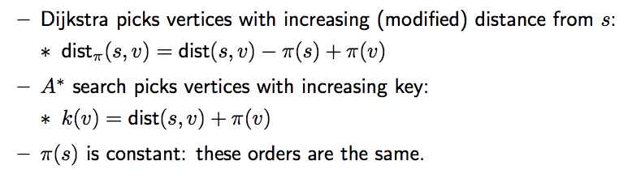
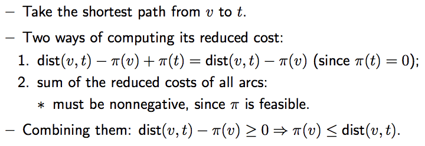
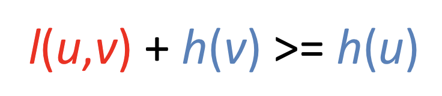
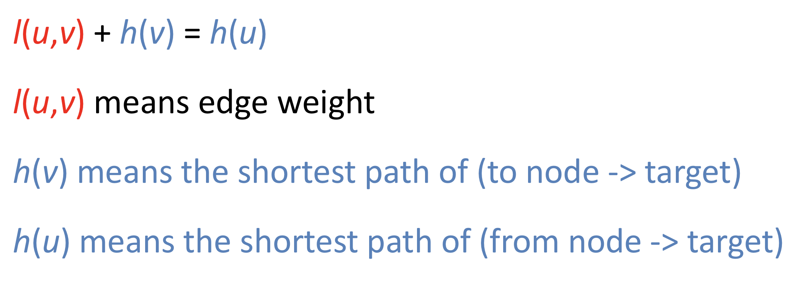

# Basic Routing Algorithms

Summary about basic routing algorithms, based on questions [here](https://github.com/Telenav/open-source-spec/blob/master/routing_basic/doc/routing_alg_questions.md)

## Dijkstra

- Grow a ball around s and stop when t is settled
- PQ + Hash map
- Algorithm detail


<br/>


- Complexity

  O(VNlogV) -> O(ElogV)  
  https://stackoverflow.com/questions/26547816/understanding-time-complexity-calculation-for-dijkstra-algorithm  

- Proof

- Difference between visited / settled

- pseudo code
```C++
do{
    Pop()
    UpdateData()
    Relax()
} while(Stop())
```


## Bidirectional Dijkstra
- Grow a ball around end(s and t) until they meet

- Unlike uni-direction dijkstra, first meet could not guarantee best solution:



<br/>

- Proof


<br/>

## A*

- Goal directed, add heuristic, make the ball become ellipse

- Algorithm detail


<br/>

- Why is A* equivalent to Dijkstra on the modified graph?


<br/>


- Why is π(v) a lower bound on dist(v, t) when π is feasible and π(t)=0?


<br/>


- How to make sure l' is > 0
Triangle inequality ensures 


<br/>

- What's the meaning of Dijkstra's algorithm only explore the shortest path?
In extreme case, only edges on shortest path would pop-out.  
This could prove in ideal situation, why A* works.  
Let's assume in all vertex you record shortest path to t, so node on shortest path be pops because:  


<br/>