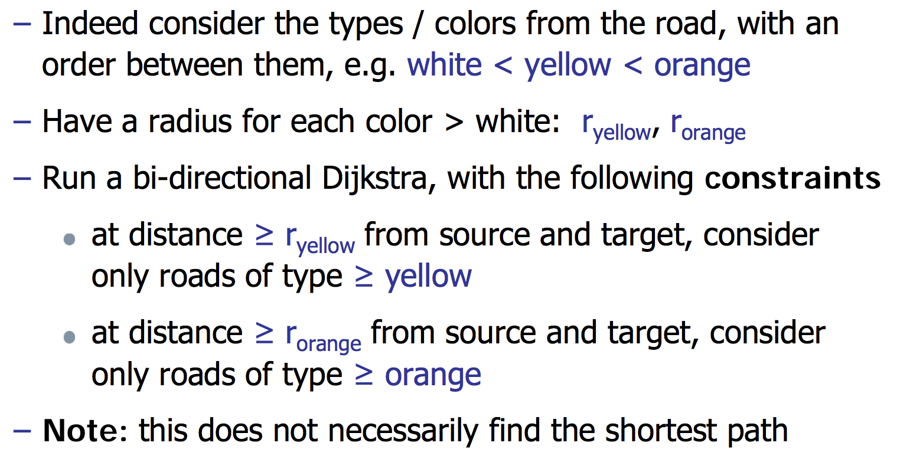
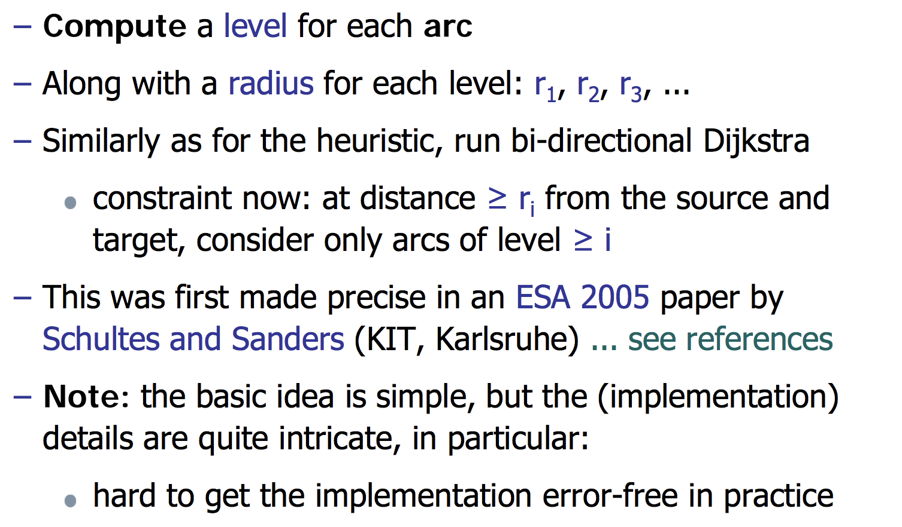
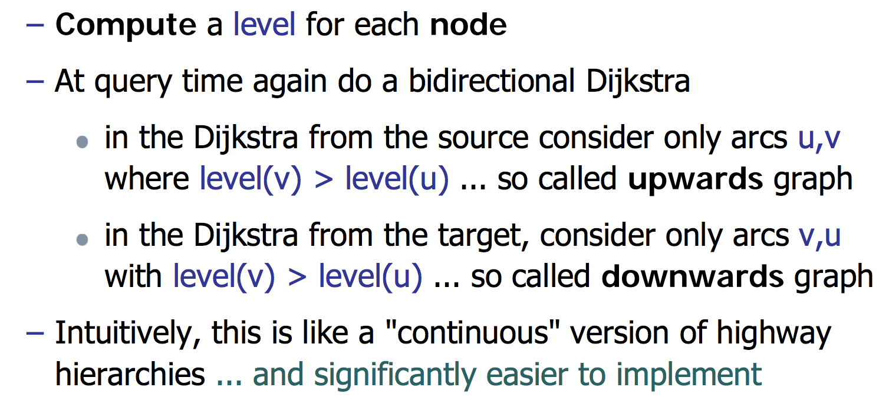
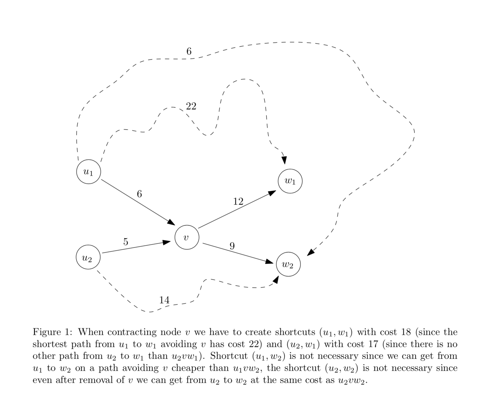
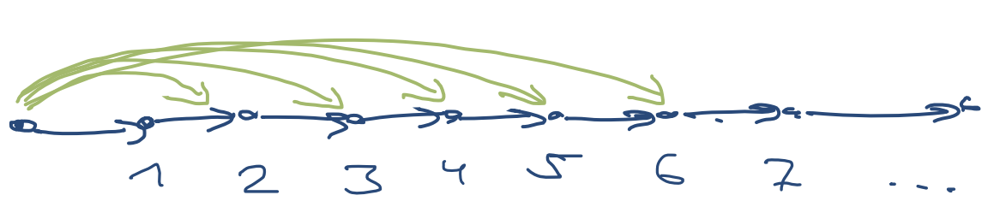
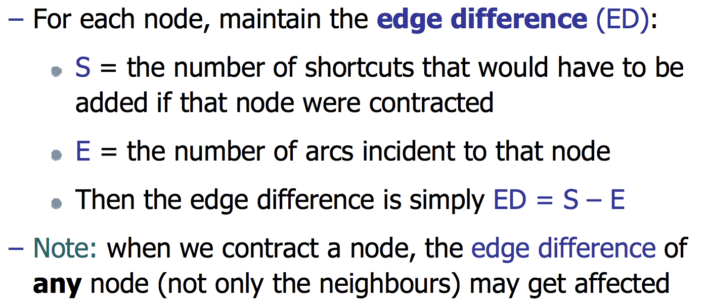
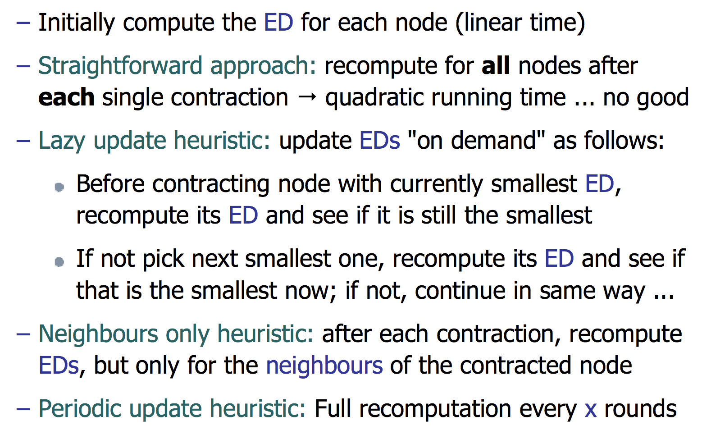
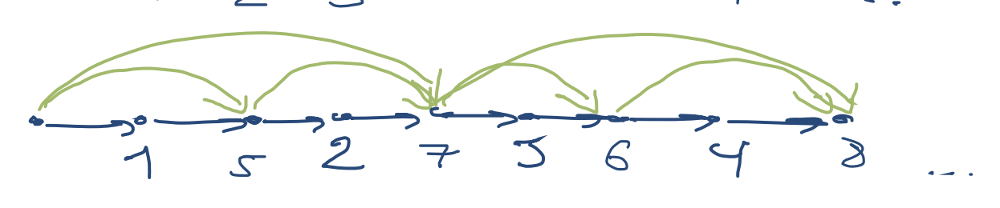
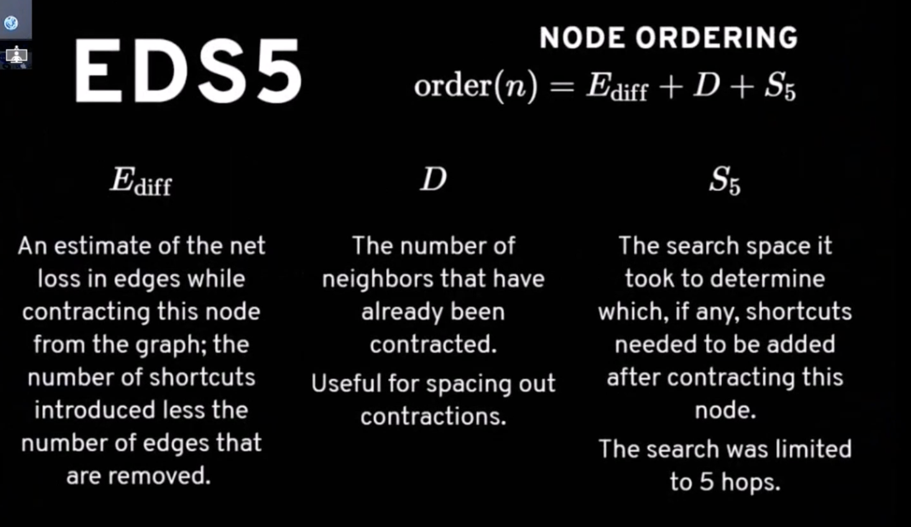
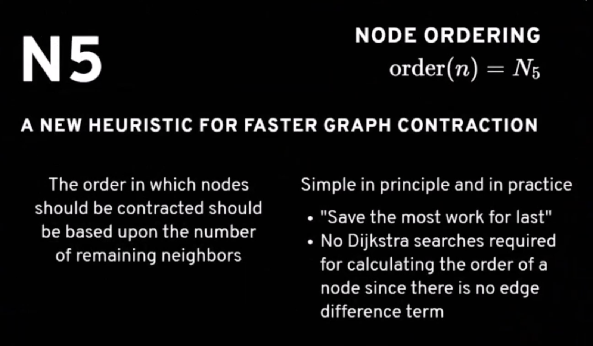

# Contraction Hierarchies

Pre select "important" nodes, during query time route to far away only use specific nodes.

## Hierarchical approach

### Basic intuition

Route selection on Google maps  
close to source and target: mainly white(local) roads  
a bit further away: mainly yellow(national/express) roads  
even further away: mainly orange(motorway/highway) roads

### Function class

 

### Highway Hierarchies

 

### Contraction Hierarchies

 

## How to contract

 

## Node Ordering

Node ordering is very important for CH's performance.  

Bad case:  

 

Maintain the nodes in a priority queue, in the order of how attractive it is to contract the respective node next  
The less shortcuts we have to add, the better  

## ED

 

 

### Spatial diversity heuristic
For each node maintain a count of the number of neig y hbours that have already been contracted, and add this to the ED.
**The more neighbours have already been contracted, the later this node will be contracted**

 

### EDS5

 

### N5

 

## More info
- [Contraction Hierarchies: Faster and Simpler Hierarchical Routing in Road Networks](http://algo2.iti.kit.edu/schultes/hwy/contract.pdf)
- [Contraction Hierarchies briefly explained](../resources/Contraction&#32;Hierarchies&#32;briefly&#32;explained.pdf)
- [Adaptive Routing on contracted graphs](https://www.youtube.com/watch?v=O74F-hpaKWM)
- [Contraction Hierarchies animation](https://www.mjt.me.uk/posts/contraction-hierarchies/)

