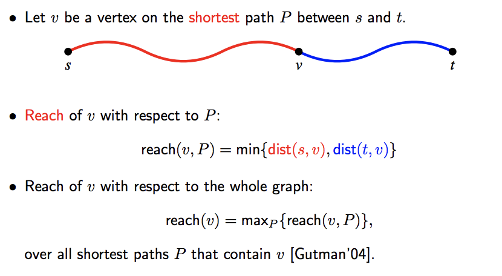
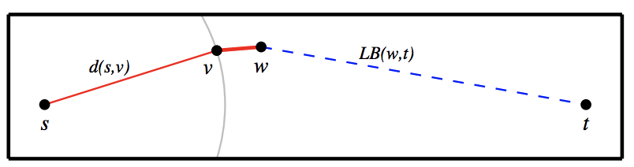
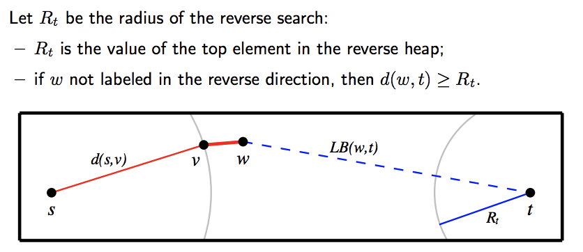
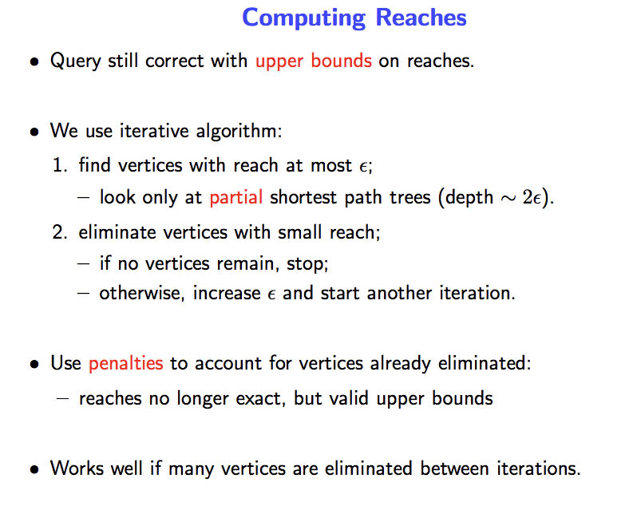

# Reach

Reach is a **pruning strategy**.  Reach value could help to filter un-reasonable nodes during exploring.

## What is Reach value

 

## Why Reach

Vertices on highways have high reach.    
Vertices on local roads have low reach.  
Let's assume we calculate all shortest path in the graph between each vertices pair.  For important nodes, you could image nodes on highway/national roads, there will be more shortest route pass it, which result bigger value compare to nodes which are on local roads.  

## How Reach works

Reach is used to prune the search during an s-t query.  During scanning an edge (v, w)  
If `reach(w) < min{d(s, v) + l(v, w), LB(w, t)}`, then w can be pruned  

 

## How to obtain lower bounds

### Explicitly
Euclidean distance  
Landmarks  

### Implicitly
Make use of reverse-reach value during bidirectional search.

 

## Computing Reach Value

Compute every s-t path is not practical.

 

