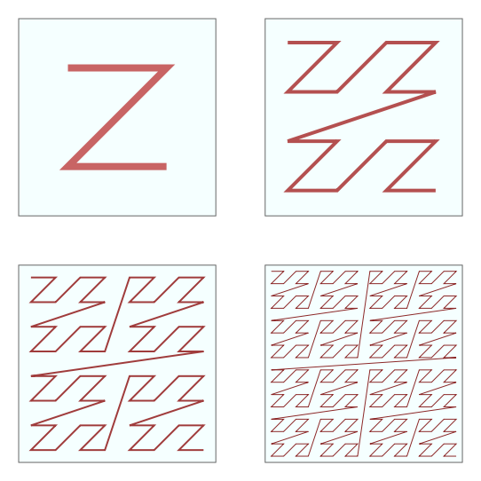
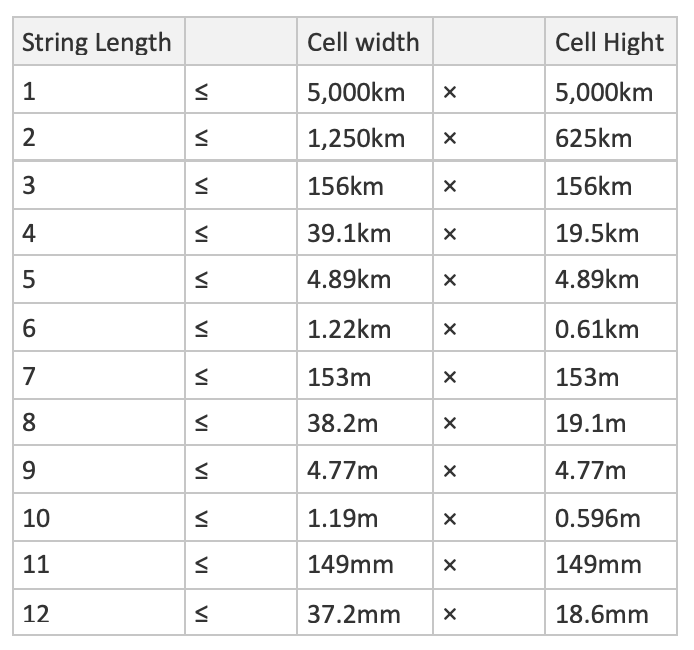

# Geohash

Geohashing is a geocoding method used to encode geographic coordinates(latitude and longitude) into a short string of digits and letters delineating an area on a map, which is called a cell, with varying resolutions. The more characters in the string, the more precise the location.


Geo hash is one of many applications which is known as a [Z-order curve]((https://en.wikipedia.org/wiki/Z-order_curve)), and generally space-filling curves. 



<br/>


## Why

If you want to have geo queries and simple implementation, GeoHash + Btree could be a simple solution for indexing points and centroids.  
GeoHash is a string represents a bounding box a location lies  

Reference code [java impl](https://github.com/graphhopper/graphhopper/blob/master/core/src/main/java/com/graphhopper/geohash/LinearKeyAlgo.java)
```java
// A 4*3 precision linear key will look like
//  
//     |----|----|----|----|
//     |   0|   1|   2|   3|
//     |----|----|----|----|
// lat |   4|   5|   6|   7|
//     |----|----|----|----|
//     |   8|   9|  10|  11|
//     |----|----|----|----|
//
//              lon
```

```java
    public final long encode(double lat, double lon) {
        lat = Math.min(Math.max(lat, bounds.minLat), bounds.maxLat);
        lon = Math.min(Math.max(lon, bounds.minLon), bounds.maxLon);

        // introduce a minor correction to round to lower grid entry!
        long latIndex = (long) ((lat - bounds.minLat) / latDelta * C);
        long lonIndex = (long) ((lon - bounds.minLon) / lonDelta * C);
        return latIndex * lonUnits + lonIndex;
    }
```

It is possible to have two spatially close locations with different GeoHashes which result in the query being inaccurate and missing data.  


## How

Geohash could use Base-32 alphabet encoding (characters can be 0 to 9 and A to Z, excl “A”, “I”, “L” and “O”).  
```
[0, 31] -> 0123456789bcdefghjkmnpqrstuvwxyz
```
Another encoding is Base-36
```
[0,35] -> 23456789bBCdDFgGhHjJKlLMnNPqQrRtTVWX
```


Imagine the world is divided into a grid with 32 cells. The first character in a geohash identifies the initial location as one of the 32 cells. This cell will also contain 32 cells, and each one of these will contain 32 cells (and so on repeatedly). Adding characters to the geohash sub-divides a cell, effectively zooming in to a more detailed area.


<br/>

### Example

Covert 31.1932993, 121.43960190000007 to geohash

First pick 31.1932993  
[-90, 90] binary divide [-90. 0) [0, 90] -> 1  
[0, 90] binary divide [0, 45) [45, 90] -> 0  
and so on ...  


<br/>


<br/>


Longitude: 101011000101110
Latitude: 110101100101101

Latitude on odd position, longitude on even position  

111001100111100000110011110110 -> 11100 11001 11100 00011 00111 10110 -> 28 25 28 3 7 22 - > wtw37q


## Deep dive

### Accuracy

Geohash 的字符串长短会来决定要划分区域的大小。一旦选定 cell 的宽和高，那么 Geohash 字符串的长度就确定下来了。这样我们就把地图分成了一个个的矩形区域了。




  

(picture from [here](https://stackoverflow.com/questions/13448595/geohash-string-length-and-accuracy))


### Issue

#### Jump at corner

z曲线最大的问题是它的突变性, 在拐角处会有比较大的跳跃


<br/>

#### Size difference between levels

另一个问题是，层与层之间的size有着比较大的跳跃，不容易查到正好的size或者说，容易touch更多的无用的数据


<br/>


#### Projection

在不同纬度的地区会出现地理单元单位面积差异较大的情况


<br/>

#### Problem of rectangle 

基于矩形的查询方法，存在8邻域到中心网格的距离不相等的问题


<br/>

六边形网格类似于圆，与周围网格的距离有且仅有一个，而四边形存在两类距离，三角形有三类距离

