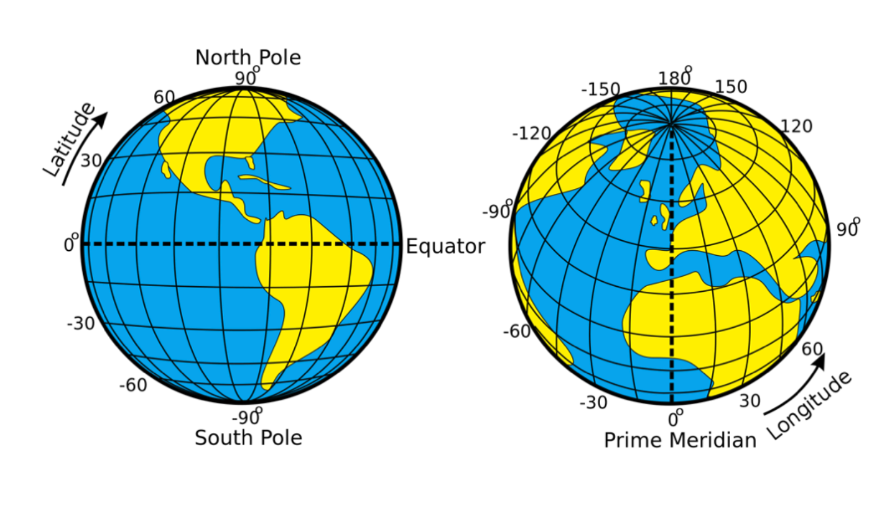
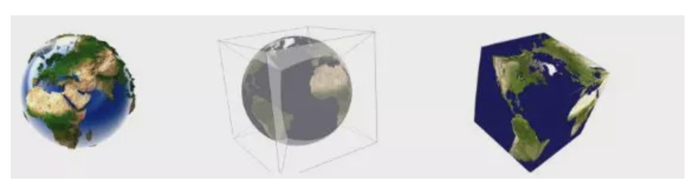
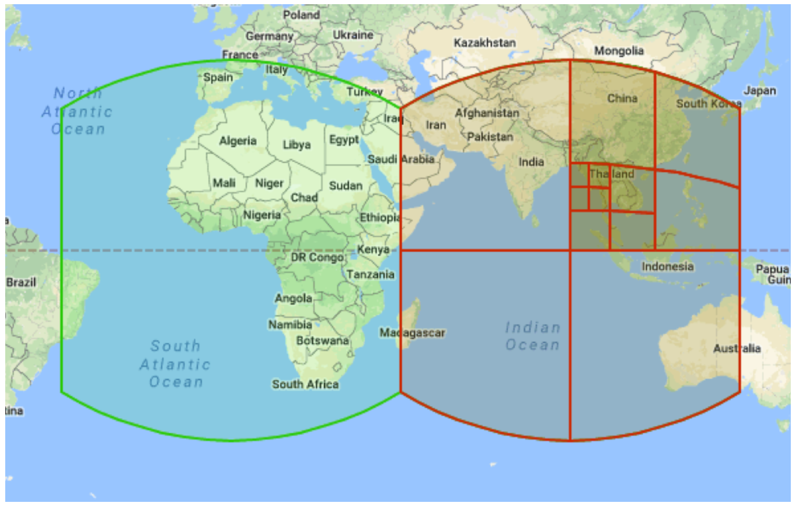
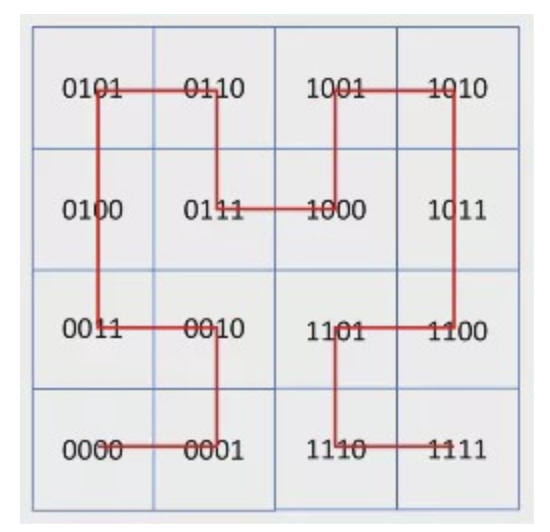

- [Google S2](#google-s2)
  - [Why S2](#why-s2)
  - [How S2 works](#how-s2-works)
    - [Three dimensional space to two](#three-dimensional-space-to-two)
    - [Two dimensional space to one](#two-dimensional-space-to-one)
    - [Indexing](#indexing)
  - [Deep dive](#deep-dive)
    - [How Hilbert curve works <span>&#9733;</span>](#how-hilbert-curve-works-%e2%98%85)
    - [How S2 Cell is generated <span>&#9733;</span>](#how-s2-cell-is-generated-%e2%98%85)
  - [More info](#more-info)
    - [Doc](#doc)
    - [Demo](#demo)
    - [Code](#code)
    - [Applications & Examples](#applications--examples)
    - [Articles](#articles)

# Google S2

S2 is a library for spherical geometry that aims to have the same robustness, flexibility, and performance as the very best planar geometry libraries.

## Why S2

```
The main reason for using Google's S2 library is for its support for spatial 
indexing. As you put more and more geospatial data in a map, your ability to 
query it in a timely and effective manner reduces dramatically. This is a problem 
for the likes of Uber, Foursquare and Yelp who deal with colossal amounts of 
spatial data.

Now the reason this is cool is that it means you can plot map points on this 
curve and when you "stretch" out the curve into a long string and add an index 
to each entry, all those points that were close together on the map remain 
close together in terms of their index position.

This is great news for searching, because it's a lot easier to find points 
that are near to each other on a map when you can access them via their 
indexes and they are still close together. It means you don't have to scan 
the whole list of points to find ones that are geographically close, but 
just a few either side of where your starting position is.
```
Reference from [Quora - Why do we need to use Google S2 geometry library when we already have Google Maps?](https://www.quora.com/Why-do-we-need-to-use-Google-S2-geometry-library-when-we-already-have-Google-Maps)

## How S2 works

### Three dimensional space to two

Given the world



We first surround the sphere with a cube and project it onto all six of its faces, slightly adjusting the projection on the move to remove distortion. This is level 0.



We could imagine using a box to wrap the world, in the center of the world there is a glowing light bulb, we could **project the surface of world to each face of the box**.


### Two dimensional space to one

Then we can divide each of the six faces of the cube into four equal parts - this is level 1. And each of the resulting four parts can be divided into four equal parts - level 2. And so on to level 30.



### Indexing

Fill space with Hilbert curve in middle levels.


<br/>



## Deep dive

### [How Hilbert curve works](./hilbert_curve.md) <span>&#9733;</span>

### [How S2 Cell is generated](./google_s2_cell.md) <span>&#9733;</span>


## More info
### Doc

- [Overview](http://s2geometry.io/about/overview)
- [S2 main page](https://s2geometry.io/)
- [S2 Overview](https://s2geometry.io/about/overview)
- [S2 Cells](https://s2geometry.io/devguide/s2cell_hierarchy.html)<span>&#9733;</span><span>&#9733;</span>
- [Geometry on the Sphere: Google's S2 Library - Intro slides from Google](https://docs.google.com/presentation/d/1Hl4KapfAENAOf4gv-pSngKwvS_jwNVHRPZTTDzXXn6Q/view#slide=id.i0)


### Demo

- [Online tool from Sidewalk Labs](https://s2.sidewalklabs.com/regioncoverer/)
- [Planetaryview](https://s2.sidewalklabs.com/planetaryview/) 
- [S2map - online tool](http://s2map.com/#order=latlng&mode=polygon&s2=false&points=)

### Code
- [S2 Implementation in Golang](https://godoc.org/github.com/golang/geo/s2)
- [S2 with python binding](https://github.com/yjwong/s2-geometry-library)

### Applications & Examples

- [Introduction to the S2 geo-library from Google and examples of using - Great example application with go](https://habrahabr.info/development/programming/948-introduction-to-the-s2-geo-library-from-google-and-examples-of-using.html)<span>&#9733;</span><span>&#9733;</span>
- [A Comprehensive Guide to S2 Cells and Pokémon GO](https://pokemongohub.net/post/article/comprehensive-guide-s2-cells-pokemon-go/)
- [Learning to Rank for Spatiotemporal Search - foursquare](http://secondthought.org/notes/wsdm2013-final.pdf)
- [Google-S2 空间索引框架简介及部分API使用示例 Java](https://my.oschina.net/ordiychen/blog/858715)
- [Google S2 demo java](https://gitee.com/ordiy/google-s2-demo)
- [计算不同区域范围，X公里半径内实体店或场站覆盖率](https://www.cnblogs.com/tgzhu/p/8289331.html)


### Articles

- [Google’s S2, geometry on the sphere, cells and Hilbert curve - How does geo/s2 works](http://blog.christianperone.com/2015/08/googles-s2-geometry-on-the-sphere-cells-and-hilbert-curve/
)


