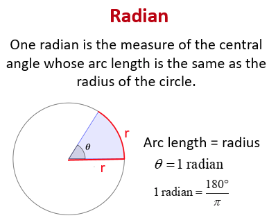
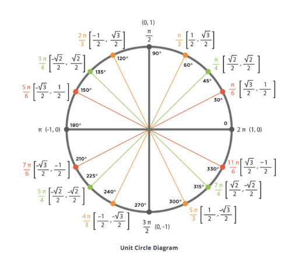
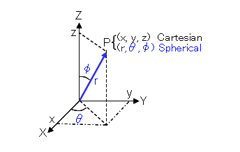
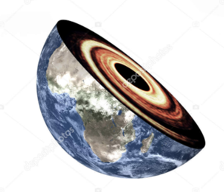
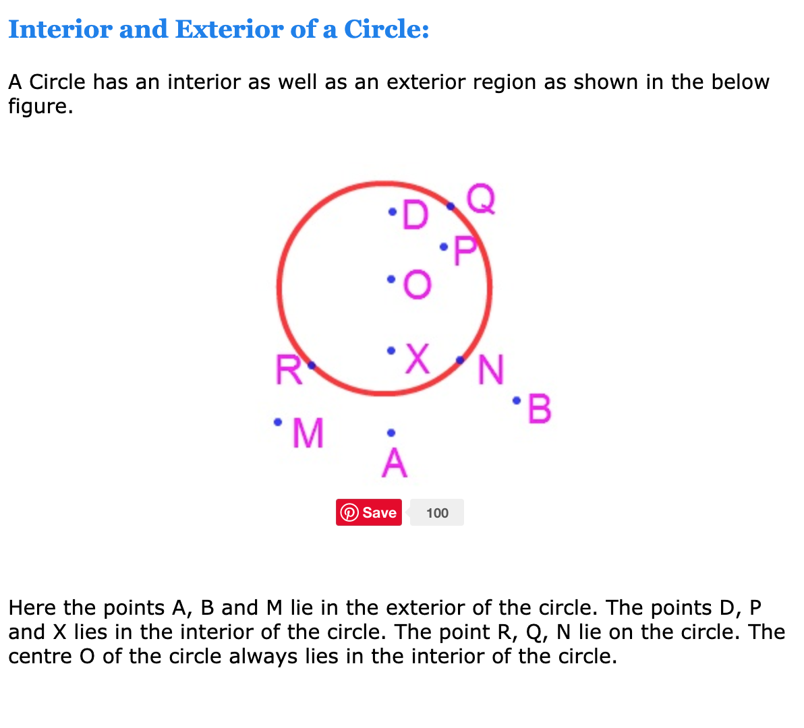
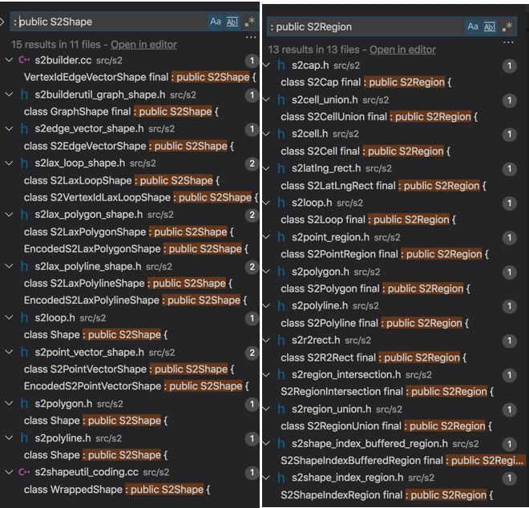
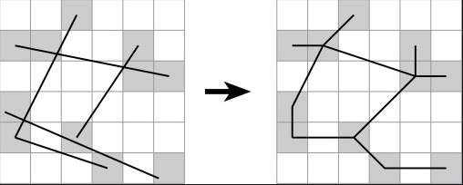

# [Google S2 Basic Types](https://s2geometry.io/devguide/basic_types)

## S1Angle

The `S1Angle` class represents a one-dimensional angle.  You could think it equivalent to the value of `latitude` or `longitude`.

- [s1angle.h](https://github.com/google/s2geometry/blob/9398b7c8d55c15c4ad7cdc645c482232ea7c087a/src/s2/s1angle.h#L84)
- [s1/angle.go](https://github.com/golang/geo/blob/5b978397cfecc7280e598e9ac5854e9534b0918b/s1/angle.go#L52)

```C++
class S1Angle {
  constexpr double radians() const;
  constexpr double degrees() const;

  int32 e5() const;
  int32 e6() const;
  int32 e7() const;


double radians_;
```

`s1angle.h` includes methods for comparison and arithmetic operators, eg:
```C++
// x and y are angles
if (sin(0.5 * x) > (x + y) / (x - y)) { ... }
```

### Radians & Degrees

<br/>
(Ref from [Convert between Degrees and Radians](https://www.onlinemathlearning.com/degrees-radians.html))

```
circumference = 2π(radius)

1 radian = 180°/π
π radian = 180°
2π radian = 360°
```
<br/>
Ref from [How to Convert Radians to Degrees](https://calcworkshop.com/radian-measure/degrees-to-radians/)


## S2Point

The S2Point class represents a point on the unit sphere as a 3D vector. 

[s2point.h](https://github.com/google/s2geometry/blob/9398b7c8d55c15c4ad7cdc645c482232ea7c087a/src/s2/s2point.h#L30)
[s2/point.go](https://github.com/golang/geo/blob/5b978397cfecc7280e598e9ac5854e9534b0918b/s2/point.go#L29)

```C++
typedef Vector3<double> Vector3_d;
typedef Vector3_d S2Point;
```


### What is (x, y, z)

```C++
// [Perry]The equivalent definition for S2 is
class S2Point /* Vector3_d */ {
 public:
  S2Point(double x, double y, double z);
```

There are two ways to represent a point on 3D space.  By `Cartesian` way you could imagine there is a cubic of `[-1,+1]x[-1,+1]x[-1,+1]`， `x, y, z` represent for offset value on each dimension.  More discussion please go to next section.


## S2LatLng

The `S2LatLng` class represents a point on the unit sphere as a pair of latitude-longitude coordinates.


```C++
class S2LatLng {
 public:
   S2LatLng(S1Angle lat, S1Angle lng);

```

### Conversion between LatLon and XYZ

- [s2latlng.cc](https://github.com/google/s2geometry/blob/9398b7c8d55c15c4ad7cdc645c482232ea7c087a/src/s2/s2latlng.cc#L36
)
- [s2/latlng.go/PointFromLatLng](https://github.com/golang/geo/blob/5b978397cfecc7280e598e9ac5854e9534b0918b/s2/latlng.go#L85)

```C++
S2Point S2LatLng::ToPoint() const {
  //...
  double phi = lat().radians();
  double theta = lng().radians();
  double cosphi = cos(phi);
  return S2Point(cos(theta) * cosphi, sin(theta) * cosphi, sin(phi));
}
```

<br/>
(Ref from [Spherical to Cartesian coordinates Calculator](https://keisan.casio.com/exec/system/1359534351))

`θ` is the value of `longitude`, which is `phi` in the upper code  
`φ` is the value of `latitude`, which is `theta` in the upper code  

```C++
// S2LatLng::ToPoint() could be translated to
x = r * cos θ * cos φ
y = r * cos θ * sin φ 
z = r * sin θ
```

## S2Region

An `S2Region` represents a two-dimensional region over the unit sphere. It is an abstract interface with various concrete subtypes, such as discs, rectangles, polylines, polygons, geometry collections, buffered shapes, etc.  **`S2Region`'s interface is restricted to methods that are useful for computing approximations.**

- [s2region.h](https://github.com/google/s2geometry/blob/9398b7c8d55c15c4ad7cdc645c482232ea7c087a/src/s2/s2region.h#L41)
- [s2/region.go](https://github.com/golang/geo/blob/5b978397cfecc7280e598e9ac5854e9534b0918b/s2/region.go#L22)

## S2LatLngRect

An `S2LatLngRect` is a type of `S2Region` that represents a rectangle in latitude-longitude space. It is capable of representing the empty and full rectangles as well as single points. It has an `AddPoint` method that makes it easy to construct a bounding rectangle for a set of points, including point sets that span the 180 degree meridian.

- [s2latlng_rect.h](https://github.com/google/s2geometry/blob/9398b7c8d55c15c4ad7cdc645c482232ea7c087a/src/s2/s2latlng_rect.h#L60)
- [s2/rect.go](https://github.com/golang/geo/blob/5b978397cfecc7280e598e9ac5854e9534b0918b/s2/rect.go#L28)


## S1ChordAngle
`S1ChordAngle` is a specialized angle type that represents the distance between two points on the sphere. (Note that the distance between two points can be expressed as the angle between those points measured from the sphere’s center.) Its representation makes it very efficient for computing and comparing distances, but unlike S1Angle it is only capable of representing angles between 0 and 180 degrees. (Internally, S1ChordAngle computes the squared distance between two points through the interior of the sphere, i.e. the squared length of the chord between those points).

https://www.geogebra.org/m/UGPgDmmP

`S1ChordAngle` is the preferred representation for distances internally, because it is much faster to compute than S1Angle and also supports the exact predicates needed for robust geometric algorithms. S1ChordAngle supports many of the same methods as S1Angle, and it is also easy to convert back and forth as required.

- [s1chord_angle.h](https://github.com/google/s2geometry/blob/9398b7c8d55c15c4ad7cdc645c482232ea7c087a/src/s2/s1chord_angle.h#L46)
- [s1/chordangle.go](https://github.com/golang/geo/blob/5b978397cfecc7280e598e9ac5854e9534b0918b/s1/chordangle.go#L37)


## S2Cap

An `S2Cap` represents a spherical cap, i.e. a portion of a sphere cut off by a plane. This is the equivalent of a closed disc in planar geometry (i.e., a circle together with its interior), so if you are looking for a way to represent a circle or disc then you are probably looking for an `S2Cap`.

- [s2cap.h](https://github.com/google/s2geometry/blob/9398b7c8d55c15c4ad7cdc645c482232ea7c087a/src/s2/s2cap.h#L59)
- [s2/cap.go](https://github.com/golang/geo/blob/5b978397cfecc7280e598e9ac5854e9534b0918b/s2/cap.go#L61)

<br/>
(Ref from [depositphotos](https://depositphotos.com/254408214/stock-photo-black-hole-in-the-planet.html))

### Interior and Exterior of a Circle

<br/>
(Ref from [circle-e](https://www.math-only-math.com/circle-e.html))


## S2Polyline

An `S2Polyline` represents a sequence of zero or more vertices connected by straight edges (geodesics). Edges of length 0 and 180 degrees are not allowed, i.e. adjacent vertices should not be identical or antipodal.

- [s2polyline.h](https://github.com/google/s2geometry/blob/9398b7c8d55c15c4ad7cdc645c482232ea7c087a/src/s2/s2polyline.h#L45)
- [s2/polyline.go](https://github.com/golang/geo/blob/5b978397cfecc7280e598e9ac5854e9534b0918b/s2/polyline.go#L28)

## S2 Loop

- [s2loop.h](https://github.com/google/s2geometry/blob/9398b7c8d55c15c4ad7cdc645c482232ea7c087a/src/s2/s2loop.h#L85)
- [s2builder.h](https://github.com/google/s2geometry/blob/9398b7c8d55c15c4ad7cdc645c482232ea7c087a/src/s2/s2builder.h#L134)
- [s2/loop.go](https://github.com/golang/geo/blob/5b978397cfecc7280e598e9ac5854e9534b0918b/s2/loop.go#L45)


## S2 Shape
Shape could represent all kinds of `shapes`, which contains a `chain` of `edges`.
- [s2shape.h](https://github.com/google/s2geometry/blob/bec06921d72068fb22ef2100830c718659a19b58/src/s2/s2shape.h#L25-L26)

### Difference between shape and region


<br/>

- `s2shape` mainly used to represent polygonal geometry, it could represent `point`, `loop`, `polygon`.  Most of core operation of S2 works on `s2shape`.
- `s2region` is used to calculate geometric approximations.  `S2RegionCoverer` could be used for approaching an area.  
  +  `S2Builder` is a tool for assembling polygonal geometry from edges, it constructs `regions` using `snap rounding`


<br/>

