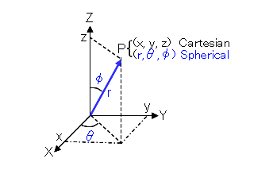

- [Google S2 Cell](#google-s2-cell)
	- [Step 1: p=(lat, lon) -> (x, y, z)](#step-1-plat-lon---x-y-z)
	- [Step 2: (x, y, z) -> (face, u, v)](#step-2-x-y-z---face-u-v)
	- [Step 3: Non-linear transform (face, u, v) -> (face, s, t)](#step-3-non-linear-transform-face-u-v---face-s-t)
		- [Problem](#problem)
		- [Solutions](#solutions)
	- [Step 4: (face, s, t) -> (face, i, j)](#step-4-face-s-t---face-i-j)
	- [Step 5: Generate Cell id](#step-5-generate-cell-id)
		- [Part1: Definition](#part1-definition)
		- [Part2: Init](#part2-init)
		- [Part3: Query](#part3-query)
	- [More info](#more-info)

# Google S2 Cell

 Give a `(lat, lon)`, how to find cellid for it.  


What is cell id? [Comments from C++ impl -> s2coords.h](https://github.com/google/s2geometry/blob/20c8f339cc9a55fdca1c0e8ab519da399752e70b/src/s2/s2coords.h#L38)
```C++
//  (id)
//    An S2CellId is a 64-bit encoding of a face and a Hilbert curve position
//    on that face.  The Hilbert curve position implicitly encodes both the
//    position of a cell and its subdivision level (see s2cell_id.h).
```
You could find similar comments in [go's impl -> stuv.go](https://github.com/golang/geo/blob/5b978397cfecc7280e598e9ac5854e9534b0918b/s2/stuv.go#L35)  

## Step 1: p=(lat, lon) -> (x, y, z)

How lat, lon is generated for a point:  


[Code from go impl](https://github.com/golang/geo/blob/5b978397cfecc7280e598e9ac5854e9534b0918b/s2/latlng.go#L85)
```go
func PointFromLatLng(ll LatLng) Point {
	phi := ll.Lat.Radians()
	theta := ll.Lng.Radians()
	cosphi := math.Cos(phi)
	return Point{r3.Vector{math.Cos(theta) * cosphi, math.Sin(theta) * cosphi, math.Sin(phi)}}
}
```



(Ref from [Spherical to Cartesian coordinates Calculator](https://keisan.casio.com/exec/system/1359534351))

`θ`即为经纬度的纬度，也就是上面代码中的`phi`，`φ`即为经纬度的经度，也就是上面代码的`theta`
```
x = r * cos θ * cos φ
y = r * cos θ * sin φ 
z = r * sin θ
```

[Comments from C++ impl -> s2coords.h](https://github.com/google/s2geometry/blob/20c8f339cc9a55fdca1c0e8ab519da399752e70b/src/s2/s2coords.h#L38)
```C++
//  (x, y, z)
//    Direction vector (Point). Direction vectors are not necessarily unit
//    length, and are often chosen to be points on the biunit cube
//    [-1,+1]x[-1,+1]x[-1,+1]. They can be be normalized to obtain the
//    corresponding point on the unit sphere.
//
//  (lat, lng)
//    Latitude and longitude (LatLng). Latitudes must be between -90 and
//    90 degrees inclusive, and longitudes must be between -180 and 180
//    degrees inclusive.
```

[Comments from s2cell_hierarchy](https://s2geometry.io/devguide/s2cell_hierarchy.html)

```
(x, y, z)\ Spherical point: The final S2Point is obtained by projecting the 
(face, u, v) coordinates onto the unit sphere. Cells in (x,y,z)-coordinates 
are quadrilaterals bounded by four spherical geodesic edges.
```


## Step 2: (x, y, z) -> (face, u, v)


[code](https://github.com/golang/geo/blob/5b978397cfecc7280e598e9ac5854e9534b0918b/s2/stuv.go#L229)
```go
// xyzToFaceUV converts a direction vector (not necessarily unit length) to
// (face, u, v) coordinates.
func xyzToFaceUV(r r3.Vector) (f int, u, v float64) {
	f = face(r)
	u, v = validFaceXYZToUV(f, r)
	return f, u, v
}
```

**其实就是在圆心打出灯光，把地球表面投影到立方体的一个面上**


(face,u,v) 表示一个立方空间坐标系，三个轴的值域都是 `[-1,1]` 之间。


[Comments from s2cell_hierarchy](https://s2geometry.io/devguide/s2cell_hierarchy.html)

```
(face, u, v)\ Cube-space coordinates: To make the cells at each level more 
uniform in size after they are projected onto the sphere, we apply a nonlinear 
transformation of the form u=f(s), v=f(t) before projecting points onto the 
sphere. This function also scales the (u,v)-coordinates so that each face 
covers the biunit square [-1,1]×[-1,1]. Cells in (u,v)-coordinates are 
rectangular, and are not necessarily subdivided around their center point 
(because of the nonlinear transformation “f”).
```

## Step 3: Non-linear transform (face, u, v) -> (face, s, t)


### Problem

投影比例不同的问题


在两级的投影比在赤道区域要大.  需要一个转换将上面长的拉短、将下面短的拉长，尽量让区间变相同。
Similar issue also exists in mercator projection, you could find this interesting article from CNN: [What's the real size of Africa? How Western states used maps to downplay size of continent](https://www.cnn.com/2016/08/18/africa/real-size-of-africa/index.html)

### Solutions

google_s2_cellid_step3_trade_off

```
// linear
u = 0.5 * ( u + 1)

// tan() 
u = 2 / pi * (atan(u) + pi / 4) = 2 * atan(u) / pi + 0.5

// Quadratic
u >= 0，u = 0.5 * sqrt(1 + 3*u)
u < 0, u = 1 - 0.5 * sqrt(1 - 3*u)
```

```
线性变换是最快的变换，但是变换比最小。
tan() 变换可以使每个投影以后的矩形的面积更加一致，最大和最小的矩形比例仅仅只差0.414。
但是 tan() 函数的调用时间非常长。如果把所有点都按照这种方式计算的话，性能将会降低3倍。
最后谷歌选择的是二次变换，这是一个近似切线的投影曲线。它的计算速度远远快于 tan() ，
大概是 tan() 计算的3倍速度。生成的投影以后的矩形大小也类似。
不过最大的矩形和最小的矩形相比依旧有2.082的比率。
```

[code](https://github.com/golang/geo/blob/5b978397cfecc7280e598e9ac5854e9534b0918b/s2/stuv.go#L176)

```go
// stToUV converts an s or t value to the corresponding u or v value.
// This is a non-linear transformation from [-1,1] to [-1,1] that
// attempts to make the cell sizes more uniform.
// This uses what the C++ version calls 'the quadratic transform'.
func stToUV(s float64) float64 {
	if s >= 0.5 {
		return (1 / 3.) * (4*s*s - 1)
	}
	return (1 / 3.) * (1 - 4*(1-s)*(1-s))
}

// uvToST is the inverse of the stToUV transformation. Note that it
// is not always true that uvToST(stToUV(x)) == x due to numerical
// errors.
func uvToST(u float64) float64 {
	if u >= 0 {
		return 0.5 * math.Sqrt(1+3*u)
	}
	return 1 - 0.5*math.Sqrt(1-3*u)
}
```

[Comments from s2cell_hierarchy](https://s2geometry.io/devguide/s2cell_hierarchy.html)

```
(face, s, t)\ Cell-space coordinates: “s” and “t” are real numbers in the range
 [0,1] that identify a point on the given face. For example, the point 
 (s, t) = (0.5, 0.5) corresponds to the center of the cell at level 0. 
 Cells in (s, t)-coordinates are perfectly square and subdivided around 
 their center point, just like the Hilbert curve construction.
```
**u，v的值域是`[-1,1]`，变换以后，是s，t的值域是`[0,1]`。**


## Step 4: (face, s, t) -> (face, i, j)


**s，t的值域是`[0,1]`，现在值域要扩大到`[0,2^30^-1]`。**

[code](https://github.com/golang/geo/blob/5b978397cfecc7280e598e9ac5854e9534b0918b/s2/cellid.go#L635)
```go
// stToIJ converts value in ST coordinates to a value in IJ coordinates.
func stToIJ(s float64) int {
	return clampInt(int(math.Floor(maxSize*s)), 0, maxSize-1)
}

// clampInt returns the number closest to x within the range min..max.
func clampInt(x, min, max int) int {
	if x < min {
		return min
	}
	if x > max {
		return max
	}
	return x
}

// caller
// cellIDFromFaceIJ(f, stToIJ(0.5*(u+1)), stToIJ(0.5*(v+1)))
```

[Comments from s2cell_hierarchy](https://s2geometry.io/devguide/s2cell_hierarchy.html)
```
(face, i, j)\ Leaf-cell coordinates: The leaf cells are the subsquares that 
result after 30 levels of Hilbert curve subdivision, consisting of a 230 × 230 
array on each face. “i” and “j” are integers in the range [0, 230-1] that 
identify a particular leaf cell. The (i, j) coordinate system is right-handed 
on every face, and the faces are oriented such that Hilbert curves connect 
continuously from one face to the next.

```

## Step 5: Generate Cell id
[Comments from s2cell_hierarchy](https://s2geometry.io/devguide/s2cell_hierarchy.html)
```
Cell id: A 64-bit encoding of a face and a Hilbert curve parameter on that face, 
as discussed above. The Hilbert curve parameter implicitly encodes both the 
position of a cell and its subdivision level.
```

<br/>

<br/>

<br/>
You could think the problem as, for given `(i, j)`, how could you find corresponding s2 cell.  

Code from [cellid.go](https://github.com/golang/geo/blob/5b978397cfecc7280e598e9ac5854e9534b0918b/s2/cellid.go)

### Part1: Definition

```go
// Constants related to the bit mangling in the Cell ID.
const (
	lookupBits = 4
	swapMask   = 0x01
	invertMask = 0x02
)

// The following lookup tables are used to convert efficiently between an
// (i,j) cell index and the corresponding position along the Hilbert curve.
//
// lookupPos maps 4 bits of "i", 4 bits of "j", and 2 bits representing the
// orientation of the current cell into 8 bits representing the order in which
// that subcell is visited by the Hilbert curve, plus 2 bits indicating the
// new orientation of the Hilbert curve within that subcell. (Cell
// orientations are represented as combination of swapMask and invertMask.)
//
// lookupIJ is an inverted table used for mapping in the opposite
// direction.
//
// We also experimented with looking up 16 bits at a time (14 bits of position
// plus 2 of orientation) but found that smaller lookup tables gave better
// performance. (2KB fits easily in the primary cache.)
var (
	ijToPos = [4][4]int{
		{0, 1, 3, 2}, // canonical order
		{0, 3, 1, 2}, // axes swapped
		{2, 3, 1, 0}, // bits inverted
		{2, 1, 3, 0}, // swapped & inverted
	}
	posToIJ = [4][4]int{
		{0, 1, 3, 2}, // canonical order:    (0,0), (0,1), (1,1), (1,0)
		{0, 2, 3, 1}, // axes swapped:       (0,0), (1,0), (1,1), (0,1)
		{3, 2, 0, 1}, // bits inverted:      (1,1), (1,0), (0,0), (0,1)
		{3, 1, 0, 2}, // swapped & inverted: (1,1), (0,1), (0,0), (1,0)
	}
	posToOrientation = [4]int{swapMask, 0, 0, invertMask | swapMask}
	lookupIJ         [1 << (2*lookupBits + 2)]int
	lookupPos        [1 << (2*lookupBits + 2)]int
)
```
- From the flash of [order 2 generation](https://github.com/CodeBear801/tech_summary/blob/master/tech-summary/navigation/spatial_index/hilbert_curve.md#order-2), you could find `order 2` curve could be generated by 4 `order 1` curve with shifting.

- Hilbert curve has four kind of shape for each 4 grid


- The value of i's range is [0,1], the value of j's range is [0,1].  Both i, j just need 1 bit to represent.  We will use i as high-order bit and j as low-order bit to generate a value with 2 bits, like `ij`
   + `ij`'s combination is `00, 01, 10, 11`, in binary, its `0, 1, 2, 3`
   + For `canonical order`, follow the sequence of curve, the value of pos is  `0, 1, 3, 2`
   + For `axes swapped`, follow the sequence of curve, the value of pos is  `0, 3, 1, 2`
   + For `canonical order`, follow the sequence of curve, the value of pos is  `2, 3, 1, 0`
   + For `canonical order`, follow the sequence of curve, the value of pos is  `2, 1, 3, 0`
   + Thats how `ijToPos` is defined for


- `posToIJ` is the reverse of `ijToPos`.  For each shape, each position, what is related `ij`.

```go
	posToIJ = [4][4]int{
		{0, 1, 3, 2}, // canonical order:    (0,0), (0,1), (1,1), (1,0)
		{0, 2, 3, 1}, // axes swapped:       (0,0), (1,0), (1,1), (0,1)
		{3, 2, 0, 1}, // bits inverted:      (1,1), (1,0), (0,0), (0,1)
		{3, 1, 0, 2}, // swapped & inverted: (1,1), (0,1), (0,0), (1,0)
	}
```

- Just from shape's perspective, you could find each of them could be converted from previous one by rotating clockwise by 90 degree.
  + Some people may say by rotating Counterclockwise, that's because they define coordinate origin upper left.  We have the same meaning just different shape of hilbert curve.
  + We could consider using bit to represent each shape/rotation, thus a sequence of rotation could be represented by bit operation  
  	

- What's the rule of further divide one kind of curve to next level?  We want to find parent->child relationship.
   + If current curve is `canonical order`, the process of further divide could be imagine as 
       - duplicate `canonical order` into four
       - for first one in the original curve(pos 0), shift that one clockwise for 90 degrees.  `canonical order` changed to `axes swapped`
       - for last one in the original curve(pos 3), shift that one counterclockwise for 90 degrees.  `canonical order` changed to `swapped & inverted`  
    <br/>  
   + If current curve is `axes swapped`, the process of further divide could be imagine as 
       - duplicate `axes swapped` into four, 
       - for first one in the  original curve(pos 0), shift that one counterclockwise for 90 degrees, `axes swapped` changed to `canonical order`
       - for last one in the original curve(pos 3), shift that one clockwise for 90 degrees, `axes swapped` changed to `bits inverted`  
    <br/>   
   + If current curve is `bits inverted`, the process of further divide could be imagine as 
       - duplicate `bits inverted` into four, 
       - for first one in the  original curve(pos 0), shift that one clockwise for 90 degrees, `bits inverted` changed to `swapped & inverted`
       - for last one in the original curve(pos 3), shift that one counterclockwise for 90 degrees, `bits inverted` changed to `axes swapped`  
    <br/>   
   + If current curve is `swapped & inverted`, the process of further divide could be imagine as 
       - duplicate `swapped & inverted` into four, 
       - for first one in the  original curve(pos 0), shift that one counterclockwise for 90 degrees, `swapped & inverted` changed to `bits inverted`
       - for last one in the original curve(pos 3), shift that one clockwise for 90 degrees, `swapped & inverted` changed to `canonical order`  
    	

- That is the usage of `posToOrientation = [4]int{swapMask, 0, 0, invertMask | swapMask}`
   + The actual value is: posToOrientation = [4]int{1, 0, 0, 3}
   + Given the definition: `canonical order` = `0x00`, `axes swapped` = `0x01`, `bits inverted` = `0x10`,`swapped & inverted` = `0x11`
   + The value of `posToOrientation` record relation of `canonical order`(`0x00`) and its children:`0x01`, `0x00`, `0x00`, `0x11`
   + If parent is `axes swapped` = `0x01`, its children are: `0x00`, `0x01`, `0x01`, `0x10`
   + If parent is `bits inverted` = `0x10`, its children are: `0x11`, `0x10`, `0x10`, `0x01`
   + If parent is `swapped & inverted` = `0x11`, its children are: `0x10`, `0x11`, `0x11`, `0x00`
   + We found that `XOR` operation is perfect fit if given parent value and `posToOrientation`
```c
0x00 ^ 0x01 = 0x01
0x00 ^ 0x00 = 0x00
0x00 ^ 0x00 = 0x00
0x00 ^ 0x11 = 0x11

0x01 ^ 0x01 = 0x00
0x01 ^ 0x00 = 0x01
0x01 ^ 0x00 = 0x01
0x01 ^ 0x11 = 0x10

0x10 ^ 0x01 = 0x11
0x10 ^ 0x00 = 0x10
0x10 ^ 0x00 = 0x10
0x10 ^ 0x11 = 0x01

0x11 ^ 0x01 = 0x10
0x11 ^ 0x00 = 0x11
0x11 ^ 0x00 = 0x11
0x11 ^ 0x11 = 0x00
``` 
- The most important summary is, we could calculate the curve if we decide quad divide one grid based on **`parent's curve`, `pos in the curve` and `posToOrientation`**

- Google design the `query` as 4 bits from i, 4 bits from j, and combine them, so pre-calculate a table for all kinds of combination of ij comes out following code:
```go
    // lookupPos maps 4 bits of "i", 4 bits of "j", and 2 bits representing the
    // orientation of the current cell into 8 bits representing the order in which
    // that subcell is visited by the Hilbert curve, plus 2 bits indicating the
    // new orientation of the Hilbert curve within that subcell. (Cell
    // orientations are represented as combination of swapMask and invertMask.)
	lookupIJ         [1 << (2*lookupBits + 2)]int
	lookupPos        [1 << (2*lookupBits + 2)]int
```

### Part2: [Init](https://github.com/golang/geo/blob/5b978397cfecc7280e598e9ac5854e9534b0918b/s2/cellid.go#L721)
```go
func init() {
	initLookupCell(0, 0, 0, 0, 0, 0)
	initLookupCell(0, 0, 0, swapMask, 0, swapMask)
	initLookupCell(0, 0, 0, invertMask, 0, invertMask)
	initLookupCell(0, 0, 0, swapMask|invertMask, 0, swapMask|invertMask)
}

// initLookupCell initializes the lookupIJ table at init time.
func initLookupCell(level, i, j, origOrientation, pos, orientation int) {
	if level == lookupBits {
		ij := (i << lookupBits) + j
		lookupPos[(ij<<2)+origOrientation] = (pos << 2) + orientation
		lookupIJ[(pos<<2)+origOrientation] = (ij << 2) + orientation
		return
	}

	level++
	i <<= 1
	j <<= 1
	pos <<= 2
	r := posToIJ[orientation]
	initLookupCell(level, i+(r[0]>>1), j+(r[0]&1), origOrientation, pos, orientation^posToOrientation[0])
	initLookupCell(level, i+(r[1]>>1), j+(r[1]&1), origOrientation, pos+1, orientation^posToOrientation[1])
	initLookupCell(level, i+(r[2]>>1), j+(r[2]&1), origOrientation, pos+2, orientation^posToOrientation[2])
	initLookupCell(level, i+(r[3]>>1), j+(r[3]&1), origOrientation, pos+3, orientation^posToOrientation[3])
}

```

- Let's just take a look at one time call of `initLookupCell()`.  
   + Basically, the function use `recursion` to generate all combination of i`[0000, 1111]` and j`[0000, 1111]` in `order 4` hilbert curve.(why order 4? 1 bit of i,j could be represented by `order 1` hilbert curve, 2 bit of i,j could be represented by `order 2` hilbert curve).  `Level` guarantees all bits has been full-filled
   + Let's first simplify our problem, we want to pre-calculate query table for i and j with just 1 bit for each of them.  `ijToPos` is your dish, you are welcome!  
   + Let's assume we want to pre-calculate query table for i and j with 2 bits for each of them.  i's range is [00, 11], j's range is [00, 11].  We could pick high-order one bit from i and another high-order one bit from j to generate `order 1` hilbert curve, and then use low-order one bit from i and another low-order one bit from j to further dived each cell from `order 1`.  If i's high level bit is 0, then final value could only exists in grid 0 and 1, by high level bit from j we could specify the grid.  Then based on previous steps's analysis we know how to further divide this grid, so we got a curve for it, and then based on low-order bit from i and j we could specify final grid, thus we got a position from hilbert curve.  
   <br/>  
   + Generate query table for i and j with 4 bits for each of them is nothing hard but continue the recursion.
   + For function `initLookupCell()`, parameter `orientation` specify the curve for this round
   + Based on `r := posToIJ[orientation]` you will know how i and j goes in this specific round\
   + `r[]>>1` will get higher level bits, `r[]&1` will get lower level bits
   + `pos <<= 2` guarantees each grid has proper start value
   + `orientation^posToOrientation` generate curve for next level
- If our target is just `order 4`'s hilbert curve, then then following code is enough.
```go
	lookupIJ         [1 << (2*lookupBits)]int
	lookupPos        [1 << (2*lookupBits)]int

func init() {
	initLookupCell(0, 0, 0, 0, 0, 0)
}
```
- But as our analysis shows for 1 bit of ij and 2 bits of ij, with more bits means we will further divide the grid.  That gave us two additional requirements:
  + `Order 4` is not the end of divide, its just the end of one round.  So we need information of `current position` in hilbert curve and `orientation` to guide if we want to further divide what is the curve looks like.
  + Since we want to generate pre-calculated table to speed up query, the curve from previous iteration could be any of the four, we must calculate all the condition for `canonical order`, `axes swapped`, `bits inverted`, `swapped & inverted`.  That's why `initLookupCell()` be called for four times in `Init()`.


### Part3: [Query](https://github.com/golang/geo/blob/5b978397cfecc7280e598e9ac5854e9534b0918b/s2/cellid.go#L564)
```go
// cellIDFromFaceIJ returns a leaf cell given its cube face (range 0..5) and IJ coordinates.
func cellIDFromFaceIJ(f, i, j int) CellID {
	// Note that this value gets shifted one bit to the left at the end
	// of the function.
	n := uint64(f) << (posBits - 1)
	// Alternating faces have opposite Hilbert curve orientations; this
	// is necessary in order for all faces to have a right-handed
	// coordinate system.
	bits := f & swapMask
	// Each iteration maps 4 bits of "i" and "j" into 8 bits of the Hilbert
	// curve position.  The lookup table transforms a 10-bit key of the form
	// "iiiijjjjoo" to a 10-bit value of the form "ppppppppoo", where the
	// letters [ijpo] denote bits of "i", "j", Hilbert curve position, and
	// Hilbert curve orientation respectively.
	for k := 7; k >= 0; k-- {
		mask := (1 << lookupBits) - 1
		bits += ((i >> uint(k*lookupBits)) & mask) << (lookupBits + 2)
		bits += ((j >> uint(k*lookupBits)) & mask) << 2
		bits = lookupPos[bits]
		n |= uint64(bits>>2) << (uint(k) * 2 * lookupBits)
		bits &= (swapMask | invertMask)
	}
	return CellID(n*2 + 1)
}
```

Give an example for how this part works, let's say we make a call with:
```
f, i, j
2,100001101110100000011110100,11000100011111100000110000010
```
```
k = 7
mask = 1111
bits+x = 0
bits+y = 100
bits-query = 1110
n = 10001100000000000000000000000000000000000000000000000000000000
bits = 10

k = 6
mask = 1111
bits+x = 100000010
bits+y = 100100010
bits-query = 1101000001
n = 10001111010000000000000000000000000000000000000000000000000000
bits = 1

k = 5
mask = 1111
bits+x = 11000001
bits+y = 11100001
bits-query = 1110010110
n = 10001111010000111001010000000000000000000000000000000000000000
bits = 10

k = 4
mask = 1111
bits+x = 111000010
bits+y = 111111110
bits-query = 1110101001
n = 10001111010000111001011110101000000000000000000000000000000000
bits = 1

k = 3
mask = 1111
bits+x = 100000001
bits+y = 100110001
bits-query = 1100101011
n = 10001111010000111001011110101011001010000000000000000000000000
bits = 11

k = 2
mask = 1111
bits+x = 11
bits+y = 111
bits-query = 1010100111
n = 10001111010000111001011110101011001010101010010000000000000000
bits = 11

k = 1
mask = 1111
bits+x = 1111000011
bits+y = 1111100011
bits-query = 1010110
n = 10001111010000111001011110101011001010101010010001010100000000
bits = 10

k = 0
mask = 1111
bits+x = 100000010
bits+y = 100001010
bits-query = 1001110000
n = 10001111010000111001011110101011001010101010010001010110011100
bits = 0
```

## More info
- [S2 Cell hierarchy](https://s2geometry.io/devguide/s2cell_hierarchy.html)
- [cellid_test.go](https://github.com/golang/geo/blob/5b978397cfecc7280e598e9ac5854e9534b0918b/s2/cellid_test.go#L170)
