- [Hilbert curve](#hilbert-curve)
  - [Examples](#examples)
  - [How to generate](#how-to-generate)
    - [Order 1](#order-1)
    - [Order 2](#order-2)
    - [Order 3](#order-3)
    - [Order n](#order-n)
  - [Benefits](#benefits)
    - [Downgrade n-dimension to 1-dimension](#downgrade-n-dimension-to-1-dimension)
    - [Stable result](#stable-result)
    - [Better locality](#better-locality)
  - [Questions](#questions)
    - [Find value in quad tree](#find-value-in-quad-tree)
    - [Create hilbert curve based on density](#create-hilbert-curve-based-on-density)
    - [Implement hilbert curve by recursion](#implement-hilbert-curve-by-recursion)
  - [More info](#more-info)

# Hilbert curve

Hilbert curve helps to downgrade n-dimension data to one dimension and also keeps spatial locality.  

## Examples

2 dimension

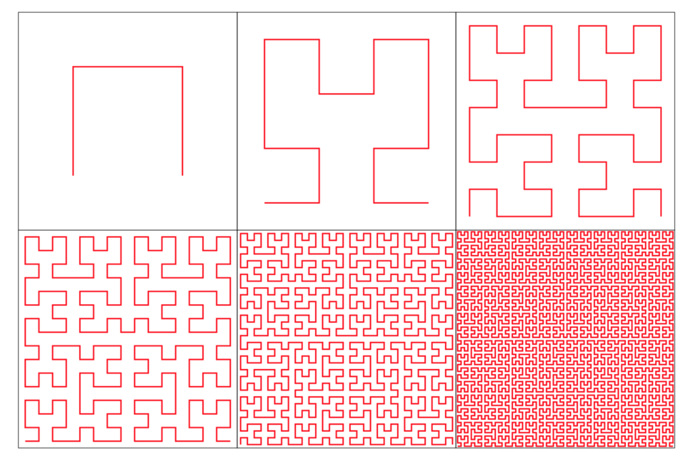

n dimension

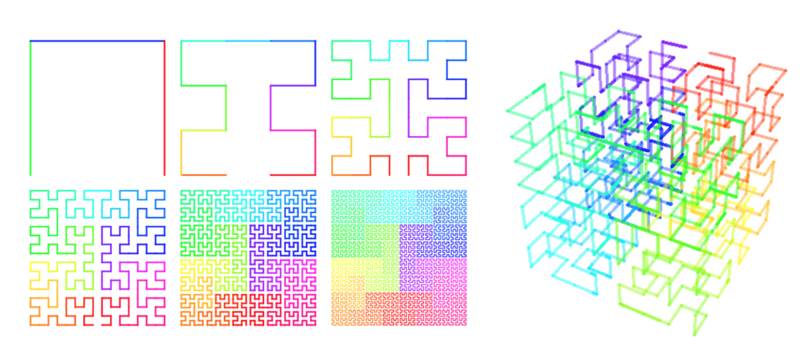


## How to generate

### Order 1


- Whether its a `U` or reverse `U` depend on where is `(0,0)`.  In the upper picture, `(0,0)` is set to lower left.

### Order 2


- further dived each cell using order 1's strategy
- connect 4 curves end to end

### Order 3


- Further dived based on order 2
- connect 4 curves end to end

### Order n


## Benefits

### Downgrade n-dimension to 1-dimension

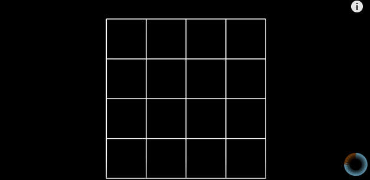

### Stable result

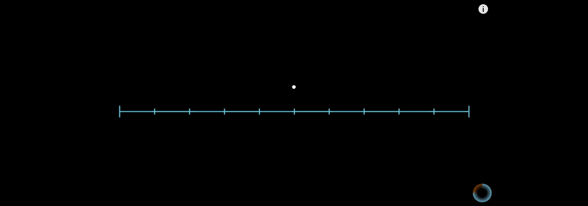


### Better locality

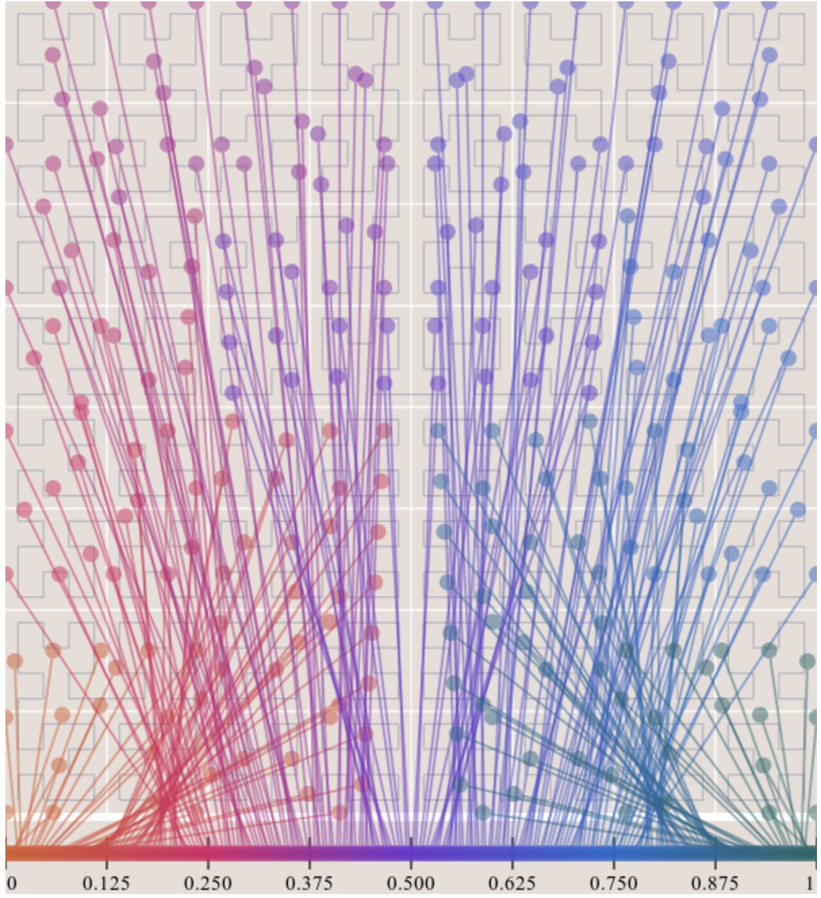


## Questions

### Find value in quad tree

Given a value, how to know which box it belonging to in quad tree?  
For example, s = 0.5(decimal)  
-> s = 0.100000000…(binary)  
-> group the digits of “s” into pairs, [10, 00, 00, 00, …]
-> Each pair of binary digits corresponds to a decimal number between 0 and 3, and indicates which of the 4 setsquares to choose at each step of the construction process.  

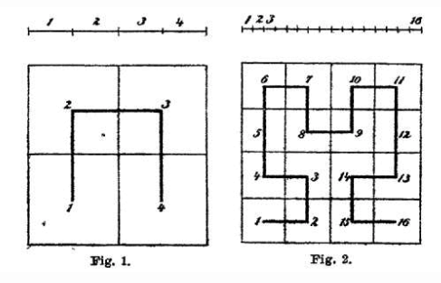

`10` means 2, choose sub-square 2 during the first iteration(square 3 in Hilbert figure 1).  
`00` means 0, choose sub-square 0 during the seconding iteration(square 9 in Hilbert figure 2).  At first level choose square 3, which means `9-10-11-12`, then choose first square in next level.  

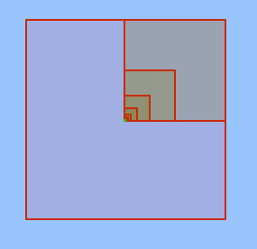

This process converges to a point that is exactly at the center of the square (the green dot in the figure). 
H(0.5) = (0.5, 0.5)

### Create hilbert curve based on density

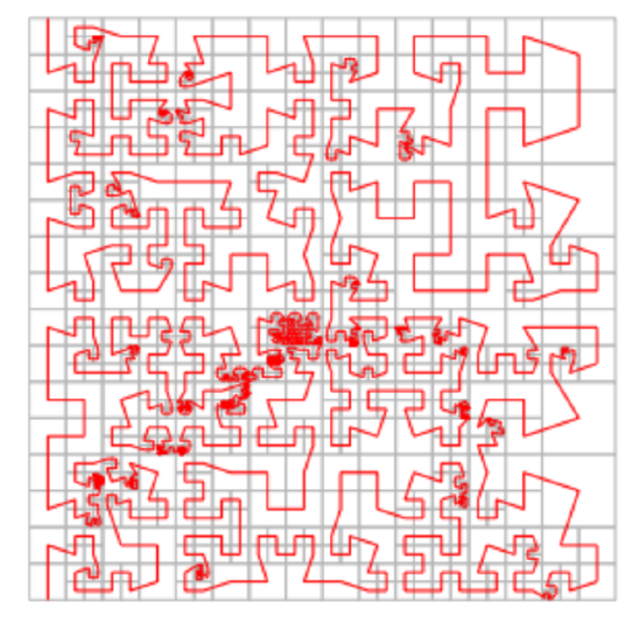


### Implement hilbert curve by recursion

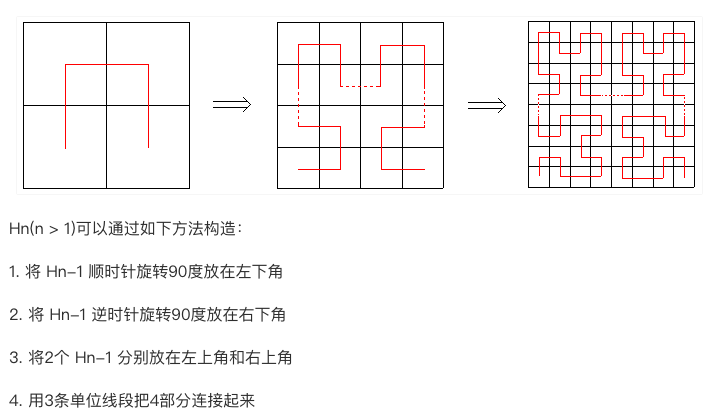

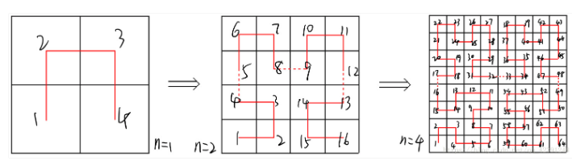


```c
#include <stdio.h>
long long f(int n, int x, int y) {
    if (n == 0) return 1;
    int m = 1 << (n - 1);//2的n-1次方
    if (x <= m && y <= m) {
        return f(n - 1, y, x);
    }
    if (x > m && y <= m) {
        return 3LL * m * m + f(n - 1, m-y+ 1, m * 2 - x + 1); 
    }
    if (x <= m && y > m) {
        return 1LL * m * m + f(n - 1, x, y - m);
    }
    if (x > m && y > m) {
        return 2LL * m * m + f(n - 1, x - m, y - m);
    }
}
int main() {
    int n, x, y;
    scanf("%d %d %d", &n, &x, &y); 
    printf("%lld", f(n, x, y));
    return 0;
}

```
Notes:
- 第一象限，把Y，X替换可以这样想


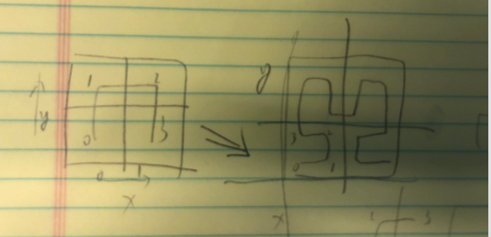

- 第四象限，逆时针旋转，相当于从原始图的从小到大变成了从大到小，逆生长


## More info
- [Hilbert curve generator](https://onlinemathtools.com/generate-hilbert-curve)
- [Hilbert curve impl in c](https://www.compuphase.com/hilbert.htm)
- [Hilbert curve impl in python](http://www.fundza.com/algorithmic/space_filling/hilbert/basics/)
