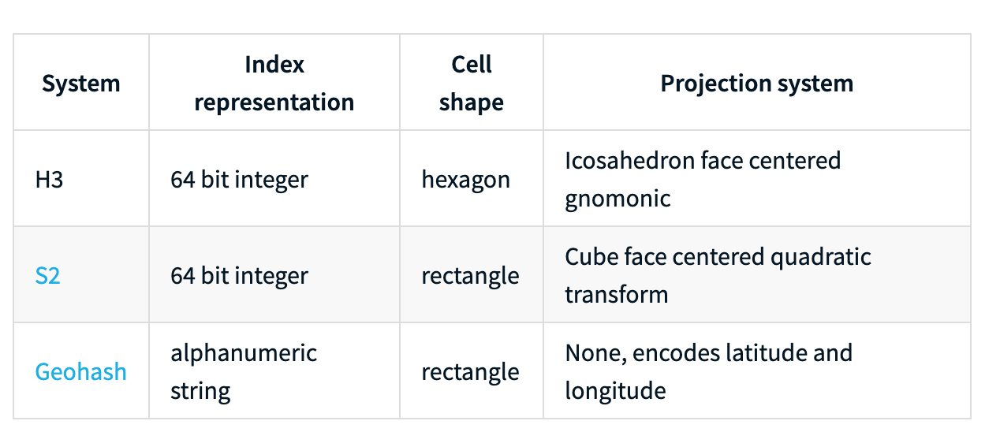
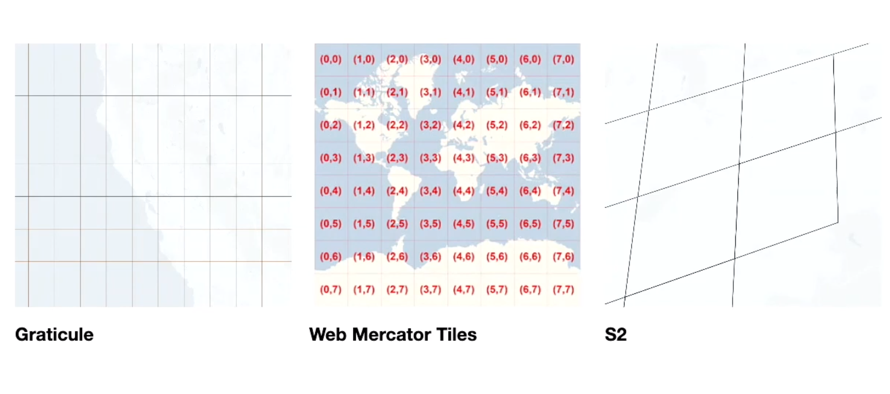

## Problems

- Given a point in the map, how to you find the nearest segment
- Given a point in the map, how to you find the nearest several segments
- Given a bounding box at any shape(rectangle, circle), how do you query map content overlapped with the shape
- Partition data based on spatial information

## Spatial Index

### Dynamic space divide
Spatial index is build based on density of data

- Rtree
- R*Tree
- KD tree

### Static space divide

- [Google S2](./google_s2.md)
- [Uber H3](./uber_h3.md)
- [Geohash](./geohash.md)

## Comparison

(Table coming from [Uber H3 doc](https://uber.github.io/h3/#/documentation/overview/use-cases))
 

 

## More information

- [Bing Map - Tile Coordinates and Quadkeys](https://docs.microsoft.com/en-us/bingmaps/articles/bing-maps-tile-system#tile-coordinates-and-quadkeys)
- [The google Tile Schema](https://www.maptiler.com/google-maps-coordinates-tile-bounds-projection/)