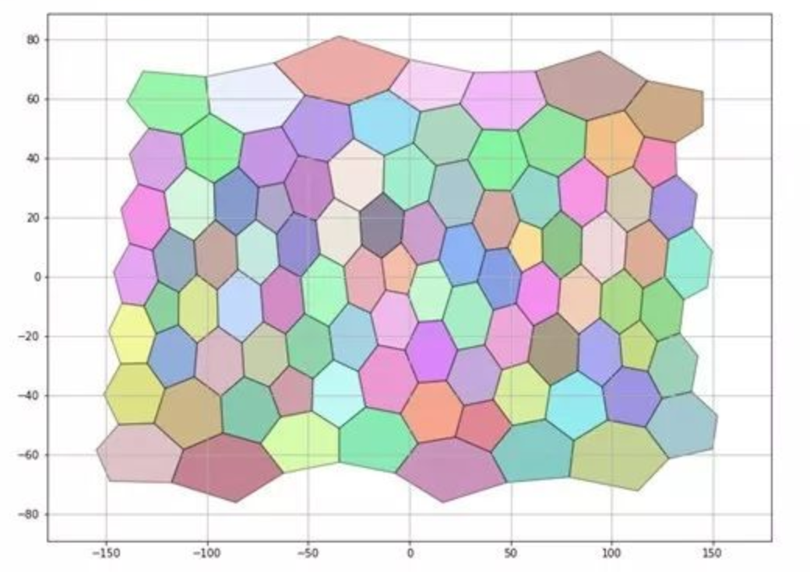

# Uber H3

The H3 geospatial indexing system is a multi-precision hexagonal tiling of the sphere indexed with hierarchical linear indexes. 

## Why H3

[Comments from ycombinator](https://news.ycombinator.com/item?id=16135302)  
ISV_Damocles on Jan 12, 2018 [-]  
I used to work at Uber and worked on H3. They're working on a blog post to explain some more, but if you clone the repo and build the doxygen docs, you'll get more explanation.
The big difference between this and S2 is that hexagons have only one kind of neighbor, neighbors that border on an edge, instead of the two kinds of "checkerboard" neighbors that squares have. This lets you do some interesting analysis on data gathered with hexagons.
Movement between neighbors could be modelled as a current flow, with the edge being a cross-sectional area between them, and since the edges are all equal (unlike squares) you can consider it a constant factor on that analysis, and then drop it and simply use the directional flow counts (the H3 UniEdge index) directly.
H3 takes better care than S2 to keep both hexagon area and shape distortion to a minimum together (area distortion is about the same as S2, but shape distortion is much better than S2), so the hexagons look almost the same almost anywhere on the planet, and so data gathered in one city on the planet is directly comparable to data gathered in another city, which can let you do interesting things like classify "types" of hexagons (urban, suburban, etc) and then make predictions about cities you haven't even set up shop in, yet, based on similar cities.
Hexagons are also the most efficient way to pack spheres, and can best approximate a circular radius with a discrete grid, so they're also useful for doing fast approximations of field-effect calculations (like electromagnetic fields from discrete particles). You could count drivers as a negative charge and riders as a positive charge, for instance, and use EM equations to determine the biggest imbalances in supply and demand distribution, and this will let you do it very quickly with little error.
The hexagons themselves can get down to a granularity below GPS resolution error, so you could, without any effective losses, pack 3 doubles (lat, lng, error) into a single 64-bit integer (H3 index of an appropriate size based on the error) and reduce bandwidth usage on location data.
The H3 index for any particular resolution is ordered in something similar to a Gosper curve[1] so if you really need just a rough approximation of data to query from an area, you actually only need to store the two indexes at the beginning and end of the gosper-like curve you're interested in.
This C library wasn't meant to be used directly by most developers and that's why it has a few rough edges (like not centering the output around the meridian (-180, 180) instead of the current (0, 360) output). I can't wait until the bindings come out, too, probably with the blog post. :)


## How H3 works

### 3D world -> 2D map

[dymaxion map](https://en.wikipedia.org/wiki/Dymaxion_map)


### 2D map -> Hexagon


### Hexagon 

#### Level 0

Level 0, the world




KML result


```
The first H3 resolution (resolution 0) consists of 122 cells (110 hexagons and 12 icosahedron
 vertex-centered pentagons), referred to as the base cells. These were chosen to capture as
 much of the symmetry of the spherical icosahedron as possible. These base cells are assigned
 numbers from 0 to 121 based on the latitude of their center points; base cell 0 has the
 northern most center point, while base cell 121 has the southern most center point.
```


#### Level 1

Level 1, the world


<br/>


```
Each subsequent resolution beyond resolution 0 is created using an aperture 7 resolution 
spacing (aperture refers to the number of cells in the next finer resolution grid for each cell); 
as resolution increases the unit length is scaled by \(\sqrt{7}\) and each hexagon has \(1/7th\)
 the area of a hexagon at the next coarser resolution (as measured on the 
icosahedron). H3 provides 15 finer grid resolutions in addition to the resolution 0 base cells.
 The finest resolution, resolution 15, has cells with an area of less than 1 \(m^2\). 
```

#### Level 2

Level 2, the world


<br/>


## Deep dive

### [Uber H3 experiments](./uber_h3_experiment.md)

### Why Hexagon


<br/>

<br/>


Features when choose rectangle


Features when choose hexagon


Pentagon is just a Hexagon missing one of its coordinate

### Issues

#### Incomplete covering between upper cell and lower cells


## More info

- [H3: Uber’s Hexagonal Hierarchical Spatial Index](https://eng.uber.com/h3/)
  - [Related discussion on Hacker News](https://news.ycombinator.com/item?id=16135302)
- [Uber H3 doc](https://uber.github.io/h3/#/documentation/overview/introduction)  
- [Visualizing City Cores with H3, Uber’s Open Source Geospatial Indexing System](https://eng.uber.com/visualizing-city-cores-with-h3/)

Application
- [Unwinding Uber’s Most Efficient Service](https://medium.com/@buckhx/unwinding-uber-s-most-efficient-service-406413c5871d#.dg5v6irao)
- [How We Built Uber Engineering’s Highest Query per Second Service Using Go](https://eng.uber.com/go-geofence/)

- [地理索引（Uber h3）](https://www.jianshu.com/p/e42d903dce38)
- [Geojson2h3](https://github.com/uber/geojson2h3)